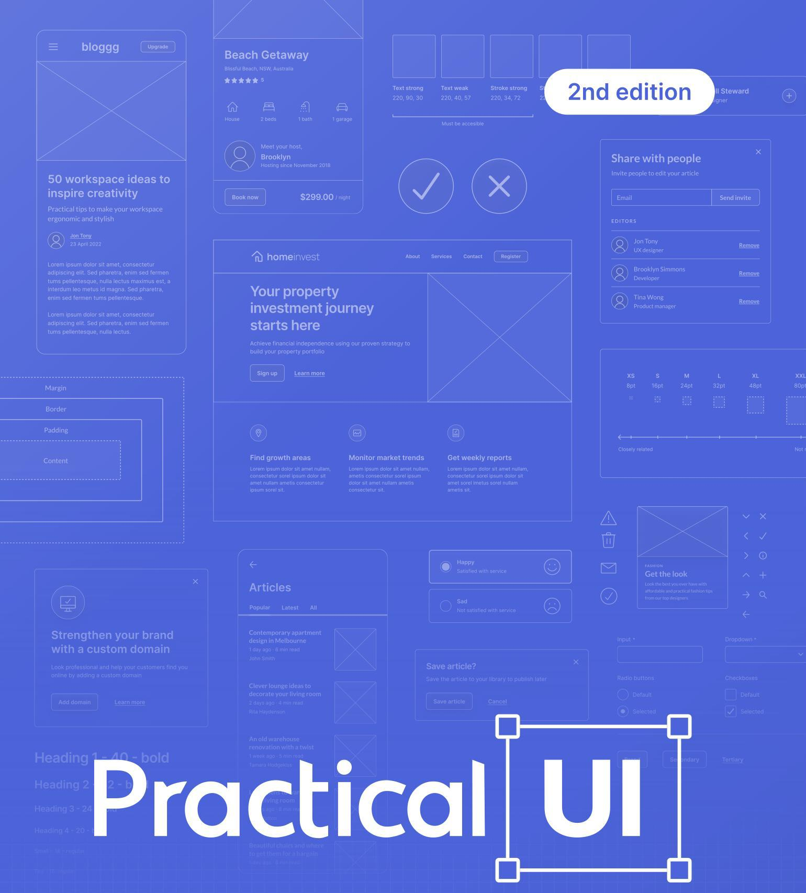
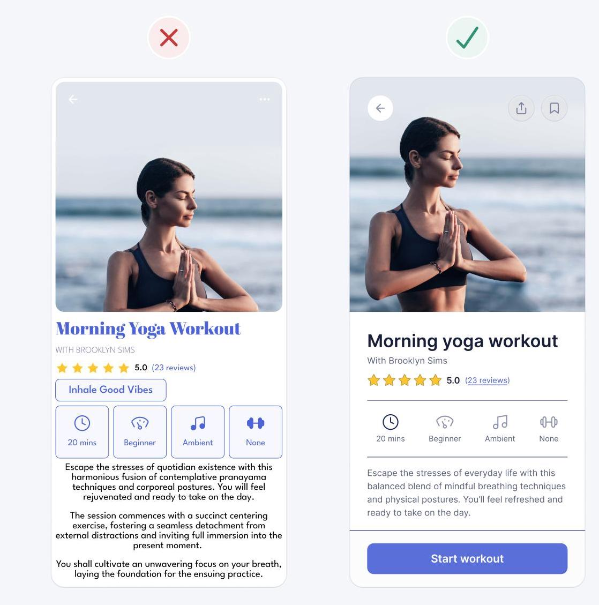

Quick and practical UI design guidelines to design intuitive, accessible, and beautiful interfaces.

2nd edition

# Practical UI Quick and practical UI design guidelines to design intuitive, accessible, and beautiful interfaces.

Written and designed by Adham Dannaway

<!-- auto-toc:start -->
## Contents

- Copyright © 2024 Adham Dannaway
- Contents
- i Turn on the table of contents
- Introduction
- 2. Less is more
- 3. Colour
- 5. Typography
- 6. Copywriting
- 7. Buttons
- 295
- 8. Forms
- Hi, I’m Adham
- UI design doesn’t have to be so hard
- UI versus UX
- Only what you need to know
- How were these guidelines validated?
- Got feedback?
- A tutorial to apply what you've learned
- Your progress

<!-- auto-toc:end -->

## Copyright © 2024 Adham Dannaway

All rights reserved. No part of this book may be reproduced or transmitted in any form or by any means, without written permission from the author.

The advice and strategies found within may not be suitable for every situation. This work is sold with the understanding that the author is not held responsible for the results accrued from the advice in this book.

ISBN: 978-0-6456766-1-7

www.practical-ui.com

## Contents

## i Turn on the table of contents

This PDF contains a built-in table of contents that can be used to navigate the book. Check the help guide of your PDF viewer to learn how to view it.

## Introduction

9

Hi, I’m Adham 10

UI design doesn't have to be so hard 11

A tutorial to apply what you've learned 14

1. Fundamentals 16

Minimise usability risks 17

Have a logical reason for every design detail 19

Minimise interaction cost 21

Minimise cognitive load 24

Create a design system 26

Ensure an interface is accessible 35

Use common design patterns 40

Use the 80/20 Rule to prioritise 42

Keep costs in mind 43

Be consistent 44

Clearly indicate interaction states 47

Tutorial - Fundamentals 48

Chapter summary 53

## 2. Less is more

55

Remove unnecessary information 56

Remove unnecessary styles 57

Not all links need to be underlined 59

Use progressive disclosure 61

Don't confuse minimalism with simplicity 63

Make sure important content is visible 65

Design for the smallest screen first 66

Reduce choice to speed up decision making 67

Tutorial - Less is more 72

Chapter summary 76

## 3. Colour

78

Ensure sufficient contrast 79

Don't rely on colour alone to convey meaning 85

Use system colours to indicate status 87

Use colour to define a clear visual hierarchy 89

Use black and white for a timeless aesthetic 91

Add a tinge of colour to black and white 93

Use 1 brand colour 94

Apply the brand colour to interactive elements 96

Create a colour palette with rules that govern its usage 103

Use the HSB colour system 105

5 colour variations is often all you need 106

Create a dark colour palette 116

Add depth using colour and shadows 120

Consider using transparent colours 124 Create a transparent colour palette 129 Use transparent layers for interaction states 142 Name colours to keep them organised 146 Adjust photo colour temperature to match the colour palette 152 Tutorial - Colour 154 Chapter summary 161 4. Layout and spacing 163

Group related elements 164

Create a clear visual hierarchy 179

Test visual hierarchy using The Squint Test 187

Use depth to create visual hierarchy 188

Understand the box model 189

Design @1x using points 191

Create a set of predefined spacing options 192

Space elements based on how closely related they are 194

Be generous with white space 201

Align the main layout to a 12 column grid 203

Align text to improve readability 207

Try to avoid using multiple alignments 210

Keep related actions close 213

Ensure your interface is unbreakable 216

Use the Rule of Thirds for photos 217

Tutorial - Layout and spacing 219

Chapter summary 227

## 5. Typography

229

Use a single sans serif typeface 230

Evoke emotion using a second typeface for headings 237

Use regular and bold font weights only 239

Use a type scale to set font sizes 241

Make long body text bigger 244

Use at least 1.5 line height for long body text 245

Decrease line height as font size increases 247

Ensure ideal line length 248

Left align text 251

Decrease letter spacing for large text 253

Ensure text on photos is legible 254

Avoid light grey and pure black text 257

Tutorial - Typography 258

Chapter summary 264

## 6. Copywriting

266

Be concise 267

Use sentence case 269

Use plain and simple language 270

Front-load text 271

Use the inverted pyramid 272

Limit the use of abbreviations and acronyms 274

Limit the use of UPPERCASE 275

Break up content using descriptive headings and bullets 276

Avoid using "my" on form labels 278

Use vocabulary consistently 279

Use numerals for numbers 281

Avoid full stops if possible 283

Ensure text length is similar across similar interface elements 284

Ensure text links describe their destination 285

Write clear error messages 287

Tutorial - Copywriting 288

Chapter summary 293

## 7. Buttons

## 295

Define 3 buttons weights 296

Use a single primary button for the most important action 303

Use secondary buttons for less important actions 305

Use tertiary buttons for the least important actions 306

Try to avoid disabled buttons 307

Left align buttons 312

Ensure button text describes the action 317

Ensure buttons have a sufficient target size 318

Balance icon and text pairs 320

Add friction to destructive actions 322

Tutorial - Buttons 325

Chapter summary 328

## 8. Forms

330

Stack forms in a single column layout 331

Minimise the number of form fields 336

Mark optional fields 337

Try to avoid optional fields by using opt-ins 338

Mark both required and optional fields 339

Match field width to the intended input 344

Stick with conventional form field styles 346

Display hints above form fields 348

Don't use placeholder text instead of a label 350

Ensure form field labels are close to their fields 352

Try to use radio buttons instead of dropdowns 353

Use an autocomplete instead of a long dropdown 354

Use steppers for numeric fields instead of dropdowns 356

Use a checkbox or toggle switch for 2 options 358

Use positive phrasing for checkboxes 360

Break up long forms into multiple steps 361

Group related fields under headings 362

Ensure form field borders are high contrast 363

Choose your form validation approach 364

Chapter summary 369

Conclusion 371 Closing thoughts 372

## Introduction

A brief breakdown of what to expect in the book to

ensure you get the most out of it

## Hi, I’m Adham

I'm a product designer from sunny Sydney, Australia, specialising in UI design and design systems. Since 2005, I've enjoyed working in startups, agencies, corporations, and government. I've led projects to design products used by millions of people.

l've been fortunate to have my work featured in books, magazines, and websites around the world. I love design and enjoy sharing what I've learned with others. This book has been a labour of love and I've spent thousands of hours creating it. I hope you find it helpful.

www.adhamdannaway.com millo

## UI design doesn’t have to be so hard

Interface design is hard. Having endless design possibilities sounds great in theory, but in practice, it can be frustrating and time consuming. With so many options to choose from regarding layout, spacing, typography, and colour, making design decisions can be overwhelming. When you add usability, accessibility, and psychology to the mix, it gets even harder.

Luckily, UI design doesn't have to be so hard. Over the years, I've realised that most of my UI design decisions are governed by a system of logical guidelines. Not artistic flair or magical intuition, just simple guidelines.

Sure, artistic talent helps, but a lot of what makes up an intuitive, accessible, and beautiful interface design can be learned. Having a system of logical guidelines helps you efficiently make informed design decisions. Without a logical system, you're just using gut feeling to move stuff around until it looks pretty.

I wish I knew these guidelines when I first started out. They're a culmination of nearly 2 decades working as a product designer on websites and apps used by millions of people. My hope is that they'll help you gain years of experience in a matter of hours.

## UI versus UX

The focus of this book is user interface (UI) design, which is made up of visual and interaction design. What a product looks like and how it works. UI design is a large part of user experience (UX) design.

You'll learn how to design the interface that people interact with when they use a digital product. The actual pixels on a screen that make up a website or app. What it looks like, how it works, and why it works that way.

There are lots of different types of digital interfaces, but this book mostly concentrates on web and mobile applications. That being said, the guidelines are universal and also apply to marketing websites, e-commerce websites, software applications, and more.

## Only what you need to know

There's an overwhelming amount of design tips, videos, books, and articles out there. You can spend a lot of time and money and end up even more confused. Much UI design theory is high-level, impractical, and unnecessary.

I kept this book as concise and practical as possible to help you quickly cut through the noise. It contains the most important things you need to know about interface design, usability, and accessibility. A picture is worth a thousand words, so I designed hundreds of visual examples to help demonstrate concepts clearly and quickly.

There's a lot of UI design information out there, but you don't need to know it all. I focussed on the \( {20}\% \) of knowledge that brings \( {80}\% \) of the results.

## How were these guidelines validated?

Most of the guidelines in this book are based on conventional best practices. They've been tried, tested, and documented over many years by hundreds of designers around the world.

Many of the guidelines are based on how our bodies work. How our eyes perceive things, how our brains interpret them, and how we interact with a user interface.

There are, of course, certain topics that have conflicting evidence and opinions. In these cases, I've looked at the evidence, weighed it up against my own professional experience, and provided my opinion and rationale.

These guidelines should help you avoid most usability issues, but l'd encourage you to conduct your own usability testing to further validate design concepts.

## Got feedback?

I don't claim to know it all. In fact, it's quite the opposite. The more I learn, the more I realise how much I have yet to learn. I'm always open to hearing different ideas or having my ideas constructively challenged. That's how we learn and grow as designers.

l'd love for this book to grow and improve over time, so let me know if you have any thoughts or feedback at hi@adhamdannaway.com

## A tutorial to apply what you've learned

The best way to learn is by doing. At the end of each chapter, you'll practice your new skills by doing a quick tutorial. You'll apply what you've learned by improving the following example. It's an interface for a workout in a fictional fitness app and it's full of common design problems.

By the end of the book, you'll have fixed the problems and created an intuitive, accessible, and beautiful design. All simply by applying some of the guidelines from the book.

Before and after of the fitness app example you'll be working on

## Your progress

Let's get started Fundamentals 2 Less is more 3 Colour 4 Layout and spacing 5 Typography 6 Copywriting 7 Buttons Forms