CHAPTER 1 Fundamentals

Overarching UI design principles that form the

foundation of the guidelines

<!-- auto-toc:start -->
## Contents

- Minimise usability risks
- Have a logical reason for every design detail
- Minimise interaction cost
- How to minimise interaction cost
- 1. Keep related actions close
- 2. Reduce distractions
- 3. Minimise choice
- An interaction cost example
- Minimise cognitive load
- Create a design system
- Colour options
- Typography options
- Spacing options
- Predefine other style options
- 2. Create reusable modules
- 3. Define usage guidelines
- Ensure an interface is accessible
- Good accessibility benefits everyone
- Good accessibility is good for business
- Assistive technology
- Screen readers
- Screen magnifiers
- Use common design patterns
- Frequently asked questions
- Use the 80/20 Rule to prioritise
- Keep costs in mind
- Be consistent
- Be consistent within your product
- Be consistent with other products
- Clearly indicate interaction states
- Chapter summary
- Your progress 1 of 8 chapters completed

<!-- auto-toc:end -->

## Minimise usability risks

While it might not sound very fun or creative, I base many of my design decisions on risk. The risk that someone could have difficulty using an interface. For example:

- Thin, light grey text can look sleek and trendy, but there's a risk that some may find it difficult to read.

- Icons without labels can look clean and minimal, but there's a risk that some might not understand what the icons mean. This risk is greater for those with cognitive and vision impairments.

- It might look nice to add colour to heading text, but there's a risk that some could mistake it for a link.

Usability testing should highlight large risks, but smaller ones could go unnoticed. It depends on the diversity of users you test with and the effectiveness of the testing. Most of the time you don't know the different types of people that will be using your product, so it's safest to cater to as diverse a range as possible.

Consider people with poor eyesight, low computer literacy, reduced dexterity and cognitive ability. Make sure that your designs meet Web Content Accessibility Guidelines (WCAG).

These guidelines are a good benchmark for website accessibility. Aim to at least meet WCAG 2.1 level AA requirements. This is the medium level of conformance and a good place to start. You'll learn the accessibility guidelines you need to know throughout the book.

Keep an eye out for potential usability risks. If there's anything that's slightly vague, confusing or unclear, simplify it to make it crystal clear before investing time and money in usability testing. I'll refer to usability risks often throughout this book to help you see risks that you may not have been aware of. I'll also provide practical advice to decrease usability risks.

The following example contains the 3 usability risks mentioned previously (low contrast text, icons without labels, and blue heading text) along with a bunch of others. You'll learn logical guidelines throughout the book to help you fix usability risks like these.

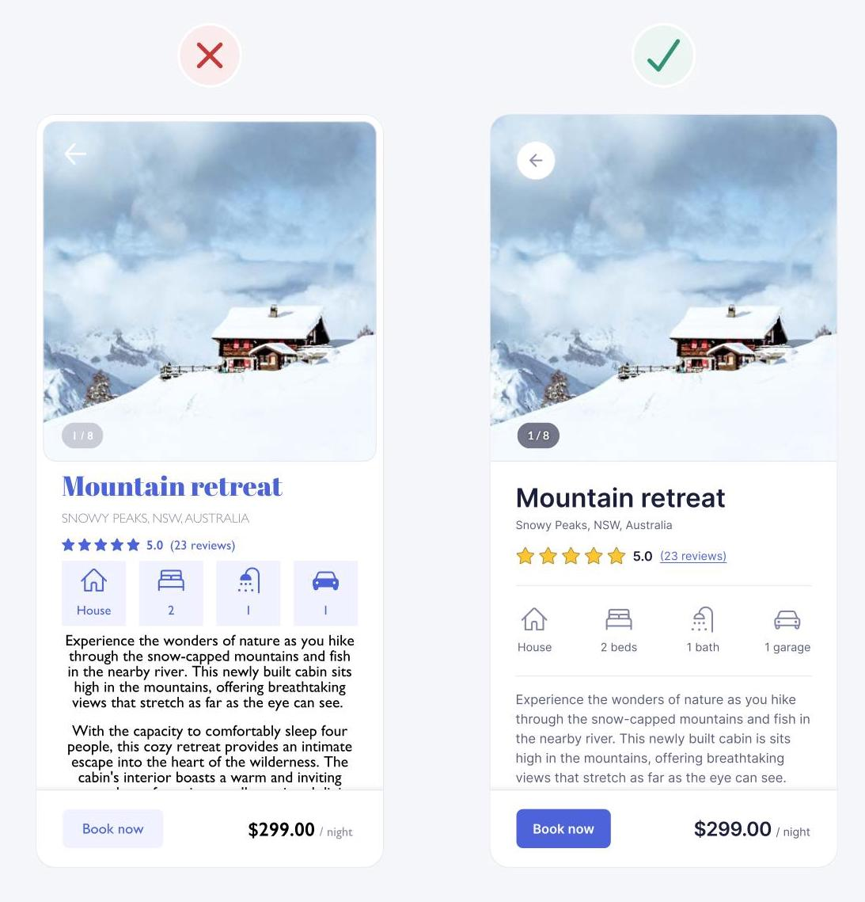

Fixing usability risks in a holiday house booking interface

## Have a logical reason for every design detail

The importance of UI design is often trivialised as being nothing more than making an interface look pretty. I think this demonstrates an ignorance of the logic behind UI design. Sure, some elements are purely decorative, but if an interface is designed well, every detail will have a logical reason behind it that improves usability.

I'm not saying that aesthetics aren't important, but UI design is about so much more than how it looks. It's about how it works and why it works that way. When designing an interface, you're literally designing the user's experience.

Designing interfaces using objective logic, rather than subjective opinion, makes it faster and easier to make design decisions. It also helps you support your decisions in discussions and provide constructive feedback to other designers. "That looks nice" or "I don't like it" are just subjective opinions, not logical or constructive feedback.

It's important to have a rationale (logical reason) behind each design decision you make and to be able to clearly articulate it to support your designs. Every guideline in this book includes a rationale to help you understand the why behind the UI.

Let's look at the rationale behind a well designed row of text blocks with icons. It may look simple, but it was carefully designed using many logical guidelines.

Here are some of the logical reasons behind this design, which you'll learn about throughout the book:

- Icons and text are left aligned to create a neat left edge. This improves readability and aesthetics while decreasing cognitive load.

- Headings and text links are descriptive so they're scannable and can be read out of context by screen readers.

- Secondary text is less important than headings, so it's made less prominent (using size and contrast) to create a clear visual hierarchy.

- Secondary text line height is at least 1.5 to improve readability.

- Text links are coloured blue to indicate they're interactive and underlined so the colour blind can distinguish them from other text.

- Spacing inside each block is less than the spacing between each block to create groups of related information. Spacing is based on a set of predefined spacing options to improve consistency.

- Information is broken up into smaller groups to make it easier to understand and to help speed up decision making.

- Colours are based on an accessible monochromatic colour palette with rules that govern its usage.

## Minimise interaction cost

Interaction cost is the sum of physical and mental effort required to achieve a task. Looking, scrolling, searching, reading, clicking, waiting, typing, thinking, and remembering all add to interaction cost. The higher the interaction cost, the harder it is for someone to achieve their task.

The great thing about interaction cost is that you can measure it. This means you can try to minimise it to make it easier for people to achieve their goals.

Of course, the more features a product provides, the harder it is to keep interaction costs down. This is one of the reasons why simple apps that focus on doing a specific task efficiently, are often the most successful.

## How to minimise interaction cost

Many of the guidelines in this book help to minimise interaction cost, but here are 3 of the most effective:

## 1. Keep related actions close

According to Fitts's Law, the closer and larger a target, the faster it is to click on that target. Keep actions close to the element they relate to and try to ensure they have a sufficient target area (at least 48pt by 48pt is a safe size). You'll learn about points (pt) in the "Layout and spacing" chapter.

## 2. Reduce distractions

Attention grabbing distractions like animated banners, pop-ups, and unnecessary visuals, can pull people's attention away from the task they're trying to complete.

## 3. Minimise choice

According to Hick's Law, the time it takes to make a decision increases with the number and complexity of choices. Reduce choices to speed up decisions. You can also highlight a smaller set of recommended or popular items to help people make decisions faster.

## An interaction cost example

In the following product page example, let's say you want to add 2 products to your cart. You need to select the quantity via a dropdown, which requires 1 click, 1 scroll, and another click. This can be especially difficult for those with motor impairments. Then you need to move your mouse across to the "Add to cart" button and click it.

The total interaction cost is 3 clicks, 1 scroll, and a short mouse movement.

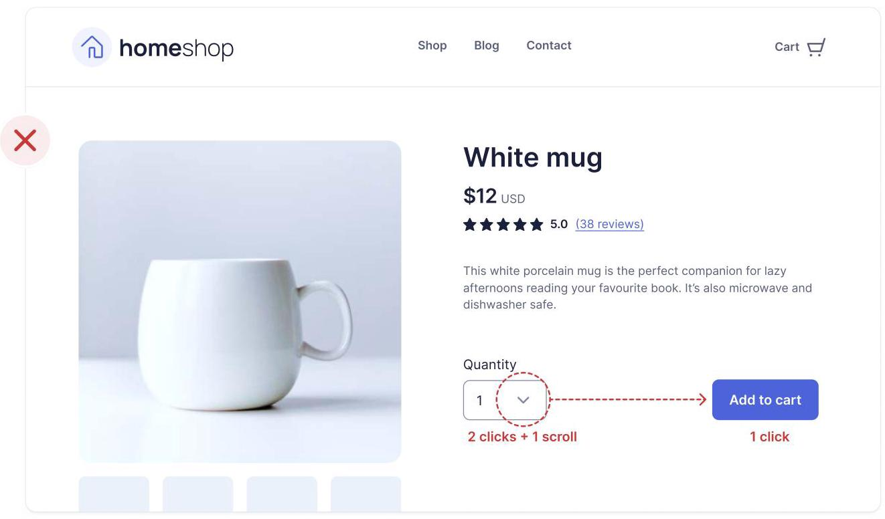

Total interaction cost is 3 clicks, a scroll, and a short mouse movement.

In the next example, we reduce the interaction cost using a stepper for the quantity instead of a dropdown. A stepper component makes it easier and faster for people to make small numeric changes. It allows people to increase or decrease a number with a single button press or by typing the number in the field.

We move the "Add to cart" button closer to the quantity selector to further reduce interaction cost. Left aligning the button also helps ensure the button won't be missed by those using screen magnifiers.

We reduced the total interaction cost to 2 clicks and a very small mouse movement. A similar approach can be taken to reduce the interaction cost on any interface.

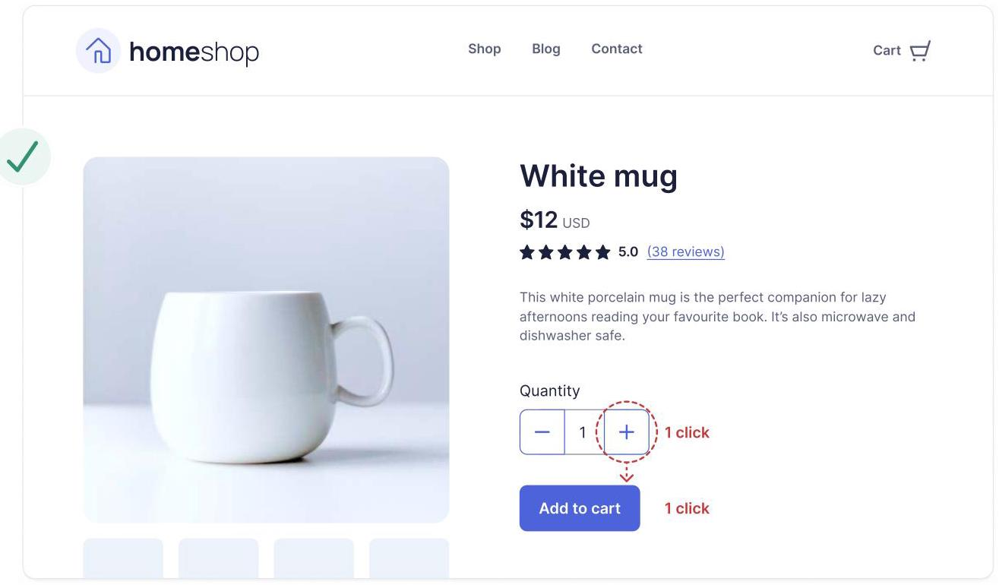

Total interaction cost is just 2 clicks and a very small mouse movement

## Minimise cognitive load

Cognitive load is the amount of brain power required to use an interface. The goal is to minimise cognitive load to make your interface as easy to use as possible. This frees up mental resources for people to focus on the task they're trying to achieve.

Quick ways to reduce unnecessary cognitive load:

- Removing unnecessary styles, information, and decisions to reduce distractions.

- Breaking up information into smaller groups to clearly show relationships and speed up decision making.

- Using conventional design patterns that people are familiar with.

- Maintaining consistency by ensuring that similar elements look and work in a similar way.

- Creating a clear visual hierarchy to show the level of importance of information.

Many of the guidelines in this book help to reduce cognitive load. It's an important concept to keep in mind when designing any interface. In the following example, cognitive load is reduced by breaking up a large, complex form into smaller, simpler steps. People can get overwhelmed by large, complex problems. Breaking them down into smaller, simpler ones makes them easier to solve.

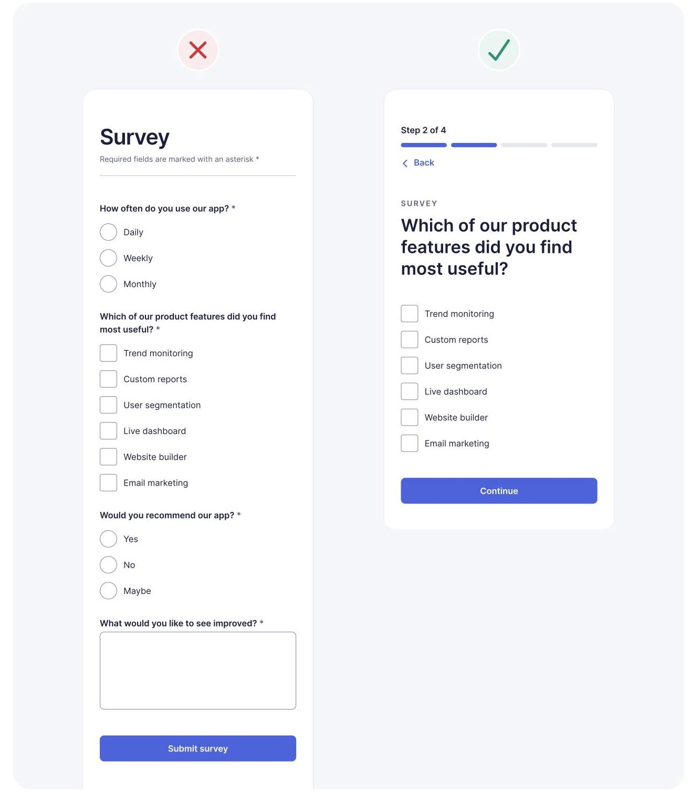

A large, complex form is broken into smaller, simpler steps to reduce cognitive load.

## Create a design system

Having endless design possibilities sounds great in theory, but in practice, it can be frustrating and time consuming. When designing an interface, there are so many options to choose from regarding layout, spacing, typography, and colour, it can quickly get overwhelming.

That's why having a system of predefined options and guidelines to help you efficiently make design decisions is crucial. This is known as a design system and you can create one in 3 steps:

1. Set predefined style options

2. Create reusable modules

3. Define usage guidelines

### 1.Set predefined style options

Rather than choosing from unlimited options for things like colour,

typography, and spacing, create a small set of predefined options to choose from. Limiting your options in this way helps improve consistency and speeds up decision making. These predefined reusable options are often referred to as "tokens".

## Colour options

Create a small set of predefined colour options called a colour palette. The following colour palette is made up of variations of the brand colour. Each colour has a purpose to help you quickly decide how and where to use it.

For example, actions like buttons and text links are often assigned the brand colour from the colour palette. Using a consistent colour for interactive elements helps teach people what's interactive and what's not.

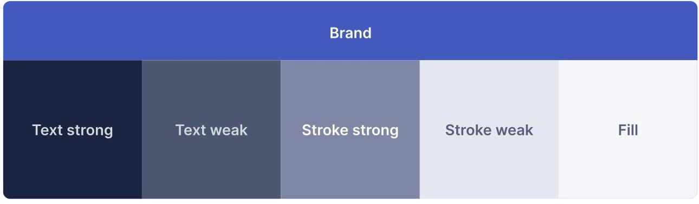

Similarly, there's no need to spend countless hours searching for different shades of grey for form input borders, checkbox borders, and radio button borders. Simply assign a colour variation from the colour palette to use for all interface element borders.

You'll learn how to create simple, powerful, and accessible colour palettes with rules that govern their usage, later in the "Colour" chapter.

## Typography options

Create a small set of predefined typography options for different text types. Define the font sizes, line-heights and weights once and reuse them throughout an interface. I used a set of typography options similar to the following one to create the examples in this book.

You'll learn how to use a type scale to create a set of typography options later in the "Typography" chapter.

<table><tr><td>TYPE SCALE (1.200)</td><td>SIZE</td><td>LINE HEIGHT</td><td rowspan="7"/></tr><tr><td>Heading 1</td><td>40px</td><td>48px</td></tr><tr><td>Heading 2</td><td>32px</td><td>40px</td></tr><tr><td>Heading 3</td><td>24px</td><td>32px</td></tr><tr><td>Heading 4</td><td>20px</td><td>28px</td></tr><tr><td>Small</td><td>16px</td><td>24px</td></tr><tr><td>Tiny</td><td>14px</td><td>20px</td></tr></table>

Example of a predefined set of typography options

## Spacing options

Deciding on the ideal spacing between interface elements can be a frustrating and time consuming process, as there are so many options to choose from. In my early days as a designer, I remember painstakingly pushing interface elements back and forth, a pixel at a time, until they looked perfect.

Creating a limited set of predefined spacing options (as seen below) can speed up your design process significantly, making you a much more efficient designer. Using consistent spacing options will also result in a neater, simpler interface design that's faster to build.

You'll learn how to define a set of spacing options and how to apply them later in the "Layout and spacing" chapter.

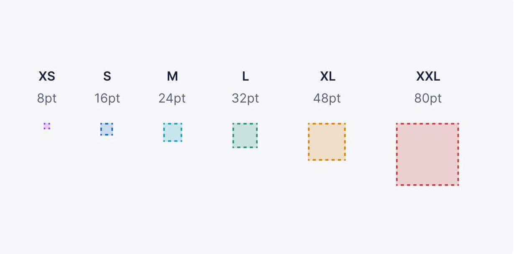

Example of a predefined set of spacing options

## Predefine other style options

Try to create sets of predefined options for any other styles you use too. You'll generally need 2 shadow options (raised and overlay) to indicate the depth of interface elements.

Raised Overlay

Predefined set of shadow options

Create 3 border radius options (8pt, 16pt, and 32pt) to use on small, medium, and large interface elements respectively.

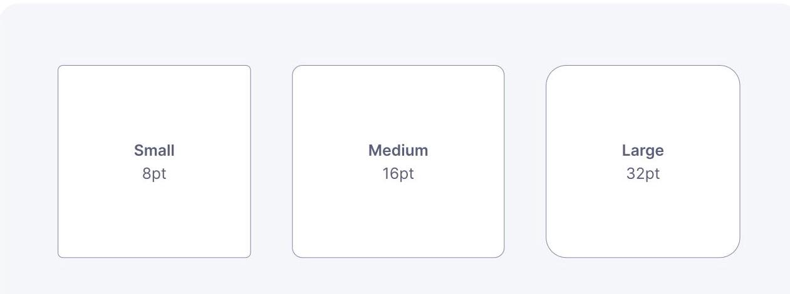

Predefined set of border radius options

## 2. Create reusable modules

Modular design involves breaking things down into smaller, reusable, and replaceable parts called modules or components. Modular design has been used to create cars, machines, buildings, and computers for many years. It's a great way to improve productivity, efficiency and consistency.

Always aim to design interfaces in a modular way by doing the following:

- Start by creating the smallest components such as buttons, avatars, and form input fields. These will be your building blocks.

- Combine small components to create larger, more complex ones.

- Arrange components in specific layouts to create reusable page templates.

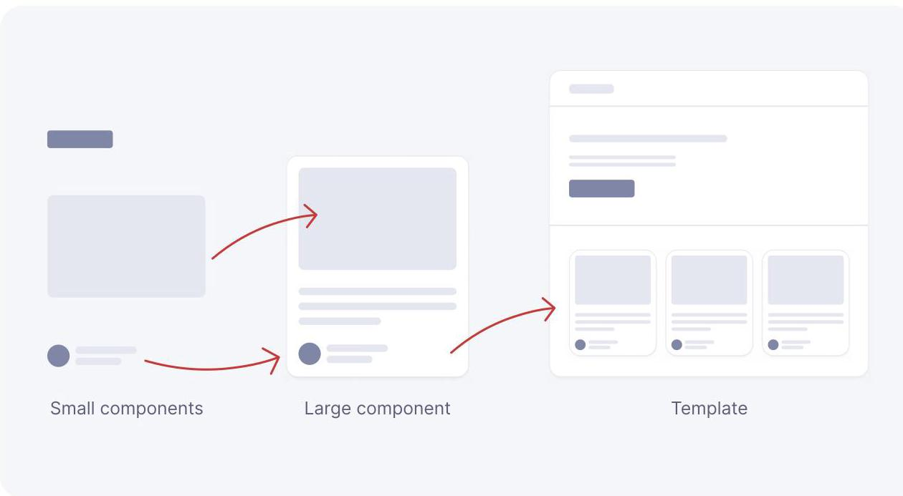

The goal is to create a collection of all components, known as a component library or UI kit. This makes it easy to view, manage, and reuse components. In the following example, an avatar component is used to create larger components. Firstly, the avatar is paired with text, then placed in a card, which is placed in a list of cards on a landing page template.

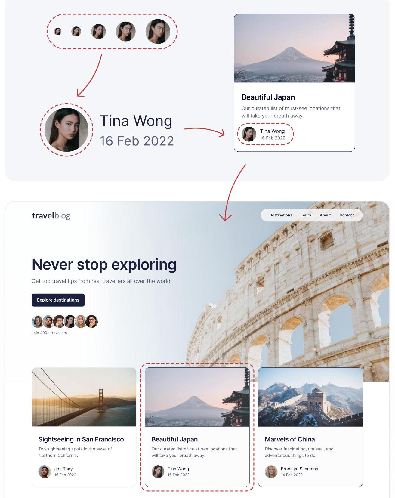

In the following examples, the same button component is reused inside multiple larger components. In a similar way, each of the larger components can be reused across multiple interfaces or templates.

The same button component is reused inside multiple larger components

## 3. Define usage guidelines

Many design systems forget to include guidance on how to use the components and visual styles in the system. Without clear usage guidelines, there's little chance that a team of designers will be able to design a consistent product experience.

How to write the text content for an interface clearly and consistently is also very important and is often overlooked. You'll learn key guidelines for how to write interface text later in the "Copywriting" chapter.

I created a design system to help design the examples in this book. Some of the high level usage guidelines include:

- Indicate interactive elements using the brand colour

- Use sentence case

- Left align buttons

- Left align text

- Try to avoid disabled buttons

- Front-load text

- Be concise and use plain and simple language You'll learn the rationale for these guidelines and many more throughout the book.

## Ensure an interface is accessible

As designers, it's our responsibility to try and ensure the interfaces we design can be used and understood by the widest audience possible. It's even a legal requirement in some countries.

We need to accommodate people with disabilities such as blindness, low vision, colour blindness, motor impairment, and mental disabilities. An accessible interface can be used by everyone, regardless of disability.

Keep the following in mind to help ensure an interface is accessible to all:

- Try to provide a comparable experience for all.

- At a minimum, make sure your interface design meets Web Content Accessibility Guidelines (WCAG) 2.1 level AA. They're a good benchmark for website accessibility and are often a legal requirement.

- Learn about how people with different disabilities access digital products and include them in usability testing. We'll look at some common assistive technologies soon.

In the following example, people with low vision could struggle to see the light form field border. Ensure the form field is accessible by increasing the border contrast to comply with WCAG 2.1 AA.

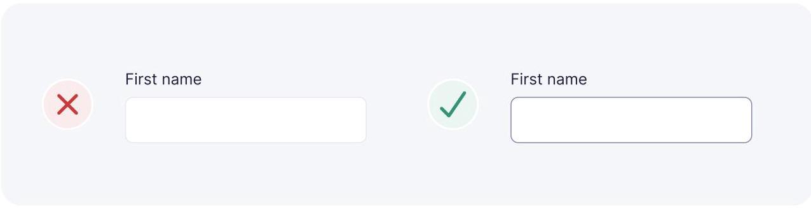

Low contrast form field versus high contrast form field

The next example demonstrates a few quick ways we can use colour and contrast to make an interface accessible to people with low vision. I'll highlight more ways we can meet WCAG 2.1 level AA accessibility requirements throughout the book.

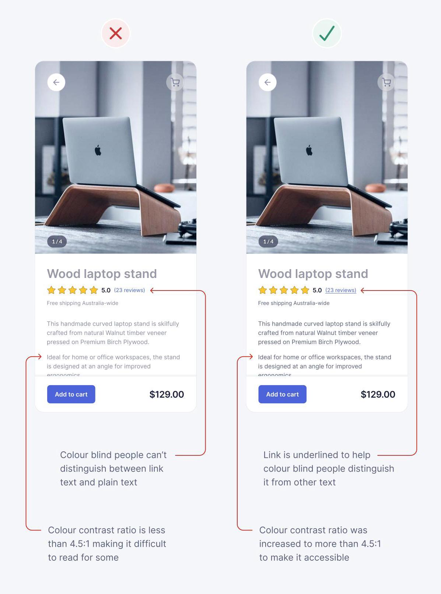

## Good accessibility benefits everyone

An accessible interface benefits everyone, not just those with permanent disabilities. Anyone could get an eye or arm injury, giving them a temporary disability until they recover. Even those with perfect sight might find it difficult to see their screen on a bright sunny day, giving them a temporary situational disability.

Many of the guidelines for creating an accessible interface for people with disabilities also helps create a more user-friendly interface for everyone else. Things like ensuring sufficient contrast, minimising interaction cost, and minimising cognitive load, are all essential for good usability.

good = great accessibility usability

## Good accessibility is good for business

Making our products accessible doesn't just benefit user experience, it's necessary for sustainable business growth and success. A significant number of people have some form of permanent disability, and we'll all experience temporary and situational disabilities at various points in our lives.

Not having an accessible product means you could be missing out on potential customers. It also means that many of your existing customers are suffering a lesser user experience.

## Assistive technology

People with disabilities often use software and other devices to assist them with using digital interfaces. It's important to be aware of the 2 most common assistive technologies, as they affect interface design.

## Screen readers

A screen reader is software that describes an interface (using speech or braille) to someone who can't see it. Computer users use their keyboard to step through interface elements which are read to them. Mobile users swipe through interface elements or drag their finger across the screen, getting what's under their finger read to them.

Much of what makes an interface accessible by a screen reader depends on the front end code (which isn't covered in this book), but it's important to know about screen readers as a designer too.

A person with low vision using a screen reader

## Screen magnifiers

A screen magnifier is software that enlarges part of an interface to make it easier for people with low vision to see. They're more widely used than screen readers and are often used in conjunction with screen readers.

Those using screen magnification have a limited view of an interface, as they can only see a small part of it at a time. It's important to keep this in mind when designing an interface. You'll learn how to cater to those using screen magnifiers throughout the book.

A screen magnifier enlarges part of an interface

## Use common design patterns

According to Jakob's Law, it's safest to stick with common or conventional design patterns that people are already familiar with. Design patterns are established solutions to recurring problems.

For example, the following accordion component is a common design pattern used to save space when displaying information. Accordions turn sections of content into a scannable list, allowing people to quickly view the content they need and ignore what they don't. They generally look like a list and include an icon to indicate that each list item can be expanded.

## Frequently asked questions

If you have any other questions or feedback, please contact me and I'll get back to you shortly.

__________

Is UX design covered too? ✓

Does this book cover UI design for apps or websites? ✓

Who is this book for? ✓

Example of a common accordion pattern

Building on people's existing mental models (understanding of how something works) means that they won't need to spend extra time and effort learning new ones. Using common design patterns is a quick and easy way to reduce usability issues, cognitive load, and interaction cost.

In the following example, unconventional form field styles introduce unnecessary usability risk. It's safer to use conventional form field styles that people are used to.

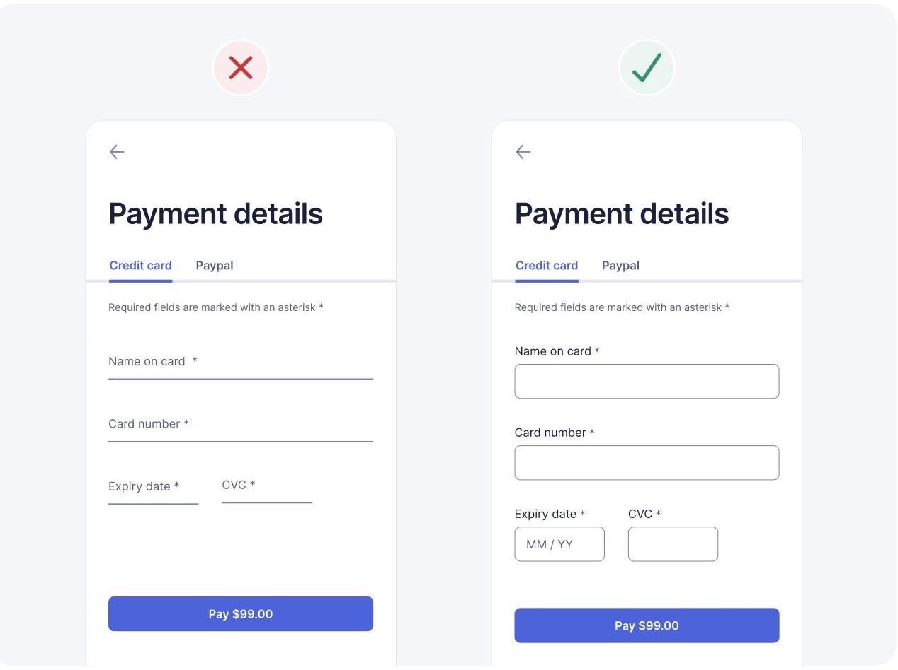

Unconventional form field styles versus conventional form field styles

Playing it safe might sound a bit boring, but you can save a lot of time and money on usability testing by sticking with what people are used to. It will also give you time to focus on solving more important problems that could make a larger impact on your product.

I'm not saying you shouldn't be creative and try to innovate, but do so where it counts. Focus on the unique selling point of your product and create an experience that meets and exceeds user needs.

## Use the 80/20 Rule to prioritise

Also called the Pareto Principle, the idea of the 80/20 Rule is that roughly 80% of effects come from 20% of the causes. Here are a few ways the 80/20 Rule relates to product design:

- Roughly 80% of your users use 20% of your features.

- Roughly 80% of customer complaints come from 20% of product issues.

- Roughly \( {80}\% \) of a customer’s attention is spent on \( {20}\% \) of a web page.

The 80/20 Rule isn't an exact measure, it states that a relatively small number of things will have a large impact. So, it's best to prioritise putting effort into improving the small number of things that will have the largest impact.

For example, optimise your interface design to cater to the tasks most people will be doing, rather than spending time on edge cases (uncommon cases) that will rarely be used.

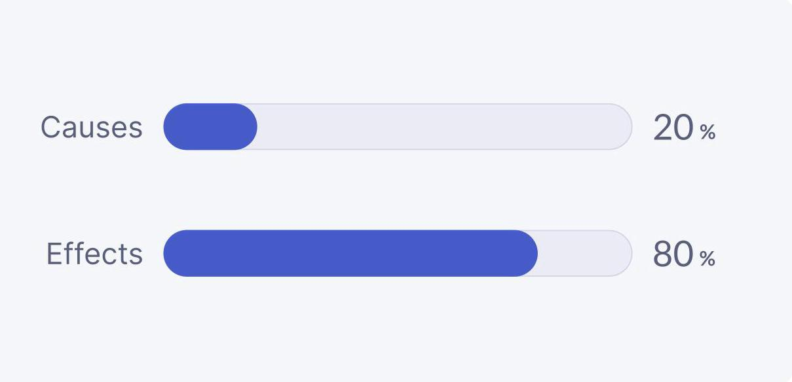

Roughly 80% of effects come from 20% of causes

## Keep costs in mind

If you're working on a commercial project, time isn't free. Every minute spent on user research, design, usability testing, development, and quality assurance costs money.

The more efficient you become as a designer, the more valuable you are to businesses. Here are some simple ways to improve your efficiency:

- Consider using an existing design system, website template, or icon set to save time.

- Outsource time-intensive tasks like illustrations to other designers.

- Stick with familiar UI patterns to save time and money on usability testing. For example, stick with conventional form fields that people are familiar with, rather than designing bespoke ones that look and behave differently.

- Learn how interfaces are built and coded to get a better idea of their technical constraints. This will help you design products that are easier, faster, and cheaper to build.

- Talk to developers early and often to discuss how you might achieve more from your design for less. The simple approach is usually cheaper to build and easier for customers to understand and use.

## Be consistent

Consistency in UI design means that similar elements look and work in a similar way. This should be true both within your product and when compared with other well-established products. This predictable functionality improves usability and reduces errors, as people don't need to keep learning how things work.

## Be consistent within your product

To maintain visual and functional consistency within your product, create a design system to define guidelines for components, templates, visual styles, and language.

Some guidelines I followed to create the examples in this book:

- Indicate interactive elements using the brand colour

- Use sentence case

- Left align buttons

- Left align text

- Try to avoid disabled buttons

- Front-load text

- Be concise and use plain and simple language

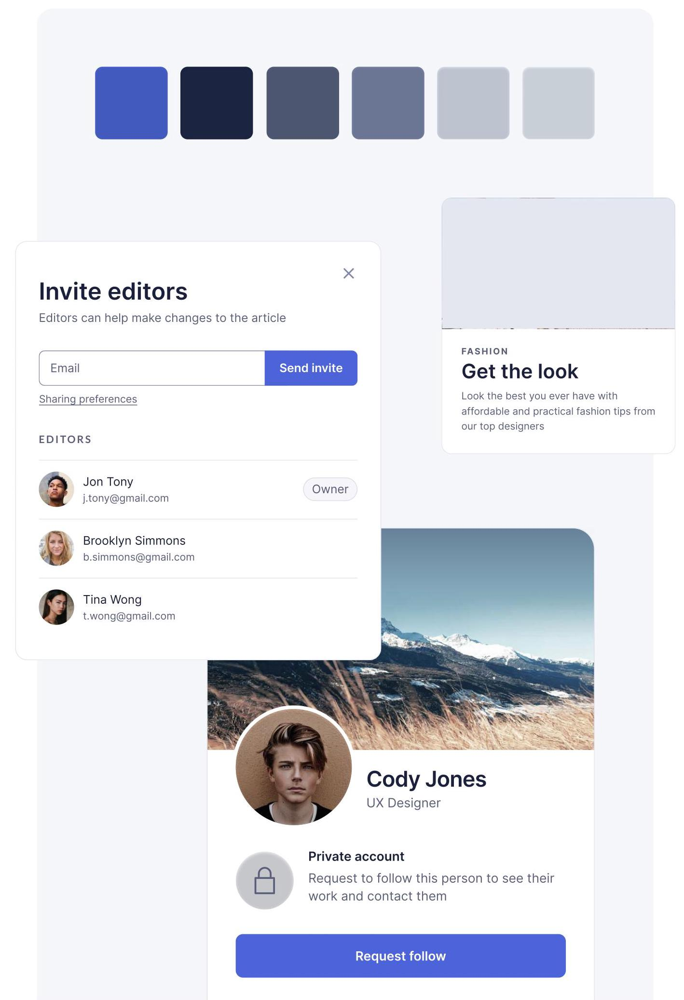

## Be consistent with other products

As well as keeping design patterns consistent within your product, it's also important to maintain consistency with other products. Being consistent with the majority of other products people are familiar with, means people won't need to spend extra time and effort learning new patterns.

If your product sits on a certain platform, like an app on iOS or Android, it's generally safest to follow the platform guidelines (unless they test poorly in usability testing or result in an inaccessible interface).

When in doubt, follow well-established, accessible UI patterns and common conventions that people are used to. For example, text links are underlined, form checkboxes are small squares with a tick icon inside them, and input fields are rectangles with a label on top.

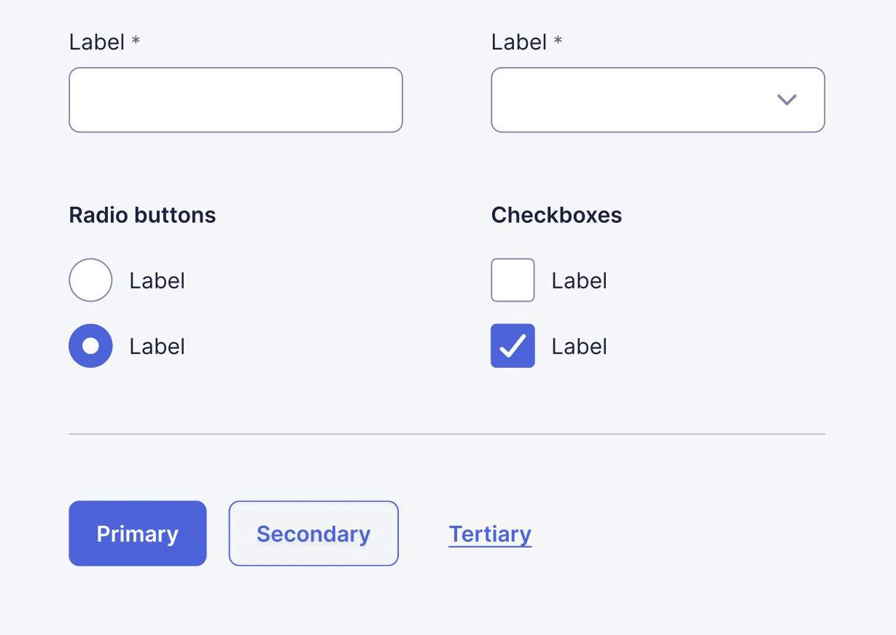

Examples of conventional UI patterns

## Clearly indicate interaction states

It's important to ensure that interactive elements, like buttons and text links, change their appearance when they're interacted with. This helps people understand how they can interact with the element and what will happen when they do.

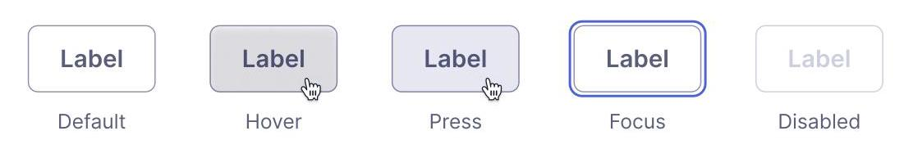

For example, a button should have a different appearance depending on whether you're looking at it, hovering your mouse over it, or pressing it. Each of these appearances is known as a "state" and there are 5 of them:

- Default / enabled - the appearance of an element when not interacted with, indicating that it's interactive.

- Hover - triggered when a cursor is placed over an element to provide visual feedback that it's interactive.

- Press / active - triggered when an element is pressed, indicating that it's being interacted with.

- Focus - triggered by using a keyboard to navigate an interface, indicating the element about to be interacted with.

- Disabled - the appearance of an element when it's not interactive.

We'll look at different ways to indicate states in the "Colour" chapter.

TUTORIAL - FUNDAMENTALS

# Apply what you've just learned

Let's apply some of the guidelines you've learned

to improve the following fitness app example.

## Minimise interaction cost

In the fitness app example, the main call to action button is relatively small. Small targets are more difficult to touch than large ones. This is especially true for those with impaired motor control, or even someone holding their phone with one hand and using their thumb.

Increasing the button size to at least 48pt tall makes it faster and easier for people to press it.

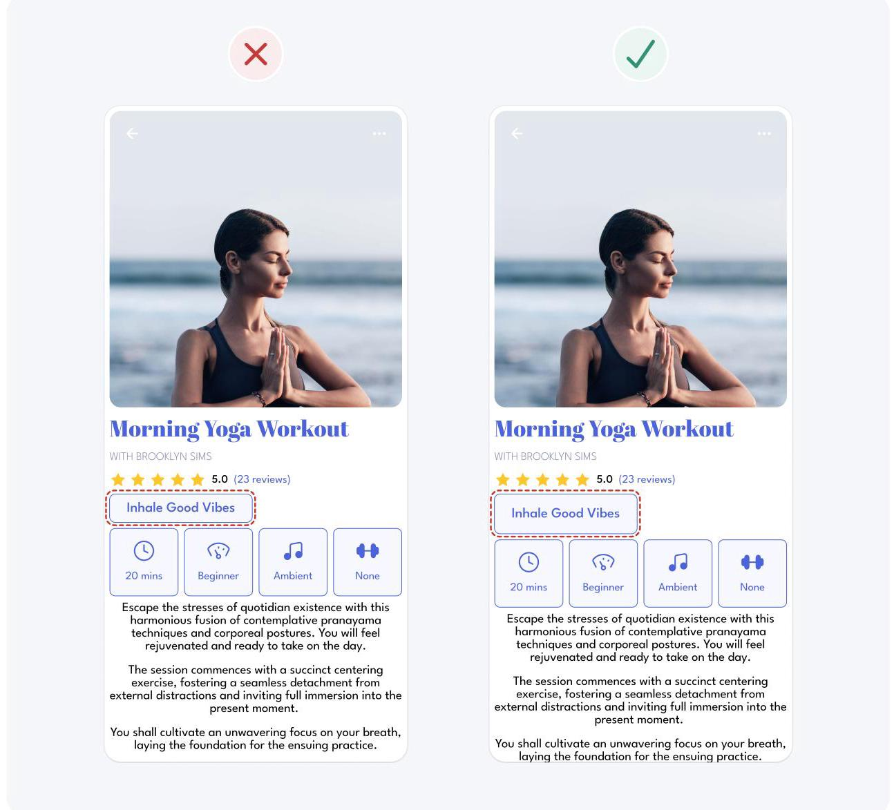

Moving the button to the bottom of the screen makes it easier to reach for those using one hand. Stretching the button the full-width of the screen helps both left and right handed people to reach it.

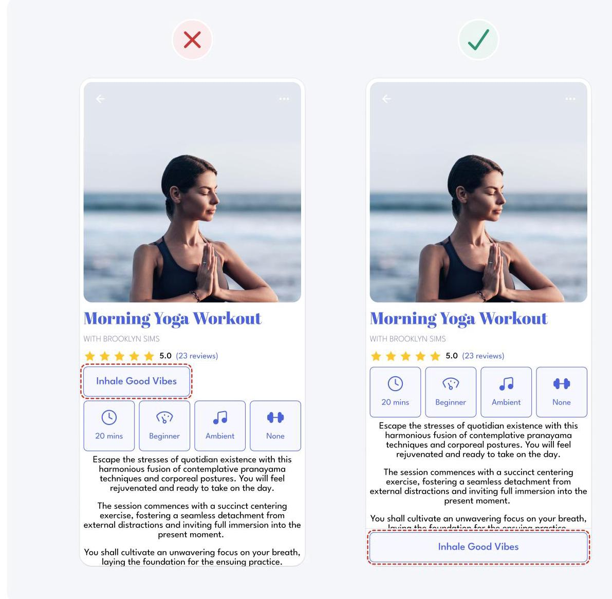

Button moved to the bottom and stretched to the full-width of the page

## Be consistent

In the fitness app example, the icon styles are inconsistent, as some are filled and others aren't. This could confuse some people, as filled icons often indicate that an element is selected.

Sticking with an outlined style for all icons helps improve consistency and gives each icon a similar level of prominence. Try to ensure the thickness of outlines is also consistent.

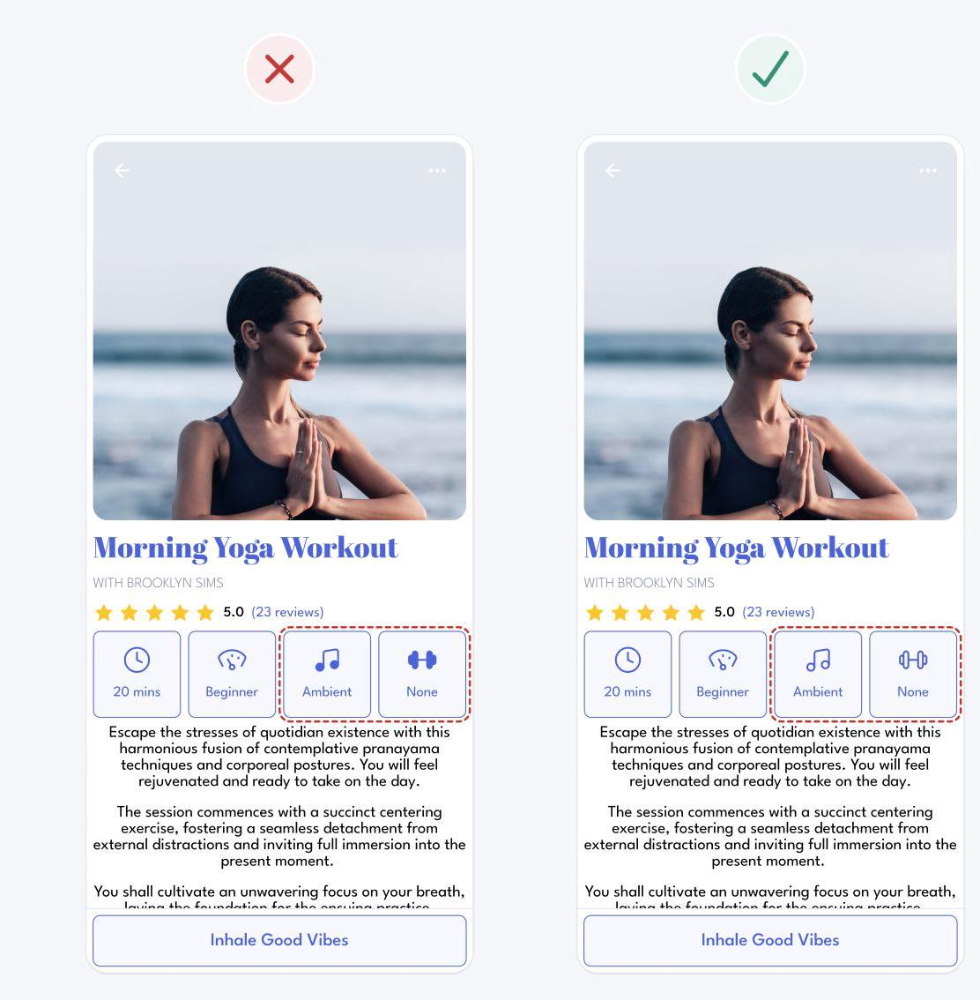

Icon styles updated to be consistent

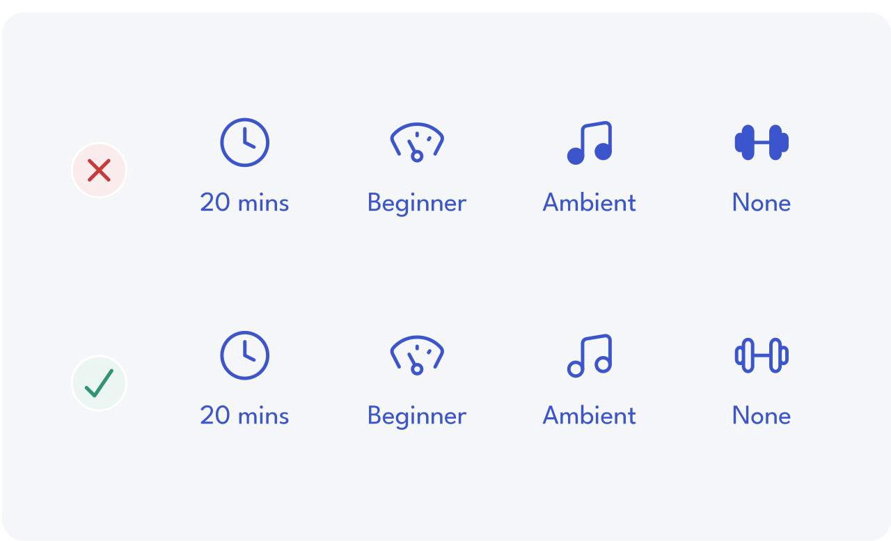

Icon styles updated to be consistent

Great work. The example app design is looking better already and we're learning some fundamental design guidelines in the process. We'll continue improving the example fitness app at the end of each chapter.

## Chapter summary

✓ Minimise usability risk by keeping interfaces simple and familiar.

✓ Don't just make design decisions based on what looks pretty, ensure that every interface detail has a logical reason behind it.

/ Minimise interaction cost and cognitive load as much as possible.

✓ Create a design system of predefined styles, modular components, and usage guidelines to help you make consistent design decisions faster.

✓ Good accessibility means great usability, so design interfaces for everyone to use.

## Your progress 1 of 8 chapters completed

- Fundamentals

2 Less is more

3 Colour

4 Layout and spacing

5 Typography

6 Copywriting

7 Buttons

8 Forms