CHAPTER 2

Less is more

Practical techniques to simplify interfaces by

removing unnecessary details

<!-- auto-toc:start -->
## Contents

- Remove unnecessary information
- Remove unnecessary styles
- Style trends fade
- Not all links need to be underlined
- Use progressive disclosure
- Don't confuse minimalism with simplicity
- Make sure important content is visible
- Design for the smallest screen first
- Reduce choice to speed up decision making
- 1. Remove choices
- 2. Group or categorise choices
- 3. Break up choices into multiple steps
- For example:
- 4. Recommend choices
- Apply what you've just learned
- Chapter summary
- Less is more

<!-- auto-toc:end -->

## Remove unnecessary information

Every element you add to your interface competes with existing elements. This can make it harder for people to understand. Unnecessary information is a distraction that increases cognitive load, so try to ensure every interface element has a logical reason behind it. Some quick tips:

- Remove repeated elements to instantly simplify your interface without losing information.

- Avoid unneeded words and introductory phrases. I'll go through this in more detail in the "Copywriting" chapter.

- Reveal less important information gradually. This is called progressive disclosure and you'll learn about it later in this chapter.

In the following example, the course name is repeated. Making the course name a subheading removes the repetition and simplifies the design. It also helps people differentiate between the chapters.

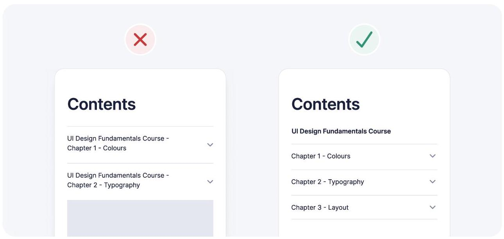

Removing repeated elements can help simplify an interface

## Remove unnecessary styles

Just like unnecessary information can be distracting and increase cognitive load, so can unnecessary styles. Avoid unnecessary lines, colours, backgrounds, and animations to create a simpler, more focused interface.

Unnecessary styles are those that don't convey information, they're purely decorative. I'm not saying that you shouldn't have any decorative styles, as aesthetics are important, but try to ensure they don't hinder usability.

In the following example, there are multiple unnecessary styles:

- The list items have decorative colours and styles that lack purpose. This could be confusing to some who assume the colours have meaning.

- The heading is coloured blue and underlined even though it's not a link.

- The decorative icon near the heading could be confused for a button.

- The icons are all very prominent and compete for attention.

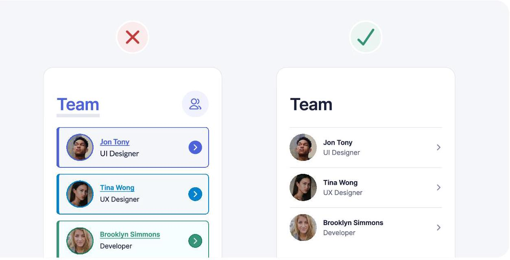

Unnecessary styles can hinder usability

## Style trends fade

It's tempting to use the latest popular visual style trends, but just remember that trends are always changing. The more trendy effects you use, the worse your interface will age over time. Sticking with minimal styles that highlight quality content is better for longevity.

While many popular visual styles look great, some simply aren't practical in real-world products, as they're prone to usability and accessibility issues. In the following "Glassmorphic" and "Neuomorphic" style examples, it's very difficult to create a clear visual hierarchy or achieve sufficient contrast using those visual languages. You'll learn more about visual hierarchy and colour contrast later on.

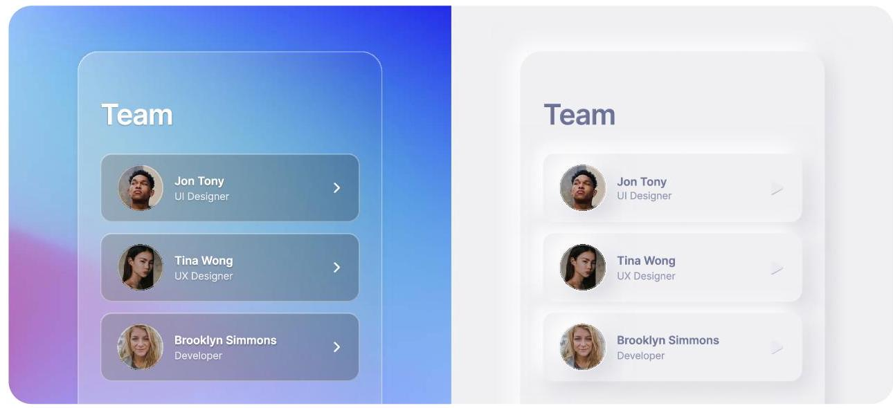

"Glassmorphic" and "Neuomorphic" style examples

I'm not saying that you shouldn't experiment with different visual styles, just make sure they don't hinder usability or exclude people from being able to use your interface. Throughout the book, you'll build a strong foundation of knowledge that will empower you to experiment and innovate while still maintaining a user-friendly and accessible interface.

## Not all links need to be underlined

For accessibility, consistency and good usability, it's safest to make text links coloured and underlined. This conventional link treatment helps differentiate links from other text and clearly indicates interactivity.

Some UI elements already look and feel interactive, so you don't need to underline and colour the text. Things like navigation menus, cards, and tabs have other cues to indicate they're interactive. Removing the conventional link treatment for these components can help simplify your interface.

The cards in the following example still feel interactive, with or without the conventional link treatment. The combination of image and text inside a raised container are sufficient visual cues to indicate the card is interactive. Feel free to keep the conventional link treatment for extra clarity.

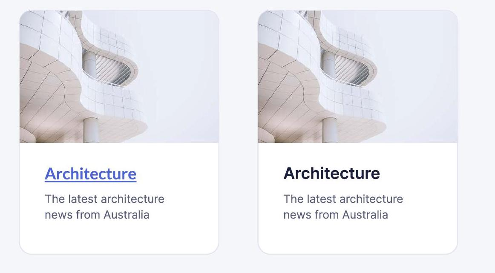

The card component still looks interactive without blue underlined text

Styling some text links with both the brand colour and an underline can make them too prominent. This can confuse the order of importance, or visual hierarchy, of elements. Removing the colour from links in these cases can help correct the visual hierarchy, as seen in the following example. You'll learn more about visual hierarchy in the "Layout and spacing" chapter.

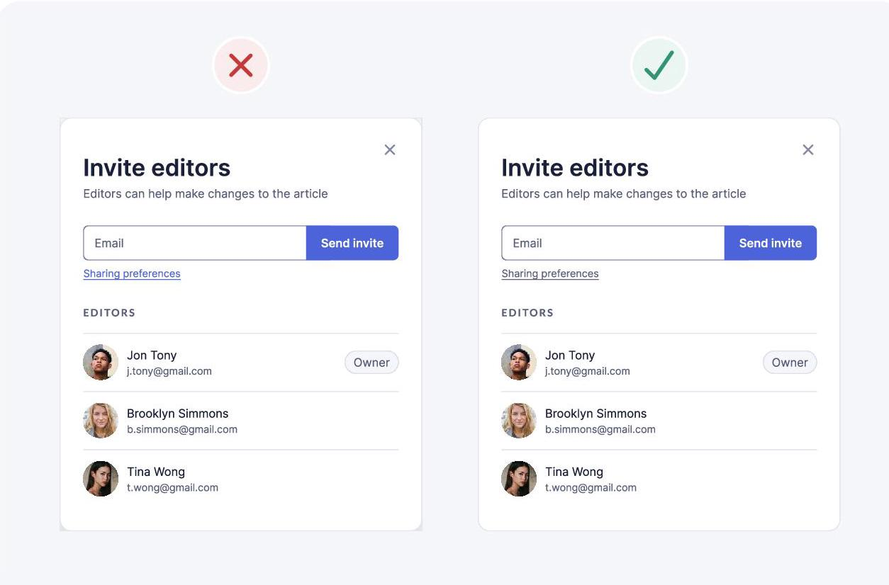

Text link colour is removed to help correct the visual hierarchy

## Use progressive disclosure

Progressive disclosure is the act of revealing information gradually as needed. Show people only what they need to know to complete the task at hand, rather than overwhelming them with all of the information upfront. For those who want more information, allow them to access it easily.

Progressively disclosing information adds extra interactions, but it can significantly reduce cognitive load and speed up decision making.

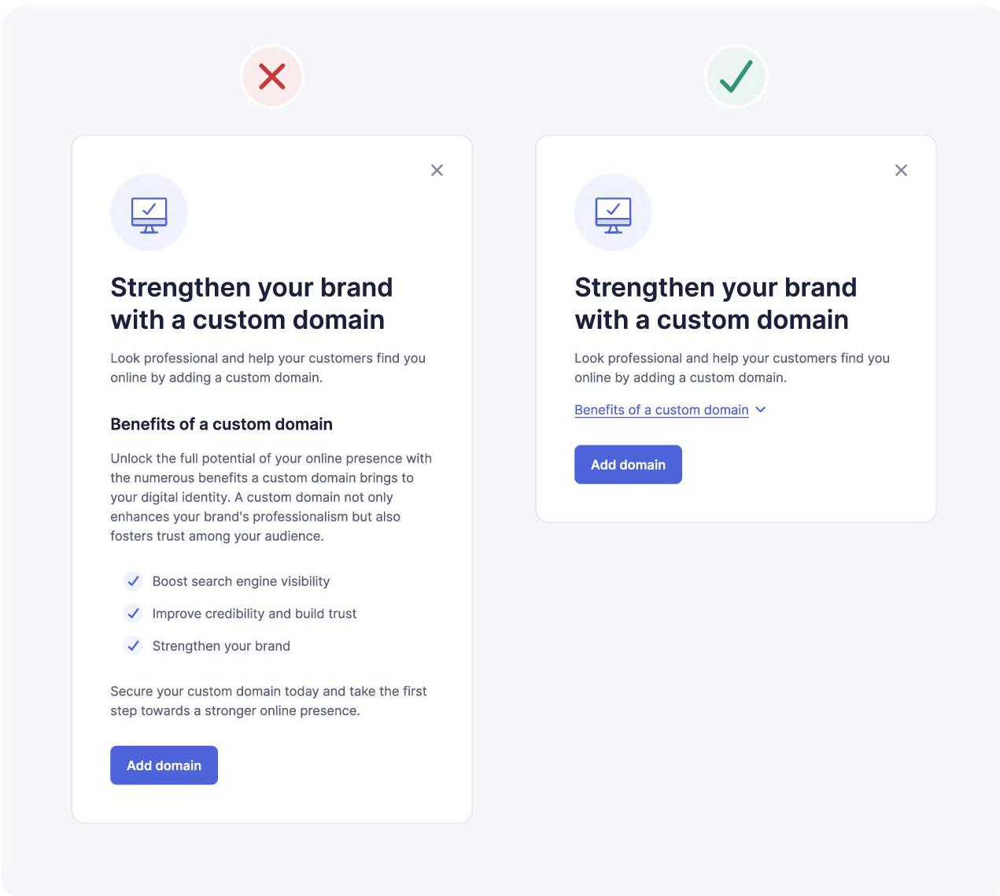

Example of progressive disclosure of information

In the previous example, a long page of text is shortened and additional information can be displayed via a text link. A descriptive label is used for the text ink to aid scanning and ensure the action makes sense when read out of context. You'll learn more about labelling actions later in the book.

In the following form, we progressively disclose the mobile number field to those who need it, rather than showing it to everyone. This avoids the need for an optional mobile number field and simplifies the form for people who aren't interested in receiving updates. You'll learn more about opt-in form fields in the "Forms" chapter.

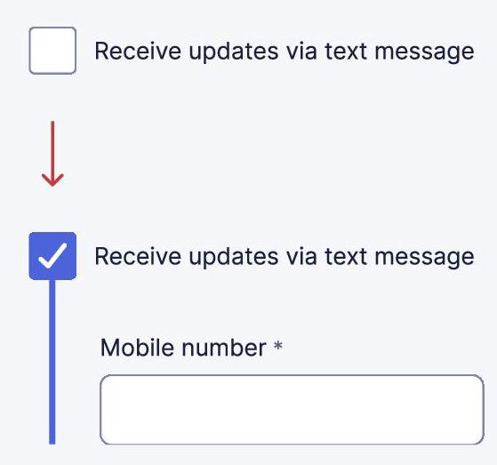

The mobile number field is displayed on click of the checkbox

## Don't confuse minimalism with simplicity

Minimal doesn't mean simple. We have a tendency to favour minimal interfaces as they can look beautiful and clean. A minimal interface has fewer elements and styles, but isn't necessarily simple to understand and use.

Minimal interfaces can often be vague or confusing as they lack crucial details needed for good usability. Simplification isn't just about reduction. Removing or hiding too much can harm usability. You need to make sure that you're not removing critical information or details.

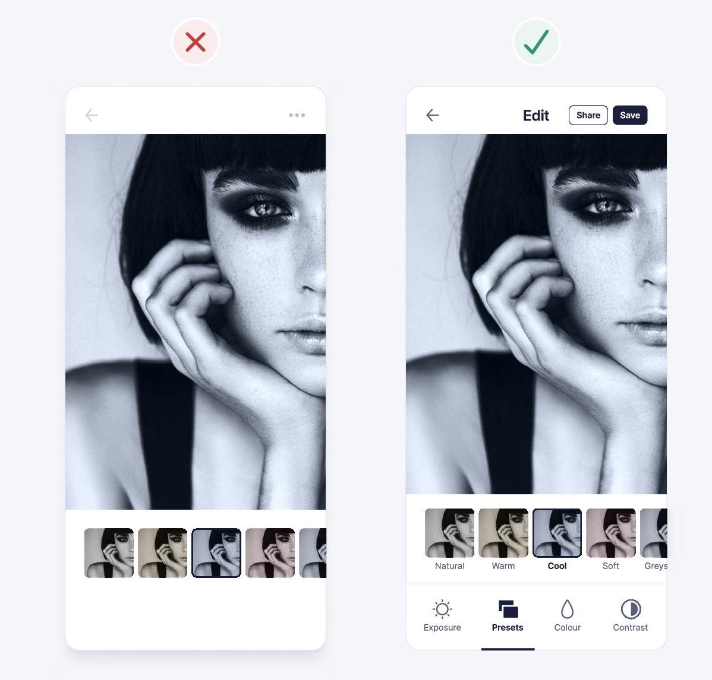

Vague minimal interface versus a simple and intuitive one

The previous example demonstrates how a minimal interface design could be confusing to use. Some of the issues include:

- The page, photo filters, and bottom navigation menu aren't labelled, so it's unclear what they're for.

- The selected state of the filters and navigation menu is very subtle, so it's unclear which one is selected.

- The share and save actions are hidden and could be missed.

- The contrast of the icons is insufficient and could be difficult for some people to see.

These issues can be fixed by making sure important actions are clearly visible, labelled, and have sufficient contrast.

## Make sure important content is visible

People don't use what they can't see. Hiding things behind interactive menus is a convenient way to keep an interface clean and minimal, but it's risky, as some people might miss those things. If there's space, try to ensure important content and actions are visible when they're needed.

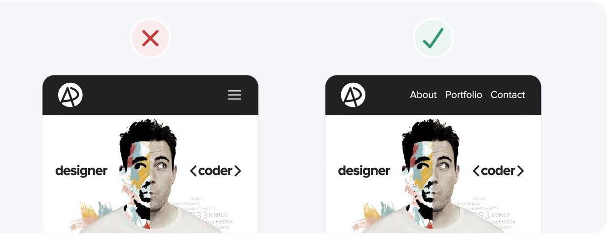

Example of hidden navigation links versus visible links

If you need to hide content due to space constraints, make sure it's discoverable. For example, expose the edge of cards that are off screen so that people know they're there.

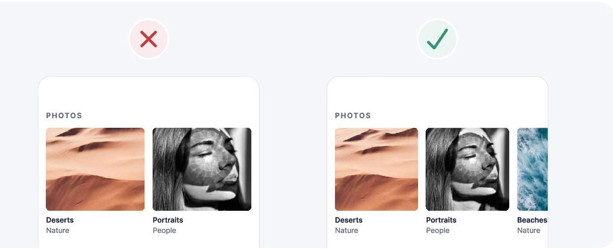

Example of hidden content versus discoverable content

## Design for the smallest screen first

Assuming your product will be used across a range of different screen sizes, start designing on the smallest size first. The restricted space will force you to prioritise important elements and remove unnecessary ones.

This approach should also help ensure your interface is simpler on larger screens too. If you start designing an interface on a large screen first, there's a tendency to want to fill the screen with more information, as there's lots of room. You don't need to fill the screen, as more information can increase cognitive load and slow down decision making.

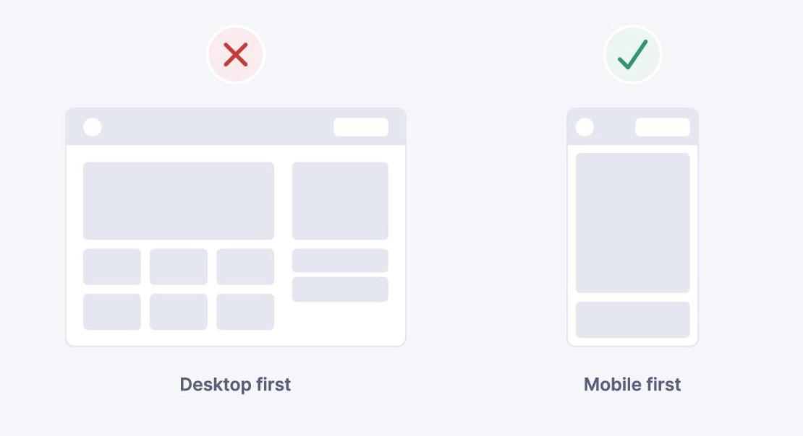

It's similar to living in a large home compared to a small one. We tend to fill large homes with lots of stuff we don't need. Whereas, in a small one, we have no choice but to be more organised and focused on the essentials.

## Reduce choice to speed up decision making

According to Hick's Law, the time it takes to make a decision increases with the number and complexity of choices. That means you should aim to present less choices more simply to help people make decisions faster.

There are 4 main ways to do this:

1. Remove choices

2. Group or categorise choices

3. Break up choices into multiple steps

4. Recommend choices

Let's go through each point in more detail with examples.

## 1. Remove choices

The most obvious way to reduce choices is to actually remove them. While this isn't always possible, it's good to keep in mind. Whether you're designing a form, a navigation, or a landing page, make sure that every option earns its place. If it's not necessary, it's a potential distraction that you should consider removing.

In the following example, the first 2 fields are removed from the subscription form. This results in a much simpler form that's faster and easier for people to complete. There's also a good chance that more people would subscribe, as there's less work to do and less personal information required from them.

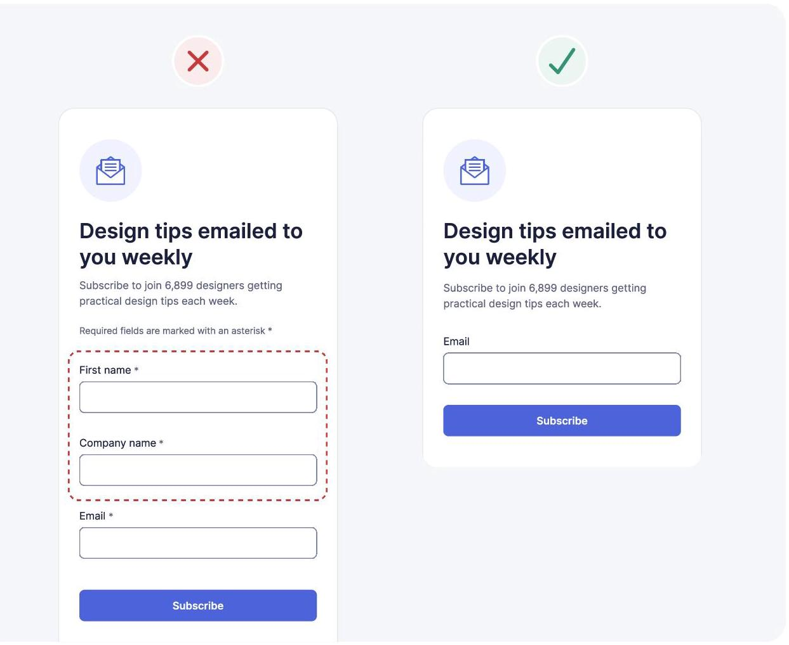

Removing unnecessary form fields can make forms faster and easier to complete

## 2. Group or categorise choices

Reduce the number and complexity of choices people need to make by grouping or categorising the options. It's simpler and faster to decide between a small number of categories than it is to choose an option from a large list.

In the following blog example, the articles are categorised to break them up and make them easier to browse.

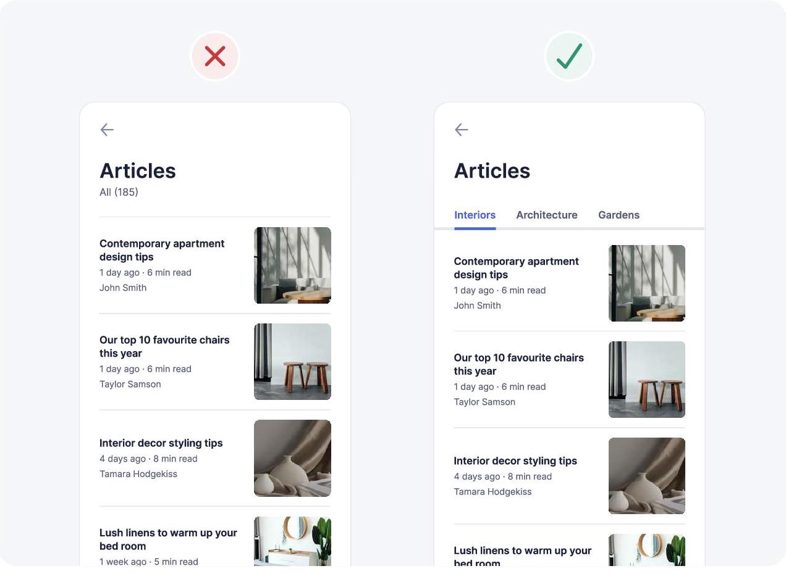

A list of articles are broken up into categories to make them easier to browse

## 3. Break up choices into multiple steps

To make large, complex tasks seem less overwhelming, break them up into multiple smaller steps. This decreases cognitive load and allows people to focus on one small thing at a time.

## For example:

- Long forms are often broken into multiple steps to simplify them and make them easier to complete.

- Large and complex navigation menus are also broken into multiple levels to help people find what they're looking for, one decision at a time.

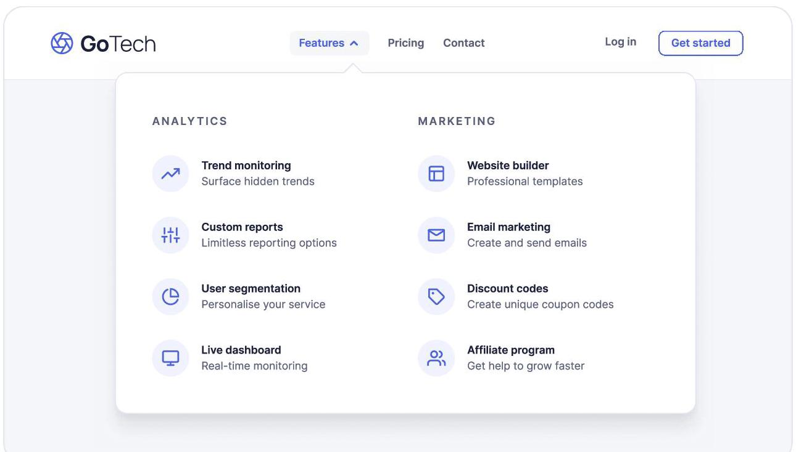

Navigation menu broken into multiple levels

## 4. Recommend choices

In some cases, you can make decisions easier for people by recommending popular or common choices. If a lot of people prefer certain choices, there's a good chance that others will too.

For example:

- Video streaming websites often recommend popular videos.

- Search boxes often suggest common search terms to help people narrow down their search faster. TUTORIAL - LESS IS MORE

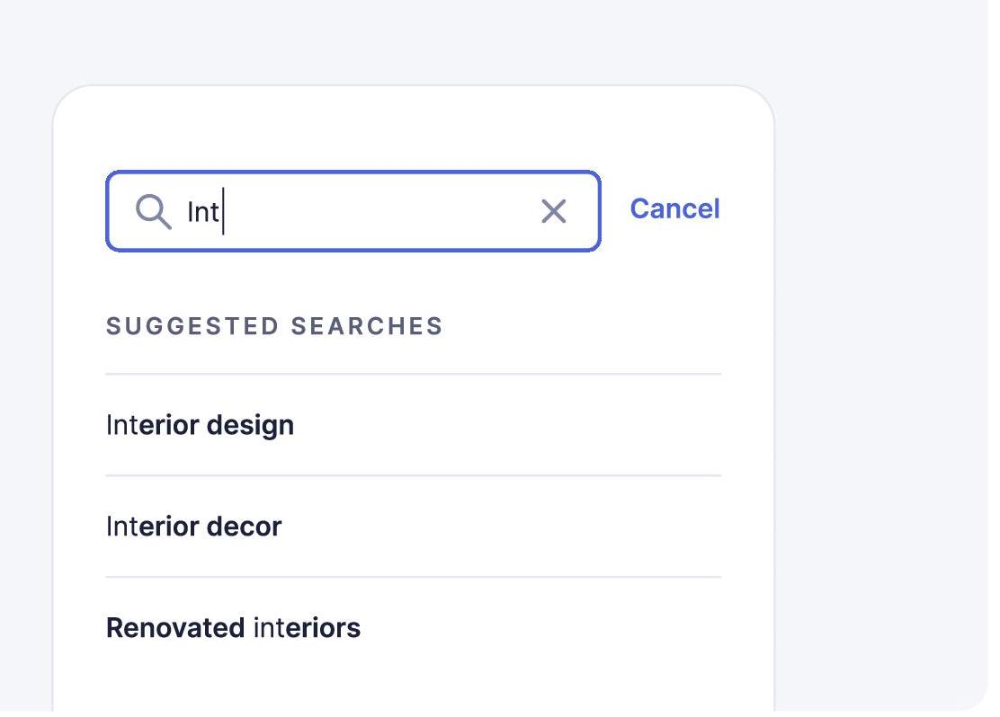

Suggested search terms help people narrow down their search faster

## Apply what you've just learned

Let's apply some of the guidelines you've learned

to continue improving the fitness app example.

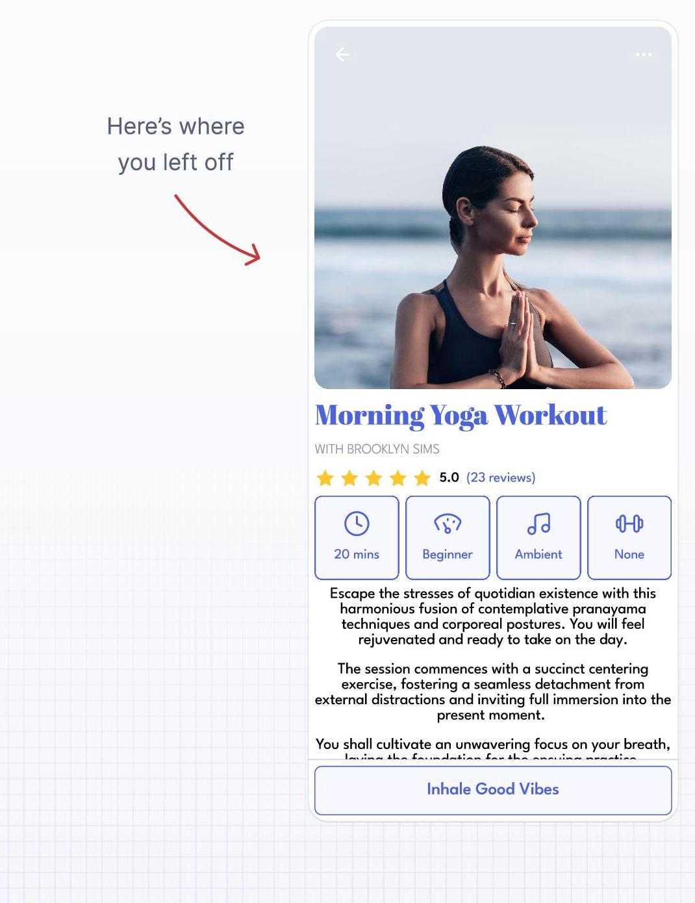

## Remove unnecessary styles

Unnecessary information and visual styles can be distracting and can increase cognitive load. Avoid unnecessary lines, colours, backgrounds, and animations to create a simpler, more focused interface.

In the fitness app example, the white space around the photo adds unnecessary visual complexity. It's not needed to convey information or group elements, so you can safely remove it to simplify the design.

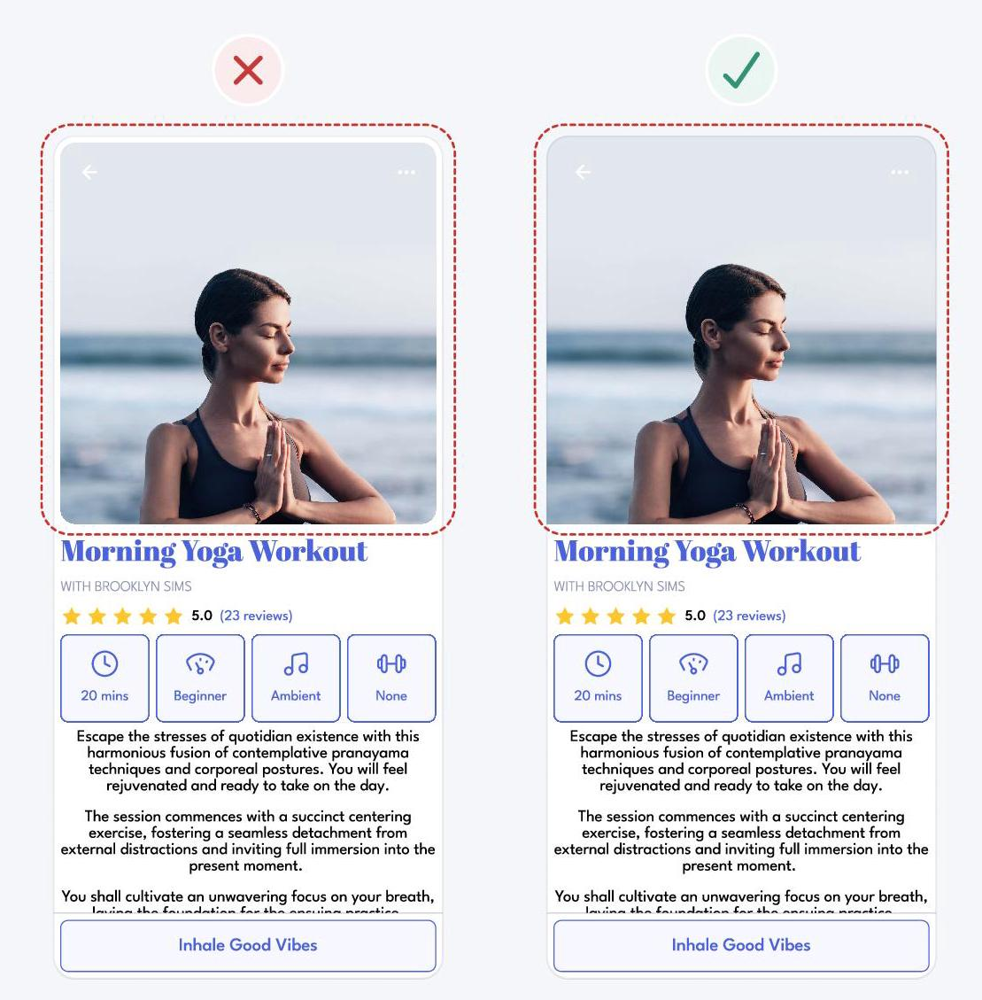

White space around the photo is removed to reduce complexity

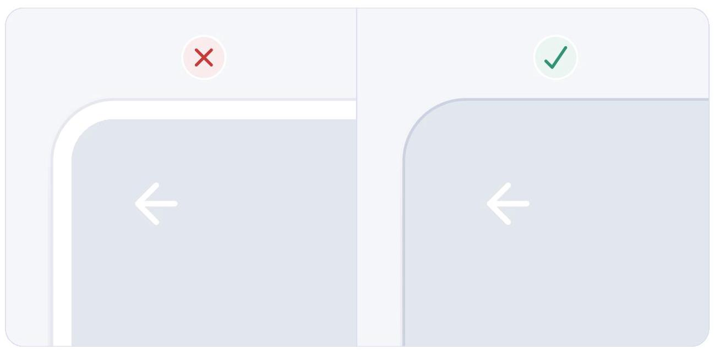

White space around the photo is removed to reduce complexity

## Make sure important content is visible

In the fitness app example, actions are hidden inside an interactive menu to help declutter the design. While it looks clean and minimal, there's a risk that some might miss the actions. Since there's space to display the 2 actions, "share" and "bookmark", keep them visible to help ensure they're not missed.

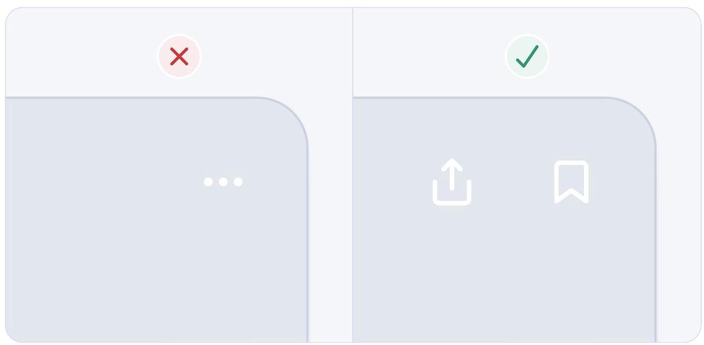

Actions are made visible, rather than being hidden inside an interactive menu.

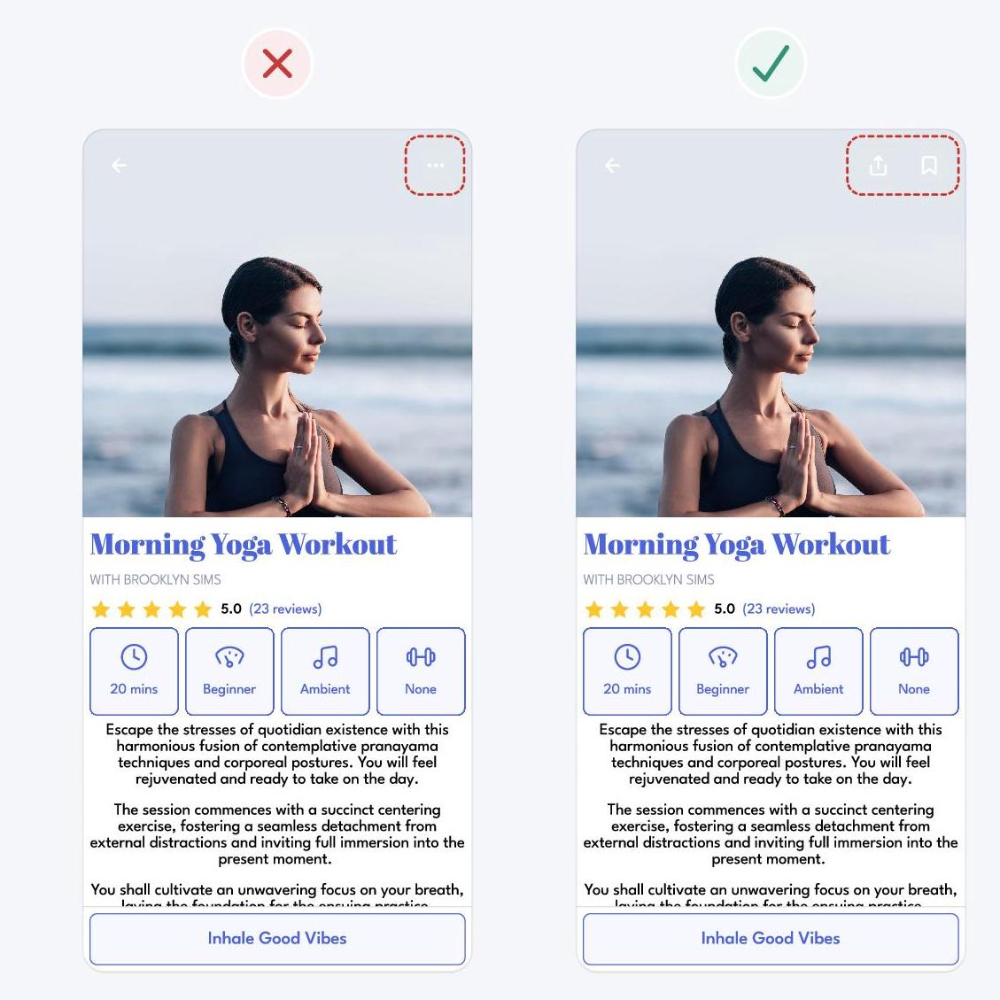

Actions are made visible, rather than being hidden inside an interactive menu.

Well done. The example app is getting there bit by bit. User interface design is often about removing what's unnecessary to highlight what's important. I hope you're starting to see how following a system of logical guidelines can help you efficiently make informed design decisions. We'll continue improving the example fitness app at the end of each chapter.

## Chapter summary

✓ Remove unnecessary information and styles to reduce cognitive load.

✓ Reveal information gradually, rather than all at once, so that people don't get overwhelmed. This also speeds up decision making.

J Minimal doesn't necessarily mean simple. Make sure you're not removing critical information or details simply to improve aesthetics.

✓ Ensure important content is visible or discoverable to reduce the risk of it being missed.

✓ To help people make decisions faster, consider removing choices, grouping them, breaking them up into multiple steps, or offering informed recommendations.

# Your progress 2 of 8 chapters completed

Fundamentals

## Less is more

3 Colour 4 Layout and spacing 5 Typography 6 Copywriting Buttons Forms