CHAPTER 3 Colour

Learn how to use colour sparingly and purposefully to

add meaning to an interface

<!-- auto-toc:start -->
## Contents

- Ensure sufficient contrast
- An improved way to measure contrast
- No more ratios
- Here's a summary of the APCA contrast guidelines:
- Swapping text and background colours affects contrast
- Better for dark interfaces
- Should I start using APCA?
- Don't rely on colour alone to convey meaning
- Use system colours to indicate status
- Ensure system colours are accessible
- Use colour to define a clear visual hierarchy
- Saturation
- Hue
- Contrast
- Use black and white for a timeless aesthetic
- Avoid pure black
- Add a tinge of colour to black and white
- Use 1 brand colour
- Colour psychology isn't universal
- Tips for choosing a brand colour
- Apply the brand colour to interactive elements
- Ensure a contrast ratio of 4.5:1
- What about low contrast colours?
- What if there are multiple brand colours?
- Create a colour palette with rules that govern its usage
- Use the HSB colour system
- 5 colour variations is often all you need
- Brand
- Text strong
- Text weak
- Stroke strong
- Stroke weak
- Fill
- What about interaction states?
- Change the opacity
- Change the fill colour
- Change the elevation
- Toggle a text underline
- Use animation
- Test your colour palette
- Monochromatic versus neutral greys
- Create a dark colour palette
- Add depth using colour and shadows
- Define 2 shadow options
- Use colour to indicate depth
- Adding depth in dark interfaces
- Consider using transparent colours
- The problem with solid colours
- Create a transparent colour palette
- Define 3 solid background colours
- Define transparent foreground colours
- Define 5 variations of black for light mode
- Define 4 variations of the brand colour
- Define 4 variations of system colours
- Neutral versus monochromatic greys
- Creating a monochromatic transparent colour palette
- Use transparent layers for interaction states
- Name colours to keep them organised
- Naming primitive colours
- [colour.number]
- Naming semantic colours
- Adjust photo colour temperature to match the colour palette
- Apply what you've just learned
- Apply the colour palette rules
- Ensure interface elements have a 3:1 contrast ratio
- Ensure text has a 4.5:1 contrast ratio
- WITH BROOKLYN SIMS  ✓ WITH BROOKLYN SIMS
- Don't rely on colour alone as an indicator
- Chapter summary

<!-- auto-toc:end -->

## Ensure sufficient contrast

Contrast is a measure of the difference in perceived brightness between two colours. It's expressed as a ratio ranging from 1:1 to 21:1. For example, black text on a black background has the lowest 1:1 contrast ratio, whereas black text on a white background has the highest 21:1 ratio. There are many online tools to help you measure contrast ratios between different colours.

In order to help ensure that people with low vision can clearly see interface details, aim to at least meet Web Content Accessibility Guidelines (WCAG) 2.1 level AA colour contrast requirements.

There are 2 important contrast ratios you need to remember:

- 3:1 - Minimum for large text (above 18px with bold weight or above 24px with regular weight) and user interface elements (like form fields). Decorative elements and styles that don't convey meaning don't need to meet this contrast ratio.

- 4.5:1 - Minimum for small text (18px or less).

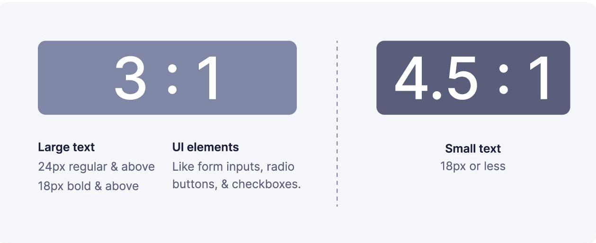

WCAG 2.1 level AA colour contrast requirements

The following example isn't accessible to people with low vision, as certain elements lack sufficient contrast:

- Close icon contrast is less than 3:1.

- Secondary text contrast is less than 4.5:1.

- Search field border contrast ratio is less than 3:1.

- Placeholder text in the search field is less than 4.5:1.

- Button background contrast against white text is less than 4.5:1.

- Link text contrast is less than 4.5:1.

Low contrast interface versus a high contrast interface

You'll learn how to avoid colour contrast issues by creating an accessible set of predefined colour options later in this chapter.

## An improved way to measure contrast

There's a new and improved way to measure contrast using the Accessible Perceptual Contrast Algorithm (APCA). It's part of the WCAG 3 draft and it helps solve some of the limitations of the WCAG 2 method.

In the following example, white text on an orange background fails WCAG 2, while black text passes. This doesn't make sense, as the white text is clearly easier to read. Using APCA, the white text passes and the black text fails. This matches our actual perception of the text.

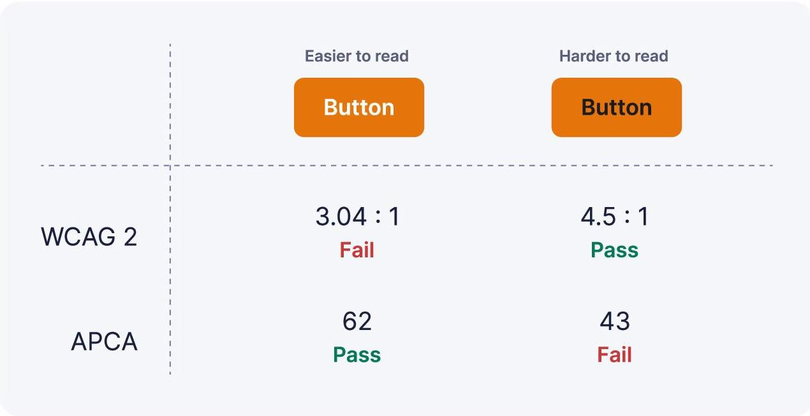

Limitations of the WCAG 2 method

The new APCA system is a bit more complex, but a lot more practical, especially for interfaces with a dark background. Let's quickly go through how it works. Colour

## No more ratios

Rather than ratios, APCA contrast is measured in numbers. The higher the number, the higher the contrast. The APCA contrast value also depends on the size and weight of text. Smaller and thinner text gets a lower score.

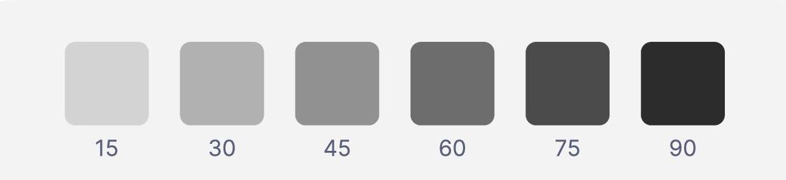

APCA key contrast values for neutral grey

## Here's a summary of the APCA contrast guidelines:

- 90 - Preferred for body text (14px regular and above).

- 75 - Minimum for body text (18px regular and above).

- 60 - Minimum for other text (24px regular or 16px bold and above).

- 45 - Minimum for large text (36px regular or 24px bold and above) and interface elements.

- 30 - Absolute minimum for text like form field placeholder text and disabled button text.

- 15 - Minimum for non-text elements.

## Swapping text and background colours affects contrast

The APCA contrast measurement differs depending on whether the colour is being used on text or a background. For example, white text on a blue background passes, while blue text on a white background doesn't.

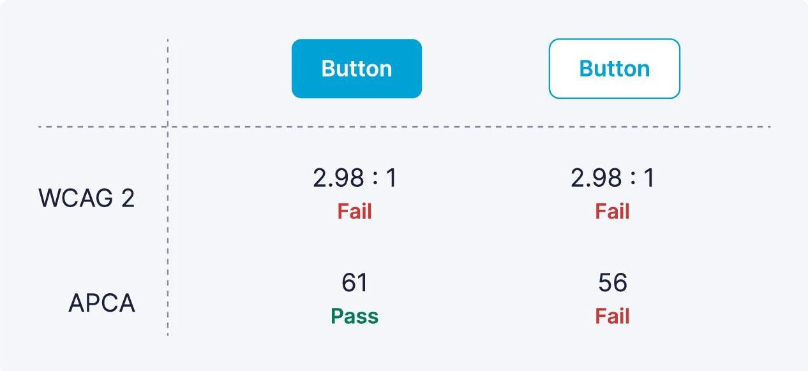

White text on a blue background passes, but blue text on a white background doesn't.

## Better for dark interfaces

Unlike APCA, WCAG 2 contrast requirements don't work well for interfaces with dark backgrounds. It results in text that's hard to read.

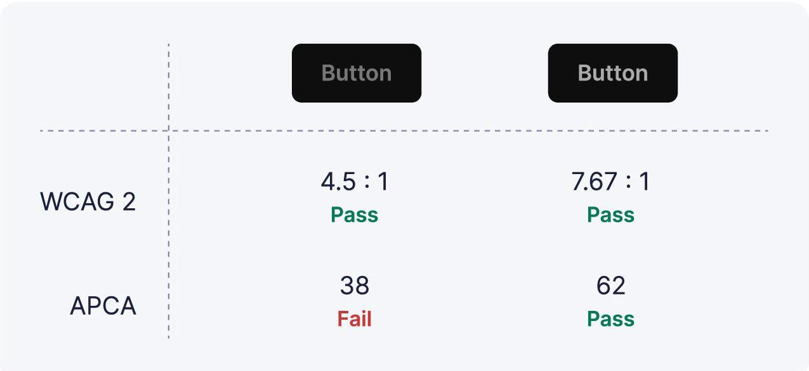

Button text on a dark background passes WCAG 2 but is difficult to read

## Should I start using APCA?

If you're working on a personal project, start using APCA, as it results in a more accessible interface. It's also easier to comply with contrast requirements, as it fixes many of the issues with WCAG 2.

For commercial projects, where accessibility compliance is a requirement, it's safest to stick with WCAG 2 until WCAG 3 is released. That being said, you should try to ensure your contrast passes both for optimal results.

## Don't rely on colour alone to convey meaning

There are many different types of colour blindness and they mainly affect men. Commonly, people who are colour blind have difficulty distinguishing between red and green, but some aren't able to see any colour at all.

To ensure an interface is accessible to those who are colour blind, you can't rely on colour alone to convey meaning or distinguish visual elements. You need to use additional visual cues to differentiate interface elements.

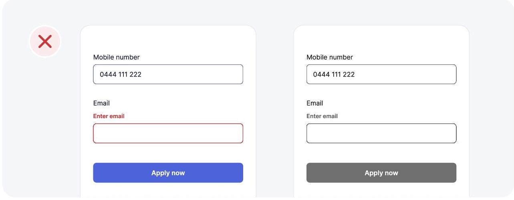

Colour alone is used to indicate a form error

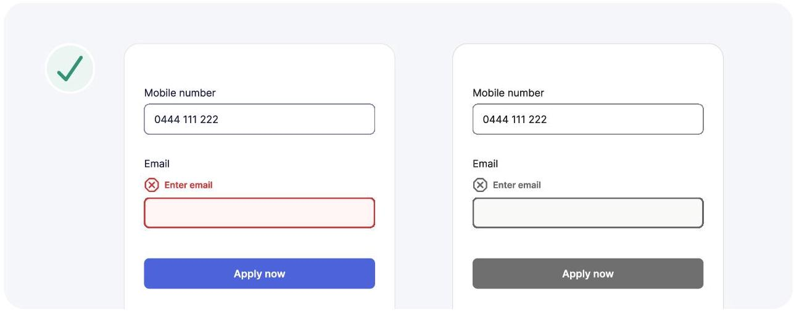

Colour along with an icon, thicker border, and background are used to indicate a form error.

In the previous example, the colour red is used to indicate an error with a form field. If colour is removed, there's nothing else to differentiate the error field from other form fields. You can fix this by adding an icon, thicker border, and background shade. This also makes the error state more obvious to others who aren't colour blind.

In the next example, the reviews text link is coloured blue to indicate that it's interactive. If colour is removed from the interface, the text link looks the same as other text, so the colour blind can't tell it's a link. You can fix this by underlining the text link to clearly differentiate it from other text.

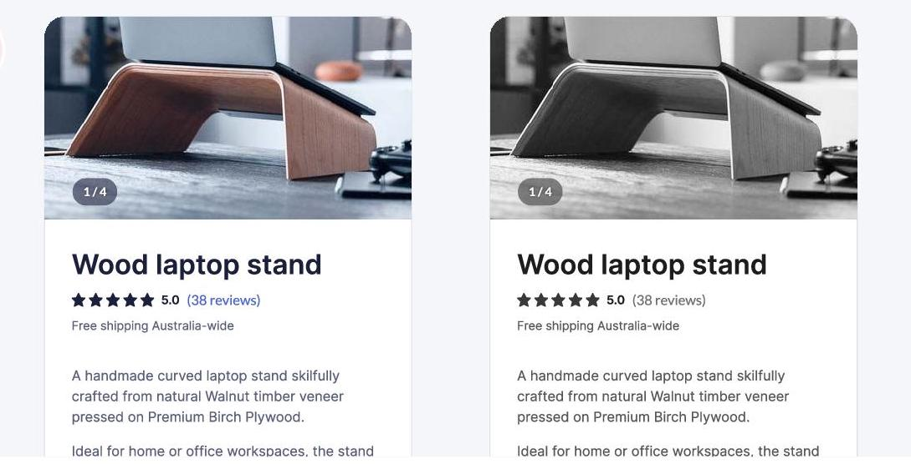

Colour alone is used to indicate a link is interactive

Colour and an underline are used to indicate a link is interactive

## Use system colours to indicate status

You'll generally need 3 system colours to indicate errors, warnings, and success states. Traffic light colours (red, amber, and green) are commonly used for system colours, as they already have familiar meanings associated with them.

- Red (error) - used to indicate a negative message such as an error or system failure that needs urgent attention.

- Amber (warning) - used to warn people to be cautious and that taking an action could be risky.

- Green (success) - used to indicate a positive message or that an action was completed as expected.

## Ensure system colours are accessible

Make sure you don't rely on system colours alone as indicators. Use additional visual cues such as icons to ensure people who are colour blind can also understand what the system messages mean.

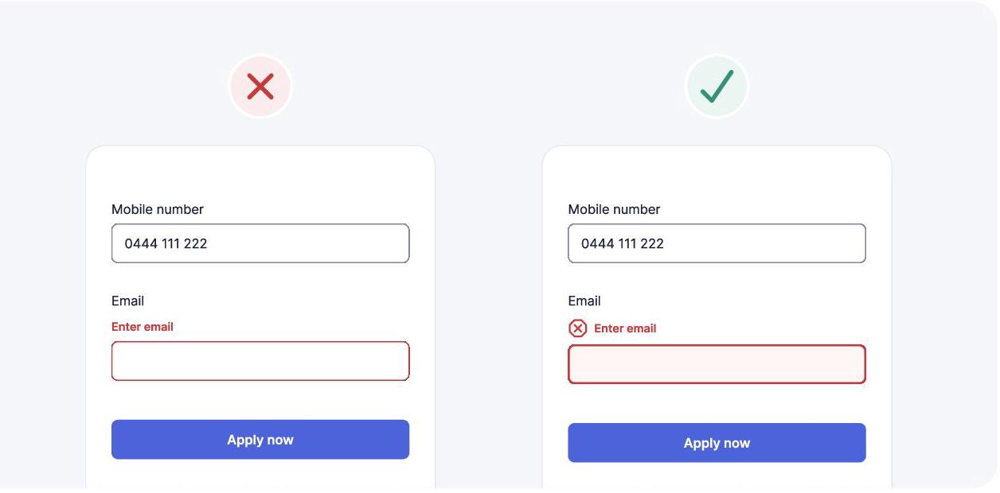

An icon is used as an additional visual cue for an error state

If you're using system colours for text, make sure they at least have a 4.5:1 contrast ratio. If you're only using system colours for interface elements and icons, they need a 3:1 contrast ratio.

Low contrast icon and text versus high contrast icon and text

## Use colour to define a clear visual hierarchy

Not all information in an interface has the same level of importance. Aim to present information in order of importance by making more important elements look more prominent. A clear order of importance, or visual hierarchy, helps people scan information quickly and focus on areas of interest. It also improves aesthetics by creating a sense of order.

Use variations in colour saturation, hue, and contrast to help define a clear visual hierarchy.

## Saturation

Saturation is the degree of richness or intensity of a colour. Use saturated colours for more important elements. For example, use a saturated colour for text links and buttons to help them stand out.

Action colour with low saturation versus one with high saturation

## Hue

A hue is a number between 0 and 360 degrees that represents the colours of the rainbow. Certain colour hues are more prominent than others and should be used for more important elements. For example, red stands out a lot, which is one of the reasons it's used to indicate urgent errors.

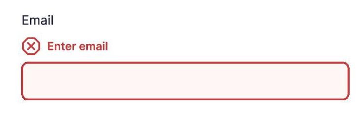

Prominent red form input error message

## Contrast

Colour contrast is the difference in brightness between 2 colours. Give more important elements higher contrast to make them more prominent. For example, make headings darker than body text to help them stand out.

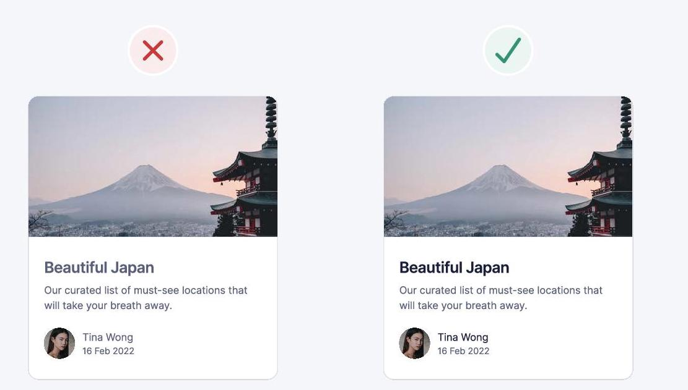

Low contrast heading versus high contrast heading

## Use black and white for a timeless aesthetic

Many brands avoid colour and use black and white for a timeless look and feel. When I say black and white, I'm also referring to shades of grey. Black and white interfaces are especially good at highlighting content, as there are fewer distractions. Even if your brand has colour, you could still consider designing your interface in black and white.

Black and white are the foundations that most interfaces are built on. It's a good idea to design interfaces without colour first, regardless of the brand colours. Designing in black and white first helps you focus on spacing, size, layout, and contrast, without the extra challenge of colour.

The proportion of black and white you use in an interface depends on the brand personality. Use mostly white backgrounds to create a light interface that conveys a simple, classic, or minimal feel.

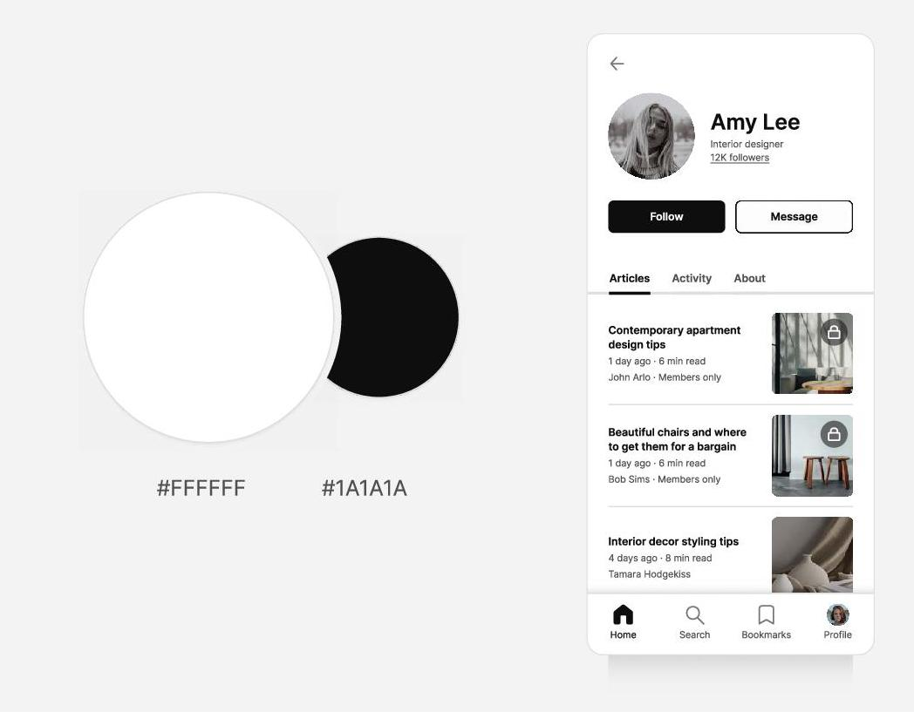

Use mostly black backgrounds to create a dark interface that conveys a dramatic, powerful, or luxurious feel.

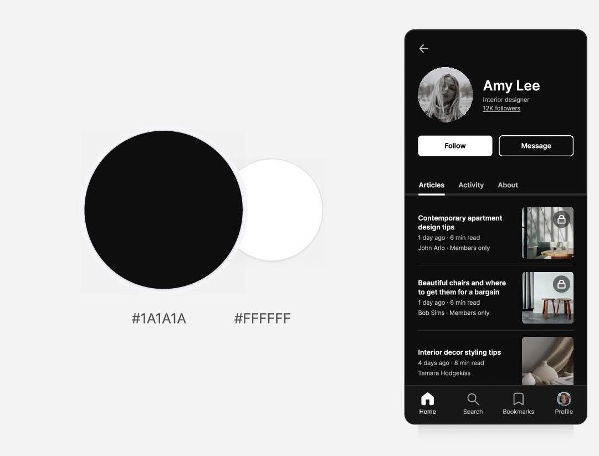

## Avoid pure black

It's generally safest to avoid pure black as it has a high contrast against white. This high contrast can cause eye strain and fatigue, especially when reading long text.

Black has 0% colour brightness and white has 100% colour brightness. The large difference in colour brightness causes our eyes to work harder. It's safest to avoid pure black against white and opt for a dark grey instead.

## Add a tinge of colour to black and white

Some brands add a tinge of colour to black and white to differentiate their brand from others. With this approach, you get most of the benefits of a simple black and white interface design, but you're able to adjust the mood with a pinch of colour.

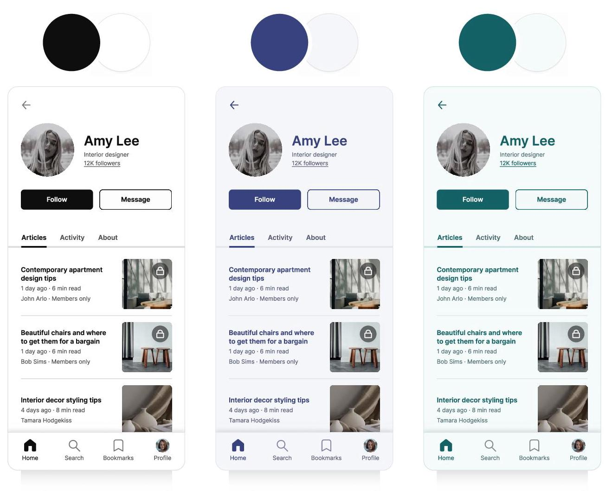

## Use 1 brand colour

Many of the top brands use a single unique colour, alongside black and white, to help convey the brand mood or personality. This works well for interface design, as you can use the brand colour purposefully to indicate interactive elements. You might recognise some of the following brand representations based solely on their brand colour.

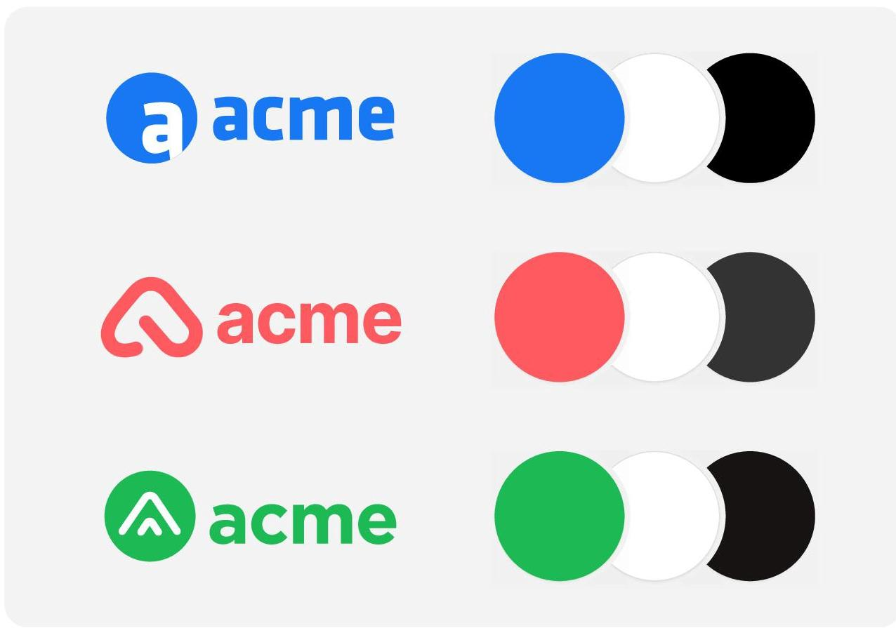

Facebook, Airbnb, and Spotify brand colours.

## Colour psychology isn't universal

If you've read about colour psychology, you know that colours make people feel a certain way. For example, green is often associated with nature, growth, and success. Yellow is often thought to convey happiness, warmth, and positivity.

Universal colour meanings sound nice in theory, but in practice, colour affects each of us differently for the following reasons:

- Colours have different meanings in different cultures.

- Your feelings about certain colours are based on your own personal experiences and preferences.

- There are different types of colour blindness that affect how people see colours.

- Our perception of colour is affected by surrounding colours, shapes, typography, and imagery.

- One colour has many different tints, shades, and tones, each of which has its own associations.

## Tips for choosing a brand colour

Brand design is a complex craft in itself. We're only scratching the surface as to how it relates to UI design. As a UI designer, you'll most likely be designing interfaces for an existing brand. In case you need to create your own brand, here are a few quick tips to help you choose a single brand colour:

- Use colour psychology as a loose guideline.

- Test the brand colour on users to make sure it's suitable.

- Try to choose a distinctive colour to help the brand stand out.

- Remember that some colours have strong meanings associated with them. Red, for example, is a very prominent system colour used to indicate urgent errors and notifications. Using it for other interface elements could cause confusion.

## Apply the brand colour to interactive elements

Use colour sparingly and with purpose. Try to avoid using colour purely for decoration, as it can be confusing and distracting. Start with black and white and introduce colour where it conveys meaning.

A simple and effective approach is to apply the brand colour to interactive elements like text links and buttons. This helps teach people what's interactive and what's not. You don't need to add colour to all interactive elements, as some already have visual cues that indicate they're interactive. Just try to avoid using the brand colour on non-interactive elements. For example, avoid using colour on non-interactive headings, as they could be mistaken for links.

The brand colour is applied to interactive elements to indicate they're interactive

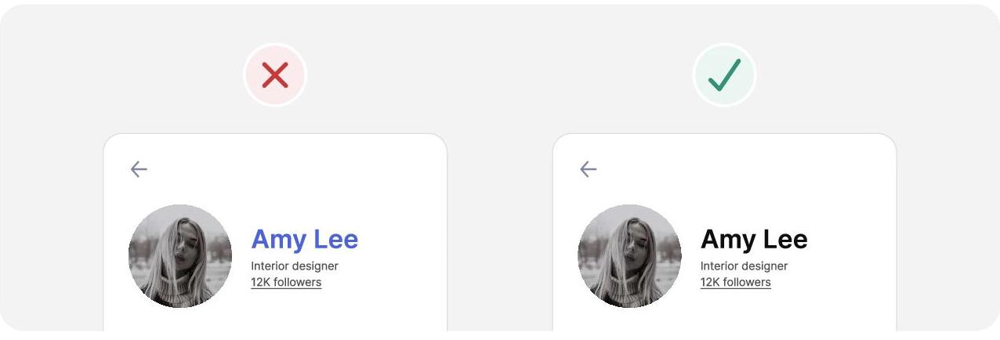

## Ensure a contrast ratio of 4.5:1

The brand colour needs to have a contrast ratio of at least 4.5:1 against the background. This ensures that button and link text are accessible to those with low vision.

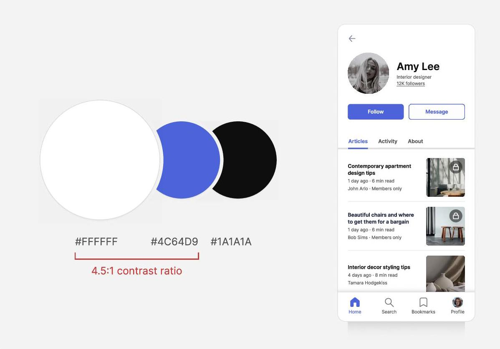

You should also check the contrast using the APCA method, as the standard method doesn't work well with certain colours. The APCA method is especially effective for measuring contrast on dark interfaces.

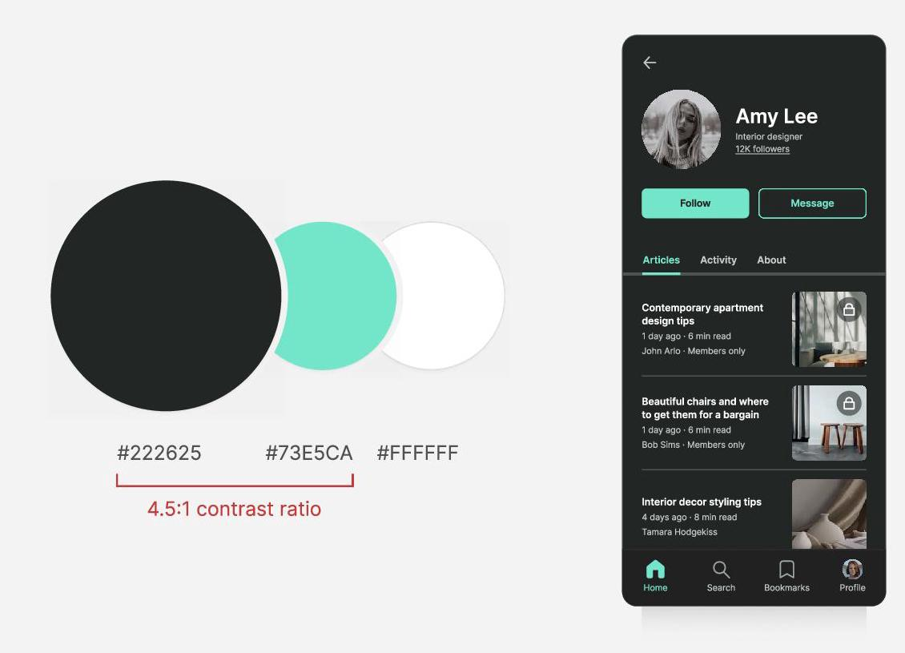

## What about low contrast colours?

If the brand colour is a light colour like yellow, it won't have enough contrast to be accessible against light background colours like white. This means that you won't be able to have yellow text links or yellow buttons with white text.

Depending on the brand colour, you might be able to darken it slightly to get it to an accessible contrast ratio (without losing brand recognition). Another trick is to add a text shadow to the white button text.

If your brand colour is very light, try the following:

- Use the text colour for button text, text links, and other interactive elements to ensure they're accessible and prominent.

- Add a border to buttons to ensure they have at least a 3:1 contrast ratio.

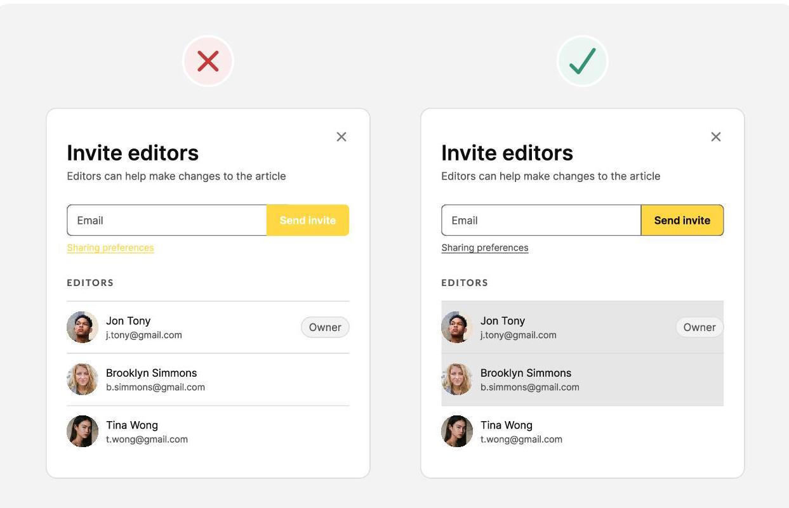

Button and text links are made accessible

You can use a similar approach for dark brand colours on dark backgrounds.

Invite editors

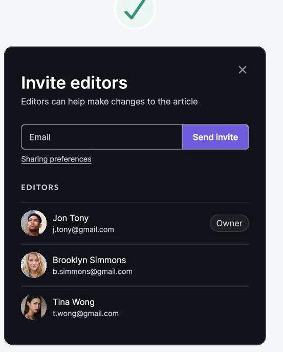

Editors can help make changes to the article

Email Send invite

Sharing preferences

EDITORS

Jon Tony Owner

j.tony@gmail.com

Brooklyn Simmons

b.simmons@gmail.com

Tina Wong

t.wong@gmail.com

You could also consider not using your brand colour for interactive elements and opt for a simple black and white aesthetic instead.

Invite editors

Editors can help make changes to the article

Email

Sharing preferences

EDITORS

Jon Tony Owner

j.tony@gmail.com

Brooklyn Simmons

Tina Wong

t.wong@gmail.com

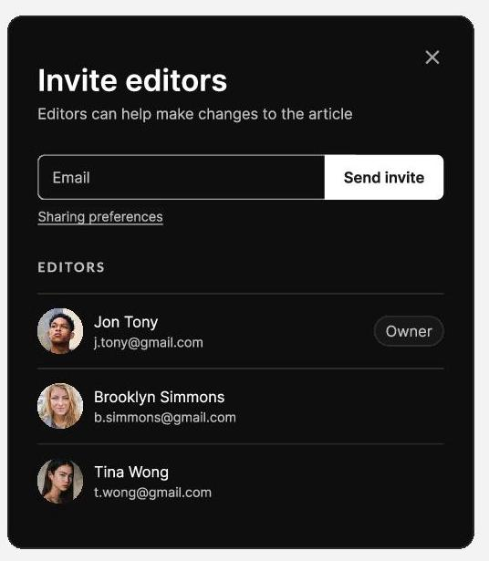

# If the brand colour has meaning, avoid using it for interactive elements.

Some colours have strong meanings associated with them. Red, for example, is a very prominent system colour used to indicate urgent errors, destructive actions, and notifications.

Using it for other interface elements, like actions, could cause confusion. Green and amber are other system colours that indicate success and warnings respectively.

If the brand colour has meaning, it's safest to avoid using it for interactive elements like text links and buttons. This helps avoid colours having conflicting meanings.

Using red for interactive elements can cause confusion

## What if there are multiple brand colours?

If there are multiple brand colours, use the highest contrast colour for interactive elements and use the others sparingly for decorative elements.

Decorative elements might include backgrounds, borders, icons, and illustrations. Don't use more than one colour for interactive elements, as it could cause confusion around what colours mean.

## Create a colour palette with rules that govern its usage

Rather than choosing colours from an unlimited set of options, create a small set of predefined colours called a colour palette. Define simple rules that govern how each colour is used. This makes it faster and easier to apply colours and also results in a more consistent design.

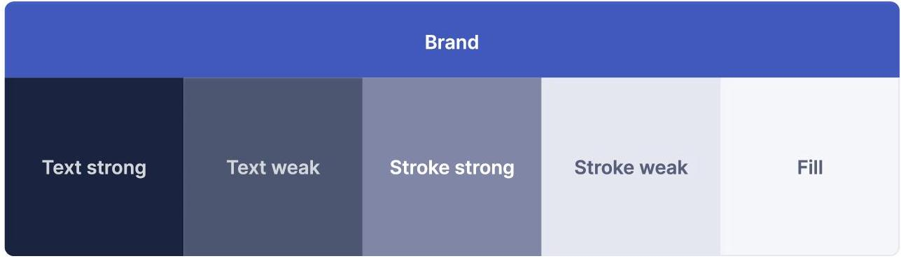

We'll create a simple yet powerful colour palette soon. It's made up of 5 variations of the brand colour. Each colour has a purpose to help you quickly decide how and where to use it:

- Brand - used to indicate interactive elements like text links and buttons.

- Text strong - used for primary text, like headings, body content, and form labels to ensure they're prominent and legible.

- Text weak - used for supporting text to make it less prominent.

- Stroke strong - used for non-decorative borders on interface elements like form input fields. Also used for icons.

- Stroke weak - used for decorative borders, like dividing lines, that aren't critical to identifying interface elements.

- Fill - used as a secondary background to help differentiate elements, like tags or badges, that sit on the main white background.

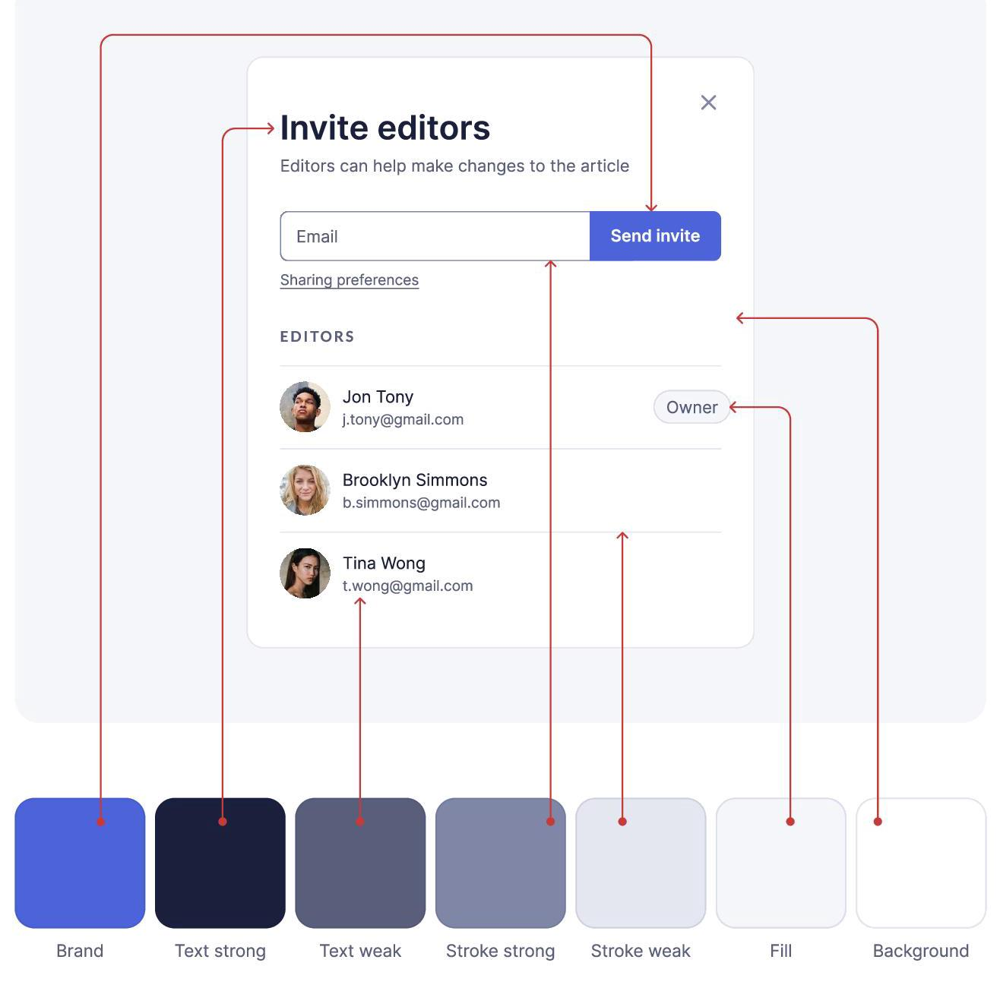

We'll create the colour palette next. To make it easier, let's quickly learn about the HSB colour system.

## Use the HSB colour system

Using the HSB (Hue, Saturation, Brightness) colour system makes it much easier to define your colour variations. If you haven't used the HSB colour system before, you've been missing out. It's really simple and very powerful.

Here's a quick introduction to HSB colours:

- Hue - a number between 0 and 360 degrees that represents the colours of the rainbow. I'm using a hue of 230 for my brand colour.

- Saturation - a number between 0 and 100 that represents the intensity or richness of a hue. A saturation of 100 is the richest version of the hue and 0 is a grey version of the hue.

- Brightness- a number between 0 and 100 that represents the lightness/ darkness of a hue. A brightness of 100 is the lightest version of the hue and 0 is always black.

Creating variations of the brand colour using HSB

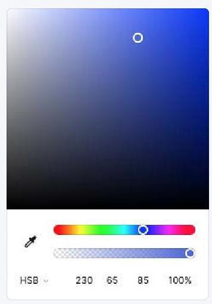

Start with the brand colour as a base and change the saturation and brightness to create other variations.

Colour picker using the HSB colour system

## 5 colour variations is often all you need

Colour palettes can be unnecessarily large and complex, making them difficult to understand and follow. In many cases, all you need is 1 brand colour and 5 variations of that colour. You can add more variations if needed.

<table><tr><td>  </td><td>Brand HSB: 230, 65, 85</td><td>Contrast with fill variation must be at least:</td><td>4.5 : 1</td></tr><tr><td>  </td><td>Text strong HSB: 230, 57, 24</td><td>Contrast with fill variation must be at least:</td><td>4.5 : 1</td></tr><tr><td>  </td><td>Text weak HSB: 230, 27, 48</td><td>Contrast with fill variation must be at least:</td><td>4.5 : 1</td></tr><tr><td>  </td><td>Stroke strong HSB: 230, 23, 65</td><td>Contrast with fill variation must be at least:</td><td>3 : 1</td></tr><tr><td>  </td><td>Stroke weak HSB: 230, 5, 94</td><td colspan="2">This is a decorative colour, so it doesn't need to be high contrast.</td></tr><tr><td>  </td><td>Fill HSB: 230, 2, 98</td><td colspan="2">Text and interface elements sitting on this colour must have sufficient contrast</td></tr><tr><td>  </td><td>Background HSB: 0, 0, 100</td><td colspan="2">Text and interface elements sitting on this colour must have sufficient contrast</td></tr></table>

This simple, accessible, and powerful colour palette works well in most cases. It does have a limitation that comes with using solid colours though. We'll look at this limitation later. We'll also consider the advantages of using transparent colours for more complex websites and apps.

Let's create a simple solid colour palette first.

## Brand

- I'm using a hue of 230 for my brand colour. I'm also using the brand colour to indicate interactive elements like buttons and text links.

- Must have a contrast ratio of at least 4.5:1 against the "fill" variation, as a text link could sit on a "fill" background.

## Text strong

- Greatly decrease the brightness of the brand colour. Aim for a very dark grey with a tinge of the brand colour. Because this variation is so dark, you'll need to saturate it quite heavily.

- Must have a contrast ratio of at least 4.5:1 against the "fill" variation, as it's used for primary text that could sit on a "fill" background.

## Text weak

- Increase the brightness and decrease the saturation of the previous variation. Aim for a dark grey with a tinge of the brand colour.

- Must have a contrast ratio of at least 4.5:1 against the "fill" variation, as it's used for secondary text that could sit on a "fill" background.

## Stroke strong

- Increase the brightness and decrease the saturation of the previous variation. Aim for a medium grey with a tinge of the brand colour.

- Must have a contrast ratio of at least 3:1 against the "fill" variation, as it's used for non-decorative borders on interface elements. For example, form input field borders. The borders of form input fields are critical to identifying them as input fields, so they need to have sufficient contrast.

## Stroke weak

- Increase the brightness and decrease the saturation of the previous variation. Aim for a light grey with a tinge of the brand colour.

- This is just a decorative colour used for borders that aren't critical to identifying interface elements, so it doesn't need to be high contrast. Decorative borders are often used to emphasise the separation between interface elements. Removing them shouldn't hinder usability.

## Fill

- Increase the brightness and decrease the saturation of the previous variation. Aim for a very light grey with a tinge of the brand colour.

- The colour of any text and interface elements that sit on this background colour need to have a contrast ratio that meets WCAG 2.1 level AA accessibility requirements.

## What about interaction states?

Interactive elements have states including hover, press, focus, and disabled. To indicate these states, consider the following options:

- Change the opacity

- Change the fill colour

- Change the elevation

- Toggle a text underline

- Use animation

## Change the opacity

Solid colours have an opacity of 100%, which means that you can't see through them. Lowering the opacity of a colour makes it more transparent or see-through.

Use changes in opacity to indicate interaction states. This means that you don't have to introduce any new colours to the palette. The hover state could have an opacity of \( {80}\% \) , while the disabled state could have an opacity of 20% to help indicate that it's not interactive. An outline is generally used to indicate the focus state.

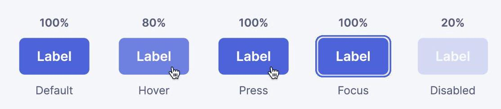

Changes in opacity being used to indicate button states

## Change the fill colour

For interactive elements with the "Background" colour, you can use the "Fill" colour variation from the palette for the hover state. For the press state, use the "Stroke weak" colour variation.

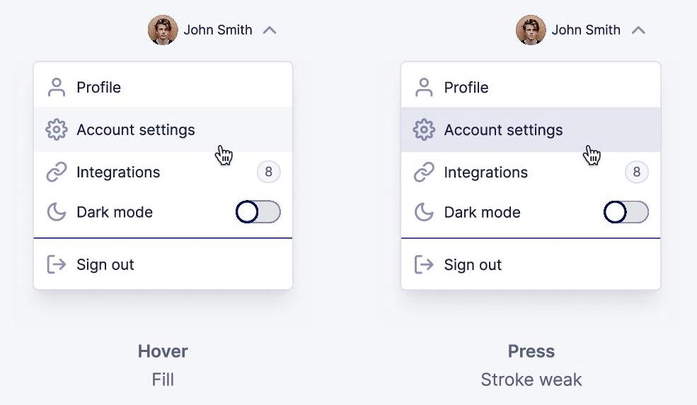

Fill colours being used to indicate states in a dropdown menu

For interactive elements that use the brand colour, like buttons, you could change the fill colour to others from the palette. "Text weak" could be used for the hover state, "Text strong" for the press state, and "Stroke weak" for the disabled state.

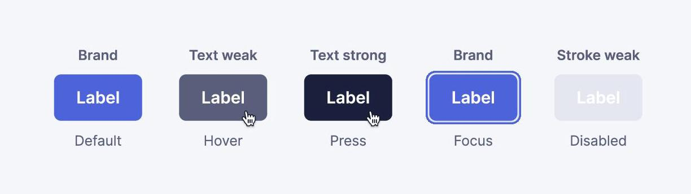

Fill colours being used to indicate states in a button

## Change the elevation

Another quick and simple way of indicating state is to change the elevation of interactive elements. Elements can be elevated using shadows. In the following example, the card component is elevated higher on hover.

Card component is elevated higher on hover

Similarly, in the next example, a shadow is used to elevate a button on hover. The press state is often the same as the default state, as it only needs to differ from the hover state.

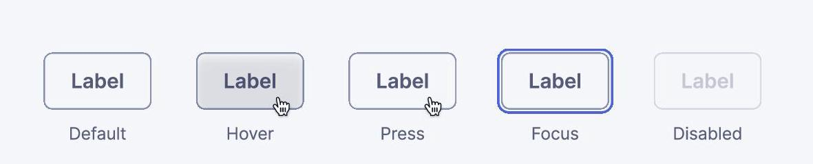

Button hover state is elevated using a shadow

## Toggle a text underline

For interactive text that's underlined, like text links, you could simply remove the underline on hover. For interactive text that isn't underlined, like text in a navigation menu, consider underlining it on hover.

Label

Default Hover

Underlined Not underlined

Text underline is removed on hover

## Use animation

You can also use subtle animations to differentiate states. For example, you could move a button slightly upwards on hover, or animate the border, or the background. Just make sure the animation is quick and subtle, so it doesn't get in the way of the user completing their task.

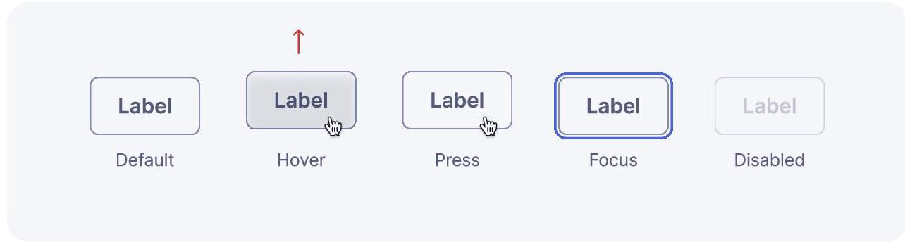

Button is moved upwards slightly on hover

You could also get creative and combine some of these options to clearly indicate interaction states.

## Test your colour palette

Test your colour palette using an interface example that contains all colour variations. Seeing all of the colours in context is the only way to be sure they'll work well together.

## Monochromatic versus neutral greys

Your colour palette is monochromatic, which means that it consists of variations of a single colour hue, rather than neutral greys. Neutral greys don't contain any colour hue. They have a saturation of zero.

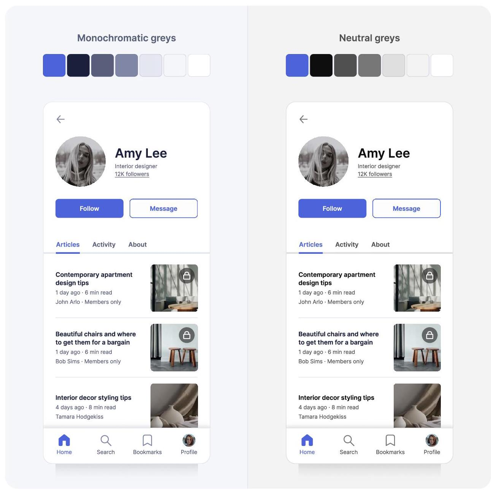

Monochromatic colour palettes are a popular and effective option for interface design for the following reasons:

- Variations of a single colour create a simple and cohesive look.

- Colour can be assigned a functional purpose rather than just being decorative. For example, the brand colour can be used to indicate actionable or interactive elements like links and buttons.

- Fewer colours can simplify an interface and decrease cognitive load.

- Most brands consist of a single brand colour, so a monochromatic colour palette conveys a strong brand presence.

If you prefer a neutral colour palette like the following example, simply use variations of neutral grey along with your brand colour. Set the saturation to zero to create neutral variations of grey.

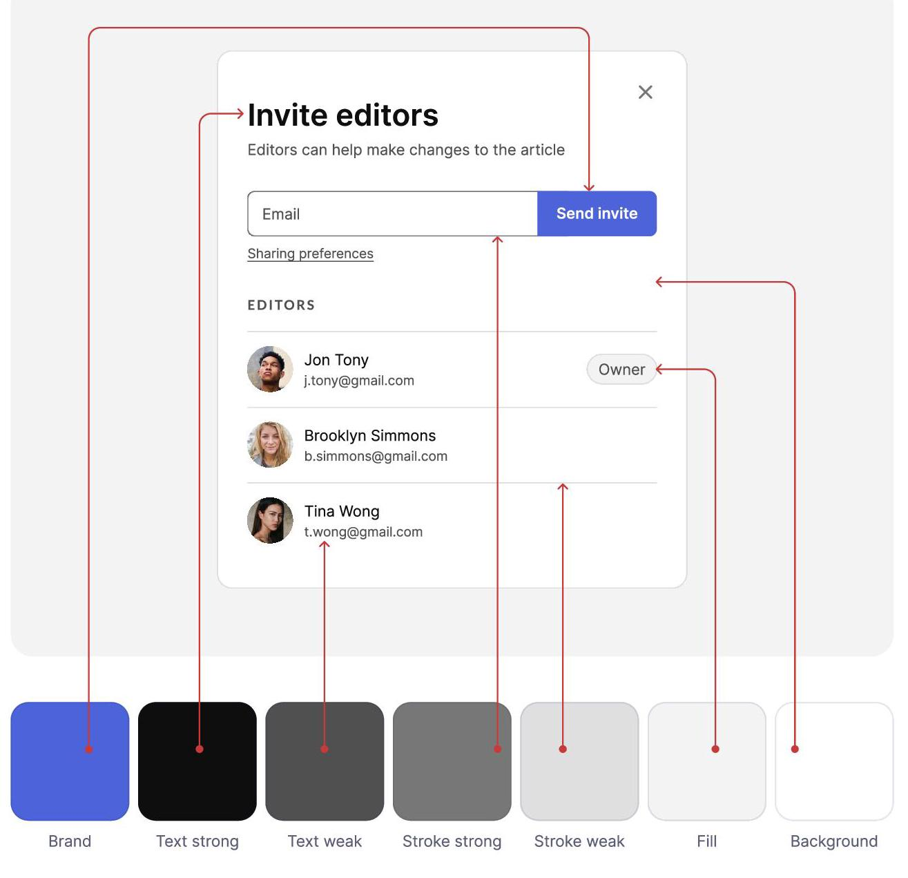

## Create a dark colour palette

Dark interfaces are quickly growing in popularity. Many websites and apps allow you to switch between light and dark mode based on your preference. Others automatically switch based on the time of day. Some brands opt for a dark only aesthetic to create a dramatic, powerful, or luxurious feel.

There's conflicting evidence on whether dark interfaces are better for your eyes or not. Some believe that they can reduce eye strain, as they're less bright. Others believe that dark interface details can be difficult to see, especially in bright, sunny environments. So it's especially important to ensure dark interfaces have sufficient contrast.

Luckily, you can create a dark colour palette in a similar way to the light one. Let’s get started.

An example of a dark interface

Use the main brand colour hue as a base and change the saturation and brightness to create the other variations. Increase the contrast well above the minimum WCAG requirements for dark interfaces, as they can be more difficult to see. Check contrast using the APCA method for more accurate contrast measurements.

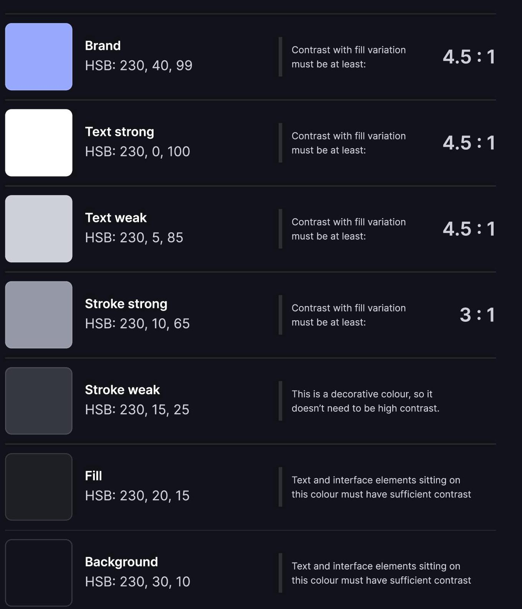

Start with white for the "Text strong" variation, it has a saturation of 0 and a brightness of 100. Gradually increase saturation and decrease brightness to create the other colour variations. Avoid pure black for the background colour and opt for a dark grey instead.

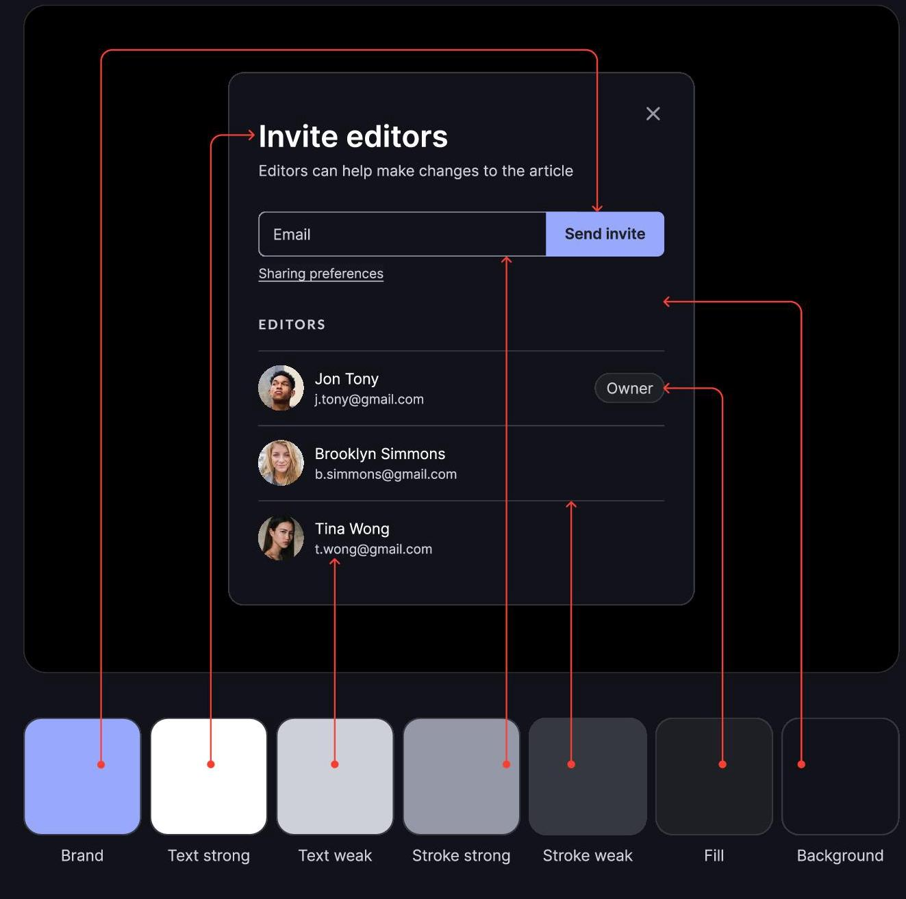

What if the brand colour has low contrast on a dark background?

In order to use the brand colour on interactive elements like text links and buttons, it needs sufficient contrast. Dark brand colours will generally need to be lightened and desaturated to achieve the required contrast.

If the adjusted colour no longer reflects the brand closely enough, consider using white for interactive elements instead. You can use the brand colour decoratively in other areas to maintain a subtle brand presence.

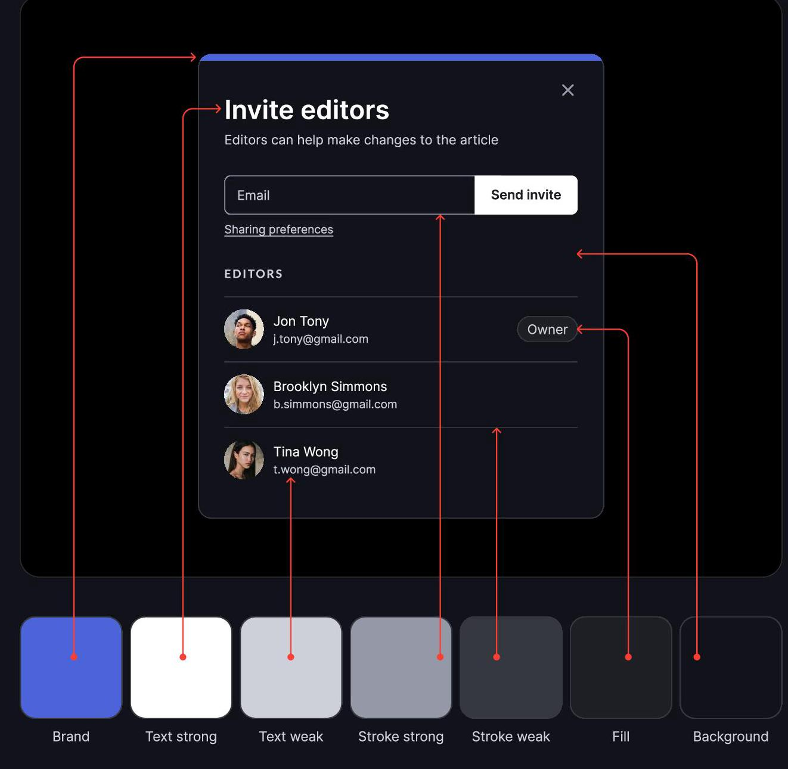

## Add depth using colour and shadows

To add depth to an interface, use colour and shadows to raise or lower interface elements to different levels of elevation. Elements with a higher elevation appear closer to you and are more prominent. Those with a lower elevation appear further away and are less prominent.

## Define 2 shadow options

Including shadow options in your design system saves time and improves consistency. For most projects you'll only need the following shadow options:

- Raised - a small and sharp shadow used to slightly elevate interactive elements like cards.

- Overlay - a larger and softer shadow used for elements that float high above the page like dropdown menus and floating dialog boxes. Some quick tips for creating shadows:

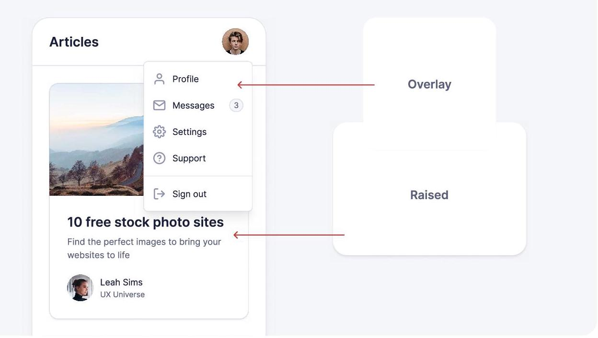

A predefined set of shadow options

- Use a small and sharp shadow to slightly raise an interface element off the page.

- Use a larger and softer shadow to elevate an interface element higher.

- Make sure the light comes from the top to mimic real world objects.

- Rather than using black for the shadow colour, try using the "Text strong" variation from your predefined colour palette. This will help ensure the shadow fits in with the rest of the interface.

## Use colour to indicate depth

Shadows aren't the only way to add depth to an interface. Light comes from above, so light colours tend to look more elevated than dark ones. Add depth to an interface by placing lighter colours on top of darker colours.

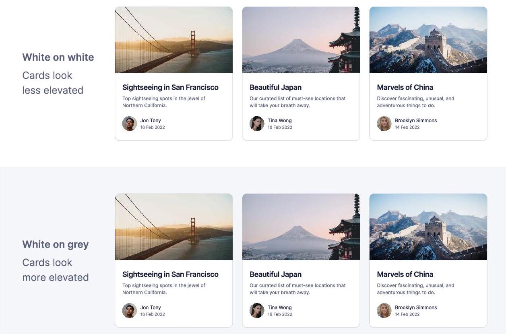

## Adding depth in dark interfaces

Shadows work well to indicate different levels of elevation in light interfaces. However, shadows can be difficult to see in dark interfaces, so you mostly need to rely on colour to indicate depth.

Take your background colour as your base and define 2 progressively brighter background colours to help indicate elevation above the page. This gives you 3 background colours to use when designing dark interfaces:

- Base - darkest colour for the main background.

- Raised - slightly brighter than the base colour.

- Overlay - slightly brighter than the raised colour.

3 levels of elevation in dark interfaces

If you're designing an interface that supports switching between light and dark mode, make sure each level of elevation looks consistent across modes.

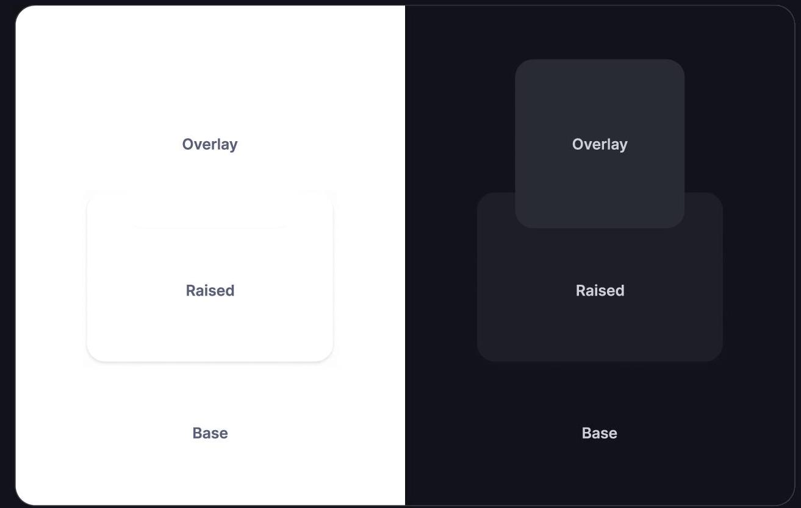

3 levels of elevation across light and dark mode

## Consider using transparent colours

Solid colours have an opacity of 100%, which means that you can't see through them. Lowering the opacity of a colour makes it more transparent or see-through.

There's actually a 4th value in the HSB colour system that controls the opacity of a colour. It's known as the "alpha" value and it's represented by the letter "A". It can have a value from 0 to 1 , with 1 being 100% opacity.

Control opacity using

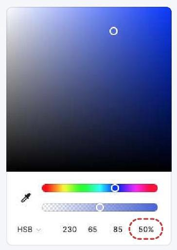

the "alpha" value

HSBA(230, 70, 80, 0.5)

Colour picker using the HSBA colour system

Now that you know what transparent colours are, here's why you should consider using them. As you design more complex websites and apps, you may start to notice an issue with the solid colour palette you just created. It's not a problem unique to this colour palette, but rather a limitation of any colour palette that relies solely on solid colours. All solid colour palettes generally suffer from the same problem.

## The problem with solid colours

The main advantage of solid colours is actually their main problem. Solid colours remain the same regardless of the background they sit on. Let's look at why this can be problematic.

In the following example, some tags (small pill-shaped elements used to categorise or label content) sit on a white background, while others sit on a grey background. Tags with a solid grey fill look less prominent on the grey background, which affects their visual hierarchy. Ideally, these tags should always look slightly more prominent than the background they sit on to help them stand out.

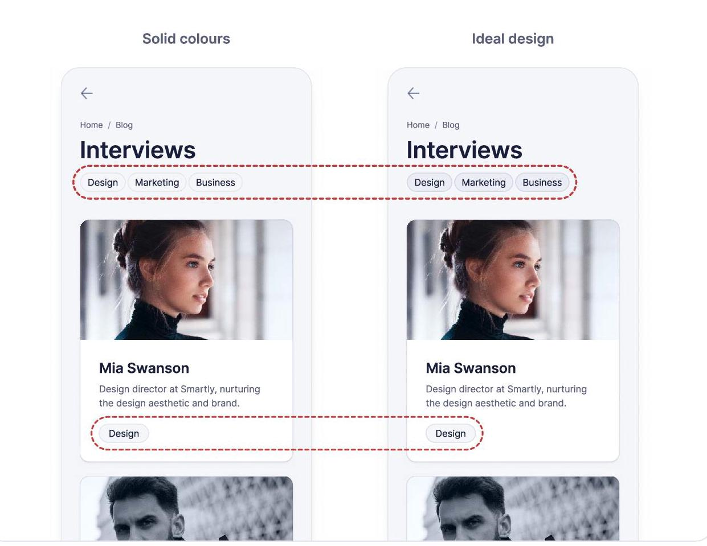

Tags using solid colours are less prominent on a grey background

You might consider simply darkening the tag component to account for the grey background. This is a common compromise, but it makes tags considerably darker on white backgrounds.

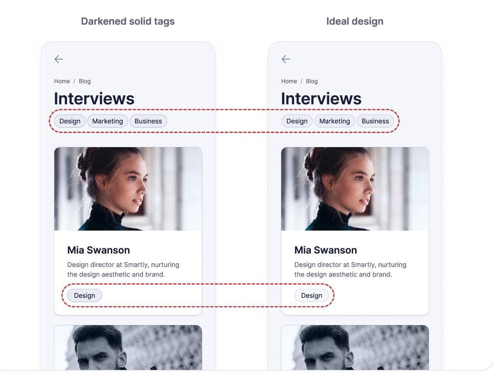

Tags are darkened to account for the grey background

Depending on your design, you might also be able to lighten the background colour to avoid the issue. But what if you have other background colours you need to support?

Dark interfaces are especially problematic, as they generally have at least 3 different background colours. One for each level of elevation. It can be very difficult to ensure that foreground elements, like tags, have a similar prominence on each level of elevation. The following example demonstrates this issue.

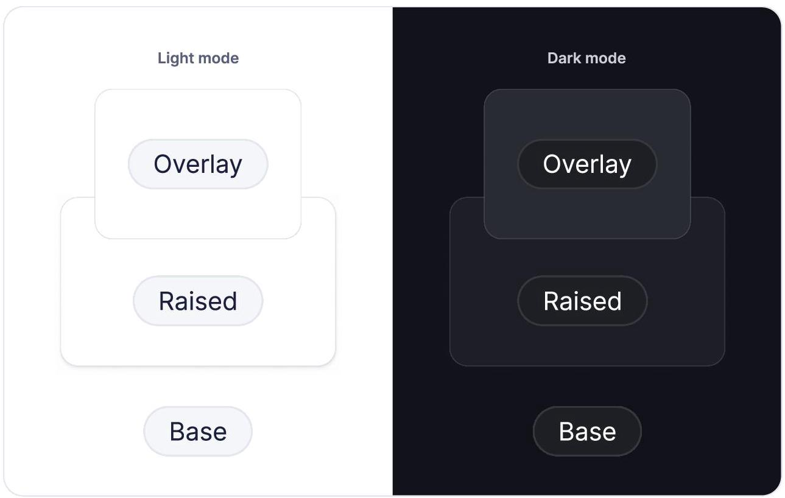

Solid tags have varied prominence on different backgrounds in dark mode

To solve this issue, foreground elements need to take their background into account. This is where transparent colours can help.

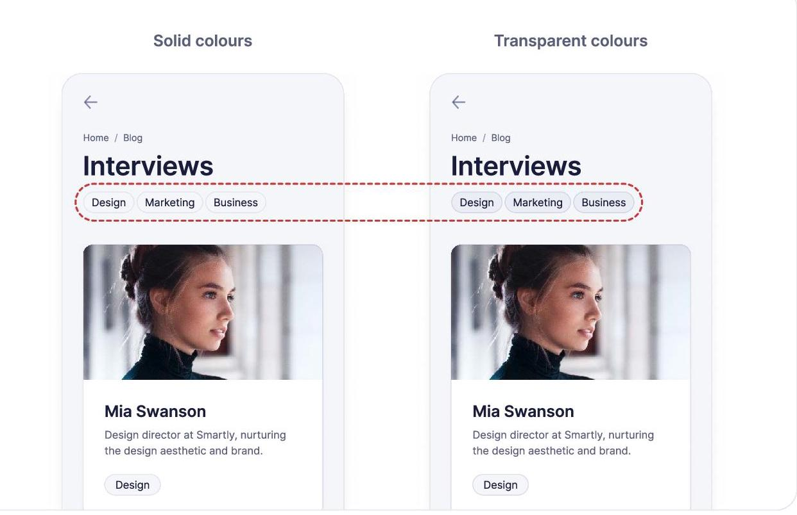

Using varying levels of transparency on foreground elements, like the tags in the example, allows some of the background colour to mix with the foreground colour. This layering of colour gives us the result we're after.

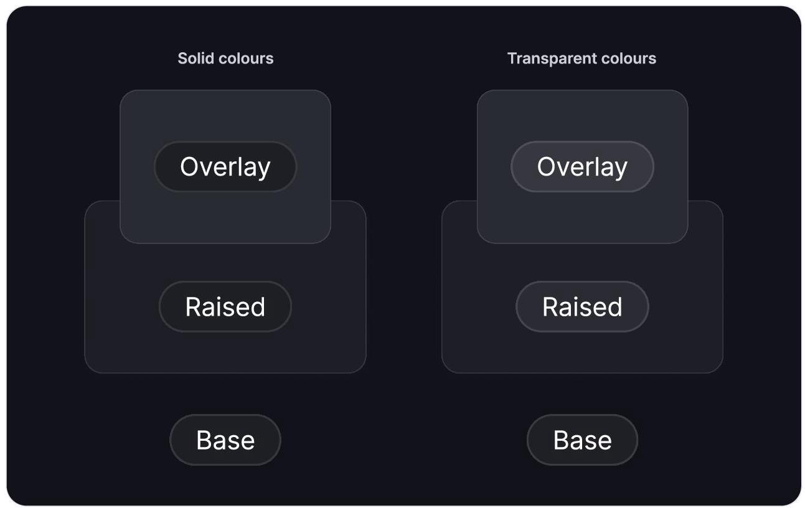

Transparent colours result in similar prominence on all backgrounds in dark mode

Depending on the complexity of your project, solid colours may be sufficient. For those who need a more scalable colour system, consider adding a transparent colour palette. Transparency can also be helpful if you're planning on creating multiple themes with different background colours.

For the best of both worlds, you could include both a solid and transparent colour palette in your design system. Include usage guidelines to help ensure colours are used consistently and correctly.

You'll create a transparent colour palette that supports both light and dark mode next.

## Create a transparent colour palette

As demonstrated previously, using transparent colours on foreground elements can help ensure they maintain a consistent level of prominence on different background colours. Let's create a transparent colour palette that supports switching between light and dark mode. To keep things simple, we'll create neutral variations of grey using black and white.

## Define 3 solid background colours

Before you can create your transparent foreground colours, you need to define the solid background colours that they'll sit on. As you learned previously, you'll need 3 background colours to indicate elevation in dark mode. Define 3 progressively brighter solid background colours for dark mode. Use white backgrounds for light mode.

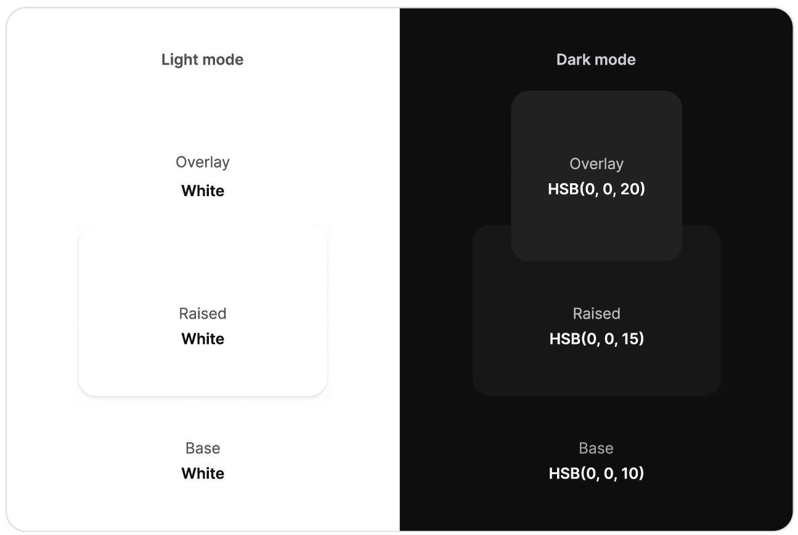

Background colours across light and dark mode

## Define transparent foreground colours

Now it's time to define the transparent foreground colours that will sit on the backgrounds. We'll use varying transparencies of white for dark mode and varying transparencies of black for light mode.

Foreground colours are used on elements that sit on top of background surfaces. Text, icons, and form inputs are all foreground elements.

Define 5 variations of white for dark mode

Start with white and gradually lower its opacity to create 4 other variations. These will be your greys. Use the following opacities or define your own. Fill Text and interface elements sitting on 6% opacity this colour must have sufficient contrast

<table><tr><td/><td>Text strong 100% opacity</td><td>Contrast with fill on overlay background must be at least:</td><td>4.5:1</td></tr><tr><td/><td>Text weak 78% opacity</td><td>Contrast with fill on overlay background must be at least:</td><td>4.5 : 1</td></tr><tr><td/><td>Stroke strong 60% opacity</td><td>Contrast with fill on overlay background must be at least:</td><td>3 : 1</td></tr><tr><td/><td>Stroke weak 12% opacity</td><td>This is a decorative colour, so it doesn't need to be high contrast</td><td/></tr></table>

Ensure foreground colours used for text and interface elements have sufficient contrast. Test the contrast of these colours against the "overlay" background. It's the brightest, so foreground elements sitting on this background will have the lowest contrast. If you have any elements with a "fill" colour, like the message count in the following example, test the contrast of the text inside them. The "fill" layer sitting on top of the "overlay" background produces an even brighter colour.

"Overlay" background Ensure message count text has sufficient contrast Articles

Profile

Messages

Settings

[# Sign out 10 free stock photo sites Find the perfect images to bring your websites to life

Leah Sims

UX Universe

## Define 5 variations of black for light mode

It's safest to avoid pure black against white for text, as it can cause eye strain and fatigue. Instead, lower the opacity slightly to create a dark grey. Continue to gradually lower the opacity to create 4 other variations. These will be your foreground greys in light mode. Use the following opacities or define your own.

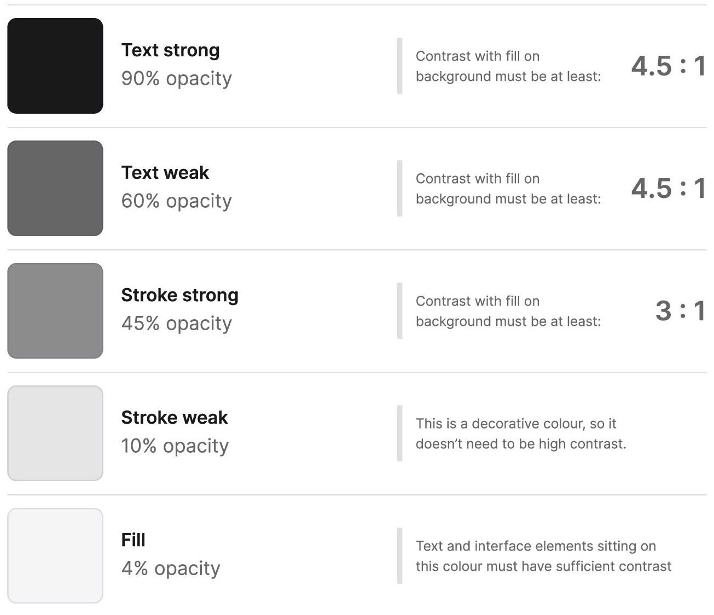

Again, ensure foreground colours used for text and interface elements have sufficient contrast. This time you simply need to test them against a white background. If you have any elements with a "fill" colour, like the message count in the following example, test the contrast of the text inside them.

## Define 4 variations of the brand colour

Depending on your design, you'll generally need 4 variations of the brand colour for foreground elements in both light and dark mode. Start with the brand colour and gradually lower its opacity to create 3 other variations.

Ensure foreground colours used for text and interface elements have sufficient contrast against the "overlay" background, as it's the brightest. If you have any elements with a "fill" colour, like the badge in the following example, test the contrast of the text and icon inside them.

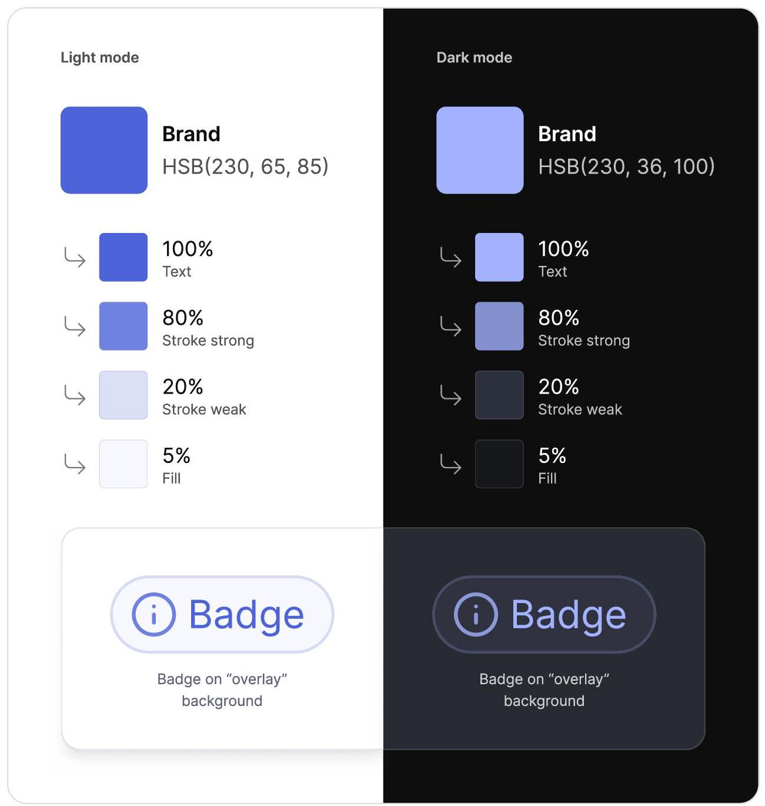

## Define 4 variations of system colours

You'll generally need 3 system colours to indicate errors, warnings, and success states. Traffic light colours (red, amber, and green) are commonly used for system colours, as they already have familiar meanings associated with them. Define 3 system colours for both light and dark mode.

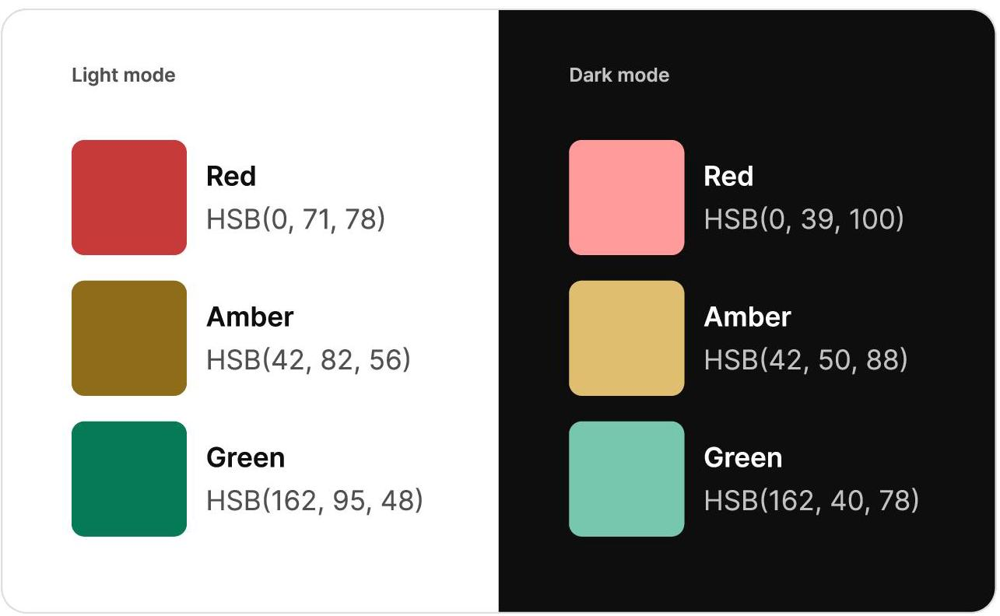

3 system colours in light and dark mode

Each system colour needs 4 variations in both light and dark mode. Again, ensure foreground colours used for text and interface elements have sufficient contrast against the "overlay" background. If you have any elements with a "fill" colour, test the contrast of the text inside them. Use the following opacities or define your own:

- 100% opacity - Text (needs 4.5:1 contrast)

- 80% opacity - Stroke strong (needs 3:1 contrast)

- 20% opacity - Stroke weak

- 5% opacity - Fill

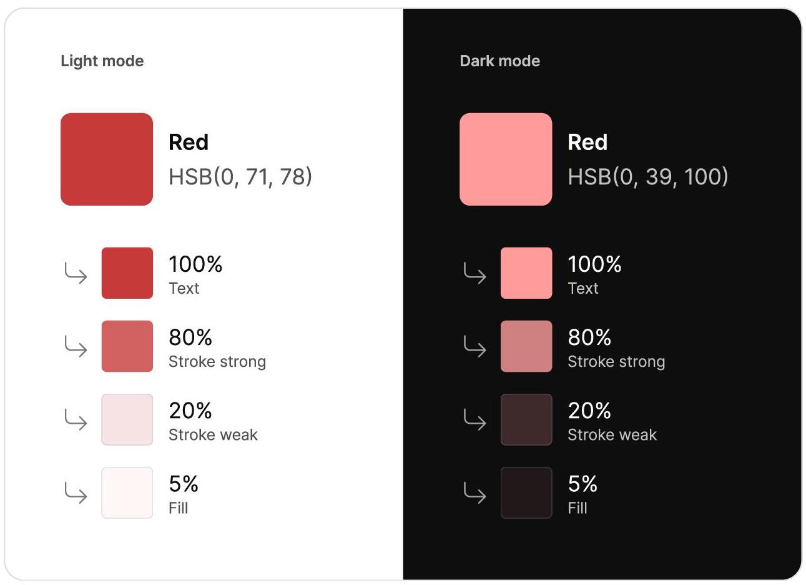

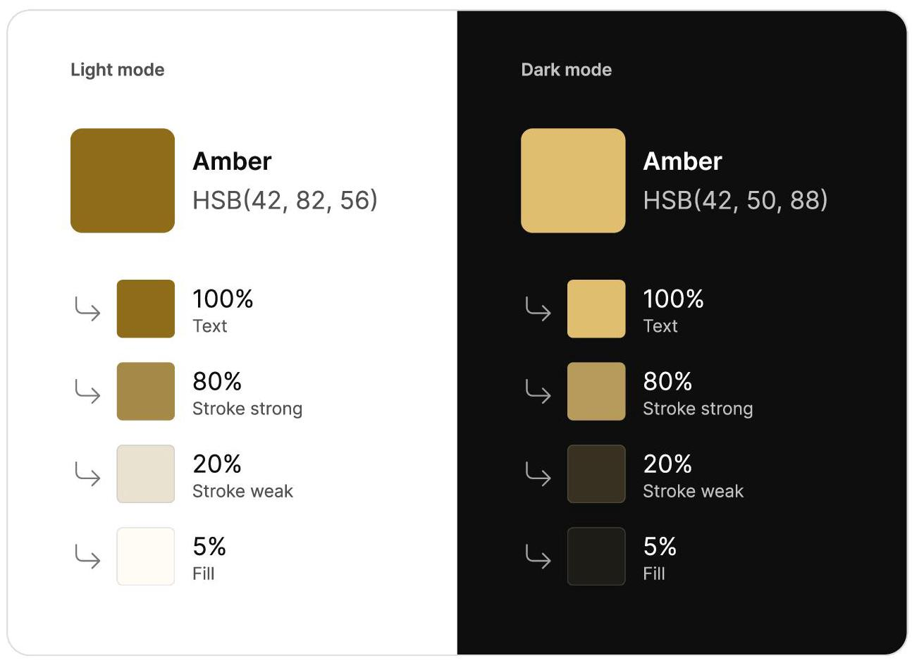

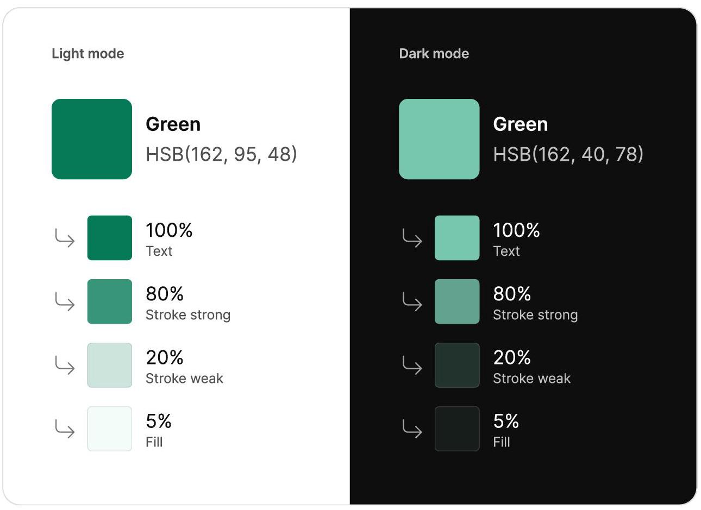

You may need to adjust the opacities slightly to ensure consistent contrast across all colours. Increase the brightness for the "fill" variation to help avoid it looking muddy or dull.


## Test your colour palette

You've already tested that the colours have sufficient contrast, but it's also important to make sure they work well together. Test your colour palette using an interface example that contains all colour variations.

The interface doesn't need to make sense, as you're just looking at colours. Try to also ensure consistency between light and dark mode.


Example interface containing all colours

## Neutral versus monochromatic greys

Now that you know how to create a neutral transparent colour palette, it's easy to move to monochromatic greys, if that's your preference. There's nothing wrong with neutral greys though. They work well with any brand colour or content and have a subtle warmth.


Comparison of neutral and monochromatic greys

## Creating a monochromatic transparent colour palette

In dark mode, simply add a tinge of the brand colour to the background colours. For each background colour, change the hue to the brand colour and saturate it slightly.

There's no need to change the foreground white variations. Because they're transparent, you'll be able to see some of the background colour through them anyway. In light mode, rather than using different opacities of black for foreground colours, add a tinge of the brand colour.


Comparison of neutral and monochromatic background colours

For each foreground variation of black, change the hue to the brand colour and the saturation to 100 . Start with a low brightness for the "Text strong" variation and gradually increase it for weaker variations.

As always, make sure colour variations used for text and interface elements have sufficient contrast.


Comparison of neutral and monochromatic greys

## Use transparent layers for interaction states

Another great thing about using transparency in your colour palette is that it makes handling hover and press states much neater. Simply layer a transparent overlay on top of interactive elements on hover and press.

- Hover - layer an overlay with the "Fill" colour variation from the transparent colour palette.

- Press - layer an overlay with the "Stroke weak" colour variation from the transparent colour palette.


A transparent overlay is layered on top of interactive elements on hover and press


Transparent overlays applied to buttons

This systematic approach works for all sorts of components, from buttons to dropdown menus, and it doesn't require the addition of extra colour variations to the colour palette. Using transparent state layers works well in dark mode too. Use the "Fill" and "Stroke weak" colour variations for hover and press states respectively.


Transparent overlays applied to a dropdown menu


A transparent overlay is layered on top of interactive elements on hover and press

# Here are the same button and dropdown examples with transparent state layers applied in dark mode.


Transparent overlays applied to buttons in dark mode

Transparent overlays applied to a dropdown menu in dark mode

## Name colours to keep them organised

So far, you've created a colour palette with high level rules that govern how colours should be used. This is fine if it's just you working on a simple product, but if there are multiple designers and developers involved, you'll need to name and organise colours systematically. This helps to ensure that colours are applied correctly and consistently.

Colours are commonly named in 2 ways:

- Primitive colours - includes all available colours in the design system. Colours are named based on their appearance and shouldn't be used directly in your designs.

- Semantic colours - also known as "colour tokens", refers to a way of naming primitive colours based on how they should be used. A single primitive colour can be used for multiple semantic colours. Use semantic colours directly in your designs. Another great thing about creating semantic colours or tokens, is that it makes it easy to switch between light and dark mode. A single semantic colour maps to a different primitive colour in each mode.


The relationship between primitive and semantic colours


A single semantic colour maps to different primitives in light and dark mode

## Naming primitive colours

Name primitive colours based on their appearance. Assign each variation of a colour hue a number from 0 to 1000 . This indicates its level of contrast relative to the other variations. 1000 has the highest level of contrast. Primitive colour names should have the following format:

## [colour.number]

Let's name the 10 foreground colours in the transparent colour palette you created earlier. Use "light" and "dark" to indicate the mode.


Primitive grey colours in light and dark mode

Name system colours in a similar way. For example, here are the 8 primitive colours for "green".


Primitive green colours in light and dark mode

You can add more colour variations as you need them. For example, you may need an even lighter variation of grey to use on some backgrounds. Assuming the new variation of grey is around half the contrast of "grey.50", you'd name it "grey.25".


Adding another grey colour variation

## Naming semantic colours

You can name semantic colours in many different ways. The following naming structure is simple but powerful. It's easy to learn and flexible enough to grow for larger and more complex design systems.

The name of each colour consists of up to 4 words that describe how and where to use the colour on an interface:

[element.tone.emphasis.state] Here are some examples:


Naming structure for semantic colours

- text.error - used for error messages on forms.

- stroke.strong - used for form input field borders.

- fill.success.weak - used for the background of success alert messages.


Examples of semantic colours used on a dropdown menu

You don't need to use a full stop ( . ) to separate each word. Some prefer to use a hyphen ( - ). In Figma (a popular design tool), words are separated using a forward slash \( \left( /\right) \) . What’s important is that there is a consistent naming structure with up to 4 words to describe how to use each colour.

You can take naming a step further and create colour names for specific components, but it's often unnecessary and overcomplicated.

## Adjust photo colour temperature to match the colour palette

Rather than a guideline, this is a quick trick that can help you create a harmonious look and feel. You may have noticed that some photos look warmer or more orange and others look cooler or more blue. This is due to their colour temperature, which is a measure of the colour of light.

If your colour palette is based on a cool colour like blue, using photos with a cooler colour temperature can help create a more cohesive look and feel. The opposite applies to warm colour palettes. You can use a photo editing tool to adjust the colour temperature of photos.

The middle photo below is the original. The colour temperature of the left photo was decreased, while the one on the right was increased.


This little trick isn't for product photos where realistic colours are important. It can, however, come in handy for decorative photos where you want to create a harmonious feel.

The following example demonstrates how a warm photo can conflict with a cool colour palette. There's nothing wrong with this, but a cool or neutral photo fits the cool blue colour scheme more closely.


TUTORIAL - COLOUR

## Apply what you've just learned

Let's apply some of the guidelines you've learned

to continue improving the fitness app example.


## Apply the brand colour to interactive elements

In the fitness app example, colour isn't used purposefully. Interactive elements like the button and text link use the brand colour, but so do noninteractive elements like the heading and icons. This makes it unclear what's interactive and what's not. A simple and effective approach is to apply the brand colour to interactive elements like text links and buttons.

To help avoid confusion, remove the brand colour from the heading and icons, as they're not interactive.


The brand colour is removed from non-interactive elements

## Apply the colour palette rules

Many of the problems with colour usage in the example fitness app can be fixed by simply applying the colour palette rules. This will help to avoid common contrast and accessibility issues, as we'll see next.


## Ensure interface elements have a 3:1 contrast ratio

In the fitness app example, the contrast of the icons sitting on the photo is too low. Using the "Stroke strong" colour from the palette and adding a solid white background to the icons gives them sufficient 3:1 contrast, regardless of the photo they sit on. This also reduces the interaction cost, as the tap area of the icons is now larger and clearly visible.


The contrast of the star ratings in the example are also less than 3:1. Adding a darker border gives them sufficient contrast.


## Ensure text has a 4.5:1 contrast ratio

In the fitness app example, the contrast of the trainer's name is too low. The thin font weight makes it even harder to read. Using the "Text weak" colour from the palette helps make the text more legible.

## WITH BROOKLYN SIMS  ✓ WITH BROOKLYN SIMS


## Don't rely on colour alone as an indicator

In the fitness app example, the brand colour is used on the "reviews" text to indicate that it's a link. If colour is removed, the link text looks the same as other text, so people who are colour blind won't be able to tell it's a link.

Underlining the link text clearly differentiates it from other text in the absence of colour.


Link is underlined to clearly differentiate it from plain text

## Avoid pure black

In the fitness app example, pure black is used for multiple text elements. Using dark grey instead helps to improve readability.


Dark grey is used instead of pure black to help improve readability

Awesome work. The example app is starting to make more sense. Using colour purposefully and ensuring sufficient contrast is quick and easy, but it can make a big difference. We'll continue improving the example fitness app at the end of each chapter.

## Chapter summary

✓ Ensure text and interface elements have sufficient contrast and don’t rely on colour alone to convey meaning or distinguish visual elements.

✓ Design in black and white to create the foundations for spacing, size, layout, and contrast, then add colour purposefully if needed. For example, use the brand colour to indicate interactive elements.

✓ Create a small set of predefined colours called a colour palette. Define rules that govern how colours are used. This helps improve consistency and speeds up the design process.

✓ Consider using transparent colours in addition to solid ones. This helps ensure foreground elements have similar prominence when on different coloured backgrounds.

✓ Name colours systematically based on how they should be used. This keeps them organised and helps ensure they're applied consistently. Your progress 3 of 8 chapters completed

Fundamentals

Less is more

Colour

L Layout and spacing

5 Typography

6 Copywriting

7 Buttons

Forms