CHAPTER 4

# Layout and spacing Create a consistent spacing system and learn about alignment and layout

<!-- auto-toc:start -->
## Contents

- Group related elements
- 1. Place related elements in the same container
- 2. Space related elements close together
- 3. Make related elements look similar
- Ensure similar looking elements function similarly
- 4. Align related elements in a continuous line
- Grouping methods example
- Containers are used to create the main structure of the interface:
- Create a clear visual hierarchy
- Create a visual hierarchy using variations in the following:
- Practical steps to improve visual hierarchy
- Test visual hierarchy using The Squint Test
- Use depth to create visual hierarchy
- Understand the box model
- Design @1x using points
- Create a set of predefined spacing options
- Space elements based on how closely related they are
- Be generous with white space
- Align the main layout to a 12 column grid
- What’s a 12 column grid?
- Columns
- Gutters
- Margins
- Align text to improve readability
- Align horizontal text to the baseline
- Try to avoid using multiple alignments
- Keep related actions close
- Ensure an interface is unbreakable
- Use the Rule of Thirds for photos
- Apply what you've just learned
- Use space to group related elements
- Chapter summary

<!-- auto-toc:end -->

## Group related elements

Breaking up information into smaller groups of related elements helps to structure and organise an interface. This makes it faster and easier for people to understand and remember.

Group related elements using the following methods:

1. Place related elements in the same container

2. Space related elements close together

3. Make related elements look similar

4. Align related elements in a continuous line

You can combine these methods to help display groupings more clearly. Let's look at each of these grouping methods in more detail.

## 1. Place related elements in the same container

According to the principle of common region, items within the same boundary or container are perceived as a group and assumed to be related. You can create containers using borders, shadows, and background colours. Using containers is the strongest visual cue to group interface elements.

Containers are often used to create the main structure of an interface.

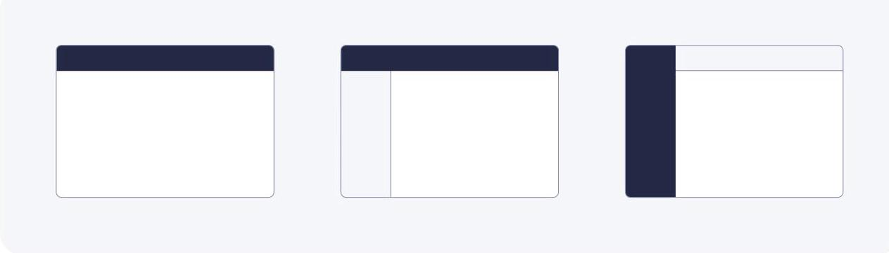

Examples of containers being used to define common website structures

Cards and dialog boxes are a common type of container used to group smaller pieces of related content.

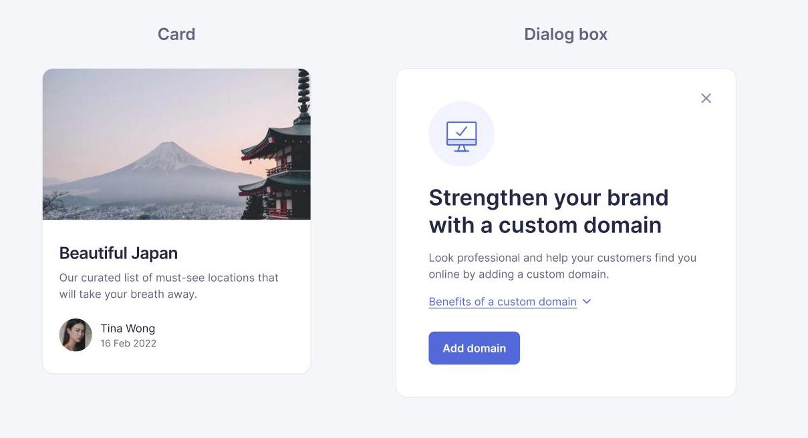

If groupings are unclear, consider using containers to help make them clearer. In the following travel blog example, it's difficult to tell who wrote each article, as the author's details are very close to the article below.

There are also varying amounts of space above the author's details, as the article description text is an inconsistent length. A large gap above the author's details makes it look like the author is related to the article below. Using containers helps to clearly associate the author with their article. This example demonstrates how containers can overpower spacing as a grouping method.

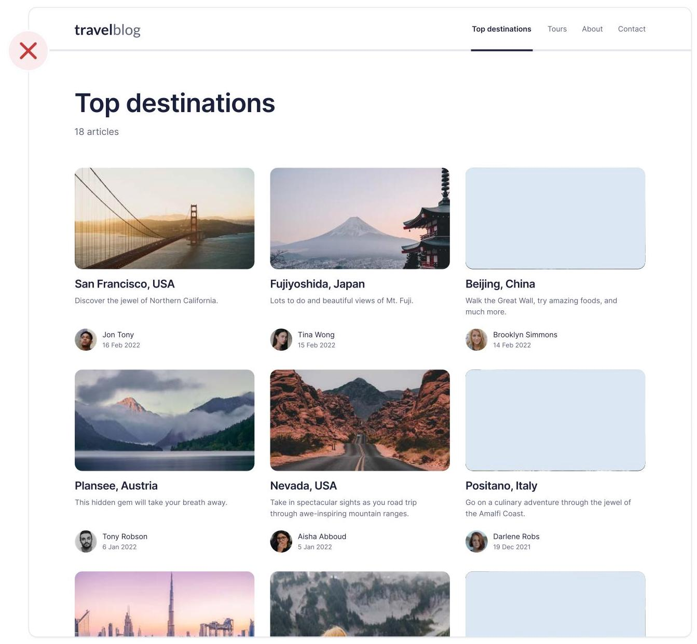

It's difficult to tell who wrote each article due to unclear groupings

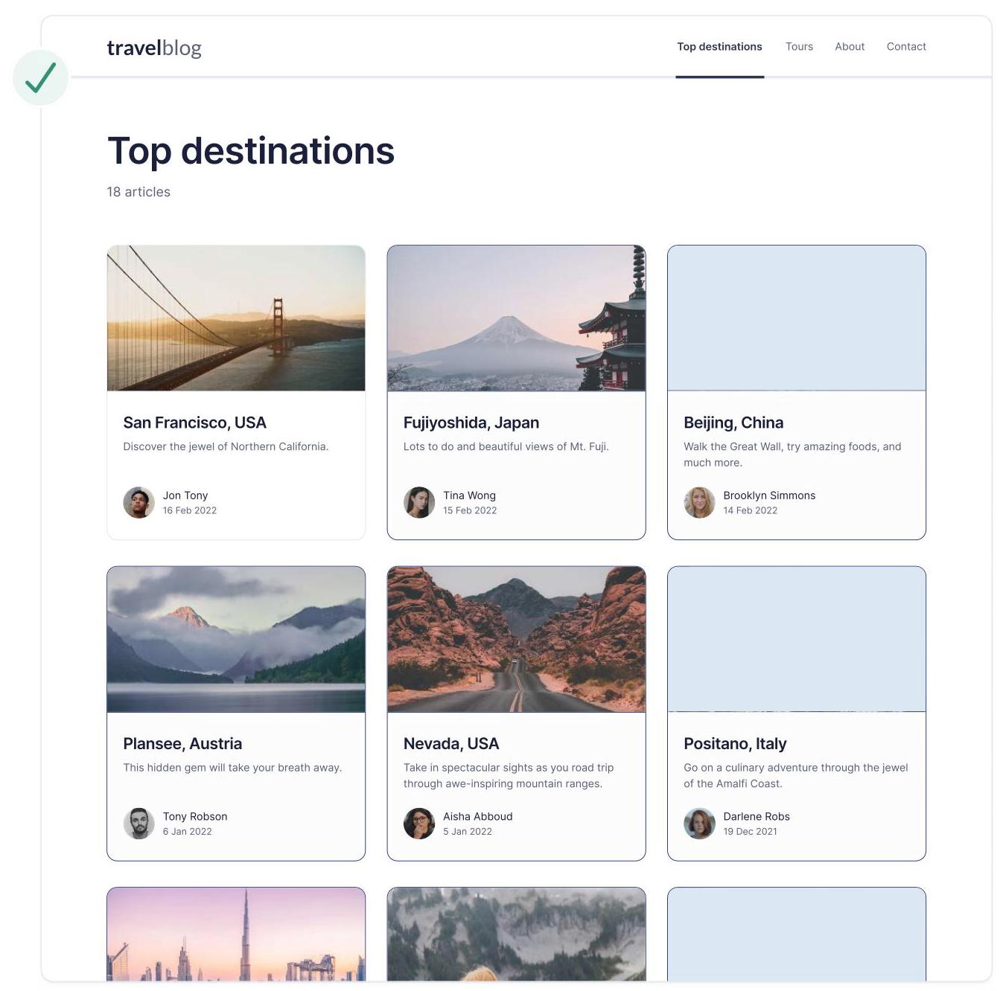

Containers are used to clearly associate the author with their article

Try to avoid using containers for every group on an interface, as it can cause unnecessary clutter. Instead, look for opportunities to use other grouping methods. They're often more subtle and can result in a simpler design, as you'll see next.

## 2. Space related elements close together

According to the principle of proximity, elements near each other are perceived as a group and assumed to be related. Place related elements close together to group them. Separate unrelated elements by placing more space between them. You'll learn how to create and use a predefined spacing system later in this chapter.

Using spacing to create groups, rather than containers, can help declutter and simplify an interface.

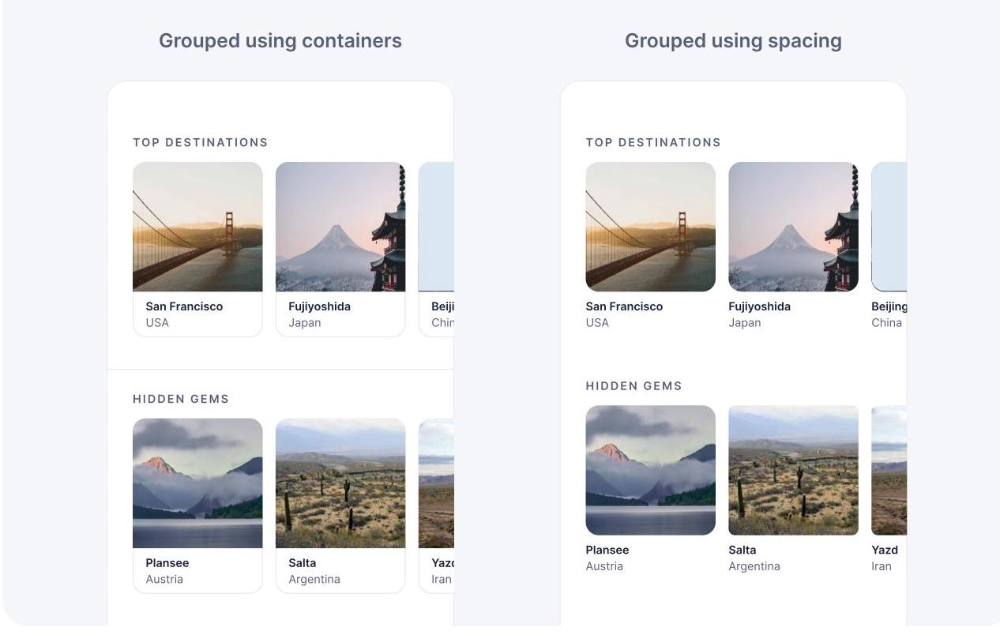

Similarly, the next example shows how removing containers can help simplify an interface. Sometimes spacing is enough to clearly group related elements, especially when it's combined with other grouping methods like similarity and continuity.

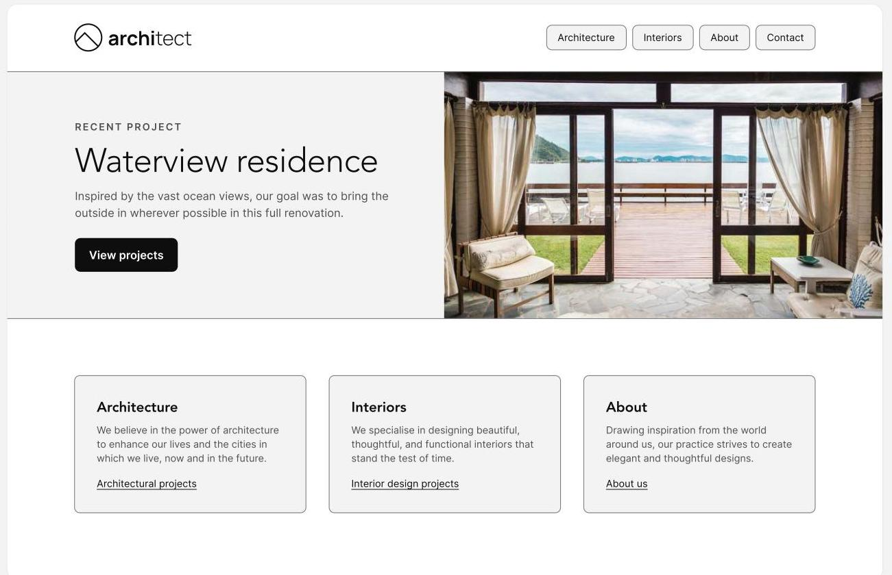

Removing the containers simplifies the design without losing the groupings. The spacing is sufficient to clearly separate different groups of content.

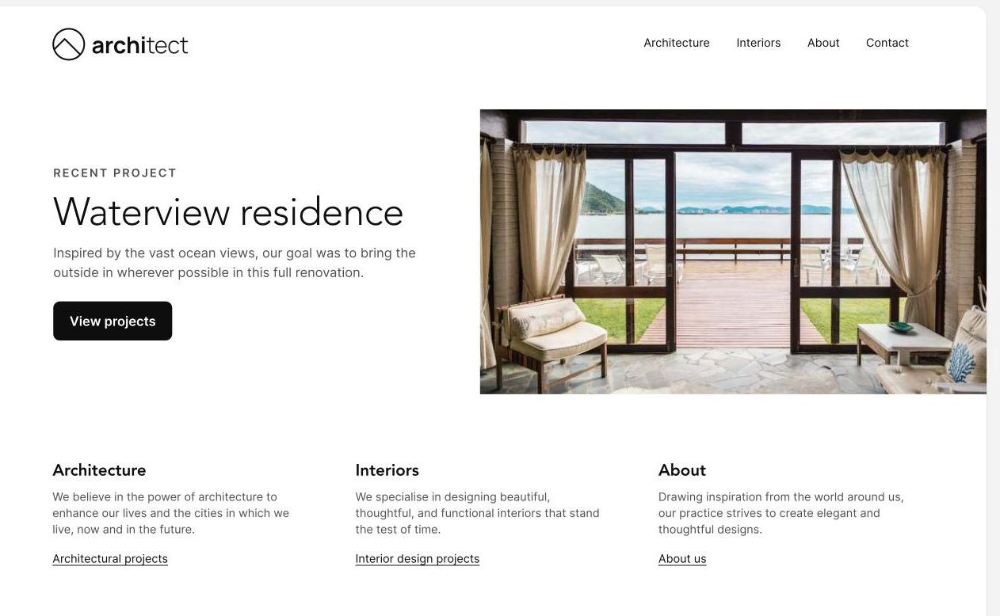

## 3. Make related elements look similar

According to the principle of similarity, when things look similar your mind groups them together. Make related elements look similar by giving them similar visual characteristics, such as size, shape, and colour.

In the following example, your mind naturally groups the links in the top navigation because they look similar. The cards also appear to be grouped for the same reason. The fact that they're close together and aligned in a continuous line further emphasises their close relationship. Within a group of related elements, you can highlight certain ones by making them look slightly different. In the following example, the pricing options look similar enough that our eyes group them together.

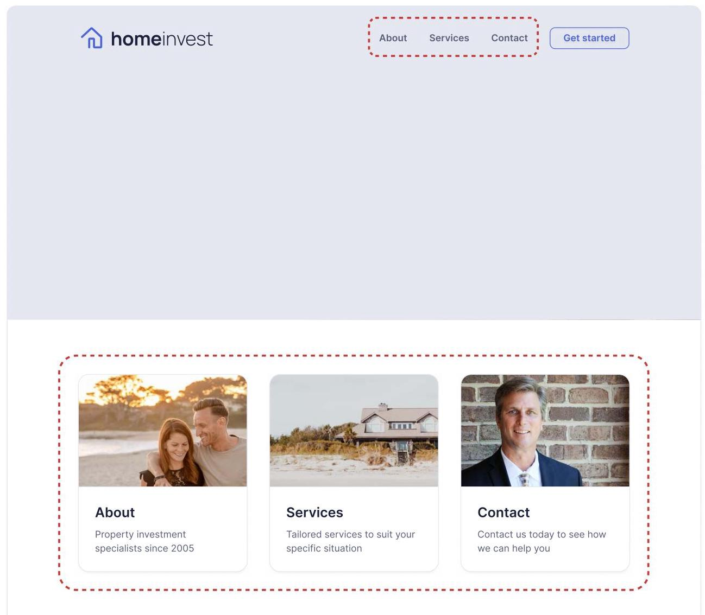

Examples of related elements being grouped by similarity

The middle one stands out, as it looks slightly different. It's larger, has a higher contrast border, a deeper shadow, a filled button, and a "most popular" badge.

Pricing options

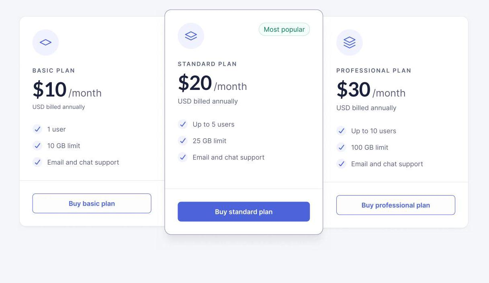

The middle pricing option stands out, as it looks slightly different to the others.

## Ensure similar looking elements function similarly

If elements look similar, people will expect them to work in a similar way. So try to ensure that you use a consistent visual treatment for elements with the same functionality. Conversely, try to ensure elements with different functionality look different. In the following example, the icons look similar to the secondary "save" button. This makes them seem interactive, even though they're not.

Removing the blue colour and border helps to differentiate the icons from the secondary button. This makes it clearer that the icons function differently to the secondary button.

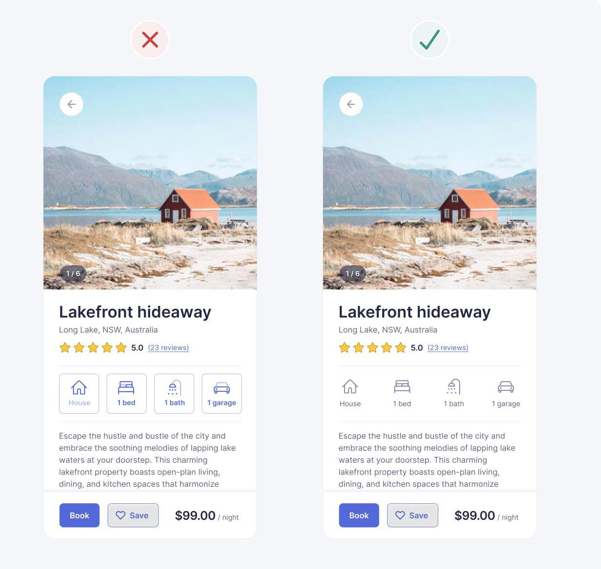

Because the icons look like the secondary button, they seem interactive, even though they're not.

In the next example, the "verified" badges look very similar to the primary "follow all" button. They're not interactive elements, so they should look different to the primary button to help avoid confusion.

Change the shape, contrast, and colour of the badges in the following ways to help differentiate them from the primary button:

- Since the badges aren't interactive, avoid using the blue action colour and instead use green to indicate success.

- A more rounded shape is commonly used for badges to help differentiate them from buttons.

- A lighter background colour helps correct the visual hierarchy, so the primary button is the most prominent element.

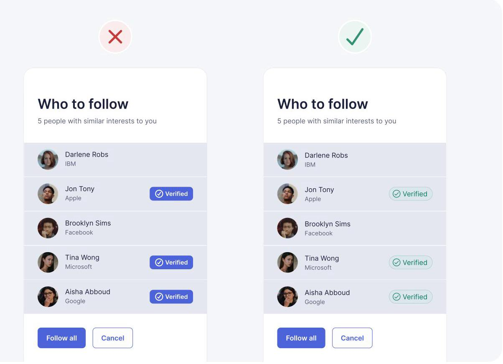

Because the badges look like the primary button, they seem interactive, even though they're not.

## 4. Align related elements in a continuous line

According to the principle of continuity, people perceive elements that are arranged in a continuous line to be related. Our eyes naturally tend to follow elements aligned in continuous straight or curved lines. You can use this to your advantage to help guide people's eyes through an interface.

Lists are a common way of using continuity to group related elements in an interface. You can disrupt continuity to indicate the end of a group of related elements or to highlight a particular element.

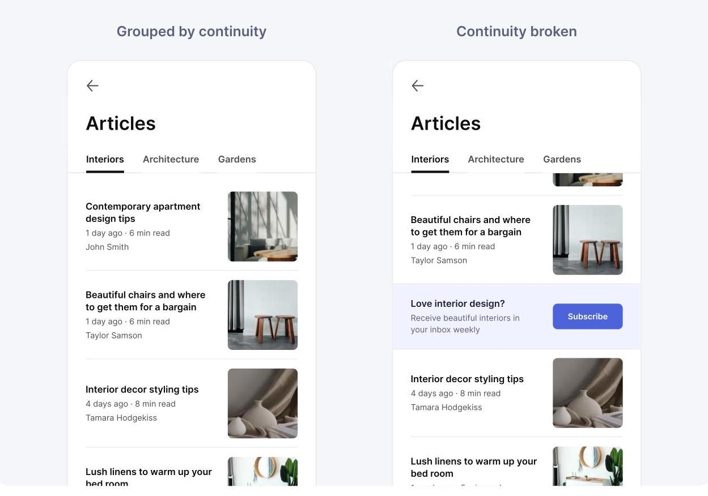

## Grouping methods example

Let's look at how different grouping methods are used and combined in the following music player example.

## Containers are used to create the main structure of the interface:

- A dark grey background is used to contain the left side navigation.

- A light grey background and shadow are used to contain the music player controls along the bottom.

- A grey border is used to contain the account menu along the top.

All of these colours come from the monochromatic colour palette created previously in the "Colour" chapter.

# You might think of using a container to group the songs in the table, but it's not always necessary.

Container is used to group songs in the table

Look for opportunities to use grouping methods other than containers. This can help simplify an interface design. The songs in the table are grouped in multiple ways:

- They have a container

- They're in close proximity

- They look similar

- They're aligned in a continuous line

<table><tr><td>#Title</td><td/><td>Album</td><td>Added</td><td>Duration</td></tr><tr><td>  </td><td>Global Rebellion Dianne Russell</td><td>Calming</td><td>24 May 2022</td><td>3:52</td></tr><tr><td>2  </td><td>Lullaby of Noise Floyd Miles</td><td>Impossible</td><td>1 Feb 2023</td><td>3:55</td></tr><tr><td>  </td><td>Clear Mission to Paris Eleanor Pena</td><td>Lounge Technology</td><td>17 Oct 2024</td><td>3:42</td></tr><tr><td>  </td><td>Stubborn Love Symphony Jane Cooper</td><td>Unlax Feelings</td><td>21 Sep 2022</td><td>3:52</td></tr><tr><td>  </td><td>Wind Down Crash Arlene McCoy</td><td>Calming Destiny</td><td>22 Oct 2024</td><td>4:06</td></tr><tr><td>  </td><td>Lonely Flow Tony Robson</td><td>Summer Vibes</td><td>2 Dec 2024</td><td>3:48</td></tr></table>

Container is used to group songs in the table

Since the songs are grouped using multiple methods, you can remove the outer container, and the songs still appear to be grouped.

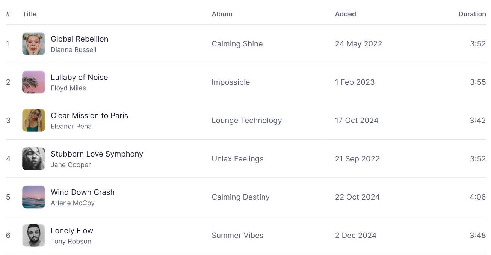

Container is removed from the table for simplicity

# Similarly, you can simplify the side navigation by removing unnecessary containers.

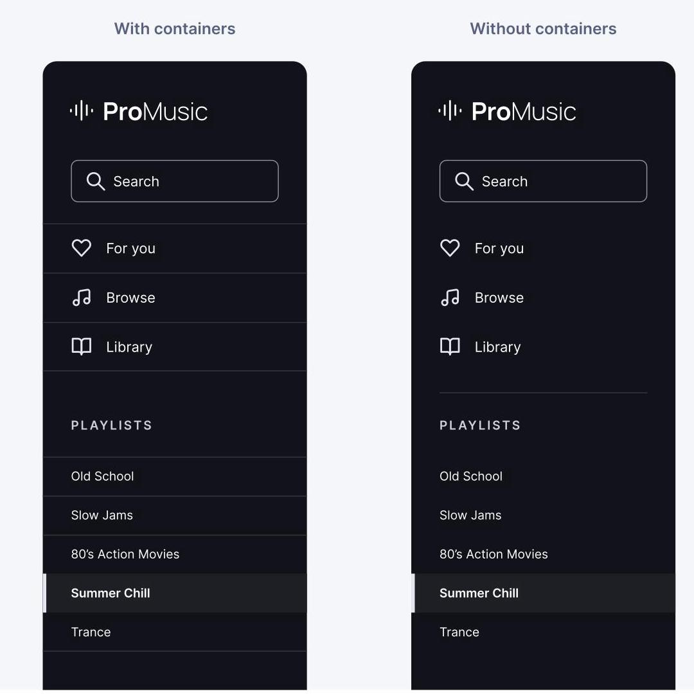

Containers, proximity, similarity, and continuity are simple but powerful methods for grouping interface elements. Use them individually or combine them for clarity.

## Create a clear visual hierarchy

Not all information in an interface has the same level of importance. Aim to present information in order of importance by making more important elements look more prominent. A clear order of importance, or visual hierarchy, helps people scan information quickly and focus on areas of interest. It also improves aesthetics by creating a sense of order.

Example of a website banner with a clear visual hierarchy

## Create a visual hierarchy using variations in the following:

- Size - make important elements larger.

- Colour - use brighter, richer, warmer, or higher contrast colours for more important elements.

- Contrast - style important elements differently to help them stand out.

- Spacing - surround important elements with more space.

- Position - place important elements toward the top of an interface or first in a row of multiple items.

- Depth - elevate important elements so they appear closer to users.

The following hero banner example uses size, colour, and contrast to create a clear visual hierarchy. This makes it quicker and easier for people to find the information they need and take the appropriate action.

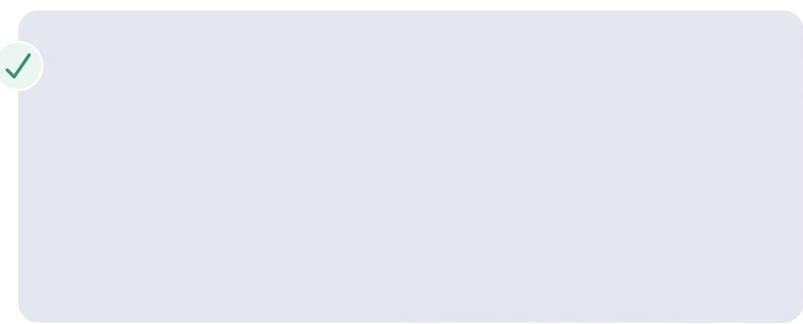

Example of a website banner with a clear visual hierarchy

Here's the same hero banner without a clear visual hierarchy. Because all interface elements have similar prominence, our eyes don't know what to focus on first. This lack of order can cause confusion and increase cognitive load, plus it looks messy.

Example of a website banner without a clear visual hierarchy

## Practical steps to improve visual hierarchy

The following example of a property booking app demonstrates the power of visual hierarchy. The first design is a simple table of information where all elements have similar visual prominence. Other than the order of table rows, there's no clear order of importance. This can make it difficult to scan.

The second design is a lot easier to scan, as it has a clear visual hierarchy. You can improve visual hierarchy using variations in size, colour, contrast, spacing, position, and depth based on the importance of each element. Starting with the first design example, let's fix the visual hierarchy, step by step. A similar approach can be taken for almost any interface:

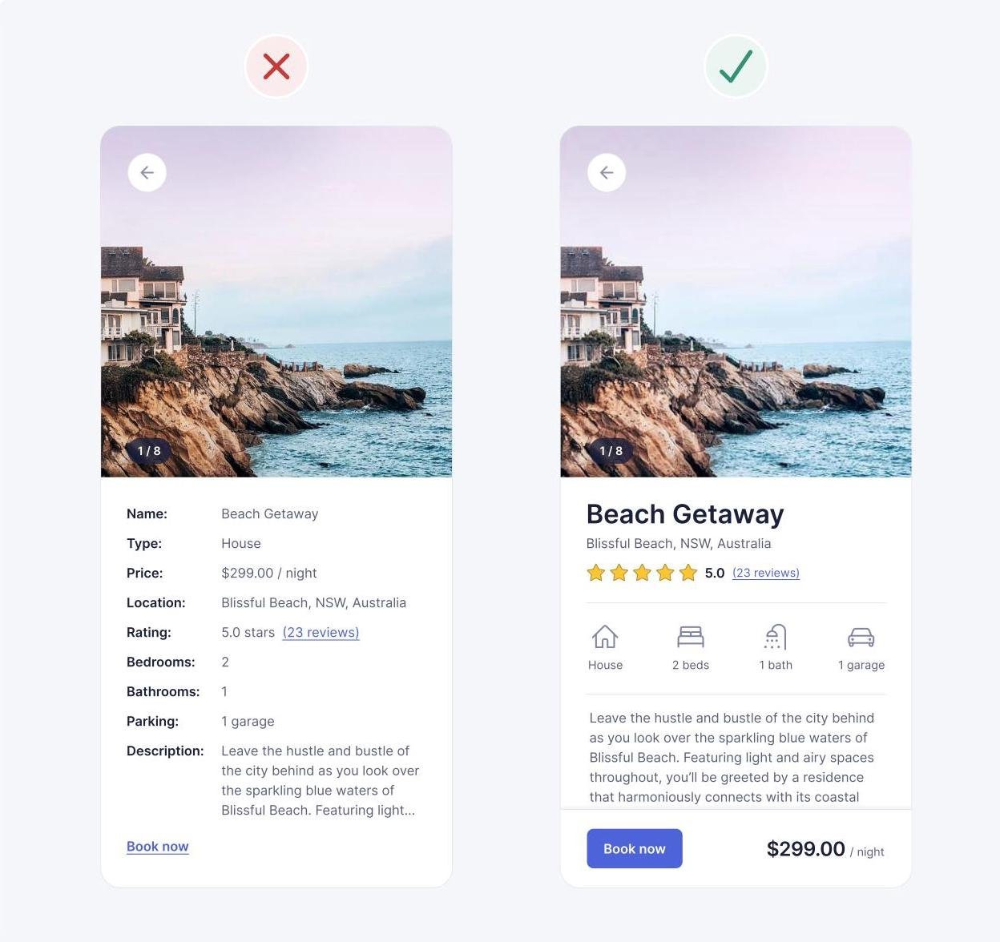

Example of an interface without a clear visual hierarchy versus one that has a clear visual hierarchy

- Firstly, group related information into separate sections. Order the information in each section by importance.

- Then order the sections by importance. Place more important sections towards the top of the interface to give them prominence.

This creates 4 main sections ordered by importance.

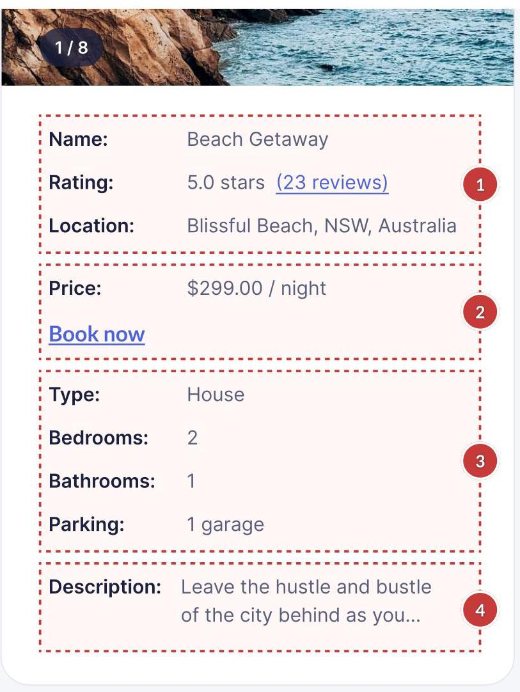

Next, let's look at the elements in each section and change their styles based on their importance. In section 1, do the following:

- Make the name large, bold, and use the "Text strong" colour variation from your colour palette. This ensures it stands out the most.

- Since the location is secondary information, make it smaller, regular weight, and use the "Text weak" colour variation.

- Introduce icons for the star rating to make it easier to scan. This also aligns with common UI design conventions, making it easier to understand as per Jakob’s Law.

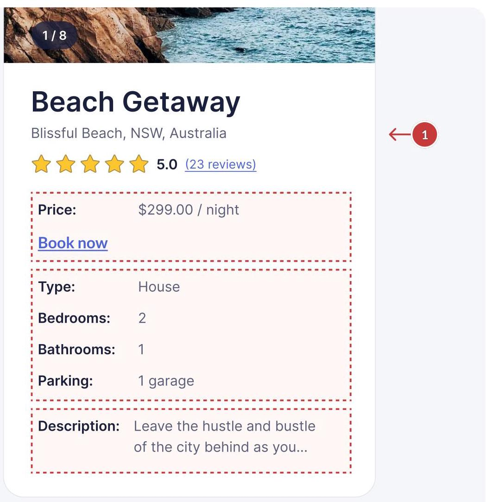

The second section is also very important, as it contains the primary call to action and the price. In section 2, do the following:

- To ensure the second section is always visible and within thumb's reach, elevate it using a shadow and stick it to the bottom of the screen.

- Increase the prominence of the primary call to action by making it a primary button with the brand colour.

- Highlight the price by making it bigger and bolder and placing it last on the interface next to the book button. According to The Serial Position Effect, people best remember the first and last items.

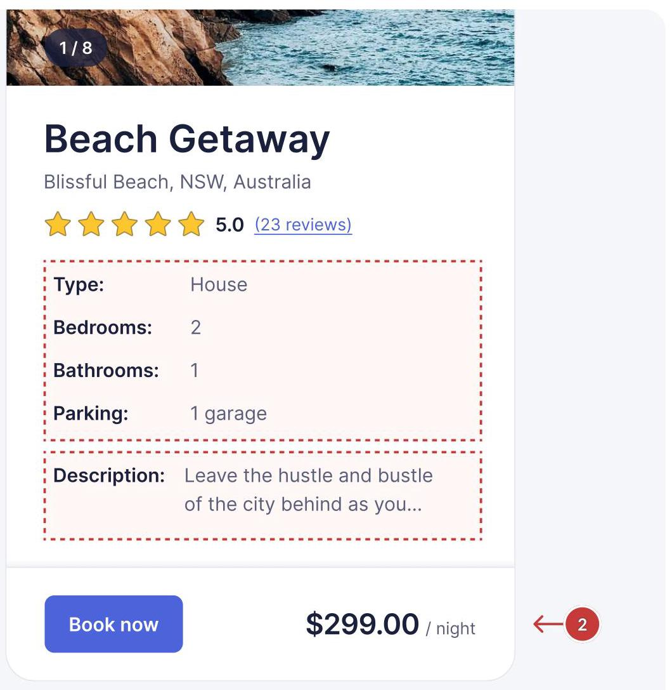

The third section contains the property details, which are all short label-value pairs. In section 3, do the following:

- Use icons with text labels to help make the property details easier to scan. Making the property details look similar helps group them together to show they're related.

- Since icons can be very prominent, use unfilled icons and the "Stroke strong" colour variation to decrease their prominence.

- Use the "Text weak" colour variation for the text labels, rather than the "Text strong" variation. This gives the text labels and icons similar prominence and creates balance.

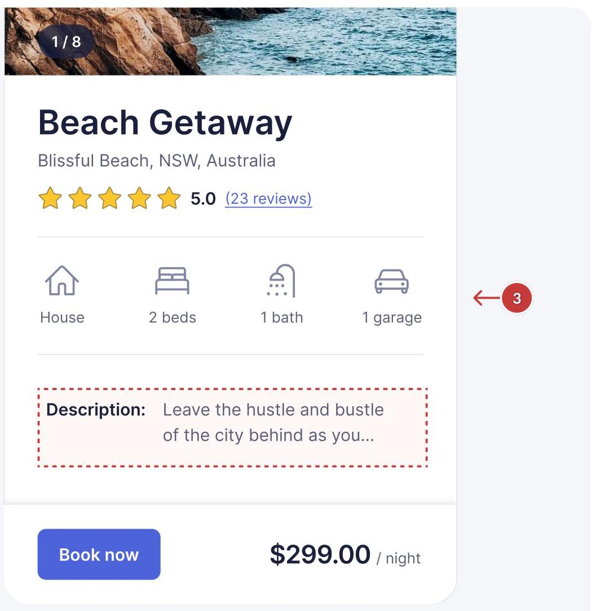

The last section contains the description. In section 4, do the following:

- Remove the "description" label as it's already obvious what this information is for.

- Use the "Text weak" colour variation for the text at regular weight so it's less prominent than section 2.

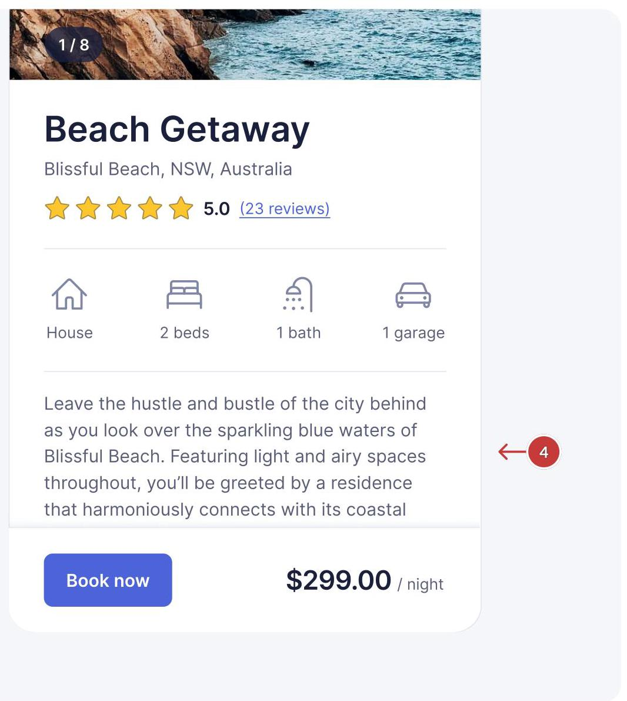

And we're done! It's amazing how some quick and simple variations in size, colour, contrast, spacing, position, and depth can help tidy up an interface and create a clear visual hierarchy.

## Test visual hierarchy using The Squint Test

A quick and easy way to test whether your visual hierarchy is correct is to use The Squint Test. Simply squint your eyes and look at your design. You should still be able to tell what the most important elements are and recognise what the interface is for. You could also try the following:

- Step back from your screen.

- Zoom out to make your design smaller.

- Blur your design (as seen below).

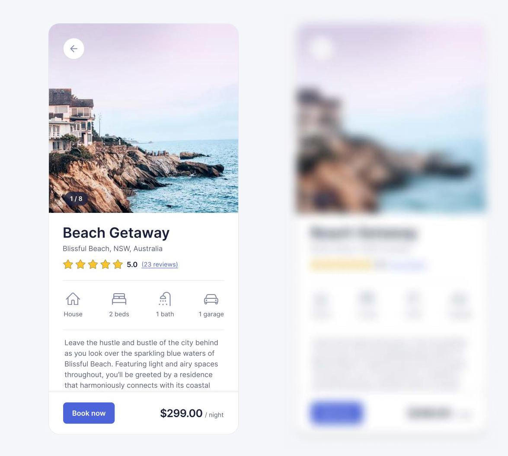

## Use depth to create visual hierarchy

To add depth to an interface, use colour and shadows to raise or lower interface elements to different levels of elevation. Elements with a higher elevation appear closer to you and are more prominent. Those with a lower elevation appear further away and are less prominent.

Use different levels of elevation to help create a clear order of importance or visual hierarchy. More important things should be elevated higher to make them more prominent. Elevation can also make interface elements feel interactive.

In the following example, you can see how adding depth makes the visual hierarchy clearer. Elevating the top header to sit above the notification feed ensures users can navigate back to the previous screen. Elevating the primary button even higher ensures it's the most prominent element.

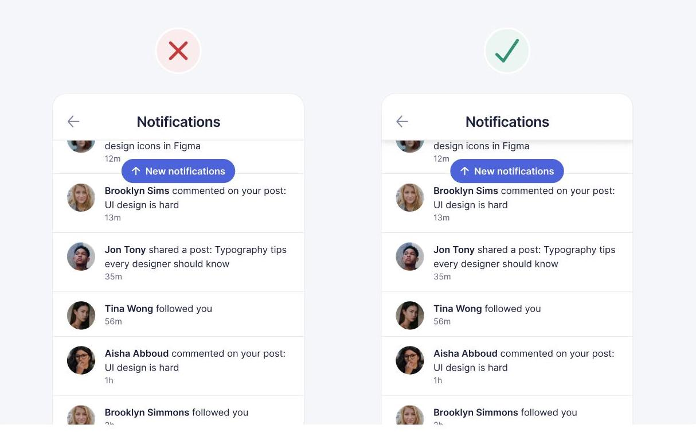

Example of depth being used to create visual hierarchy

## Understand the box model

You may have heard a joke that designers get paid to move rectangles around on a screen. While it's a very simplistic view, it's basically true. Interfaces are made up of lots of rectangles within rectangles.

It's important to understand how these rectangles, or boxes, work and interact. Each rectangle can have an outer margin, inner padding, and a border according to the box model:

- Margin - the space between the box and neighbouring boxes.

- Border - the stroke around the edge of the box.

- Padding - the space between the border and the contents of the box.

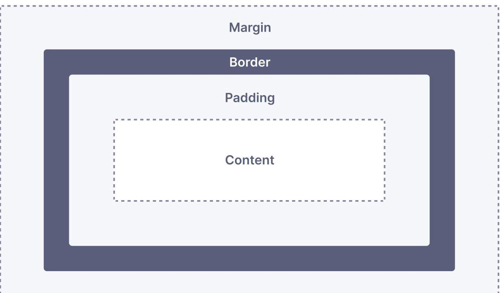

Diagram of the box model

The following example illustrates how an interface is made up of smaller rectangles within larger ones. You'll also notice that the spacing between the innermost rectangles starts relatively small and gradually increases as you move outwards. You'll learn more about how to apply a predefined spacing system soon.

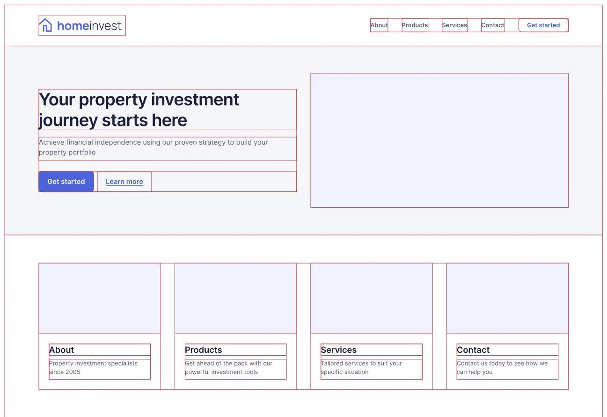

The red lines show how an interface is made up of smaller rectangles within larger ones

## Design @1x using points

Back when all screen resolutions were 72 ppi (pixels per inch), 1 point (pt) was equal to 1 pixel (px). A pixel is the smallest piece of a screen that can display colours.

Nowadays, screen resolutions are higher, so 1pt may be equal to \( {4px} \) (2px x 2px) on a "@2x" resolution, or 9px (3px x 3px) on a "@3x" resolution.

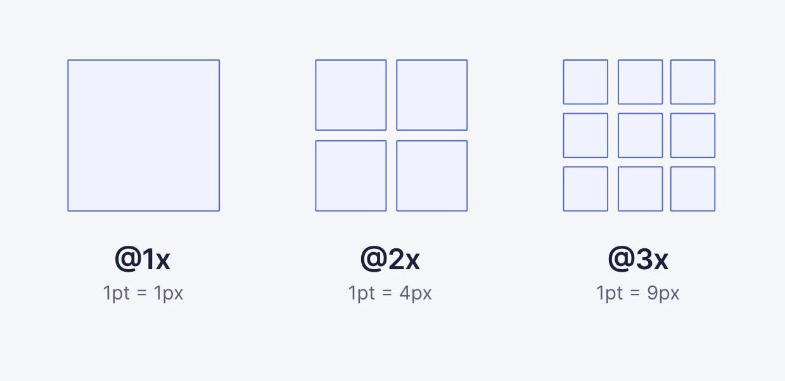

Points versus pixels on different screen resolutions

For UI design, always work in points. This is often called working "@1x" and most design tools are configured to work like this by default.

## Create a set of predefined spacing options

Deciding on the ideal spacing between interface elements can be a frustrating and time consuming task. There are endless options to choose from. Rather than using trial and error, one pixel at a time, create a simple set of predefined spacing options to make decisions faster.

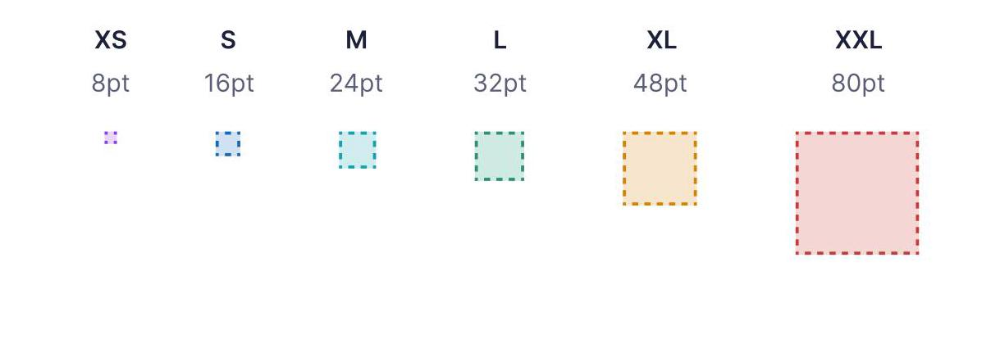

An example set of predefined spacing options

Set simple t-shirt sized spacing options based on increments of 8 points. Why 8? Many popular screen sizes are divisible by 8 and it provides a bit more spacing flexibility than using 10 points.

This is also known as using an 8 point grid, as all interface elements will end up aligning to a series of vertical and horizontal guidelines separated by 8 points. For more detailed interfaces, you could use 4 point increments for a bit more control.

Much like a typography scale, your spacing options should grow by larger amounts as they get bigger. This ensures that spacing is proportional for larger interface elements. Benefits of using a predefined set of spacing options:

- Simplified designs - as there's less variation between spacing.

- Improved consistency - as spacing across interface elements will match.

- Design faster - as there are fewer options to choose from.

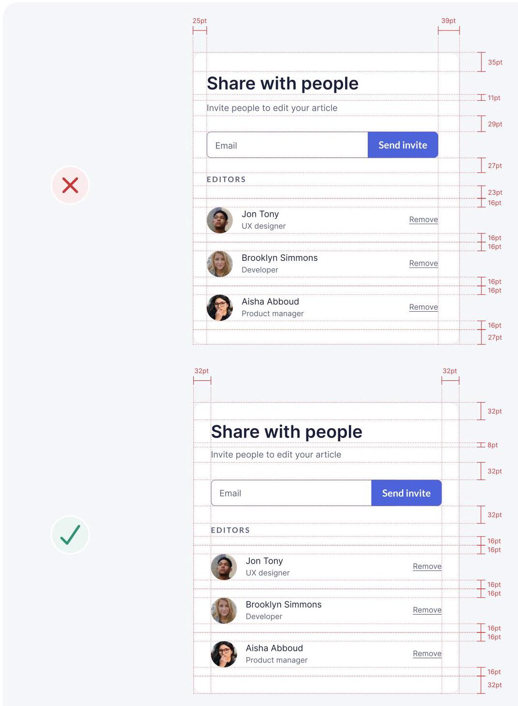

An example of an interface with inconsistent spacing versus one using a set of spacing options

## Space elements based on how closely related they are

It's great that we have a set of predefined spacing options, but how do we know which spacing option to use? The amount of spacing between interface elements should depend on how closely related the elements are.

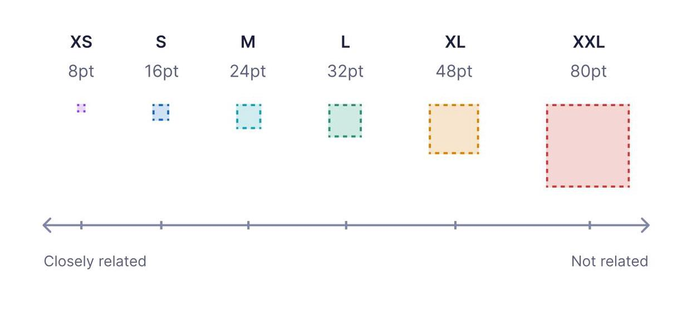

More closely related elements should generally be closer together to show that they're related. Unrelated elements should be separated by placing more space between them.

Using spacing in this way is one of the most powerful methods of breaking up information into smaller groups. If you think of each group as a rectangle, you'll start to notice that interfaces are made up of many small rectangles within larger ones.

Start by applying small spacing to the innermost rectangles and gradually increase the spacing between rectangles as you move outwards. In the following landing page example, the same predefined spacing option, small (16pt), is used between all rectangles, regardless of how closely related they are. This results in a design that looks cluttered, squashed, and difficult to understand.

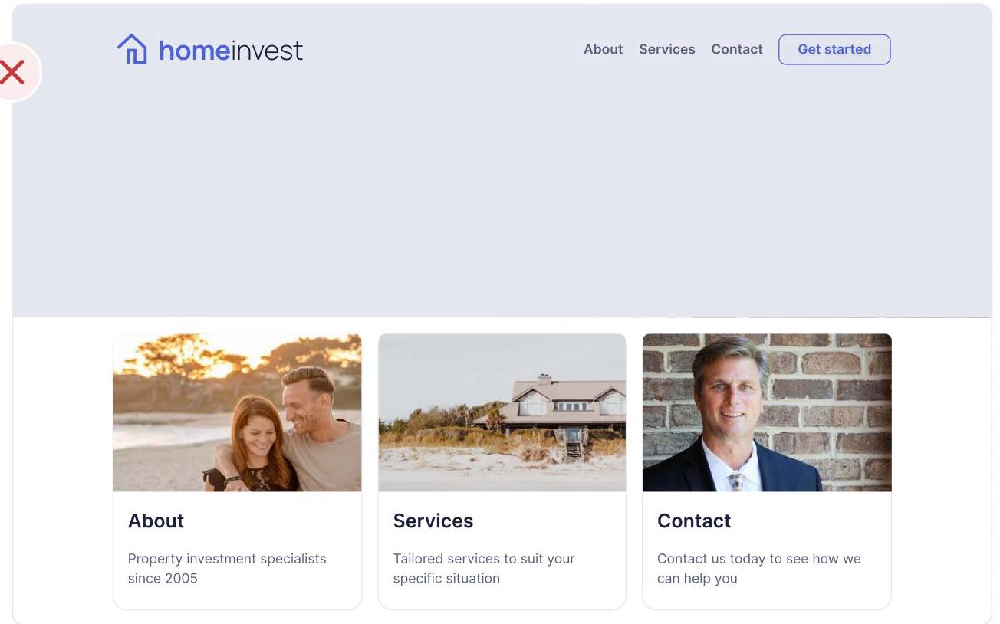

Landing page example with small spacing option applied everywhere

Let's fix the spacing issues with this example. Firstly, break it up into rectangles within rectangles.

Start by applying extra small (8pt) spacing to the innermost rectangles and gradually increase the spacing between rectangles as you move outwards. We'll go through this process in more detail soon.

This results in a design that's clearer, neater, and easier to understand.

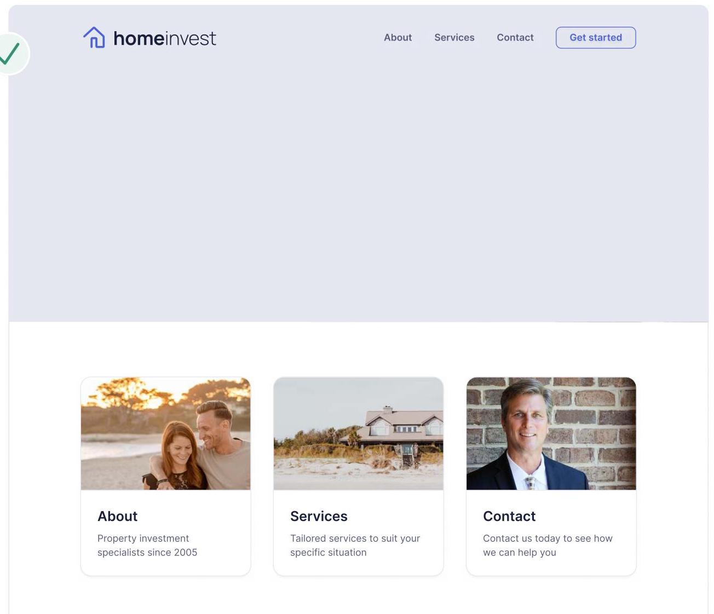

Landing page example with increasingly larger spacing options applied as you move outwards

Use spacing options consistently throughout your interface for improved order and rhythm. It's a good idea to create spacing rules to help achieve better consistency and to speed up spacing decisions. For example, you might use the following spacing rules:

- Use medium (24pt) internal padding for components like cards

- Use large (32pt) gaps between columns

- Use extra extra large (80pt) vertical padding for website sections

Let's look at the spacing options used in the improved example. Start with extra small (8pt) spacing for the innermost rectangles (the card text). Moving outwards, increase the spacing to the medium (24pt) option for the next level of rectangles (the top section content and card padding). You could use the small (16pt) option, but more generous spacing makes it easier for people to distinguish interface elements.

homeinvest About Services Contact Get started

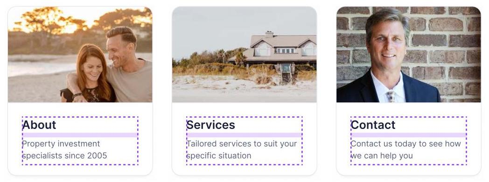

XS M L XL XXL

8pt 16pt 24pt 32pt 48pt 80pt

Closely related Not related

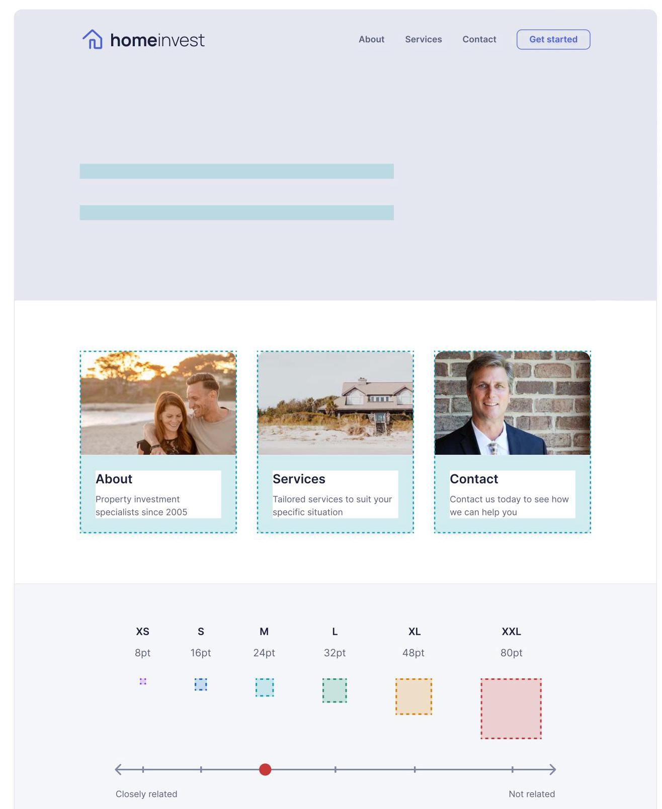

Moving further outwards, apply the large (32pt) spacing option between top navigation links and cards. The cards are actually sitting on a 12 column grid which has gaps of 32pt between columns. You'll learn about grids soon.

nomeinvest About Services Contact Get started

XS M XL XXL

8pt 16pt 24pt 32pt 48pt 80pt

Closely related Not related

For the outermost boxes of section content, apply the extra extra large (80pt) spacing option to help separate each section of content. Using this systematic spacing approach is a simple way to add order and structure to an interface design.

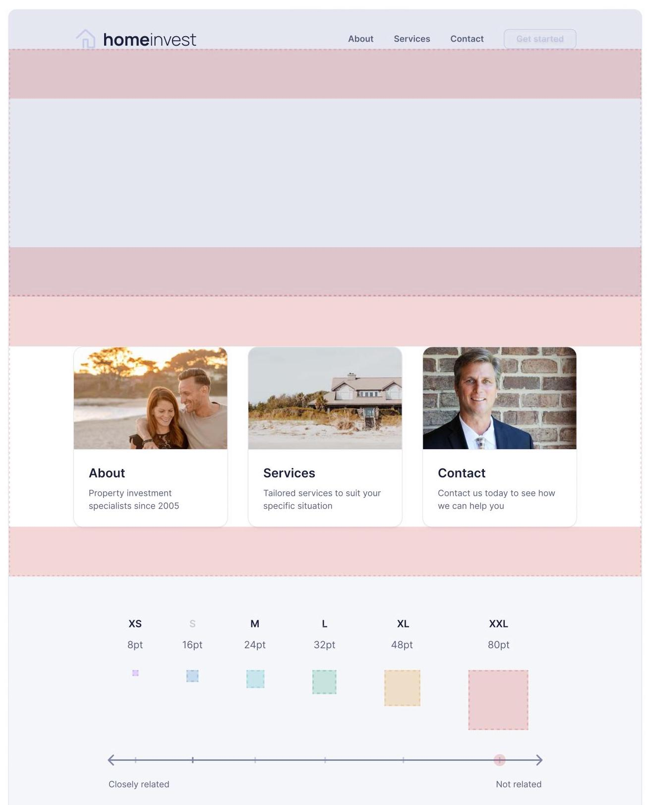

## Be generous with white space

One of the quickest and easiest ways to instantly improve an interface design is to use more spacing or white space. White space refers to the empty space between and around design elements. It can be padding, margins, or even the space between lines of text. White space isn't necessarily white, it can be a colour, pattern or image.

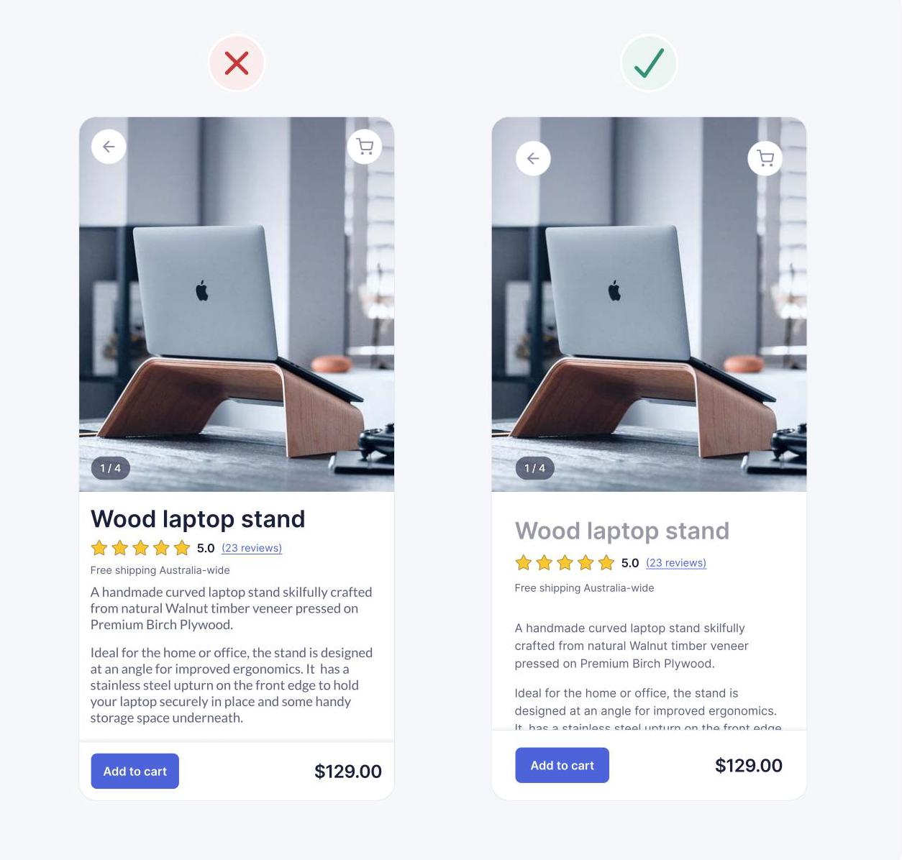

Example of an interface with tight spacing versus one with generous spacing

Unfortunately, there's no simple rule that tells you how much white space you should use. Using more white space is generally better than using less. Tight spacing makes it more difficult for people to see groupings and visual hierarchy. This makes it harder for them to understand the information. More white space can also make your interface design look simpler, cleaner, and more sophisticated.

When defining the space between design elements, try to be generous. For example, instead of using the extra small (8pt) predefined spacing option, consider using the next one up.

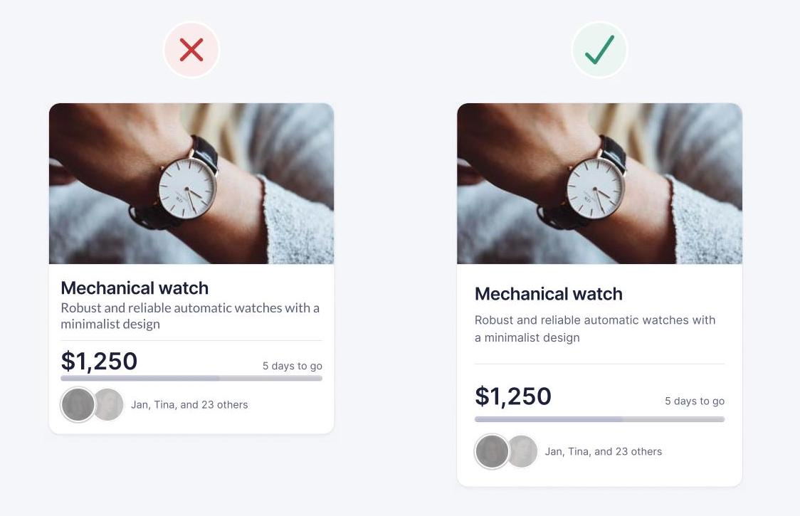

Example of an interface with tight spacing versus one with generous spacing

Use The Squint Test to test whether you have enough white space. If you squint or blur the interface and you can't easily distinguish between elements, then you should probably increase spacing to be safe.

White space isn't just leftover space, it's an important design element that you can use to improve usability and aesthetics.

## Align the main layout to a 12 column grid

The more interface elements you align, the more ordered and structured your interface will appear. This reduces cognitive load and makes it easier for people to understand an interface. A quick and simple way to improve alignment is to use a 12 column grid.

## What’s a 12 column grid?

A 12 column grid consists of 12 vertical columns separated by empty spaces called gutters. Outer margins prevent the content from hitting the left and right edges of a screen. Columns provide a structure for the layout of the main elements of an interface to align with.

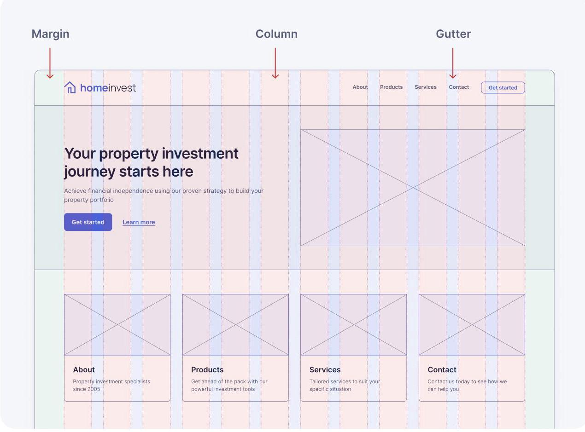

12 column grid layout overlayed on a website

## Columns

Create different page layouts by aligning the main containers to one or more columns. Smaller elements inside the main layout containers don't need to align to the 12 columns. Use your predefined spacing options for these smaller elements.

Columns generally have a flexible width, defined with percentages, rather than a fixed width. This allows them to adapt to different screen sizes. Start with 12 columns for large screen sizes, like desktops and laptops. Decrease the number of columns for smaller screens, like tablets and mobiles.

For example, on a large screen, 3 content cards might be aligned in a row across 12 columns. Each card spans 4 columns. On a smaller mobile screen, the cards stack on top of each other across 4 columns.

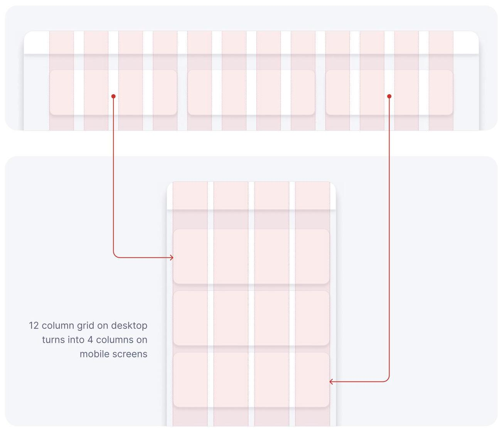

## Gutters

The purpose of gutters is to separate and align columns of content, not to contain content. Gutters should remain empty and should be narrower than columns. Gutters generally have a fixed width and are often wider on larger screens to keep spacing proportional.

For example, a large (32pt) predefined spacing option might be used for gutters on large screens, while a small (16pt) spacing option is used on smaller mobile screens.

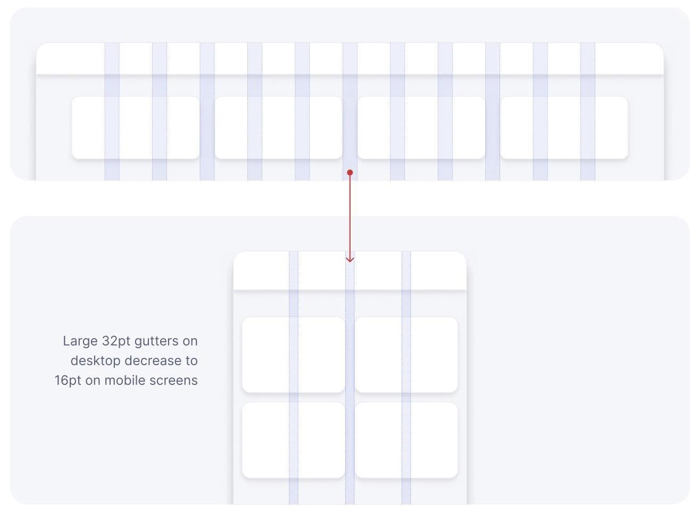

## Margins

Margins are the empty space on the left and right of the 12 columns. They prevent the content from hitting the left and right edges of a screen. Margins can have either a fixed or flexible width and are generally wider on larger screens.

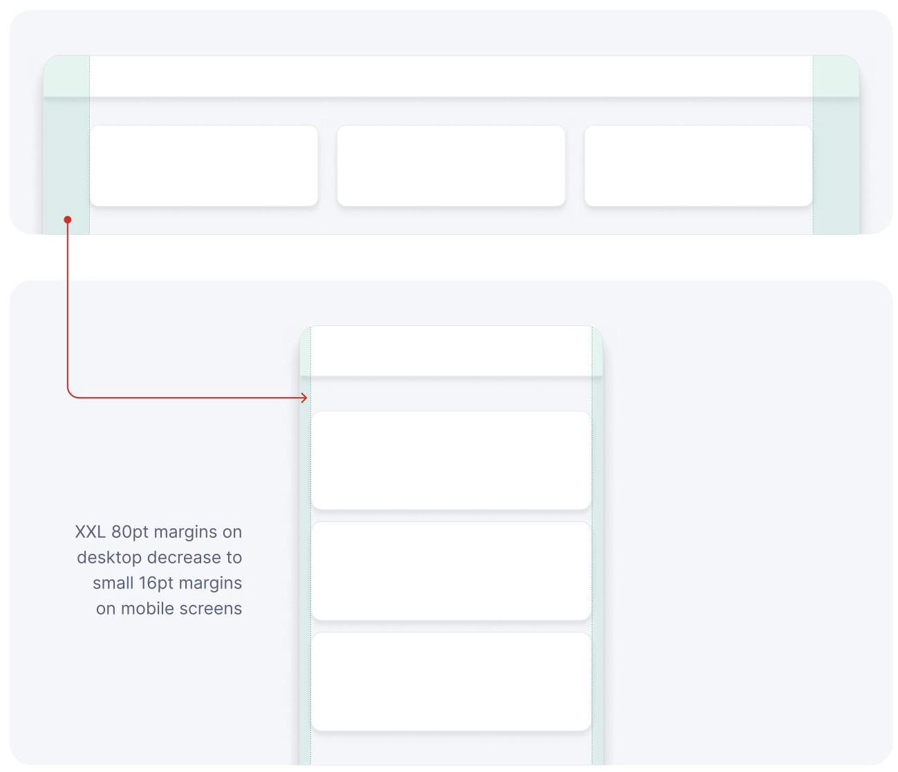

Some experienced designers find a 12 column grid restrictive, but when you're learning UI design, having some restrictions can be helpful. Why 12? 12 columns is the most common, as it provides sufficient flexibility without being overly complex. It also aligns with most front end development frameworks. There are lots of online grid generators to help you experiment with spacing options for columns, gutters, and margins.

## Align text to improve readability

Left aligned text is easiest to read because each line starts along the same straight left edge. This gives your eyes a consistent anchor to quickly jump back to at the end of each line. Try to maintain a straight left edge when aligning text with other interface elements like icons.

In the following example, the icon placement breaks the straight left edge. You can feel your eyes working slightly harder to go from the heading to the secondary text. This adds unnecessary cognitive load.

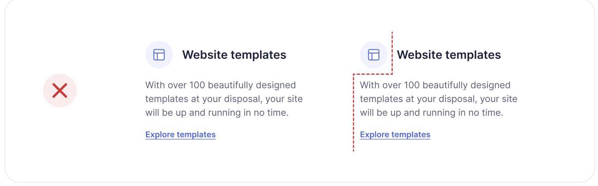

The following examples align text to a straight left edge, making it more comfortable to read. It's literally easier on the eye, which makes it appear more neat and tidy.

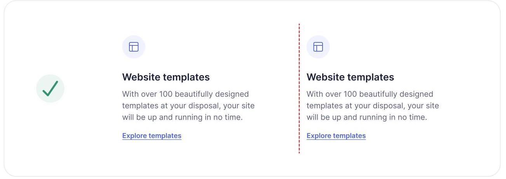

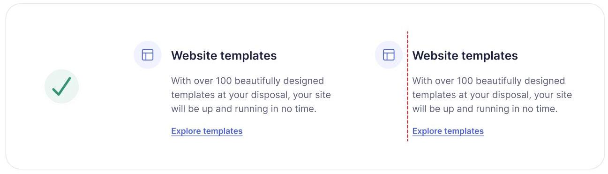

While centre aligning long blocks of text makes it harder to read, it can work well in moderation, for short blocks of text.

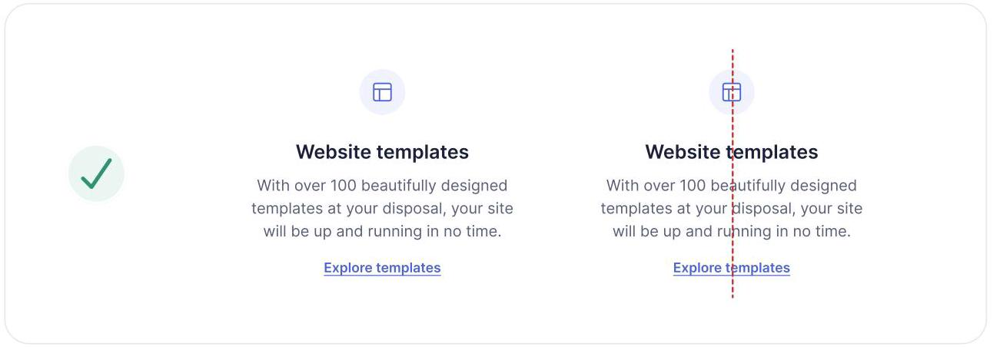

## Align horizontal text to the baseline

The baseline is an invisible line that text sits on. It creates a relatively straight bottom edge that our eyes can easily follow. When you have different sized text sitting in a horizontal line, align it to the baseline, rather than the vertical centre. This makes the text easier to read and also results in a neater looking design, as more elements are aligned.

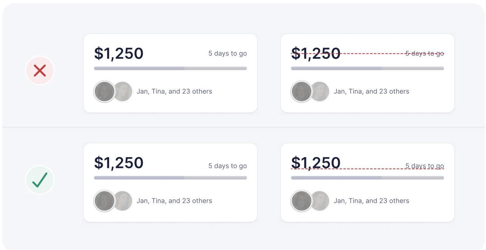

Text aligned to vertical centre versus text aligned to the baseline

In the following example, the "/month" text is floating on its own when it's vertically centred. Aligning it to the baseline neatly connects it to the price.

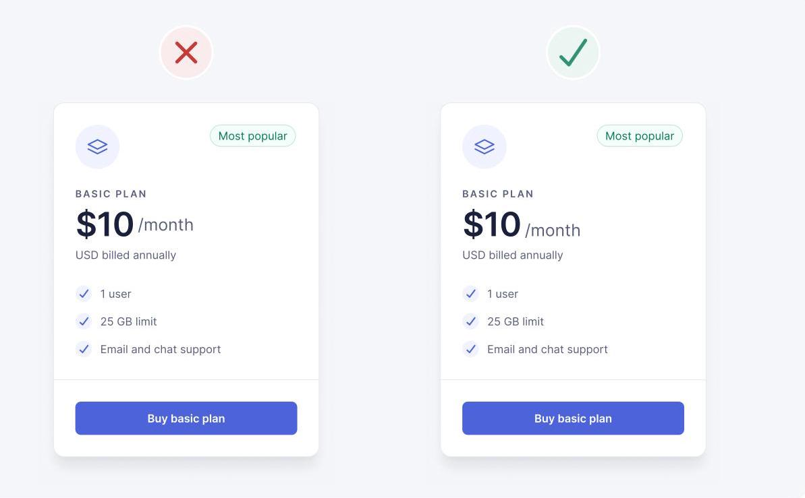

The "/month" text is aligned to the vertical centre versus the baseline

## Try to avoid using multiple alignments

The more different types of alignment you use (left, right, or centre), the more complex and messy an interface can look. Our eyes are forced to work harder as they move around to try and follow each alignment. This is highlighted when multiple different alignments are used within a small component or section of an interface.

Sticking with a single alignment (or as few as possible) helps to simplify an interface, making it look neater and tidier.

The following example starts with centre aligned text, then changes to left alignment for the other elements. The mixture of alignments adds unnecessary complexity, resulting in a slightly increased cognitive load and a less tidy interface.

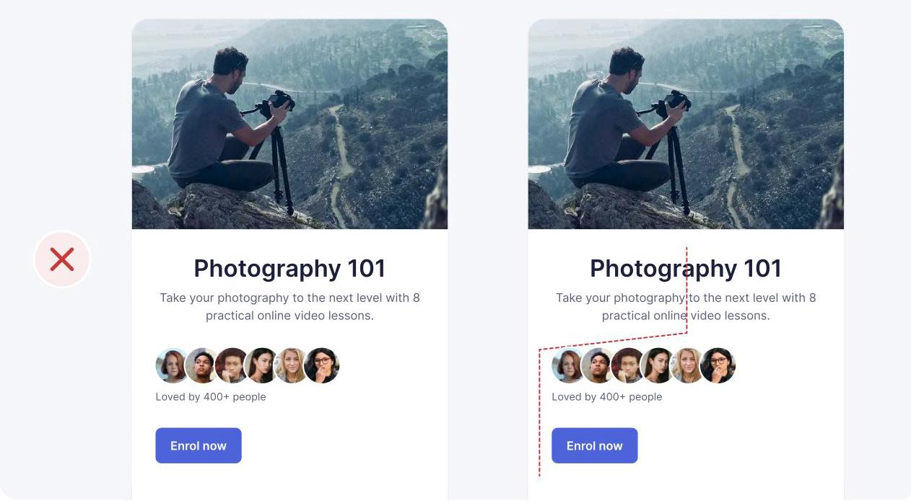

Example of an interface with multiple alignments

It's simpler and neater to left align all interface elements. The straight left edge also improves readability.

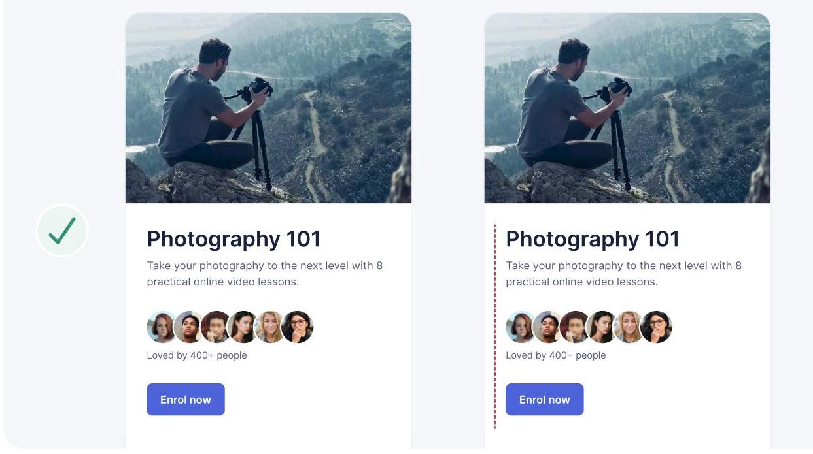

Since there's only a small amount of text, you could also centre align all elements. Make the button full-width to help both left and right handed users easily reach it with one hand. Here's another example that demonstrates how using fewer alignments can help simplify an interface. The person's name and role are centre aligned, their photo is right aligned, the quoted text is left aligned, and the stars are centre aligned. You can feel your eyes zig-zag as you view the information and it looks untidy.

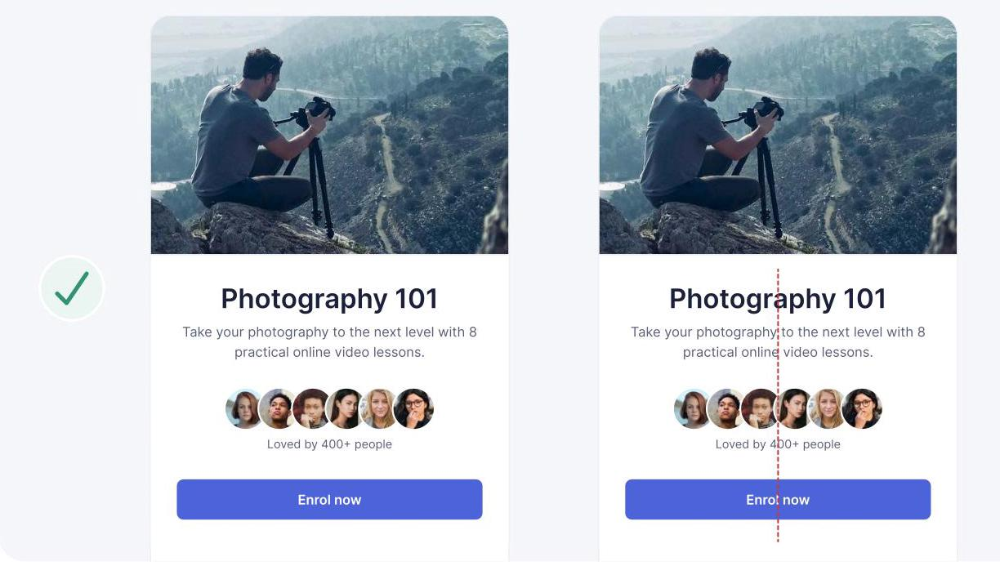

Aligning the majority of elements to the left is simpler and neater.

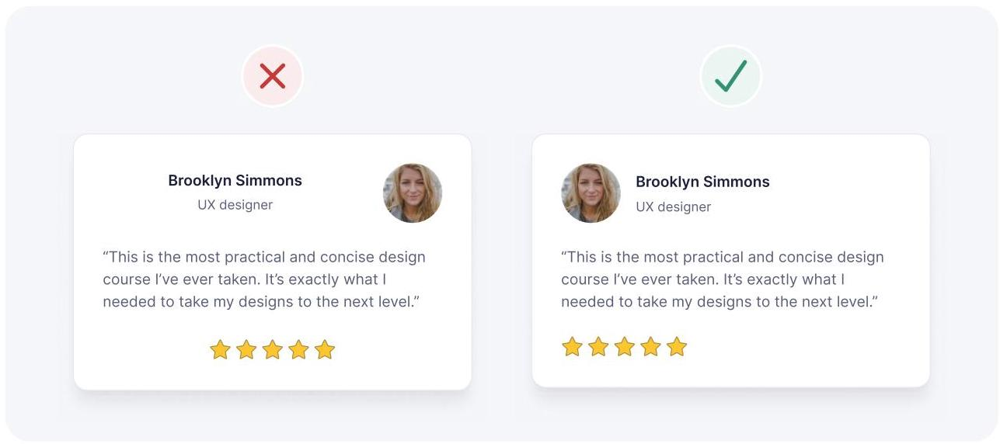

You could also improve readability by aligning all text to the left edge. The right aligned photo is ok, as the majority of elements have 1 alignment.

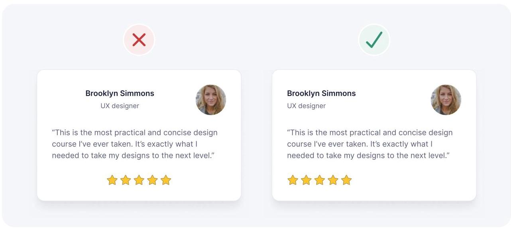

## Keep related actions close

According to Fitts's Law, the closer and larger a target, the faster it is for someone to select the target. This simple concept is often forgotten.

Reduce interaction cost by keeping actions close to the element they relate to. Try to ensure they have a sufficient target area. At least 48pt by 48pt is a safe size.

In the following example of a blog, we'll use Fitts's Law to help reduce interaction cost. Let's say that you want to navigate to the "Most popular" category by tapping on the menu icon in the top left.

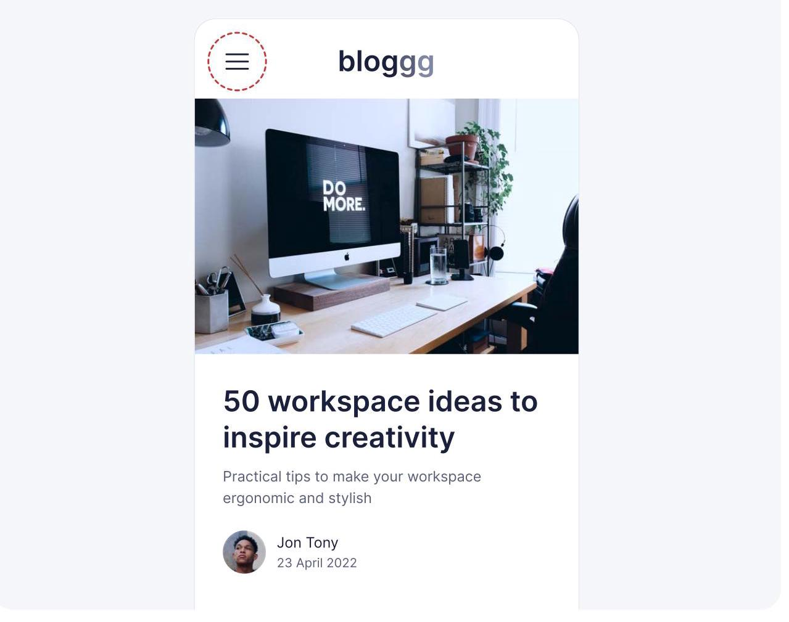

When you tap on the menu icon, a category menu slides out from the left.

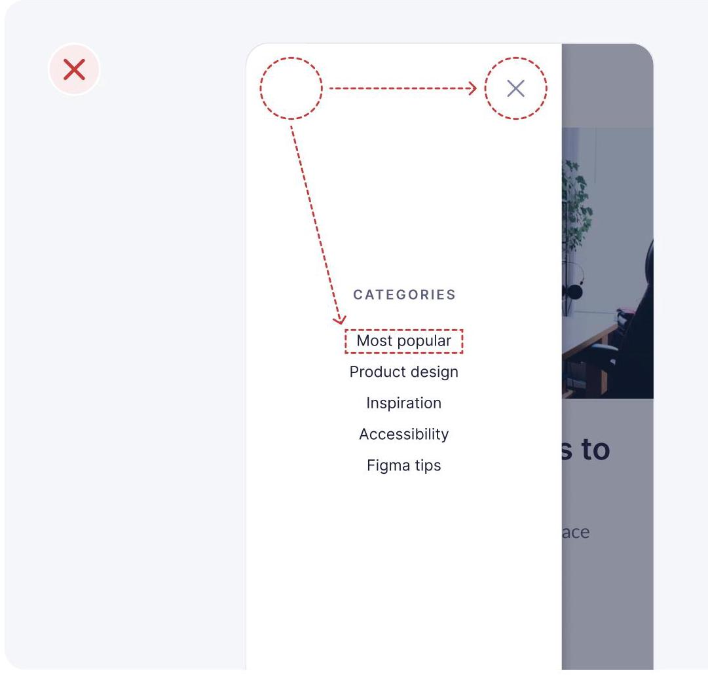

Relatively high interaction cost to navigate to a category or close the menu

The category list is placed in the middle of the screen for aesthetic reasons, but it's quite far from the initial tap position in the top left. The close button is also relatively far from the initial tap position. This causes you to spend slightly more time and effort navigating to a category or closing the menu.

The size and tap area of the category menu items are also relatively small, which means you need to be more precise when tapping them. Again, this takes more time and effort which increases interaction cost.

Let's quickly redesign this slide out menu to accommodate Fitts's Law:

- Move the close button to the start position, so that people don't need to move their finger position to open and close the menu.

- Move the category menu to the top, left align the text, and increase the size of the menu items to make them faster and easier to tap.

- Add a border around the menu items to clearly indicate the large target area. This is so people don't need to be so precise when tapping on a menu item, and can do so faster and more easily.

This is a relatively small saving to interaction cost, but many small savings can quickly add up, especially when interactions are repeated.

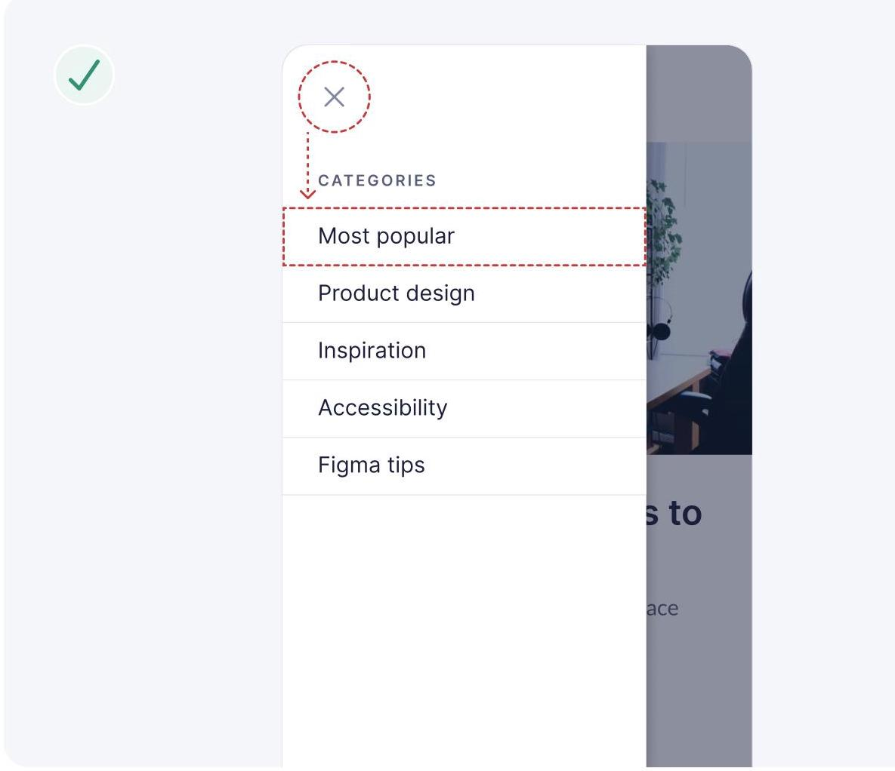

Lower interaction cost to navigate to a category or close the menu

## Ensure an interface is unbreakable

Don't just design an interface for small numbers and short text. Make sure it can accommodate long data and edge cases (uncommon cases) too. Try to avoid hiding data that overflows, as you could be hiding essential information. Instead, keep your components flexible to allow for reflow of content, or decrease font sizes to allow for long data.

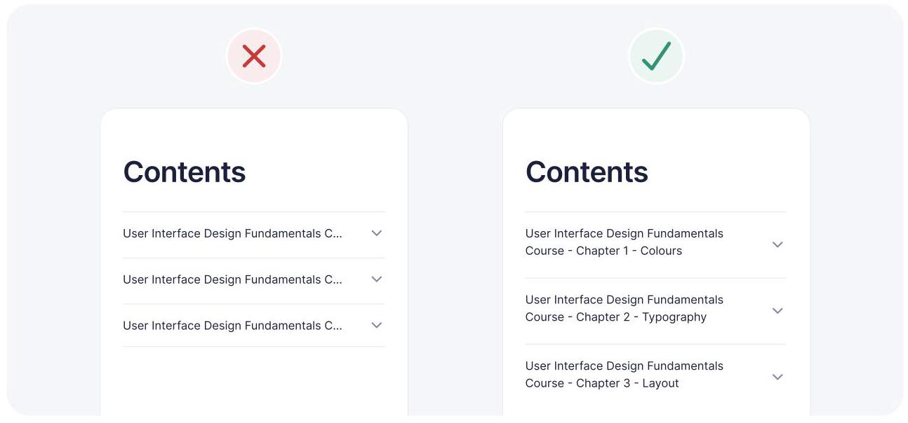

If you need to hide data due to space constraints, try to ensure that you're not hiding essential information. For example, consider cropping text in the middle, rather than at the end, so that people can differentiate items.

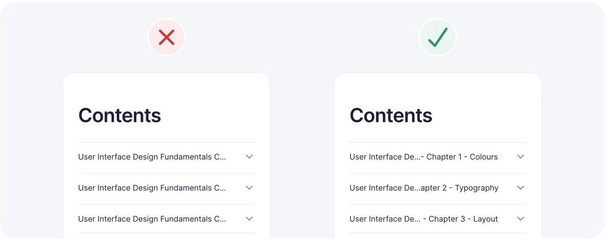

## Use the Rule of Thirds for photos

The Rule of Thirds is a simple but effective way to make photos look more balanced, natural, and dynamic. Let's learn how to use it.

Divide your photo into thirds by creating a grid that's 3 columns wide and 3 rows tall. This creates 4 focal points where the lines intersect. Our eyes naturally gravitate towards these focal points. Try to roughly align key elements of your photo to the grid, ensuring that the main subject sits on one of the 4 focal points.

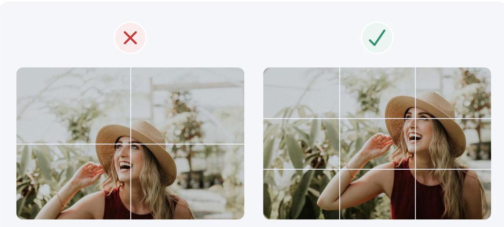

Centre alignment versus alignment using the Rule of Thirds

In this example, the focal point is the person's eyes. If you simply position their eyes in the centre of the photo, you end up with a very symmetrical photo that looks a bit rigid and still.

If you move their eyes to align with one of the 4 focal points on the grid, the asymmetry introduces a sense of natural motion and flow.

The Rule of Thirds is especially effective for action shots, as it increases the sense of motion already present in the photo. In the following photo, align the surfer to a focal point and ensure that the top of the wave aligns with the horizontal grid.

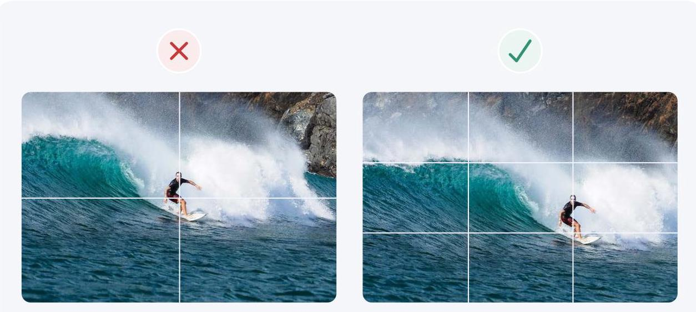

Centre alignment versus alignment using the Rule of Thirds

Similarly, the following photo of a tree in a field feels more natural by using the Rule of Thirds. Align the tree to a focal point and ensure that the landscape aligns with the horizontal grid.

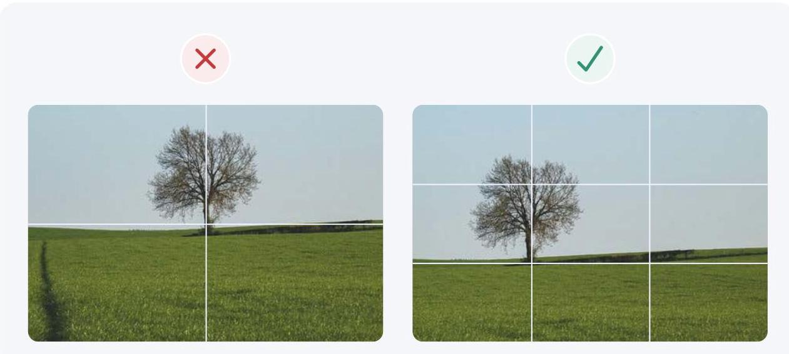

Centre alignment versus alignment using the Rule of Thirds

TUTORIAL - LAYOUT AND SPACING

## Apply what you've just learned

Let's apply some of the guidelines you've learned

to continue improving the fitness app example.

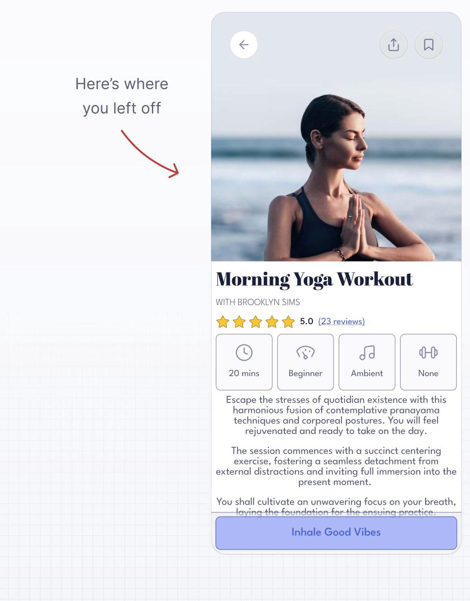

## Ensure similar looking elements function similarly

If elements look similar, people will expect them to work in a similar way. So try to ensure that you use a consistent visual treatment for elements with the same functionality.

In the fitness app example, the icon containers have a similar visual style to the button at the bottom. This makes them seem interactive, even though they're not. Removing the button styling from the icons helps to avoid them being mistaken for interactive elements.

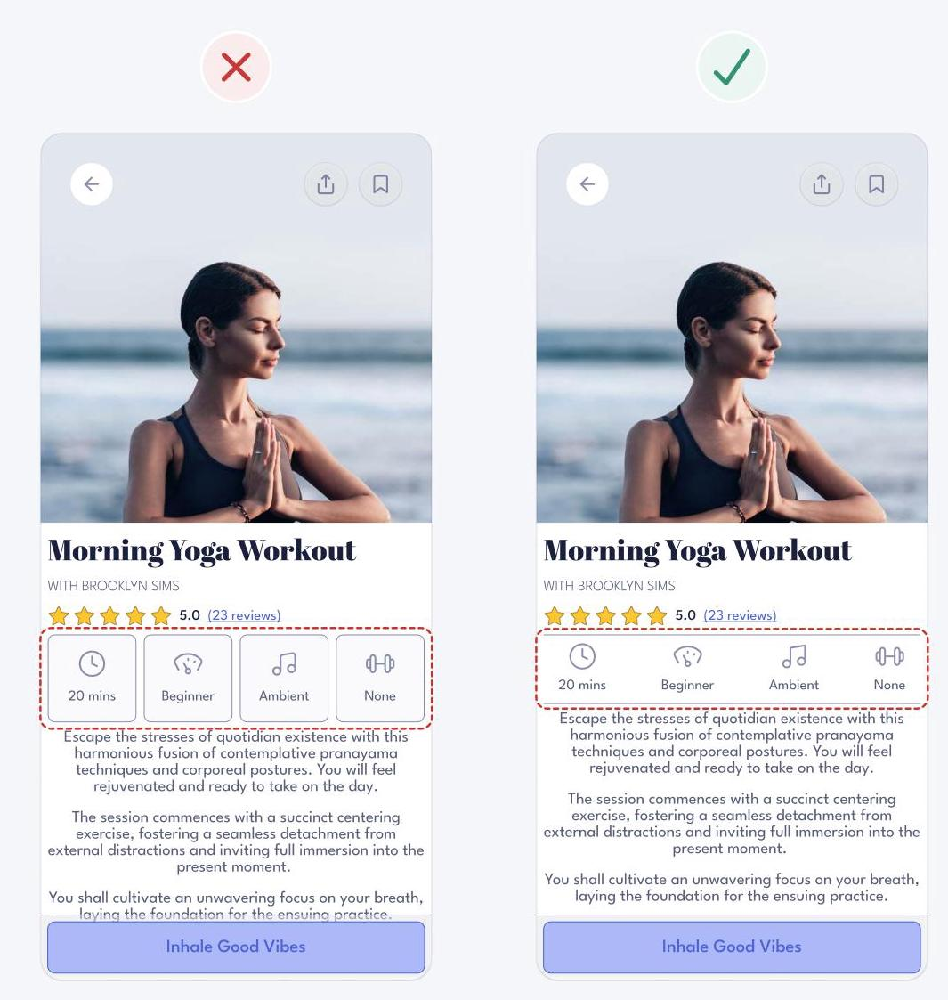

Icon styling is changed to help differentiate icons from buttons

## Use space to group related elements

In the fitness app example, all of the content is spaced very closely together, making the design look cluttered and difficult to understand. Increasing spacing using predefined spacing options helps to clearly group content. This makes it more organised and easier to understand.

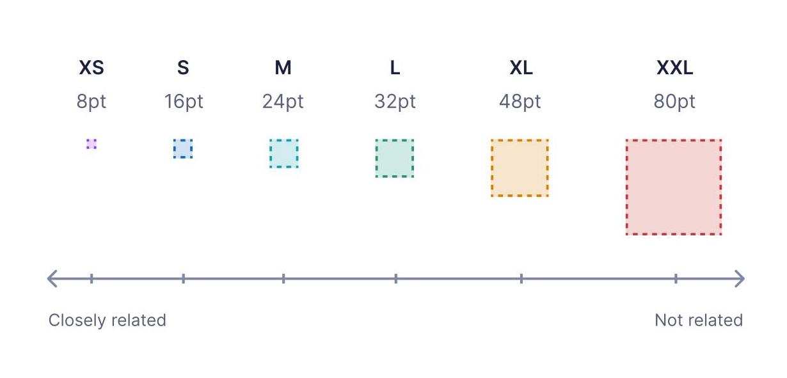

An example set of predefined spacing options

The amount of spacing between interface elements should depend on how closely related the elements are. More closely related elements should generally be closer together to show that they're related. Unrelated elements should be separated by placing more space between them.

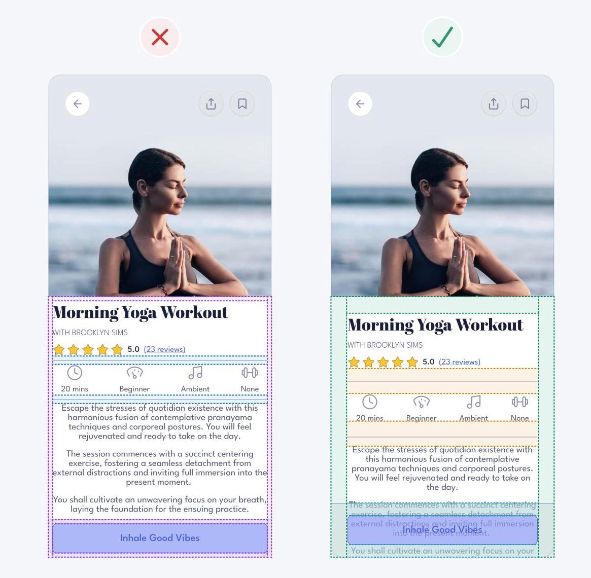

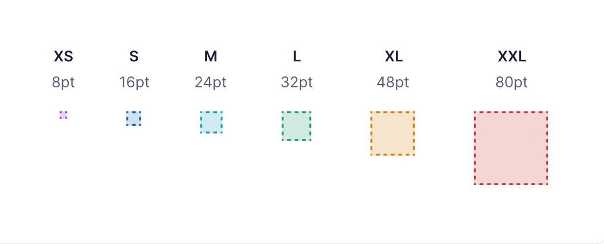

Predefined spacing options applied to the fitness app example

## Create a clear visual hierarchy

Let's apply the Squint Test to the fitness app example to test the visual hierarchy. We can see that there are multiple elements with similarly strong prominence competing for attention. Meanwhile, the primary action at the bottom doesn't stand out much.

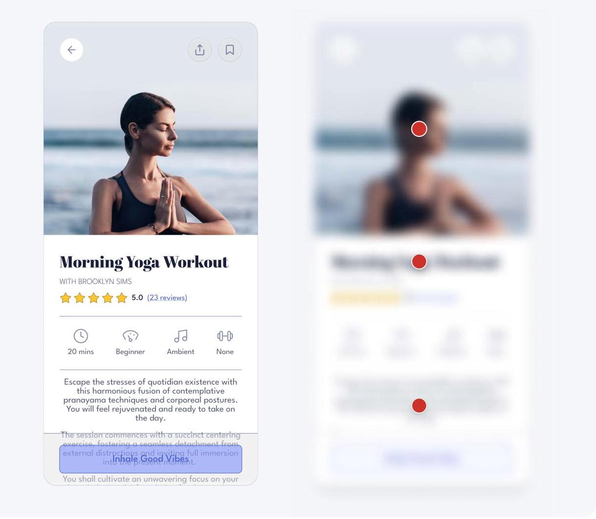

Applying The Squint Test to the fitness app example

The primary action should generally be the most prominent element on an interface, given that it's the most important. Apply the brand colour as a solid fill to give the button more prominence.

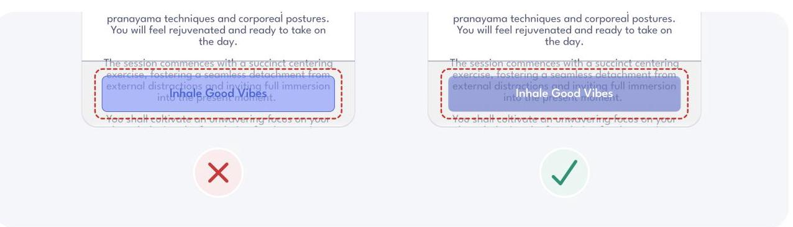

Applying the Squint Test to the updated design, the primary action is clearly the most prominent element.

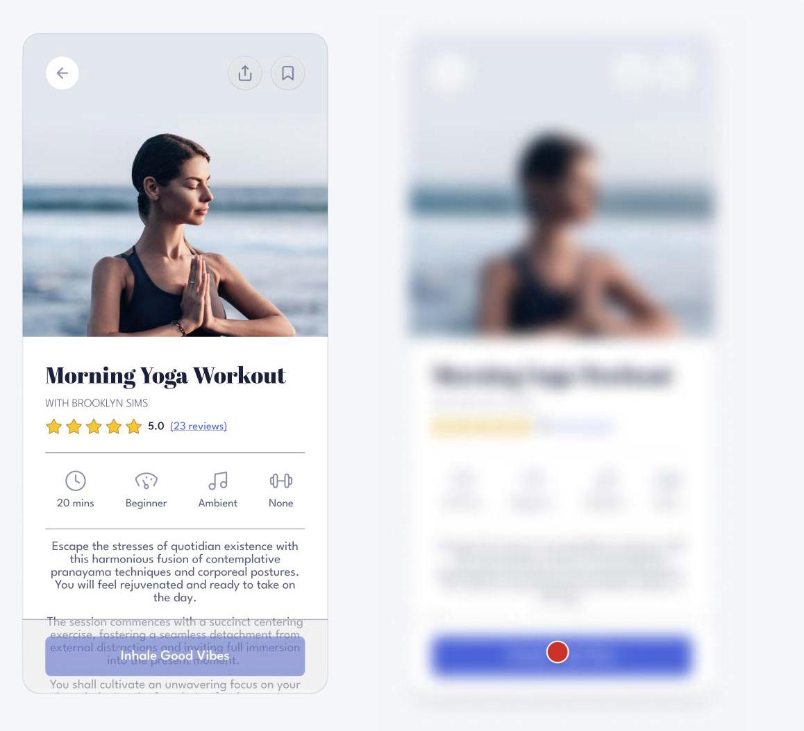

## Use the Rule of Thirds for photos

In the fitness app example, the photo looks a bit rigid and still, as it's very symmetrical. The focal point is the person's face and it's positioned in the centre of the photo.

Let's apply the Rule of Thirds. Instead of centre aligning their face, move it to align with one of the 4 points of intersection on the grid. The asymmetry introduces a sense of natural motion and flow. You should also make sure that the horizon aligns with the horizontal grid.

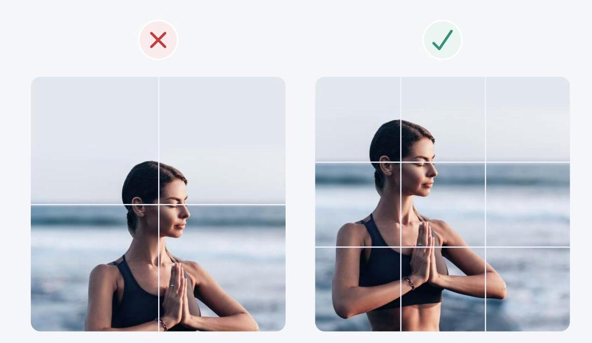

The photo is realigned based on the Rule of Thirds

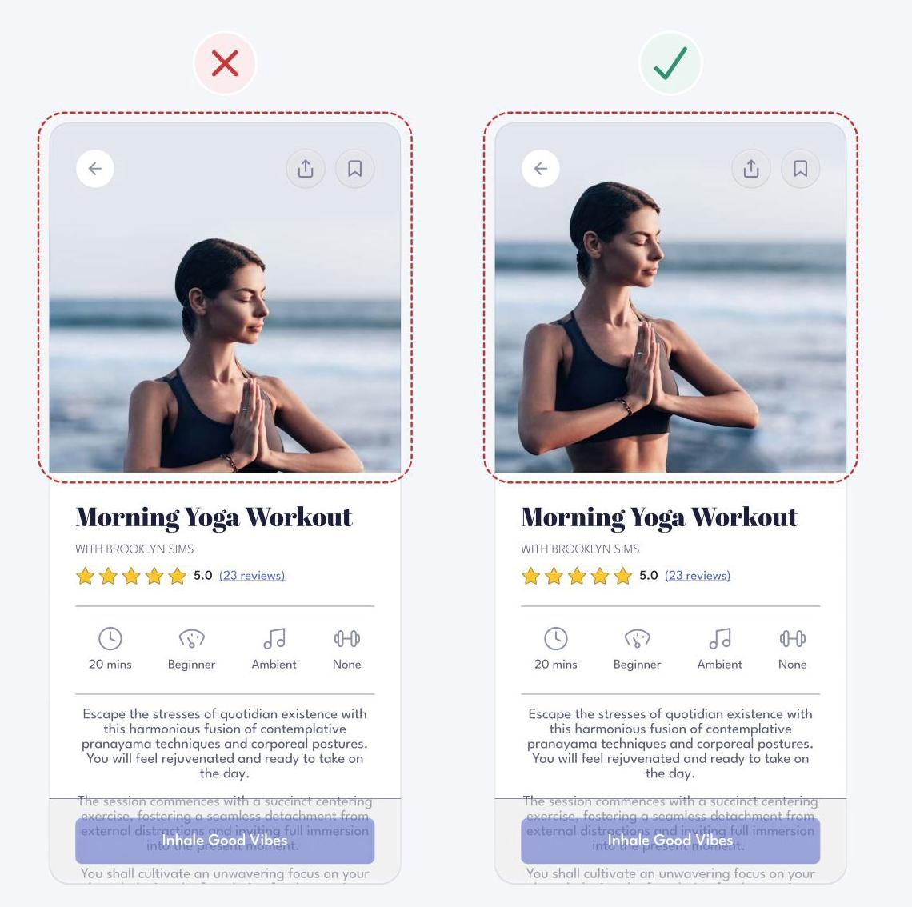

The photo is realigned based on the Rule of Thirds

Nice work. It's amazing that simple things like spacing and visual hierarchy can be so powerful. I hope you're starting to see that UI design isn't just a magical art form. A lot of it is made up from logical guidelines like the ones above. We'll continue improving the example fitness app at the end of the next chapter.

## Chapter summary

✓ Group related elements by placing them in the same container, spacing them close together, making them look similar, or aligning them in a continuous line.

✓ Create a clear visual hierarchy by presenting information in order of importance. Use size, colour, contrast, spacing, position, and depth to control the prominence of elements.

✓ Understand that interfaces are made up of lots of rectangles within rectangles. Each rectangle can have an outer margin, inner padding, and a border according to the box model.

✓ Create a small set of predefined spacing options in increments of 8 points. Space elements based on how closely related they are.

✓ Align interface elements to a 12 column grid structure to help make the interface easier to understand. Try to avoid using multiple different alignments to keep things neat and tidy. Your progress 4 of 8 chapters completed

Fundamentals

- Less is more Colour Layout and spacing 5 Typography 6 Copywriting Buttons