江

##

CHAPTER 5

Learn a system of logical guidelines to make text

beautiful and easy to read

<!-- auto-toc:start -->
## Contents

- Use a single sans serif typeface
- Serif typefaces
- Sans serif typefaces
- Sans serif
- Script typefaces
- Display typefaces
- Monospaced typefaces
- Reasons to use a single sans serif typeface
- 1. Legibility
- 2. Neutrality
- 3. Simplicity
- Tips for choosing a sans serif typeface
- Evoke emotion using a second typeface for headings
- Use regular and bold font weights only
- Use a type scale to set font sizes
- Small type scales
- Large type scales
- Responsive type scales
- Make long body text bigger
- Use at least 1.5 line height for long body text
- Decrease line height as font size increases
- Ensure ideal line length
- Left align text
- Don't centre align long body text
- Don’t justify long body text
- Decrease letter spacing for large text
- Ensure text on photos is legible
- Add a linear gradient overlay
- Add a semi-transparent overlay
- Add a blurred semi-transparent overlay
- Apply a solid text background
- Avoid light grey and pure black text
- Avoid pure black text
- Use accessible grey text
- Use a typeface with taller lower case letters
- Use at least 1.5 line height for body text
- Chapter summary

<!-- auto-toc:end -->

## Use a single sans serif typeface

It's safest to use a single sans serif typeface for most interface designs. To see why, let's learn a bit about typefaces.

A typeface is a set of related fonts with a similar style or aesthetic. Helvetica is an example of a san serif typeface. Fonts are variations within a typeface, like weights or sizes. For example, Helvetica Bold and Helvetica Regular are 2 different fonts within the Helvetica typeface.

There are 5 main classifications of typefaces: serif, sans serif, script, display, and monospaced.

Serif

- Sans serif

Jcript

Display

Monospaced

## Serif typefaces

Serif typefaces include decorative tails or feet at the ends of letters (highlighted below). They often convey a traditional, classic, or formal mood. Some serifs are more legible than others and can be used at small sizes. Others are better suited for use at large sizes.

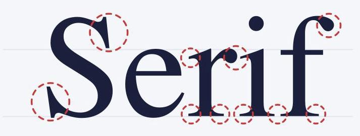

## Sans serif typefaces

Sans serif typefaces don't include decorative tails or feet at the ends of letters. They generally look more modern due to their simplicity. Sans serif typefaces are highly legible, making them suitable for use at small and large sizes. Due to their simplicity and lack of character, sans serif typefaces are a safe and neutral option that suits most interface designs.

## Sans serif

## Script typefaces

Script typefaces are based on handwriting. Their low legibility means that they're not suitable for use at small sizes. Script typefaces can be effective at conveying a formal or casual mood at large sizes.

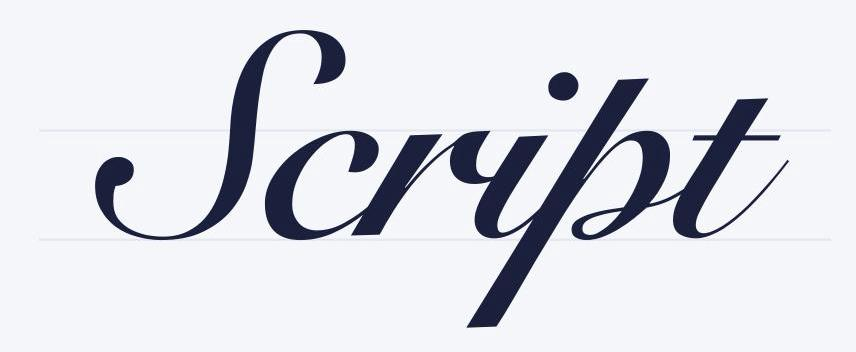

## Display typefaces

Display typefaces come in a wide range of varied styles. They're decorative typefaces specifically designed to be read at large sizes. Due to their strong character and detail, they can be especially good at conveying a range of different moods. Display typefaces aren't suitable for use at small sizes due to their visual complexity.

## Monospaced typefaces

In most typefaces, the horizontal space that a character takes up depends on its natural width. For example, an "i" takes up less space than a "w". In a monospaced typeface, every character takes up the same amount of horizontal space.

For this reason, they're often used for displaying code. They're also useful for displaying numbers to make them easier and faster to compare.

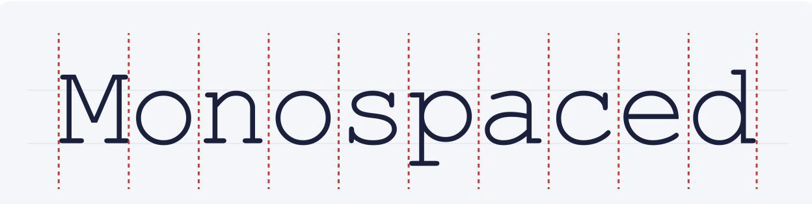

## Reasons to use a single sans serif typeface

If you're just starting out, it's safest to use a single sans serif typeface for most interface designs for the following 3 reasons:

## 1. Legibility

Legibility is a measure of how easily individual characters can be distinguished and identified. Sans serif typefaces are generally the most legible. The main purpose of interface text is to clearly communicate information so that people can achieve a task. If a typeface isn't legible, it makes the interface harder to read, understand, and use.

## 2. Neutrality

Sans serif typefaces generally don't convey a strong mood or personality. This can be helpful for the following reasons:

- The typeface will fit with most brand personalities.

- The content is the focal point, rather than the typeface.

- There's less chance you'll choose an unsuitable typeface.

## 3. Simplicity

Sans serif typefaces are generally simpler than others as they have less character and detail. Complicated typefaces can be distracting and can increase cognitive load, especially if there's more than one.

Simplifying your typography can help improve usability and aesthetics. Less is more when it comes to typography. In the following example, multiple typefaces make the interface look complex and cluttered. Some text is also difficult to read at a small size. Using a single sans serif typeface, like Inter, removes complexity. This helps decrease cognitive load, improve legibility, and it looks a lot neater too.

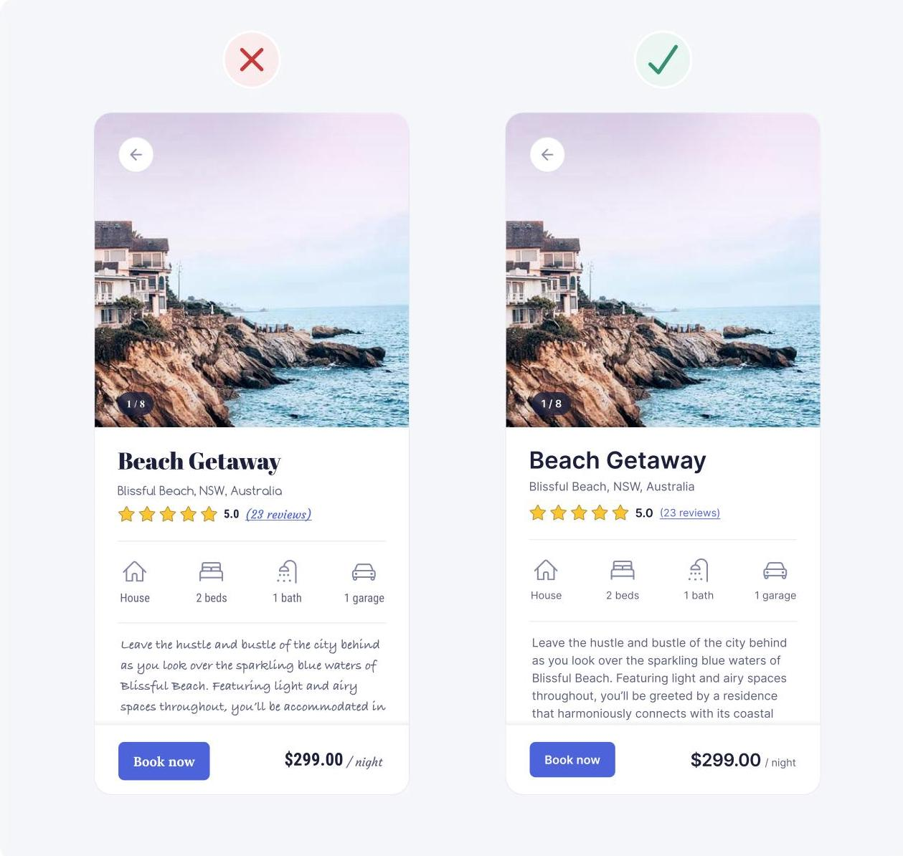

Example of an interface with multiple typefaces versus one with a single sans serif typeface

I'm not saying that you shouldn't use serif typefaces for interface design. They can work really well in some cases, but it's generally safest to use sans serifs until you gain more experience.

## Tips for choosing a sans serif typeface

With so many typefaces to choose from, it can be difficult to know where to start. Here are a few tips to help you choose a suitable sans serif typeface:

- Choose a popular typeface that's been tried and tested by many. You can usually sort font directories by popularity.

- Look for typefaces that come in a variety of weights, as they're generally better quality. Those with light, regular, medium, semibold, and bold weights are a good place to start.

- Look for typefaces with taller lower case letters and greater letter spacing, as they're generally more legible at small sizes. The height of lowercase letters in a typeface is known as the x-height.

- Get inspiration from designers and companies known for good design. Inspect their website code or check their brand guidelines for their typeface.

- If your interface needs to support multiple languages, make sure the typeface does too.

- Look for typefaces with OpenType features. They support both Mac and Windows computers, usually offer better language support, and often have additional advanced features.

- When in doubt, just use the default system typeface native to the platform, as it's tried and tested and loads quickly.

## Evoke emotion using a second typeface for headings

While it's safest to use a single sans serif typeface for most interface designs, you might want to add some personality depending on the brand. As you get more confident with typography, try introducing a second typeface for headings only. Since you're only using the second typeface for headings, you don't need to worry about legibility at small sizes.

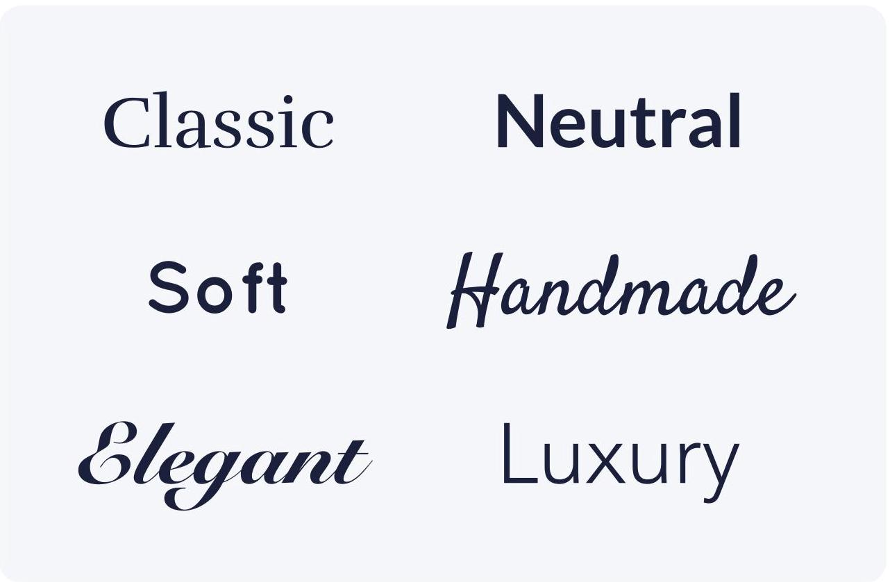

Examples of typefaces and the moods they convey

Along with colour, shape, and imagery, you can use typefaces to help evoke emotion or convey a mood. While the emotions people feel from different typefaces are largely subjective (based on personal experiences, preferences, and culture), there are still some general guidelines you can follow to choose a typeface that fits the brand personality.

Different typefaces generally evoke different feelings, for example:

- Sans serif typefaces generally feel neutral, minimal, or modern.

- Serif typefaces generally feel traditional, established, or classic.

- Rounded sans serif typefaces generally feel fun, soft, or playful.

- Casual script typefaces generally feel personal or handmade.

- Formal script typefaces generally feel formal, feminine, or elegant.

- Light sans serif typefaces generally feel chic, modern, or luxurious.

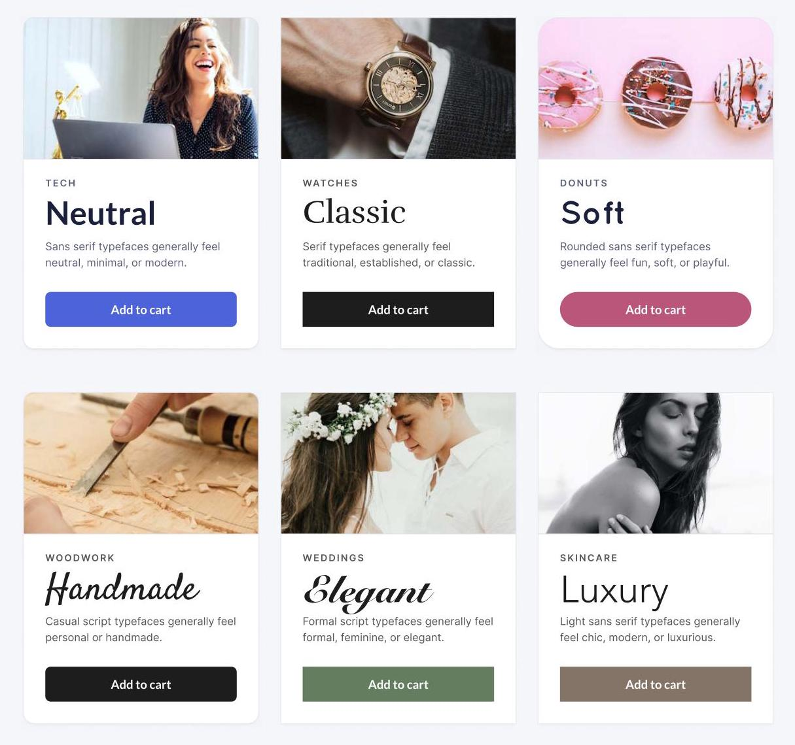

Examples of typefaces and the moods they convey

## Use regular and bold font weights only

Just because there are lots of font weights available in a typeface, doesn't mean you need to use all of them in your designs. Using lots of different font weights can add noise and clutter to your interface. It also makes it more difficult to use each font weight consistently.

Keep your design system simple and concise by using regular and bold font weights only. Some typefaces have a semi-bold font option that you can use instead of bold if bold is too heavy. Quick usage tips:

- Use bold font weight for headings to emphasise them.

- Use regular font weight for other smaller text.

- Reserve very thin or thick font weights for headings and larger text, as they can be difficult to read at smaller sizes.

Thin

Light

Regular

Semi-bold

Bold In the following example, multiple font weights are used, including thin, light, regular, medium, bold and extra bold. It looks cluttered and complex because your eyes need to process so many different font weights.

Using only regular and bold weights simplifies the design, making it look neater and easier to understand. It also speeds up the design process, as there are fewer decisions to make regarding typography.

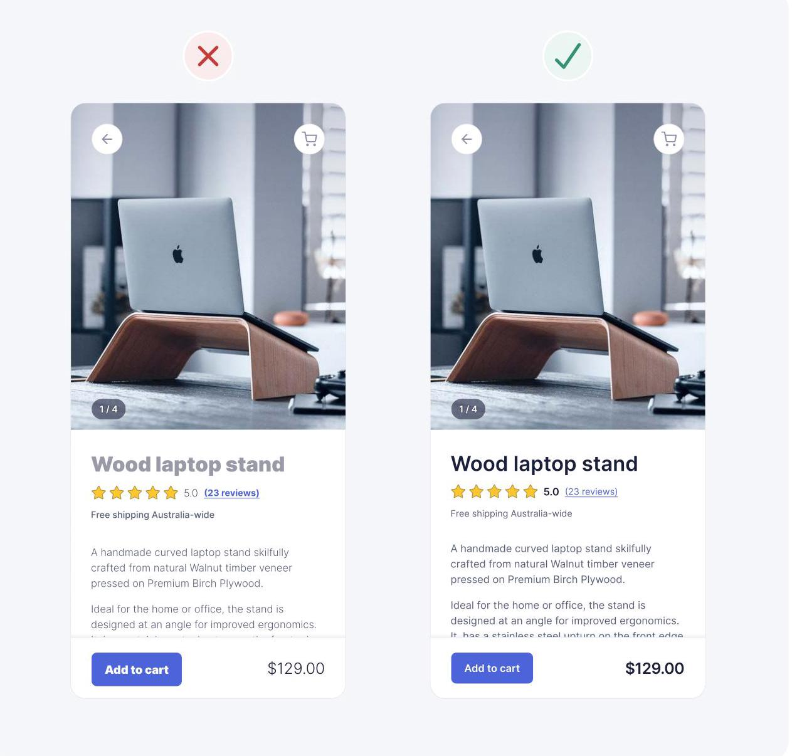

Example of an interface using multiple font weights versus one using only regular and bold

## Use a type scale to set font sizes

Using a type scale is a simple and logical way to create a set of balanced font sizes that work well together. It's best to have a limited set of font sizes in your design system. It helps speed up decision making and improve consistency across your product.

To create your set of font sizes, start with a base font size for body text, then keep multiplying it by a certain scale to create larger font sizes.

Here are some popular type scales, ordered from smallest to largest:

---

- 1.067 - Minor Second

- 1.125 - Major Second

- 1.200 - Minor Third

- 1.250 - Major Third

	- 1.333 - Perfect Fourth

- 1.414 - Augmented Fourth

- 1.500 - Perfect Fifth

- 1.618 - Golden Ratio

---

For example, start with a base font size of \( {16px} \) and use a "1.200 - Minor Third" scale. Multiply 16px by 1.2 to get the next font size of \( {19.2}\mathrm{{px}} \) . Round it to \( {20}\mathrm{{px}} \) for simplicity. Then take \( {20}\mathrm{{px}} \) and multiply it by 1.2 to get the next font size, and so on.

<table><tr><td/><td>TYPE SCALE (1.200)</td><td>SIZE</td><td>LINE HEIGHT</td><td/></tr><tr><td/><td>Heading 1</td><td>40px</td><td>48px</td><td/></tr><tr><td/><td>Heading 2</td><td>32px</td><td>40px</td><td/></tr><tr><td/><td>Heading 3</td><td>24px</td><td>32px</td><td/></tr><tr><td/><td>Heading 4</td><td>20px</td><td>28px</td><td/></tr><tr><td/><td>Small</td><td>16px</td><td>24px</td><td/></tr><tr><td/><td>Tiny</td><td>14px</td><td>20px</td><td/></tr></table>

An example set of font sizes using a slightly modified Minor Third type scale

With most type scales, you'll notice that the resulting font sizes have messy decimal values. Round font sizes to the nearest whole number for simplicity. It's not crucial that font sizes are divisible by 4 , but try to ensure that their line height is. This will align your text neatly to a 4pt vertical layout grid. You'll learn more about line height soon.

You don't need to stick strictly to a scale. Once you get more confident with font sizes, you can adjust them to better suit the interface you're designing.

## Small type scales

Using a small type scale, like "Major Second", will result in less of a difference between font sizes than using a large type scale. Small type scales are generally more suitable for complex website applications, tools, and dashboards where more detail is needed.

## Large type scales

Using a large type scale, like "Perfect Fifth", will result in a larger difference between font sizes. Large type scales are generally more suitable for less complex interfaces, like marketing websites.

## Responsive type scales

While large type scales can work well on large screens, they can cause text to wrap onto the next line on smaller mobile screens. To fix this issue, you could consider switching to a smaller type scale on mobile.

Remember not to create text styles if you don't need them. Every detail of your design system should earn its place, otherwise, it's adding unnecessary noise and complexity.

## Make long body text bigger

Do you often find yourself zooming in on website articles to make the text bigger so it's easier to read? You're not alone. Most websites have relatively small text, especially older ones. Designers also tend to prefer small text, as it generally looks nicer.

Most people will be reading text from around an arm's length away, whether it's on a phone, tablet or desktop. So, make sure your body text is legible from that distance. For most typefaces, make long body text at least 18px to help improve readability.

In the following example, the body text is too small at 14px. Increasing it to 18px makes it much easier to read.

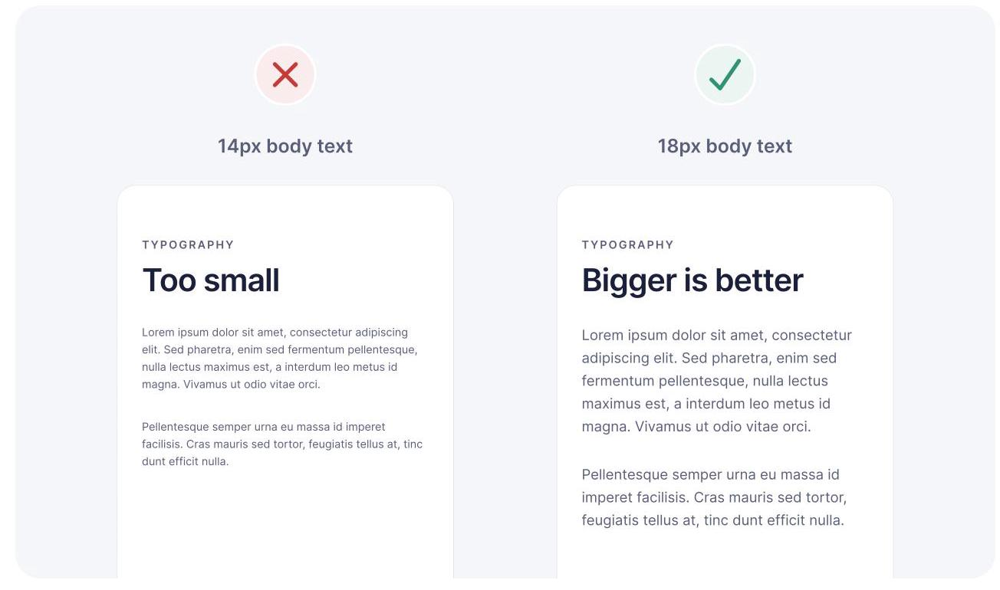

## Use at least 1.5 line height for long body text

Line height is the vertical distance between two lines of text. For accessibility and readability, especially for long body text, ensure that line height is at least 1.5 (150%). Keeping line height between 1.5 and 2 generally works well.

The white space between lines helps prevent people from rereading the same line of text. It also looks and feels more comfortable to read.

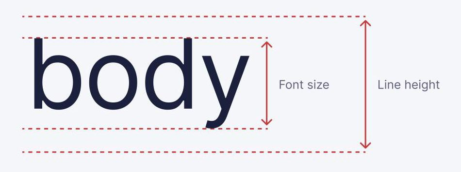

Some quick tips to set a suitable line height:

- Longer lines of text require a taller line height to help separate them.

- Darker and heavier typefaces require a taller line height to help lighten and separate lines of text.

- Some typefaces look larger than others, even though they're the same font size. Typefaces that look larger require a taller line height. In the following example, a line height of 1 (100%) is difficult to read because the lines of text aren't clearly separated. Increasing the line height to 1.6 (160%) clearly separates each line. This makes it easier for people to track from the end of one line to the start of the next.

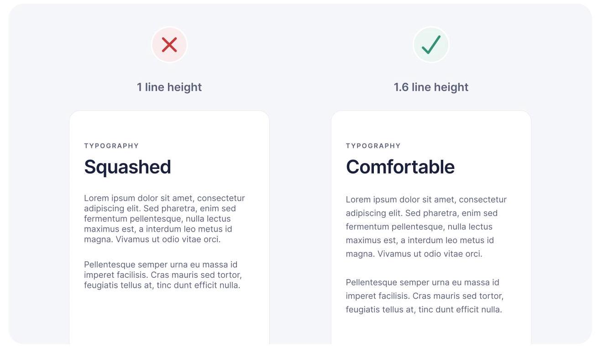

## Decrease line height as font size increases

The purpose of the spacing between lines is to help people read from one line to the next, comfortably. While a line height of at least 1.5 (150%) works well for body text, it's unnecessary on larger sized text such as headings. The larger the font size, the smaller the line height should be, to maintain comfortable spacing.

In the following example, the line height of both the heading and paragraph text is 1.6 (160%). Because line height is relative to font size, the actual space between lines of heading text is much larger than the space between lines of paragraph text. Decrease the line height for larger text to create a consistent gap between lines.

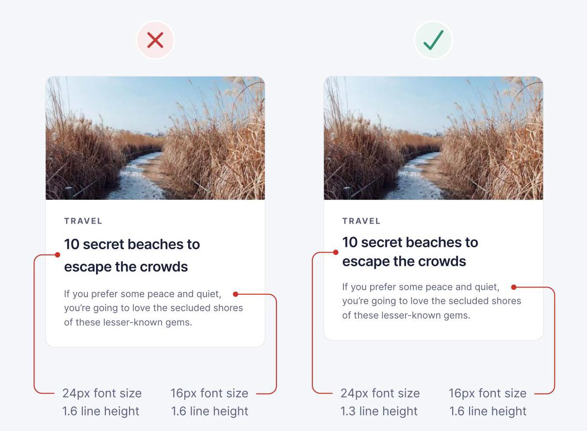

## Ensure ideal line length

Ensure text is 40 - 80 characters per line (including spaces) to improve readability. If lines are too long, it makes it harder for people to gauge where the line starts and ends.

If lines are too short, your eyes get stressed from having to travel back too often. A comfortable line length is especially important for long body text.

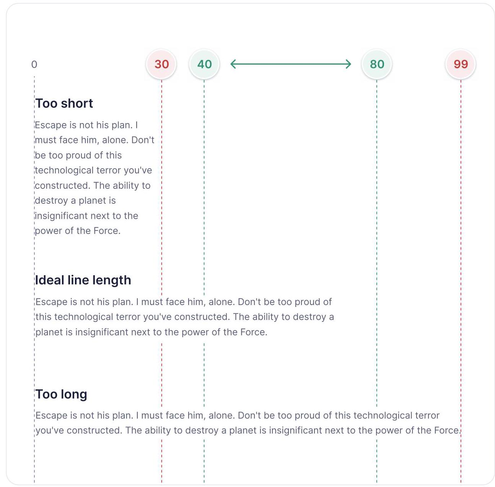

Uncomfortably long line lengths are very common, like in the following landing page example.

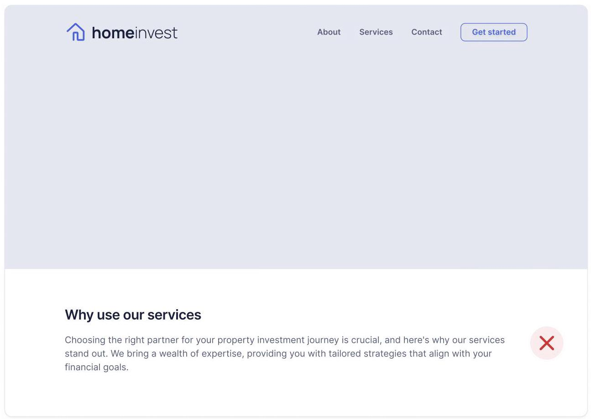

Example of an uncomfortably long line length

You don't need to use the full width of the page for your text, as it hinders readability. Instead, keep your line length between the recommended character range and align your block of text to the left or centre of the page.

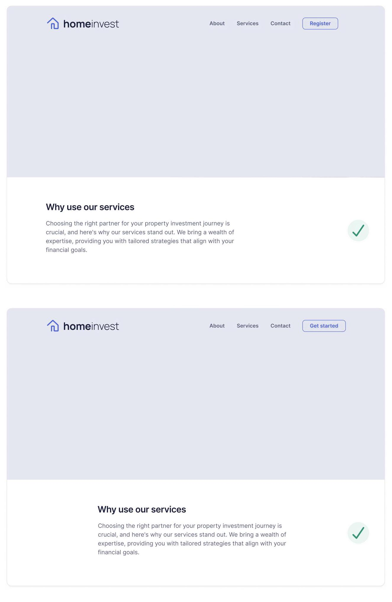

## Left align text

English is read from left to right, downwards in an F-shaped pattern. So it's best to keep text left aligned for optimal readability. For long body text, it's safest to avoid centre aligned or justified text. It's more difficult to read, especially for those with cognitive disabilities.

Also, avoid combinations of different text alignments. It's harder for your eyes to follow and can look messy.

## Don't centre align long body text

Centre alignment can work for headings and short text, as it can be quickly read. However, centre alignment makes longer body text harder to read, because the starting point of each line changes. Your eyes need to work harder to find the starting point of each line.

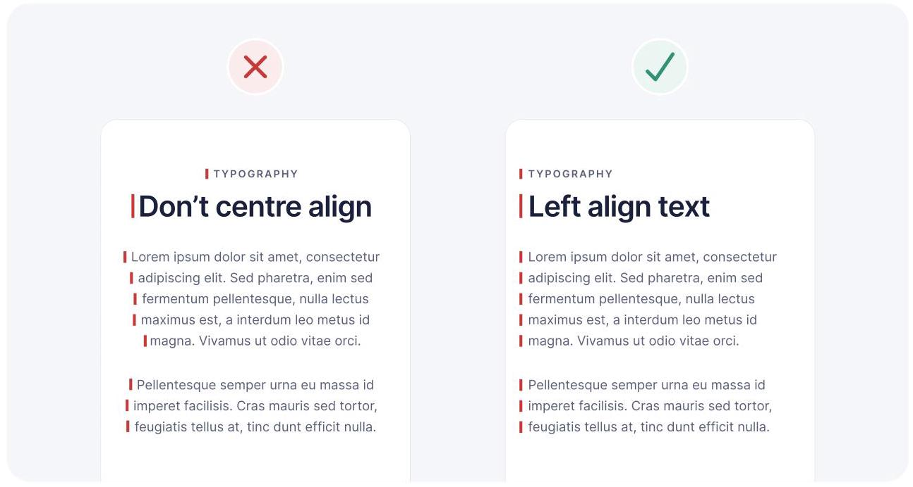

Example of centre aligned versus left aligned text

## Don’t justify long body text

Books often justify text for aesthetics, ironically making them harder to read. The variations in letter and word spacing make it harder for your eyes to distinguish text and follow lines (especially for those with cognitive impairments like dyslexia).

The variations in spacing also create distracting "rivers" of white space, highlighted in the following example.

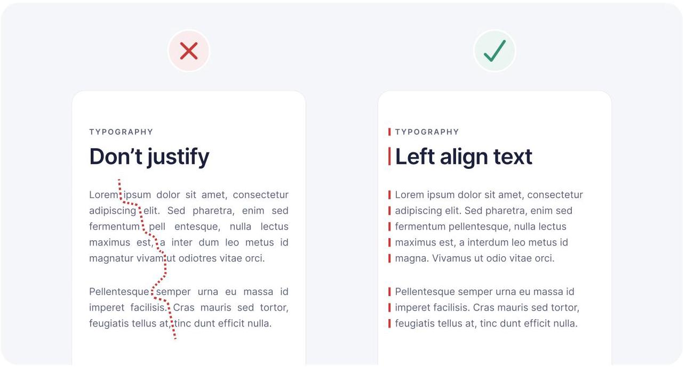

Example of justified versus left aligned text

Left aligned text is the easiest to read. Each line starts along the same left edge, giving your eyes a consistent anchor to quickly jump back to at the end of the line.

## Decrease letter spacing for large text

A small trick to make large headings look better is to decrease their letter spacing (space between letters). How much you decrease letter spacing depends on the typeface and size, but generally, you'll want to decrease letter spacing more as text gets bigger.

This is because many typefaces were designed to be read at small sizes in long body text. They're known as "text type" typefaces and have wide letter spacing to make them more legible at small sizes. You probably won't need to decrease letter spacing for "display type" typefaces, as they were designed to be used at large sizes and generally have closer letter spacing.

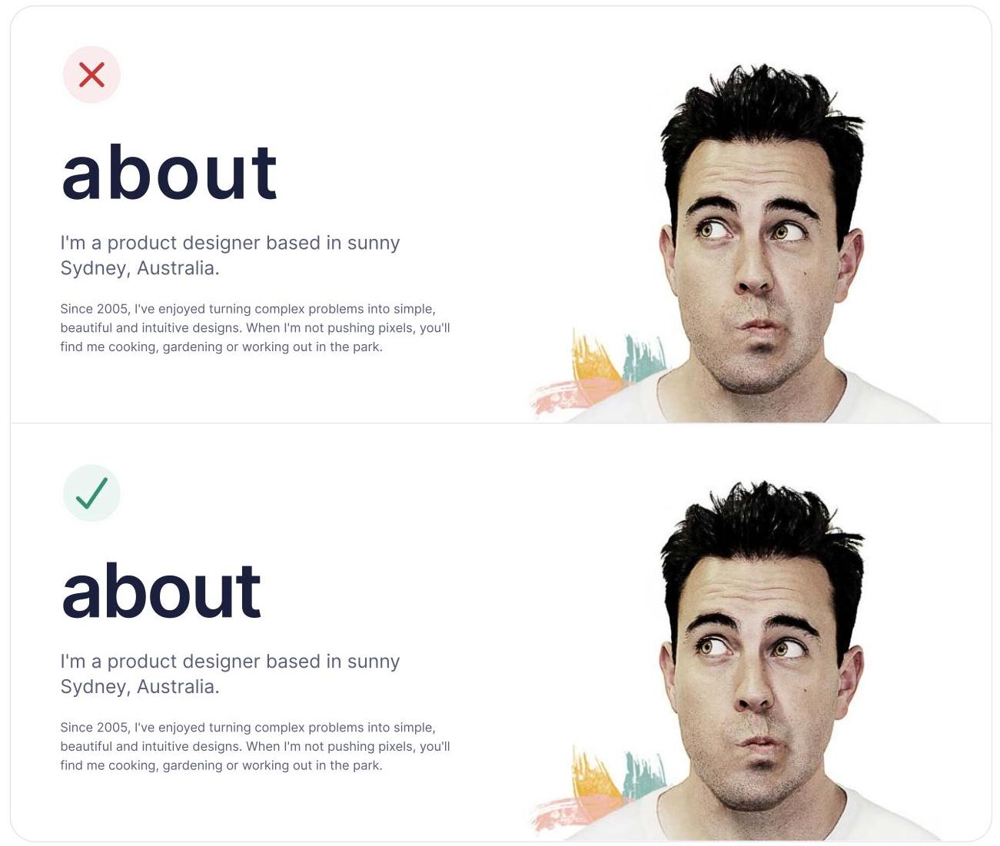

Example of a heading with regular letter spacing versus one with decreased letter spacing

## Ensure text on photos is legible

Placing text directly on photos is a very common design mistake. Depending on the photo, this can make text illegible, especially to people with low vision. Ensure the contrast ratio of text placed on photos meets WCAG 2.1 level AA accessibility requirements:

- Small text (18px and under) should have a contrast ratio of at least 4.5:1.

- Large text (above 18px with bold weight or above 24px with regular weight) should have a contrast ratio of at least 3:1.

In the following example, white text is placed directly on the photo making it difficult to read.

Example of illegible white text placed directly on a photo

Here are some simple options you can use to ensure your text is always accessible on photos.

## Add a linear gradient overlay

In the following example, a linear gradient overlay is placed behind text to achieve sufficient contrast. The gradient starts with a dark grey colour at 90% opacity at the bottom of the photo and ends with 0% opacity halfway up the photo. A text shadow further increases the text contrast.

Example of a linear gradient overlay placed on top of a photo to improve text legibility

## Add a semi-transparent overlay

In the following example, a dark grey overlay with \( {50}\% \) opacity is placed on top of the photo to achieve sufficient contrast. Again, a text shadow further increases the text contrast.

Example of a semi-transparent overlay placed on top of a photo to improve text legibility

## Add a blurred semi-transparent overlay

You could also add a blur to the semi-transparent overlay to make the text easier to read.

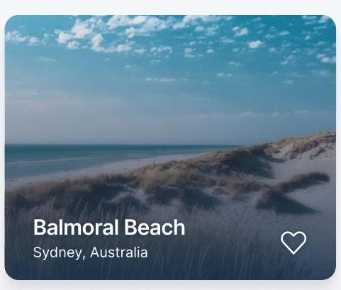

Example of a blurred semi-transparent overlay placed on top of a photo to improve text legibility

## Apply a solid text background

A popular approach for video captions is to apply a solid background behind text to ensure text has sufficient contrast. Try using white text on a dark grey background.

Example of a solid background applied behind text to improve legibility on photos

## Avoid light grey and pure black text

Designers tend to be drawn to light grey text, as it can look soft and minimal. However, this poses an accessibility issue, as many people either can't read it or find it difficult to do so. Always aim for text to have at least a 4.5:1 contrast ratio to meet WCAG 2.1 level AA accessibility requirements.

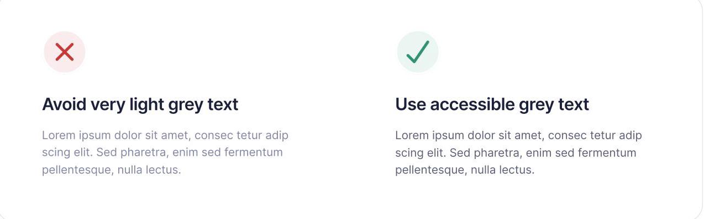

Example of inaccessible light grey text versus accessible dark grey text

You also need to avoid contrast that's too high, as it can cause eye strain and fatigue. Black has \( 0\% \) colour brightness and white has \( {100}\% \) colour brightness. The large difference in colour brightness causes our eyes to work harder. So it's safest to avoid pure black text on a white background and opt for an accessible dark grey instead.

## Avoid pure black text

Lorem ipsum dolor sit amet, consec tetur adip scing elit. Sed pharetra, enim sed fermentum pellentesque, nulla lectus.

Example of pure black text versus accessible dark grey text

## Use accessible grey text

Lorem ipsum dolor sit amet, consec tetur adip scing elit. Sed pharetra, enim sed fermentum pellentesque, nulla lectus.

TUTORIAL - TYPOGRAPHY

# Apply what you've just learned

Let's apply some of the guidelines you've learned

to continue improving the fitness app example.

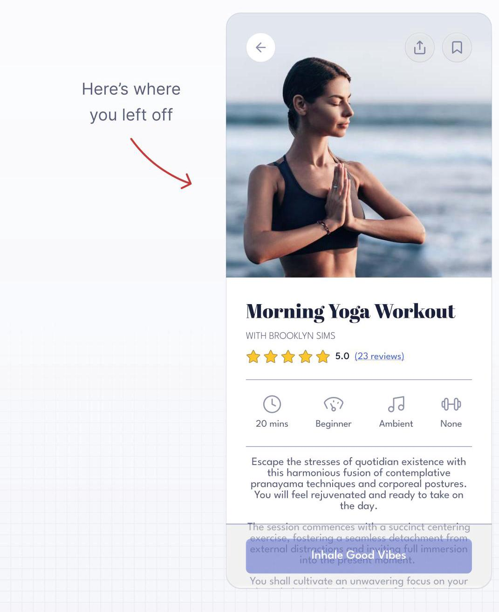

## Use a single sans serif typeface

It's safest to use a single sans serif typeface for interface design, as they're generally the most legible, neutral, and simple.

In the fitness app example, the heading uses a detailed serif typeface that's a bit difficult to read and could be distracting for some. It also has a personality that might not match some content in the app. Simplifying the heading to a sans serif typeface can help improve usability and aesthetics. Let's change the heading to match the typeface used elsewhere on the interface. Now we have a single sans serif typeface, but is it the most suitable option?

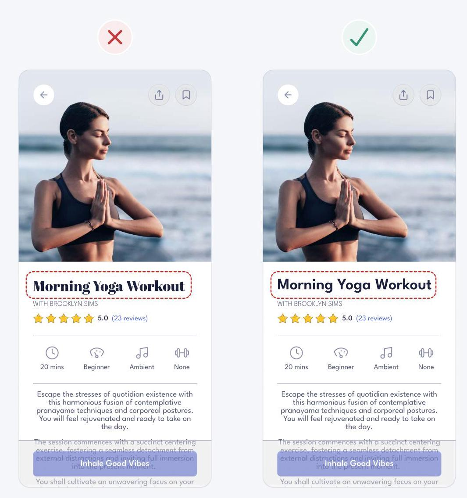

## Use a typeface with taller lower case letters

Look for typefaces with taller lower case letters and greater letter spacing, as they're generally more legible at small sizes. The height of lowercase letters in a typeface is known as the x-height.

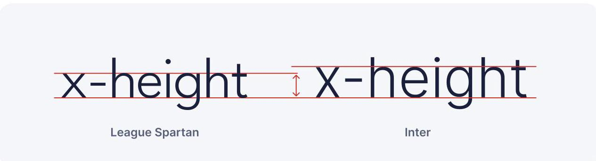

Comparison of the x-height of League Spartan and Inter typefaces

The fitness app example uses the League Spartan typeface, which has a relatively low x-height. Changing the typeface to one with a larger x-height, like Inter, helps to improve readability.

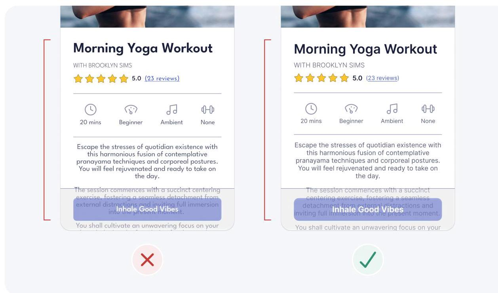

Typeface is changed to one with a larger x-height

## Use regular and bold font weights only

In the fitness app example, the text for the instructor's name uses a light font weight. You've already increased the colour contrast above the required 4.5:1 contrast ratio, but the thin characters could still be difficult for some people to read, especially at a small size. Increasing the font weight to regular helps improve readability and simplifies the design.

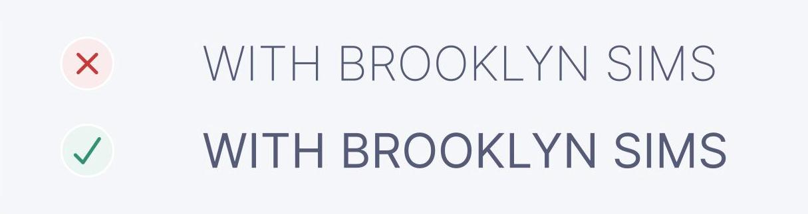

Comparison of light and regular font weights

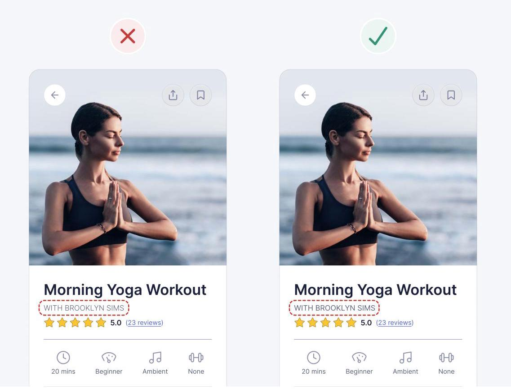

Light font weight is increased to regular to improve legibility

## Left align text

In the fitness app example, the block of body text is centre aligned. Left aligning the text improves readability and is also consistent with the left aligned text that sits above it.

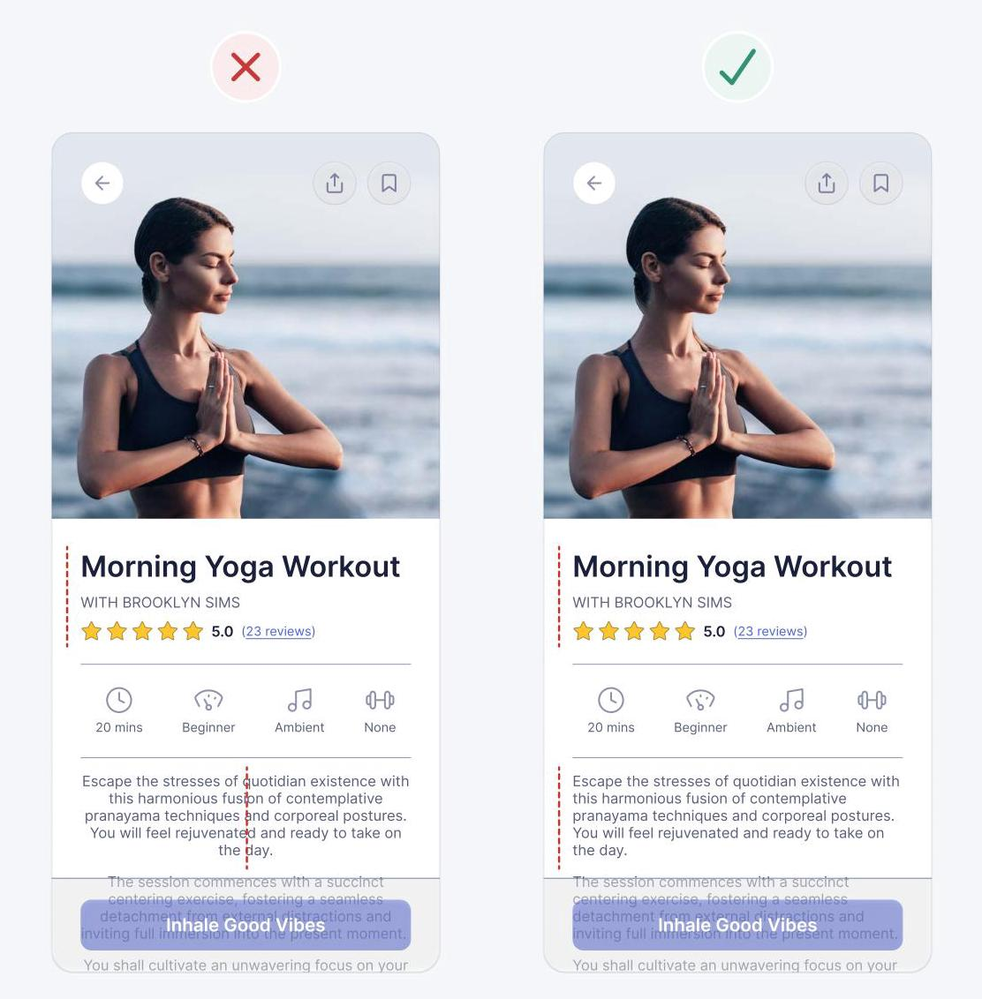

All text is left aligned to improve readability and consistency

## Use at least 1.5 line height for body text

In the fitness app example, the line height of the block of body text is only 1 (100%). Increasing it to 1.5 (150%) helps to improve readability.

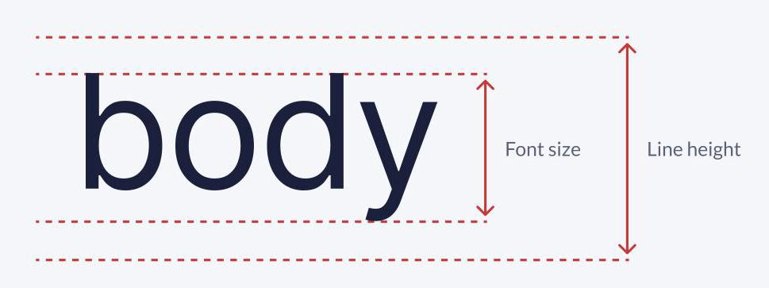

Line height is the vertical distance between two lines of text

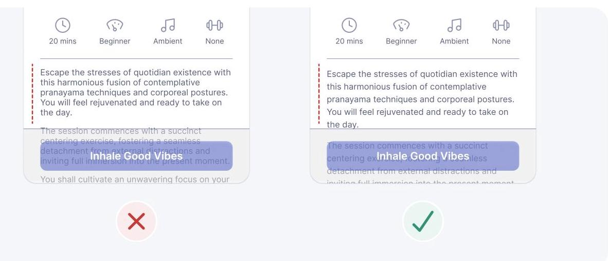

Line height is increased from 1 to 1.5 to improve readability

Nice one. We're nearly there. Our example fitness app is looking much better after applying a few logical guidelines. How text looks can make a big difference to your interface designs, but so can the words themselves. We'll look at the words in the next chapter.

## Chapter summary

✓ Limit typography styles to regular and bold font weights in a single sans serif typeface to improve legibility, neutrality, and simplicity.

✓ Use a type scale to create a small set of predefined font sizes that work well together.

✓ Use a line height of at least 1.5 for long body text to improve readability. Decrease line height as font size increases.

✓ Ensure text is 40 - 80 characters per line (including spaces) to improve readability. If lines are too long, it makes it harder for people to gauge where the line starts and ends.

✓ Left align text for optimal readability, as English is read from left to right, downwards in an F-shaped pattern. Your progress 5 of 8 chapters completed

Fundamentals

- Less is more Colour Layout and spacing Typography

6 Copywriting

Buttons