<!-- auto-toc:start -->
## Contents

- CHAPTER 6 Copywriting
- Be concise
- Use sentence case
- Use plain and simple language
- Front-load text
- Use the inverted pyramid
- Limit the use of abbreviations and acronyms
- Limit the use of UPPERCASE
- Make sure headings are descriptive
- Avoid using "my" on form labels
- Use vocabulary consistently
- Use numerals for numbers
- Avoid full stops if possible
- Ensure text length is similar across similar interface elements
- Ensure text links describe their destination
- Using "click here" for text links is another common mistake:
- Write clear error messages
- Limit the use of uppercase
- Chapter summary

<!-- auto-toc:end -->

## CHAPTER 6 Copywriting

Practical guidelines on how to write interface text

that clearly communicates with people

## Be concise

Every element of your interface should earn its place, especially the words. Ironically, more words don't necessarily result in more effective communication, as people often won't read large chunks of text.

Our attention spans are shorter than ever, so aim to say more, with fewer words. If a word can be removed without losing information or negatively affecting usability, remove it. Being concise makes your content faster and easier to understand.

In the following dialog box example, unnecessary words are removed to make it quicker and easier to understand.

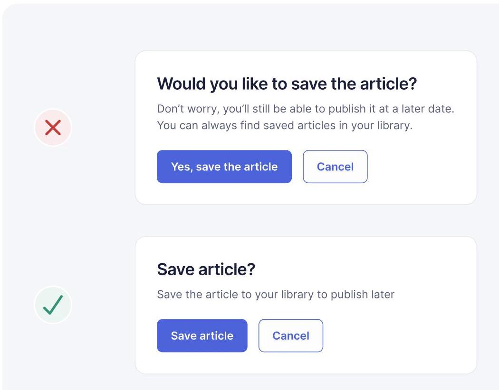

Example of unnecessary text versus concise text

Some guidelines on how to be concise:

- Avoid unneeded words like: "actually", "basically", "really", "truthfully", and "quite".

- Avoid short joining words like: "a", "an", and "the".

- Avoid introductory phrases like: "would you like to", "in order to", "when it comes to", "are you sure", "there are" and "it is".

- Use shorter words instead of longer ones if they convey the same message.

- Try to keep sentences under 20 words. People can lose focus when reading long sentences with a lot of commas.

## Use sentence case

Sentence case is where only the first word and proper nouns (names of people, places or things) are capitalised. For example, "This is sentence case". It's super simple, easy to read, and grammatically correct.

Another popular capitalisation style is title case. All words are capitalised except for minor words, unless they're the first or last word of the title. For example, "This Is Title Case".

Title case is commonly used for book and article titles, but it's often misused as its complex rules aren't universally standardised. Title case is also harder to read, as the capital letters of each word interrupt scanning. Our minds are expecting a lower case letter, so an uppercase letter confuses us. This unnecessarily increases cognitive load.

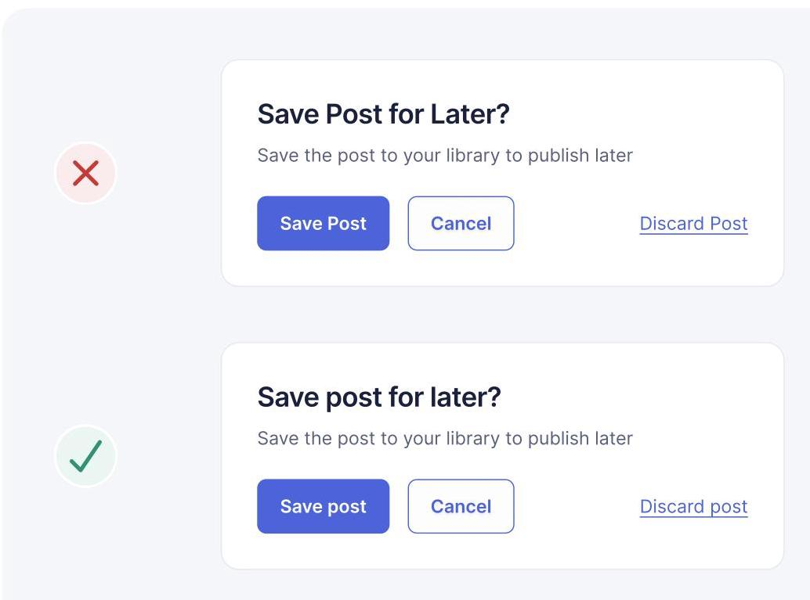

Example of title case versus sentence case

## Use plain and simple language

Many people have trouble reading and some may have mental disabilities. Keep your language simple and conversational to make it easier for a broader range of people to understand. Here are some quick tips:

- Imagine that you're having a conversation with a 6th grade student who's unfamiliar with the topic.

- Avoid jargon (specialised or technical language that's only understood by particular groups of people).

- Avoid slang (very informal language used between people in the same social group).

- Choose short, simple words over long and complex ones.

- Use shortened words to sound more natural: who's, they're, you're.

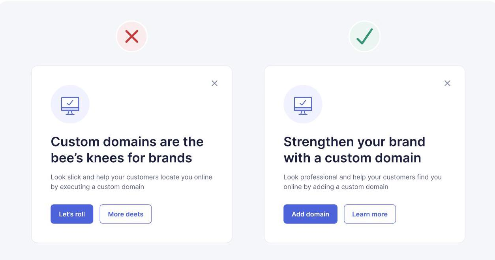

Example of complex versus simple language

## Front-load text

Front-loading is putting the important information at the start of your text. People quickly scan text down the page from left to right. Putting the key information or benefit at the front of your headings, lists, and links makes it faster and easier for people to gain value from your text.

The following examples aren't front-loaded. Key information, highlighted in bold, is at the end of each sentence:

- Subscribe to my newsletter to learn UI design.

- Sign up today for 30% off.

- You should read these 5 UI design eBooks.

The same examples were rewritten to be front-loaded. Key information, highlighted in bold, is at the start of each sentence:

- Learn UI design by subscribing to my newsletter.

- 30% off if you sign up today.

- 5 UI design eBooks you should read.

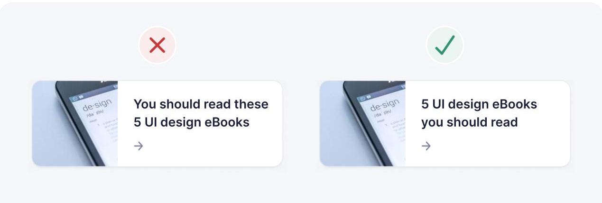

Example of text without and with front-loading

## Use the inverted pyramid

The inverted pyramid is a writing structure where the most important information is placed at the start, followed by supporting information and then smaller background details. It's a similar concept to front-loading text but it applies to larger pieces of text.

The inverted pyramid writing structure is popular in journalism and is also very effective for interface text for the following reasons:

- It gets to the point quickly, helping people understand information and make decisions faster.

- People who quickly skim the first sentence will still get the main point.

- Additional information is there for those who need it.

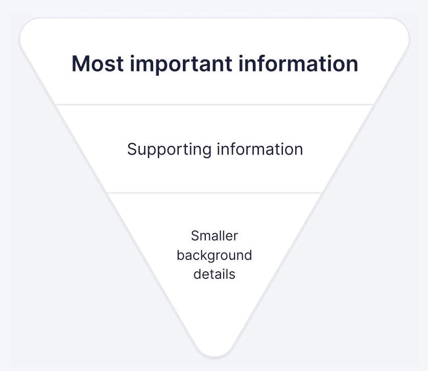

The inverted pyramid writing structure

Here's an example of the inverted pyramid:

- The most important information is contained in the heading to allow most people to complete the task without reading any other information.

- Supporting information is displayed under the heading for those who need a bit more detail.

- Smaller background details are moved to a separate screen as they're less important and could add unnecessary complexity. Example of the inverted pyramid in use

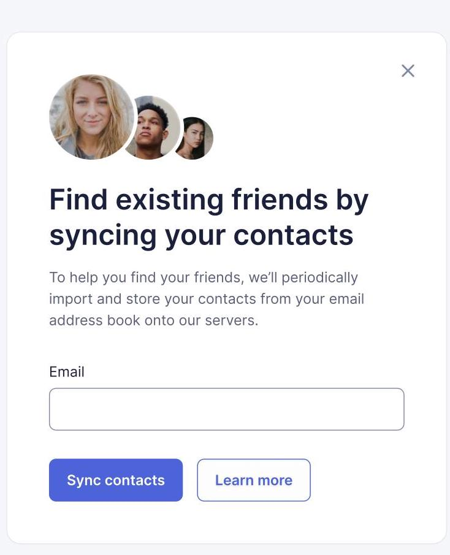

## Limit the use of abbreviations and acronyms

An abbreviation is a shortened form of a word or phrase. For example, the word "department" can be abbreviated to "dept." to shorten it. An acronym is a common type of abbreviation formed from the initial letters of words. For example, "COB" stands for "close of business".

Abbreviations can save space, but they make people think, which increases cognitive load. Limit the use of abbreviations to improve readability and reduce confusion. If you do use them, explain what they are initially.

"The ETA of the dept. manager is COB tomorrow", could be unclear to some people. Instead, explain the acronyms when they're first used, to make it clearer: "The ETA (estimated time of arrival) of the dept. manager is COB (close of business) tomorrow".

Simplify it further by removing all abbreviations: "The estimated time of arrival of the department manager is close of business tomorrow". The sentence is longer, but it's clearer and faster for people to understand.

In the following form field example, avoiding abbreviations makes it clearer.

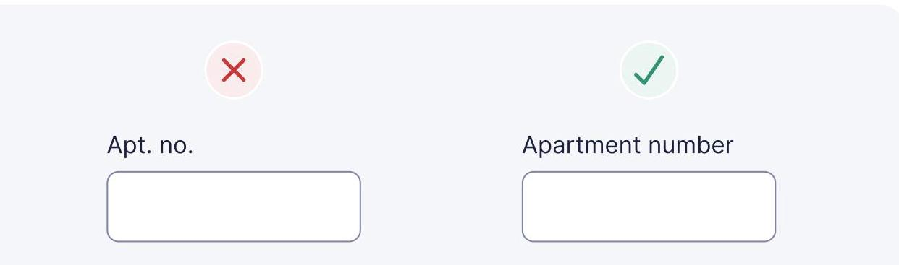

Example of a form field label with and without abbreviations

## Limit the use of UPPERCASE

Unless you're shouting at people, there aren't many valid reasons to use uppercase. IT'S LOUD AND DIFFICULT TO READ. When you read, you look at the shape of a word, rather than looking at each letter. The shape helps you recognise the word more quickly. Uppercase words all have the same rectangular shape. This forces you to read each letter one by one.

SHAPE

That being said, you can use uppercase for short labels to help visually differentiate them from other text. Use uppercase in bold weight at a small size and increase the letter spacing. This makes it less loud and more legible.

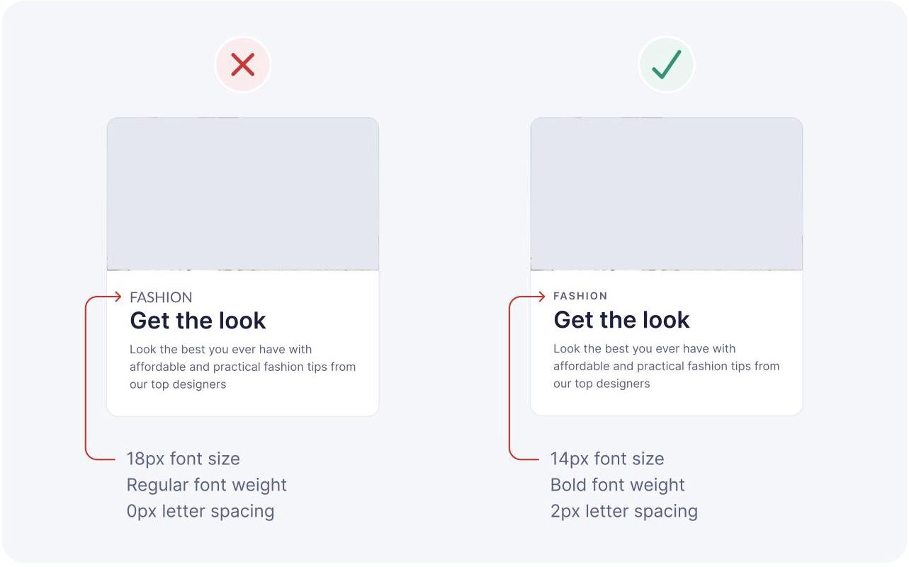

# Break up content using descriptive headings and bullets

Break up large pieces of information into multiple smaller ones. This makes it easier and faster for people to understand.

Highlight key information using descriptive headings. This allows people to quickly scan information and get a better idea of the structure and organisation of content.

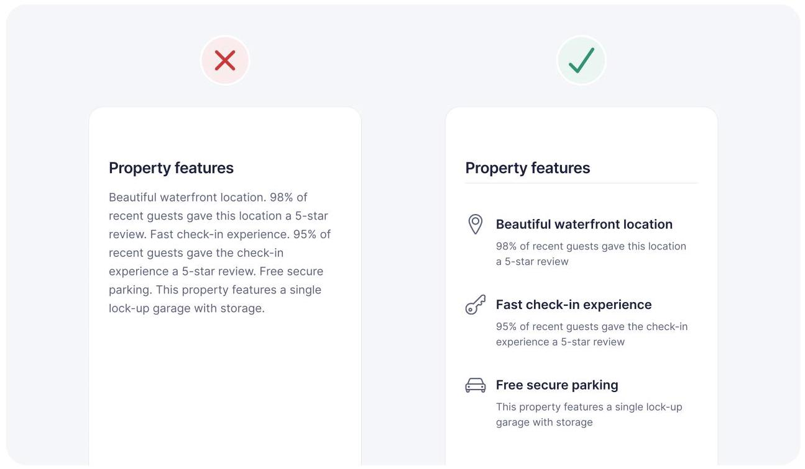

Example of content being broken up into separate groups with descriptive headings

## Make sure headings are descriptive

It's important to ensure headings are descriptive and convey key points for the following reasons:

- Many people quickly scan information and may not read supporting text as it takes more effort.

- Headings need to make sense when read out of context by those using screen readers. Screen reader users often listen to a list of all headings on a page and quickly skip to the information they're after.

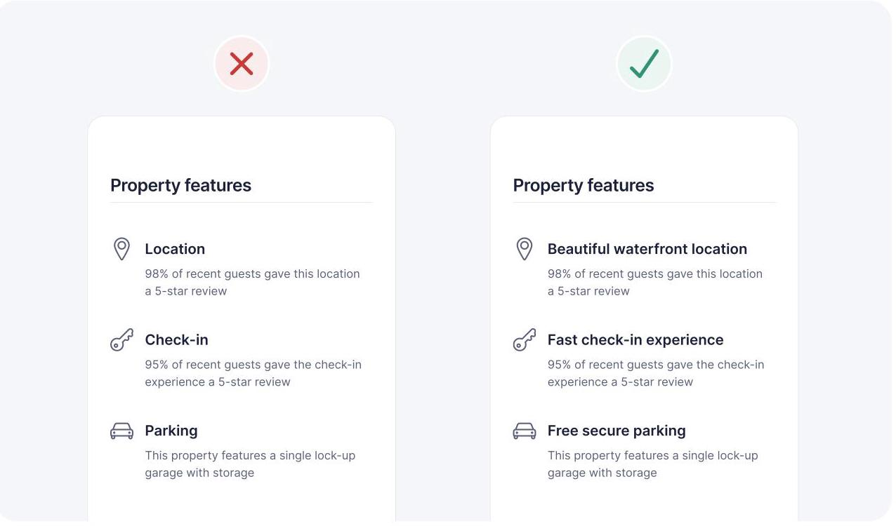

Example of vague versus descriptive headings

## Avoid using "my" on form labels

Avoid using the word "my" on form labels as it can be confusing. Think of the interface as a person who's talking to the user. An input field labelled "my email address", refers to the interface's email address, rather than the user's.

Using "your" is clearer, but unnecessary in most cases. Keep it simple and avoid using either "my" or "your" if possible. Being concise will also help declutter the interface.

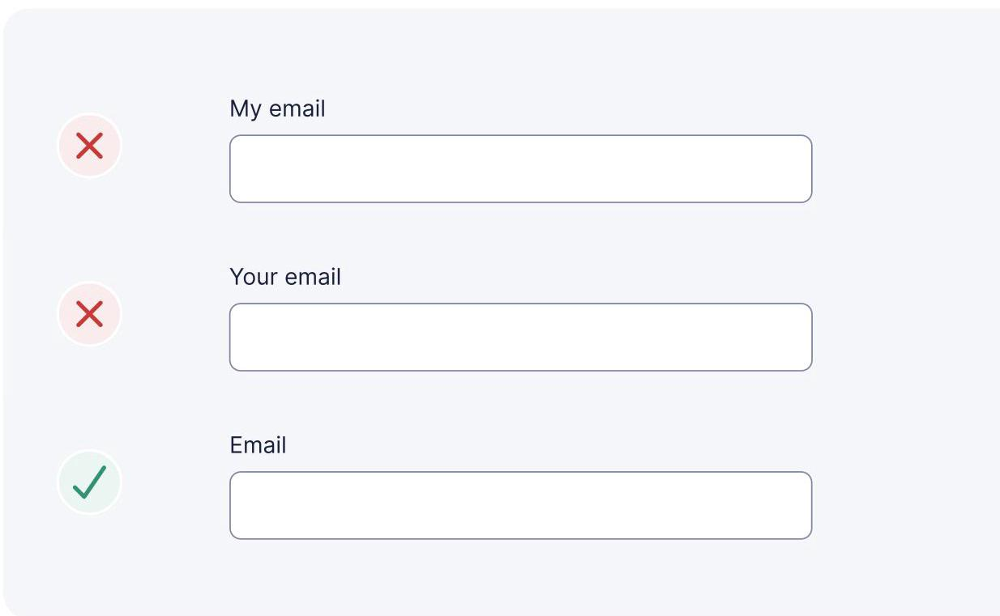

Avoid using "my" or "your" on form labels

It can be even more confusing if you use both "my" and "your" throughout an interface, so always try to be consistent.

## Use vocabulary consistently

Similar interface elements should look and work similarly to reduce confusion. The same goes for words. Use the same word consistently to describe the same interface element.

For example, if the primary button on your product page is labelled "add to cart", and your cart is labelled "bag", this can cause confusion.

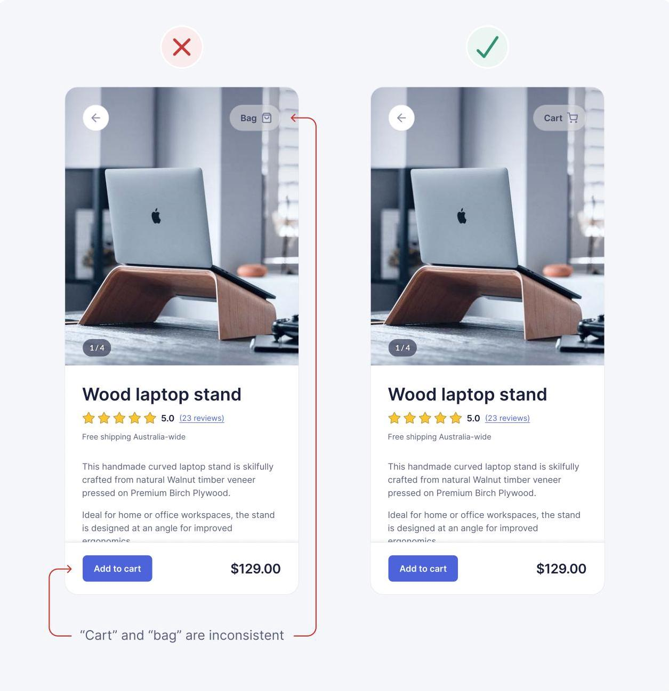

Some common examples of inconsistent vocabulary on interfaces:

- Publish / post

- Sign up / register

- Log in / sign in

- Delete / remove

- Subscribe / join

"Register" and "Sign up" are used inconsistently in the following landing page example. This can cause confusion.

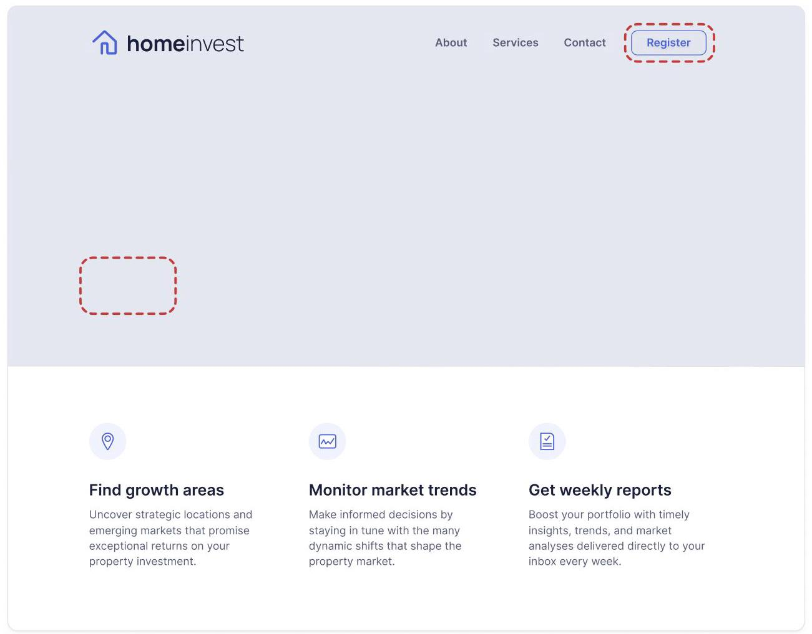

Example of inconsistent use of vocabulary

## Use numerals for numbers

Use numerals for numbers, rather than spelling them out as text. For example, use 245 rather than "two hundred and forty five". This has the following advantages:

- Numerals are easier to scan as they have a different shape to letters.

- Numerals are quicker for people to read and understand.

- If people are looking for a numerical fact or figure, they'll naturally expect it to be in numerical format.

- Writing numbers as numerals is much more concise.

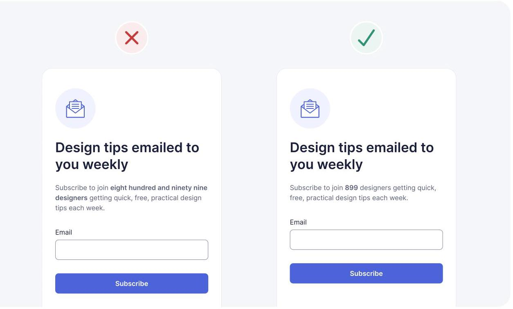

Example of numbers being written as words versus numerals

Make sure that you format numerals consistently and use commas to help break them up. For example, write 1,000, not 1000.

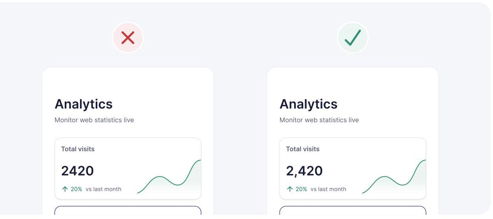

Example of a comma being used to break up numerals

For very large numbers, consider simplifying them by using a combination of numerals and letters. For example, write 1 billion, not 1,000,000,000. This avoids people having to count how many numbers there are, and decreases cognitive load.

## Avoid full stops if possible

Most user interface text should be short enough that commas and full stops (periods) aren't needed. Don't add full stops unless the piece of text forms a full sentence with commas.

Full stops are a tiny detail, but removing them when they're not needed can help simplify your interface design.

If you have multiple similar interface elements next to each other, make sure you use full stops consistently across them.

In the following example, full stops are used inconsistently. Since there aren't any commas used, it's neater to avoid using full stops.

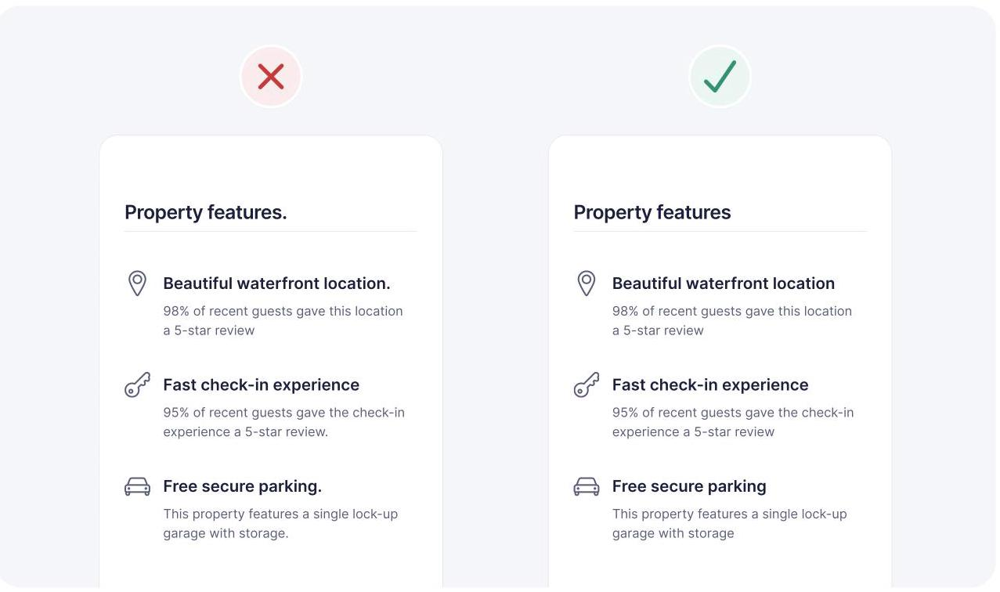

Example demonstrating inconsistent use of full stops

## Ensure text length is similar across similar interface elements

If you have multiple blocks of text aligned in a row, try to ensure that they're the same length. The more interface elements we can align with each other, the more organised and simple an interface will look. This makes it faster and easier for people to understand.

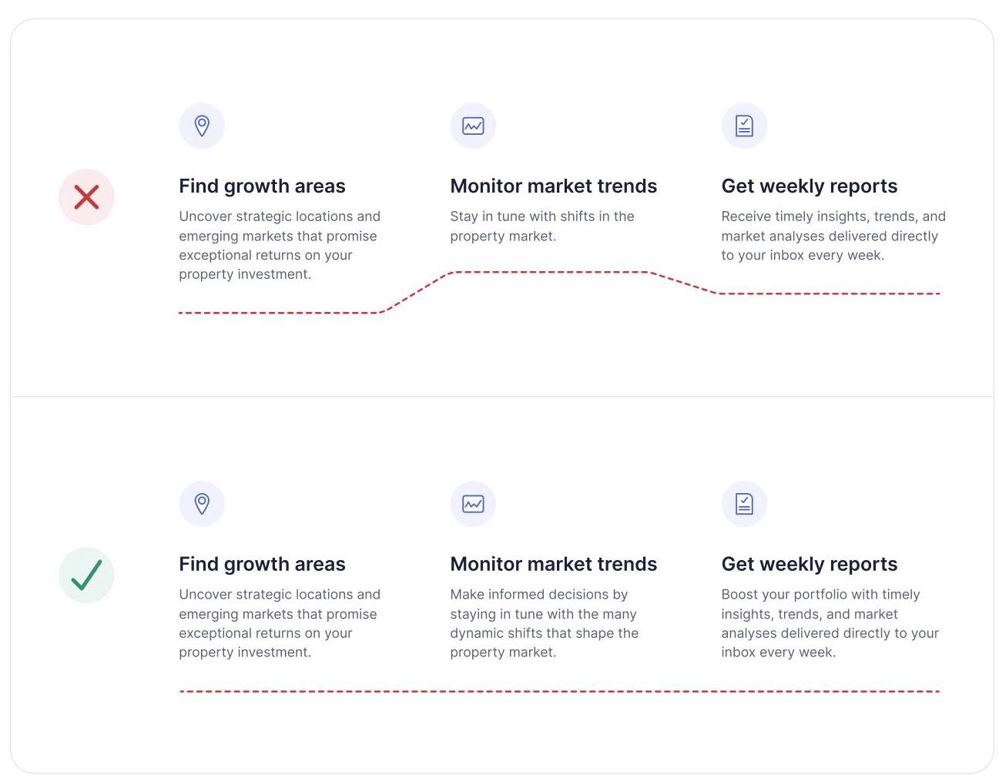

Example of different text lengths aligned in a row

## Ensure text links describe their destination

The purpose of a text link is to take you to another page or a different part of the same page. Text links need to describe where they'll take you when actioned. Using generic text like "learn more", "read more", or "click here" for text links can be problematic for the following reasons:

- It's more difficult to scan a page with links that aren't descriptive, as you're forced to read the surrounding text to gain context. This is even harder for non-sighted people using screen readers.

- Those using screen readers often listen to a list of all text links on a page to help them quickly skip to the information they're after. If links aren't descriptive, they won't make sense when read out of context in a list.

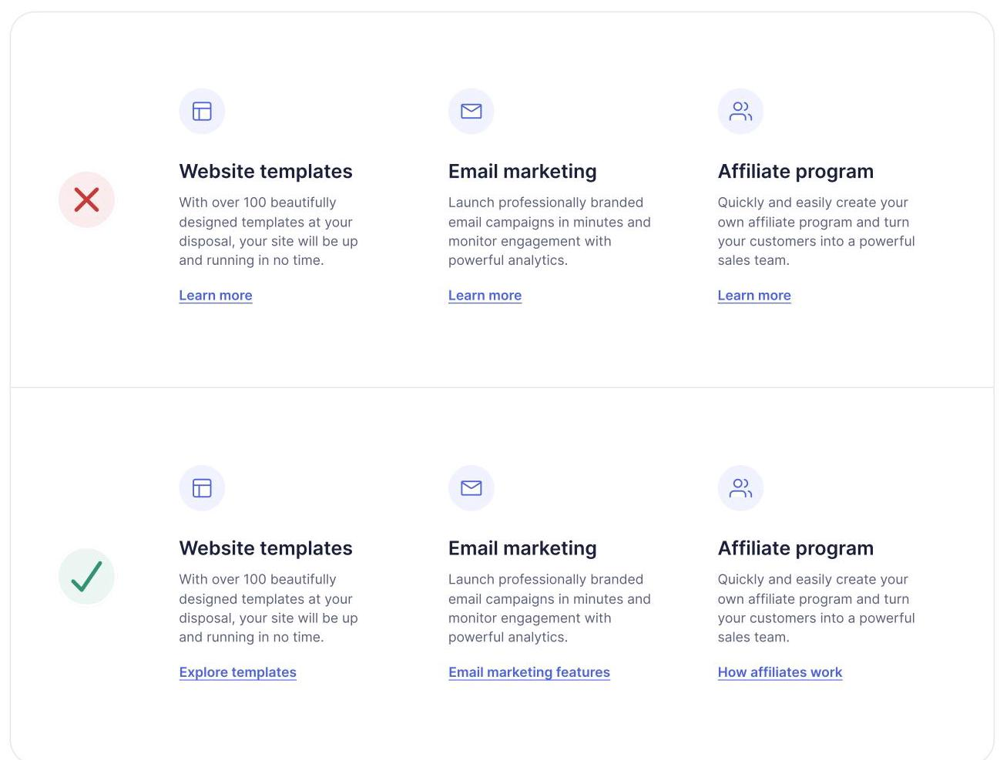

Example of generic text links versus descriptive text links

Some could mistakenly think the 3 "learn more" links, in the previous example, all link to the same page. Another option is to remove the "learn more" link and simply turn the heading into a link.

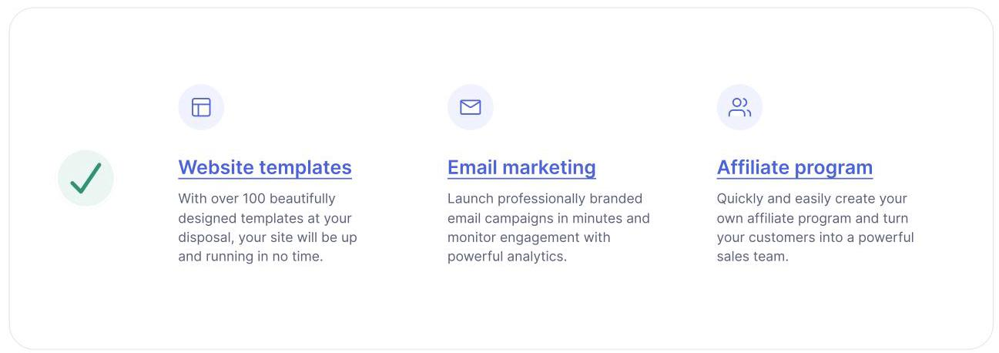

Example of headings as links

## Using "click here" for text links is another common mistake:

- It's inaccessible and difficult to scan.

- It's unnecessary to tell people how to use a link, as most already know that links can be actioned (make sure links look different to other text).

- "Click" is also inaccurate for those not using a mouse. They might be using a mobile phone, keyboard, or voice recognition.

Avoid using "click here" for text links. Instead, use the name of the destination page.

Example of text link using "click here" versus the name of the destination page

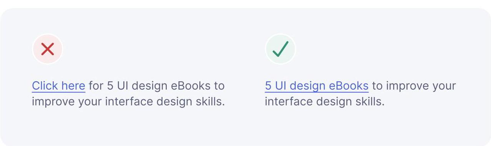

## Write clear error messages

Error messages should let people know that a problem occurred, why it happened, and provide a solution to fix it and move forward.

Quick tips to keep in mind when writing error messages:

- Never blame the user. Always be positive and helpful.

- Be concise and avoid unnecessary words like "please", "sorry" and "oops".

- Don't talk like a robot, keep language clear and conversational, and avoid technical jargon.

- Make headings and buttons descriptive, so people don't need to read supporting text.

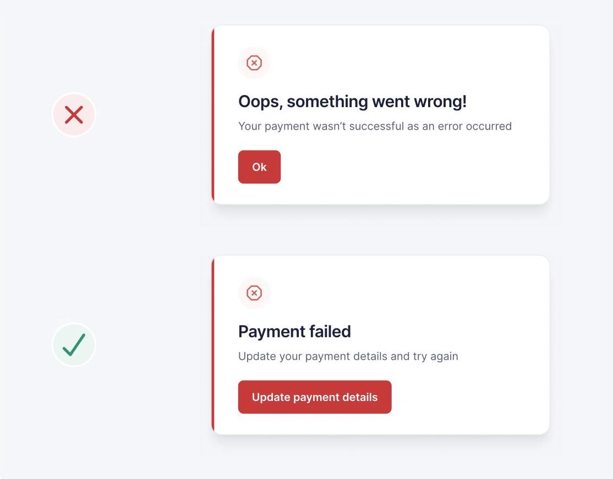

Unclear versus clear error message

TUTORIAL - COPYWRITING

# Apply what you've just learned

Let's apply some of the guidelines you've learned

to continue improving the fitness app example.

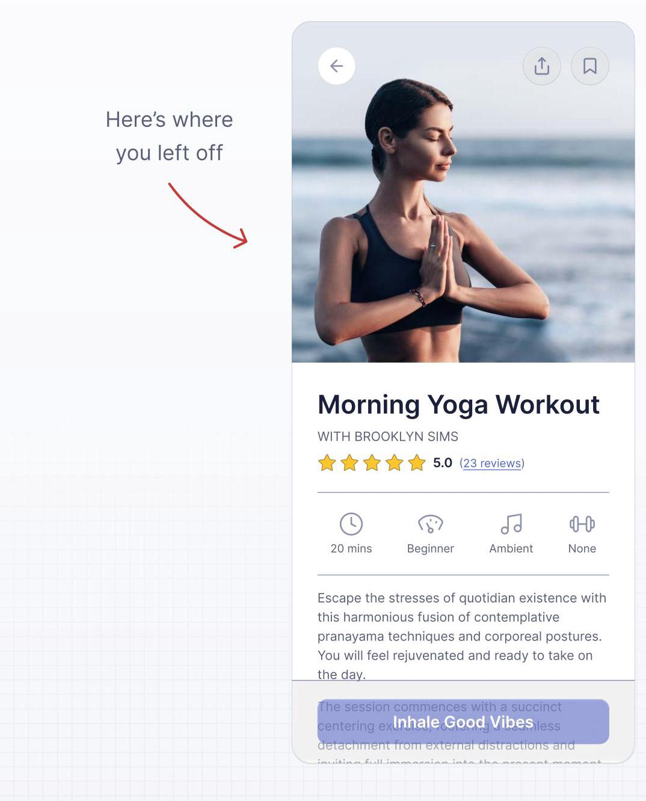

## Limit the use of uppercase

Unless you're shouting at people, there aren't many valid reasons to use uppercase. IT'S LOUD AND DIFFICULT TO READ. When you read, you look at the shape of a word, rather than looking at each letter. The shape helps you recognise the word more quickly. Uppercase words all have the same rectangular shape. This forces you to read each letter one by one.

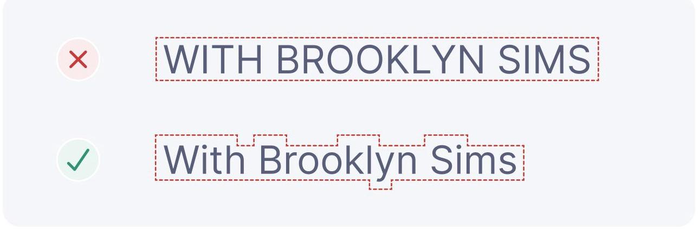

In the fitness app example, the instructor's name is in uppercase. Avoiding uppercase helps to improve readability.

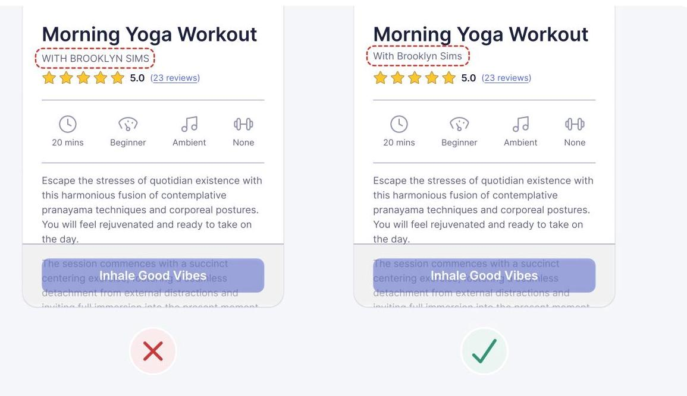

Uppercase is avoided for the instructor's name

## Use sentence case

In the fitness app example, the title of the workout and the button text are changed from title case to sentence case to improve readability.

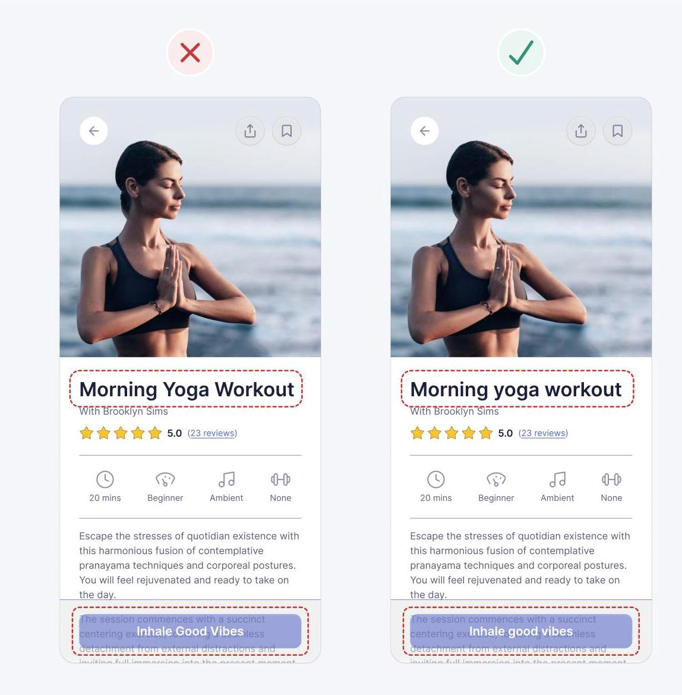

Text is changed from title case to sentence case to improve readability

## Use plain and simple language

Many people have trouble reading and some may have mental disabilities. Keep your language simple and conversational to make it easier for a broader range of people to understand.

The body text in the fitness app example is complex and difficult to read. The complex words and jargon have been underlined and simplified.

Escape the stresses of quotidian existence with this harmonious fusion of contemplative

- pranayama techniques and corporeal postures. You will feel rejuvenated and ready to take on the day.

Escape the stresses of everyday life with this ✓ balanced blend of mindful breathing techniques and physical postures. You'll feel refreshed and ready to take on the day.

KEY Complex Jargon Unnatural

Text is simplified to make it easier for more people to understand

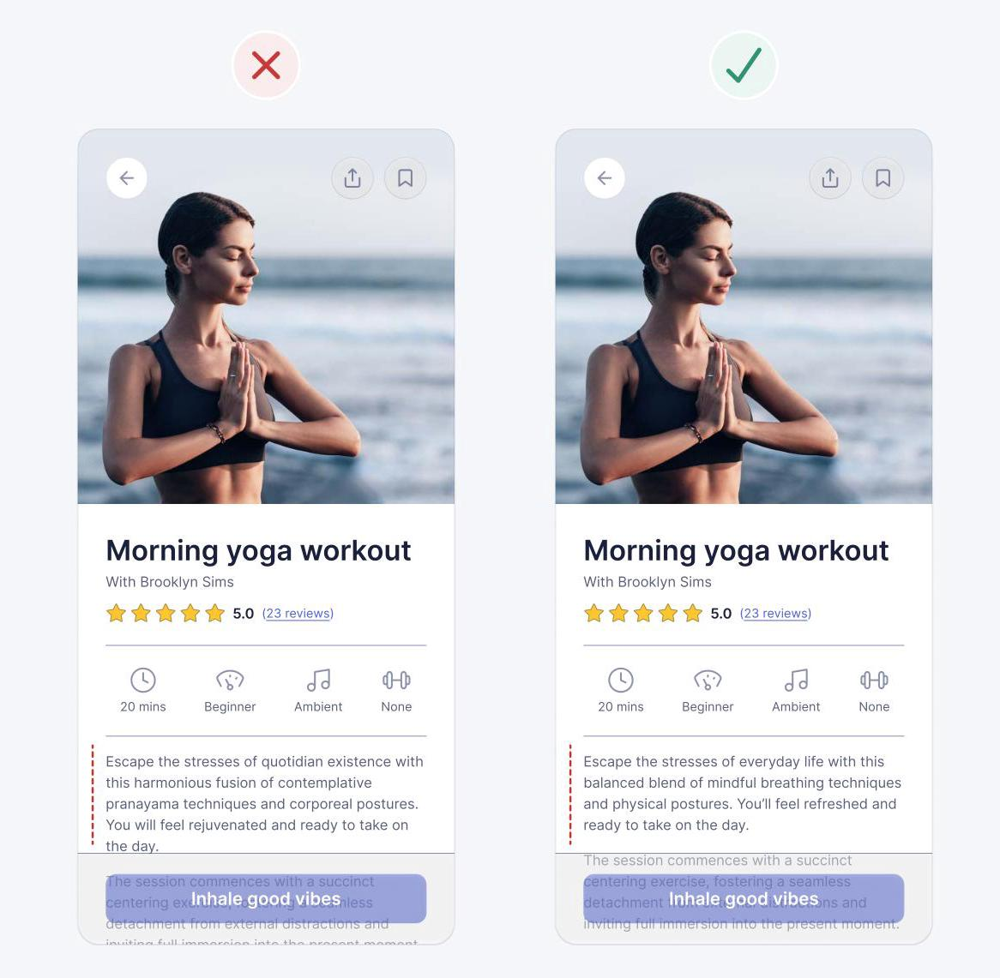

Complex language versus simple language

Looking good. You're nearly there. You've looked at colour, layout, typography, and copywriting. There's only one more improvement to make to the button in the next chapter.

## Chapter summary

✓ Be concise. Avoid unneeded words, use short words instead of long ones, and try to keep sentences under 20 words.

✓ Use sentence case where only the first word and proper nouns (names of people, places or things) are capitalised. Limit the use of uppercase, as it's loud and can be difficult to read.

✓ Avoid jargon, slang, abbreviations, and acronyms. Keep your language simple and conversational to make it easier for a broader range of people to understand.

✓ Front-load text by putting the most important information at the start of your text. This makes it faster and easier for people to scan.

✓ Break up large pieces of information into multiple smaller ones. Highlight key information using descriptive headings. This helps people get a better idea of the structure and organisation of content. Your progress 6 of 8 chapters completed

Fundamentals

- Less is more ✓ Colour

- Layout and spacing — Typography Copywriting Buttons