CHAPTER 7 Buttons

Learn how to design descriptive and accessible

buttons with a clear visual hierarchy

<!-- auto-toc:start -->
## Contents

- Define 3 button weights
- Common button design mistakes
- Example 1
- Example 3
- Example 5
- Example 7
- Example 8
- Button design guidelines
- Use secondary buttons for less important actions
- Use tertiary buttons for the least important actions
- Try to avoid disabled buttons
- Disabled buttons can be problematic for the following reasons:
- Enable buttons and validate on submit
- Remove unavailable actions
- Put a lock icon on unavailable actions
- Make disabled buttons more inclusive
- Register
- Left align buttons
- What about small dialog boxes?
- Reasons for left aligned buttons
- Reasons for right aligned buttons
- Left align buttons on multi-step forms
- Exceptions to the left aligned button guideline
- Ensure button text describes the action
- Ensure buttons have a sufficient target size
- Balance icon and text pairs
- Use a similar weight
- Use a similar size
- Vary the contrast
- Add friction to destructive actions
- Initial friction
- Light friction
- Moderate friction
- Heavy friction
- Allow people to undo destructive actions
- Apply what you've just learned
- Chapter summary

<!-- auto-toc:end -->

## Define 3 button weights

In most cases, you'll need 3 button weights to indicate the importance of actions: primary, secondary, and tertiary. You may also require smaller and/or larger button sizes depending on the complexity of the interface.

The following button styles are familiar, accessible, and have a clear visual hierarchy that isn't dependent on colour alone. They're not the only way to style buttons, but they're a safe option.

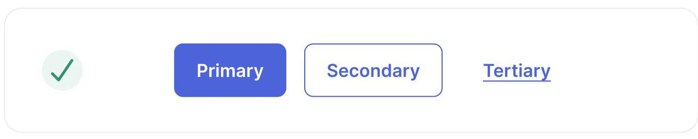

- Primary button - a rectangle with rounded corners, a solid fill of the brand colour, and white text. This is the most prominent button used to highlight the most important action.

- Secondary button - an unfilled rectangle with a border and rounded corners. Use the brand colour for the text and border for consistency with other interactive elements. Avoid using a solid fill of another colour, as it could conflict with the primary button. It's also safest to avoid using a light grey fill or outline, as it could be mistaken for a disabled button (a button that's unavailable and can't be pressed).

- Tertiary button - a transparent button with underlined text that looks like a text link. Use the brand colour for consistency with other interactive elements. Underline the text to ensure people who are colour blind can tell that it's interactive.

## Common button design mistakes

Let's look at the issues with some popular button designs. These issues pose a potential risk to usability, so it's safest to avoid them if possible. We'll aim to at least meet WCAG 2.1 level AA accessibility guidelines, as this is the most common standard and a good place to start.

The following 9 button examples are problematic and should be avoided.

## Example 1

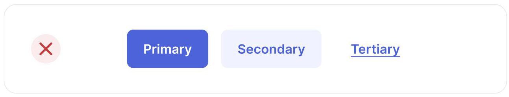

User interface components like form fields, buttons, and tabs, need to have a colour contrast ratio of at least 3:1. This helps people with low vision tell the difference between different components. Decorative styles that aren't required to distinguish interface components can have lower contrast.

In this example, the secondary button fill contrast ratio against the background is less than 3:1. This is too low to clearly indicate the button shape to those with low vision.

Some designers may argue that the secondary button fill is decorative and doesn't need to have a contrast ratio of 3:1 to be accessible. The fill is needed to identify the secondary button as a button. Without the fill, it's just plain blue text with no indicator of interactivity but colour. You could add a high contrast border to the secondary button to fix this issue.

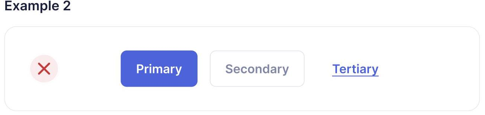

The button styles in example 2 have the following issues:

- The secondary button could be mistaken as being unavailable or in a disabled state due to its light grey colour. It's safest to avoid light grey buttons to reduce potential confusion.

- The secondary button text contrast ratio is less than the required 4.5:1 WCAG guideline, making it difficult to read for some.

- The secondary button border is also less than the required 3:1 ratio.

## Example 3

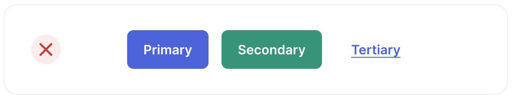

The button styles in example 3 have the following issues:

- The primary and secondary buttons conflict due to their similarity. This confuses the visual hierarchy, making it unclear which is more important.

- Since both buttons have the same style, the only way to tell the difference between them is via their colour. This means people who are colour blind may not be able to differentiate between them.

- The contrast ratio between the buttons is also less than the required 3:1. This means that people with low vision may not be able to clearly distinguish between them.

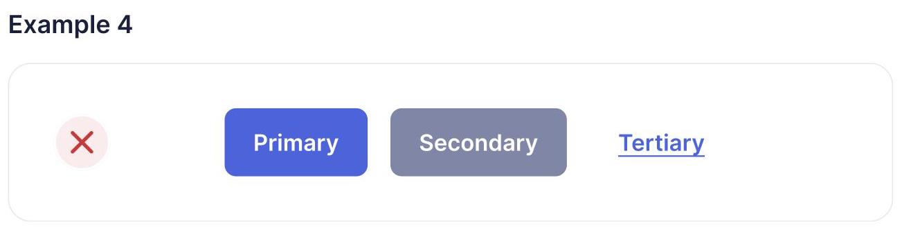

The button styles in example 4 have similar issues to the previous example:

- The primary and secondary buttons conflict due to their similar style and lack of contrast.

- The secondary button text contrast ratio is too low and should be at least 4.5:1 to ensure it's accessible.

## Example 5

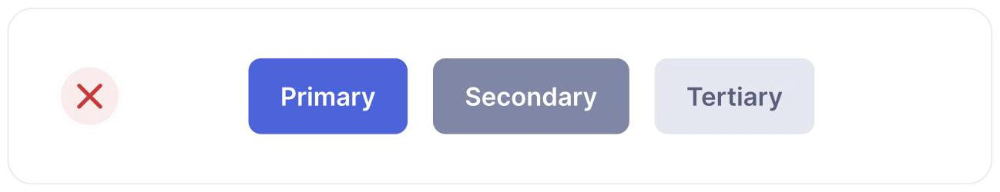

The button styles in example 5 are too similar for people with low vision to distinguish between. The contrast ratio between buttons is the only way to tell the difference between them and it's less than the required 3:1 ratio.

Buttons should have a clear visual hierarchy that isn't reliant on colour.

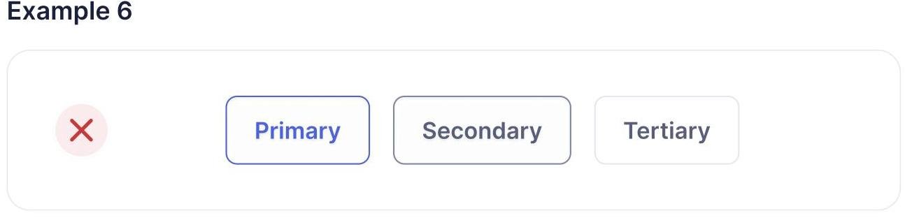

The button styles in example 6 have similar issues to the previous example:

- Button styles are too similar in contrast and style for those with low vision to differentiate.

- The contrast ratio of the tertiary button border must be at least 3:1 to be accessible and clearly identify it as an interactive element.

## Example 7

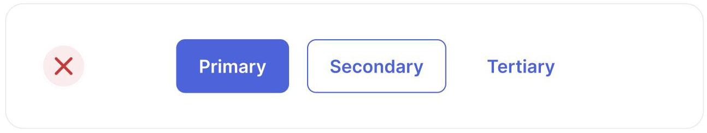

When it comes to accessibility, it's important that we don't rely on colour alone to distinguish interface elements. Those who are colour blind won't be able to tell the difference between elements.

In example 7, the tertiary button isn't accessible because colour is the only indicator that it's interactive. This means that those who are colour blind may not be able to distinguish it from plain text.

The context, position and close proximity of the tertiary button to other buttons may help distinguish it from plain text in some cases, but there's still a risk that it could cause confusion.

## Example 8

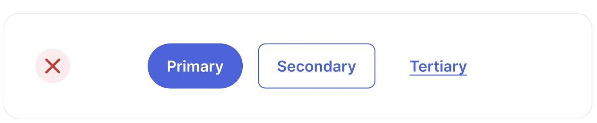

Every detail of an interface design should have a logical purpose. Why are the primary and secondary button shapes different in example 8 ? Do they function differently? Elements that function the same should look the same. Avoid inconsistent button shapes as they can cause confusion.

Example 9

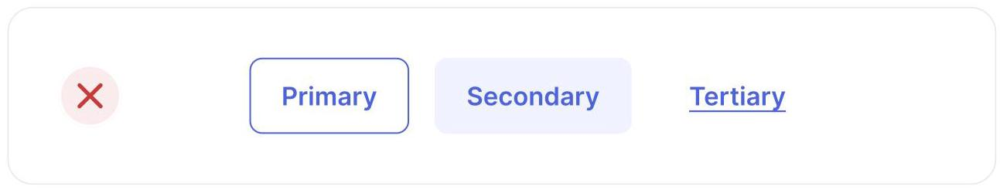

Visual hierarchy is how we communicate the relative importance of interface elements. The purpose of the 3 button styles is to indicate the importance of actions. This helps people make decisions. The button styles in example 9 have the following issues:

- The visual hierarchy is unclear, as the primary and secondary buttons have similar visual weight or prominence.

- The secondary button background contrast ratio is below 3:1, which is too low to clearly indicate the button shape to people with low vision.

## Button design guidelines

Based on the previous button design mistakes, here are some quick and practical tips to keep in mind to design user-friendly and accessible buttons:

- Buttons should have a clear visual hierarchy that doesn't depend on colour alone.

- The contrast ratio of the button shape must be at least 3:1 to ensure people with low vision can identify it as an interactive element.

- The button text contrast ratio must be at least 4.5:1 to meet WCAG 2.1 level AA accessibility requirements.

- If buttons have identical styles, the contrast ratio between them must be at least 3:1 to ensure they're distinguishable to those with low vision.

- Use a large target area (at least 48pt by 48pt) to ensure people can easily press buttons.

- Make sure there's sufficient space between buttons so people don't mistakenly press the wrong one. I usually use 16pt to be safe.

# Use a single primary button for the most important action

The purpose of a primary button is to highlight the most important action on an interface. This helps people understand what to do next in order to complete their task.

Guidelines for using primary buttons:

- If there isn't a single most important action on an interface, use secondary or tertiary buttons for those actions.

- Avoid using multiple primary buttons on a screen. They can compete for attention and cause confusion around what to do next.

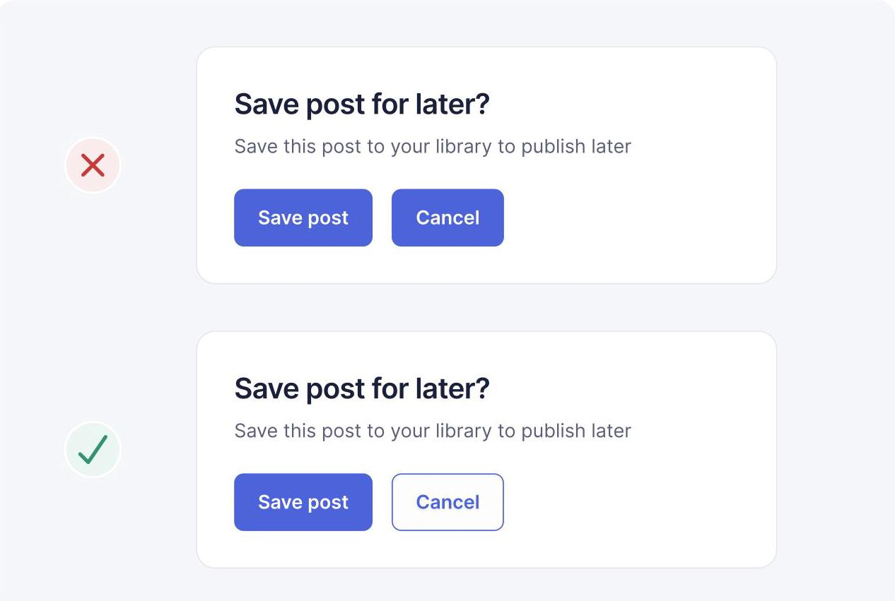

Multiple primary buttons can cause confusion around what to do next

In the following example, multiple primary buttons are competing for attention. This is telling people that all of these actions are the most important action on the screen. Multiple primary buttons can clutter an interface and confuse the visual hierarchy. If everything is considered important, then nothing stands out as the most important.

Using less prominent secondary buttons instead helps to correct the visual hierarchy. You could also use tertiary buttons to further decrease the prominence of the buttons.

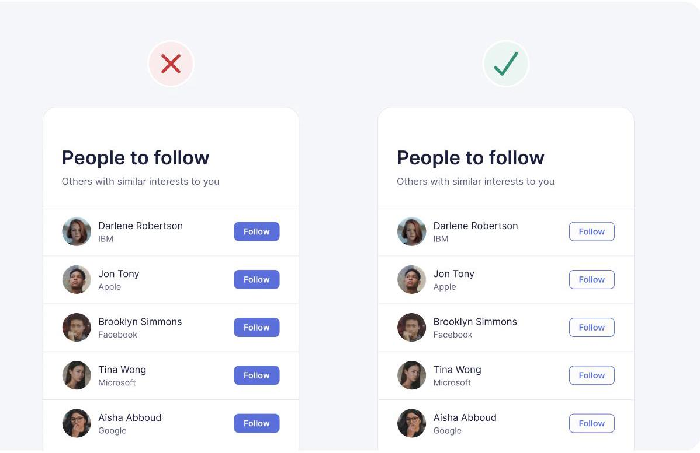

Multiple primary buttons can clutter an interface and confuse the visual hierarchy

## Use secondary buttons for less important actions

Secondary buttons are usually the alternative to the primary action. Use secondary buttons for less important actions or for multiple actions that have equal importance.

The following example is a message that appears after someone deletes a suspicious email from their inbox. It's up to them whether they want to report the email as junk or not. Since the buttons have equal importance, they should have equal prominence. Don't make one button more prominent than the other as it creates bias.

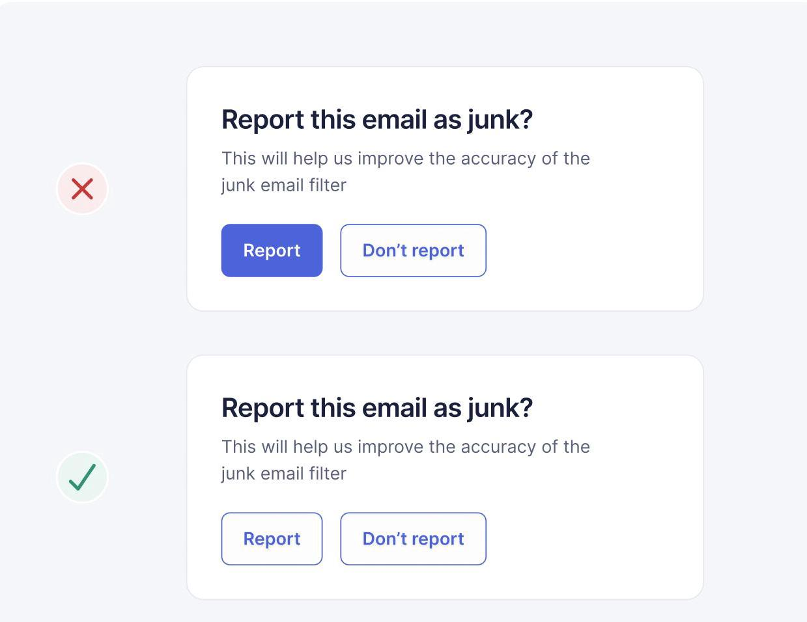

Use secondary buttons for multiple actions that have equal importance

## Use tertiary buttons for the least important actions

Due to their low prominence, tertiary buttons are especially good for displaying multiple actions or destructive actions that you want to make less prominent.

In the following example, too much attention is brought to destructive actions. This causes them to compete with the primary "send invite" action. Using tertiary buttons instead reduces their prominence. This corrects the visual hierarchy, clearly making "send invite" the most prominent action.

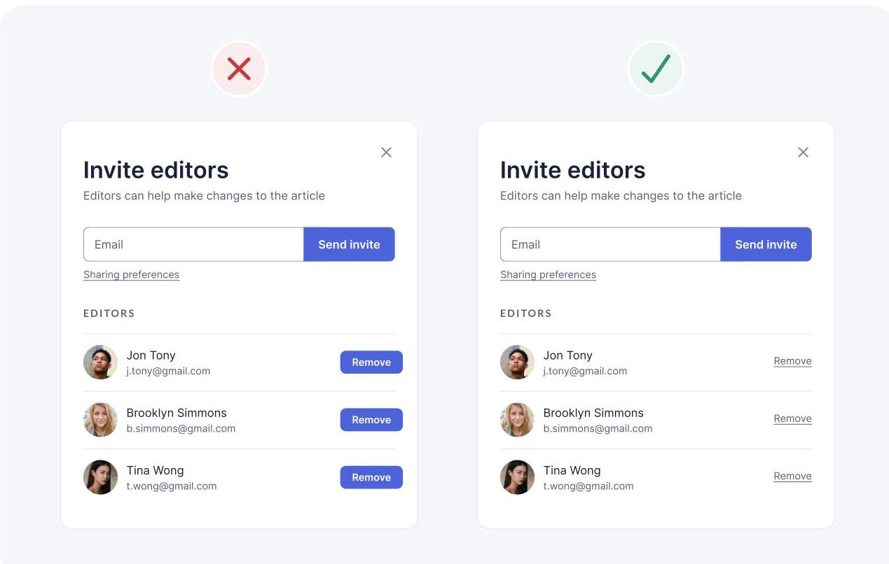

Tertiary buttons being used to display multiple destructive actions

Decreasing the prominence of destructive actions is also a good way to help people avoid actioning them mistakenly. You'll learn more about this soon.

## Try to avoid disabled buttons

A disabled button can't be actioned. It's often a very low contrast colour and is used to prevent people from taking actions that aren't available or could cause an error.

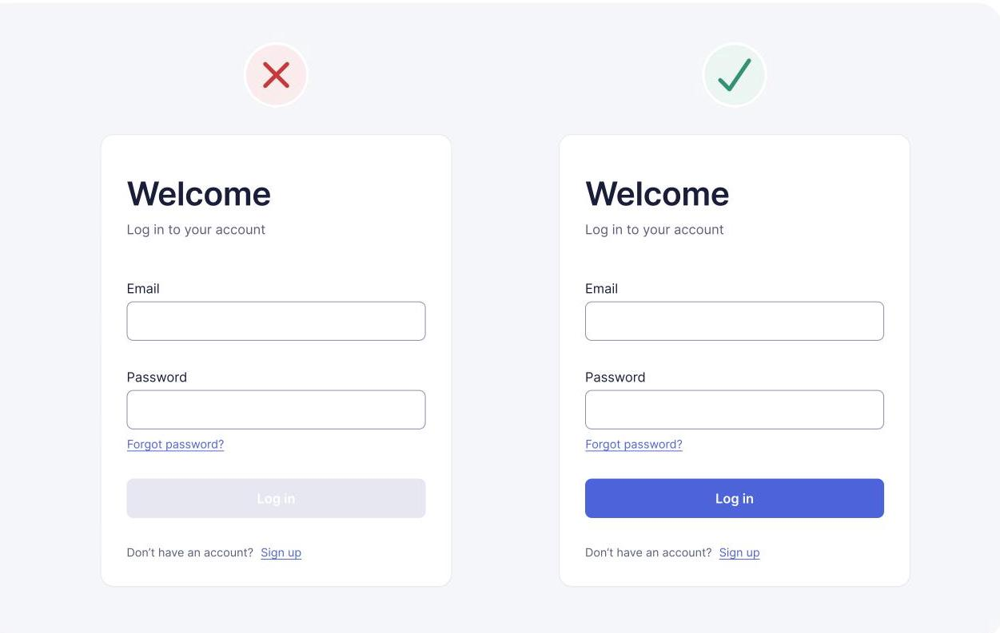

Disabled login button versus enabled login button

## Disabled buttons can be problematic for the following reasons:

- They can cause people to get stuck, as they generally don't provide feedback on why they're not actionable.

- Their low contrast makes them hard for those with poor eyesight to see.

- They're not keyboard accessible, which may confuse keyboard users when they can't focus on the button.

Here are some alternatives to disabled buttons to help avoid these issues.

## Enable buttons and validate on submit

Submit buttons on forms are often disabled until all fields are completed. This prevents people from submitting empty fields but can be problematic for the reasons mentioned previously. Instead of disabling the submit button, enable it and display error messages on submit.

In the following example, the user mistakenly missed the first field and is stuck wondering why they can't press the pay button. Using an enabled button instead, instantly makes them aware that they missed the first field. This is a simple, accessible solution that prevents people from getting stuck.

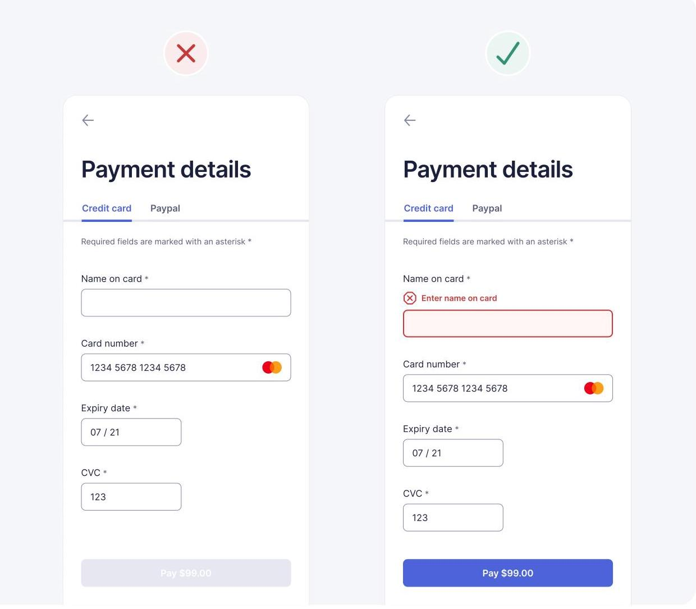

Instead of disabling the submit button, enable it and display error messages on submit.

## Remove unavailable actions

Rather than disabling actions that aren't available, consider removing them and letting people know why they're unavailable.

In the following example, some actions are disabled. They're unavailable until the person accepts your request to follow them. Some people could be confused as to why the buttons can't be pressed.

Remove the unavailable actions and let people know why they're unavailable. This reduces confusion and creates a clear focus on the primary action.

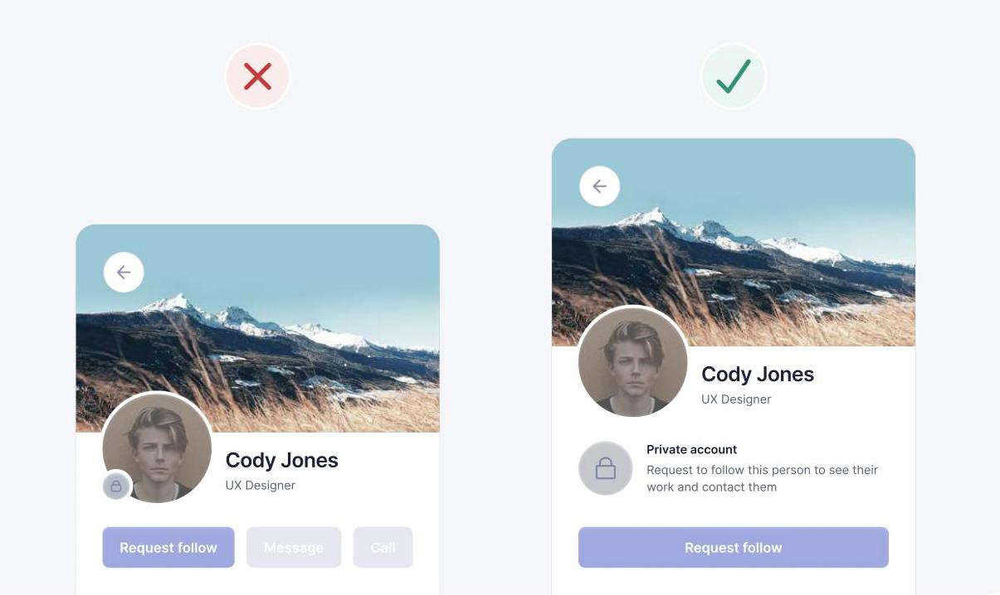

Remove unavailable actions and let people know why they're unavailable

## Put a lock icon on unavailable actions

Another alternative to disabled buttons is to put a lock icon on regular buttons. This indicates that they're unavailable or locked.

Putting a lock icon on regular buttons ensures actions are discoverable and have sufficient contrast. It works especially well for premium features that require payment to get access to them.

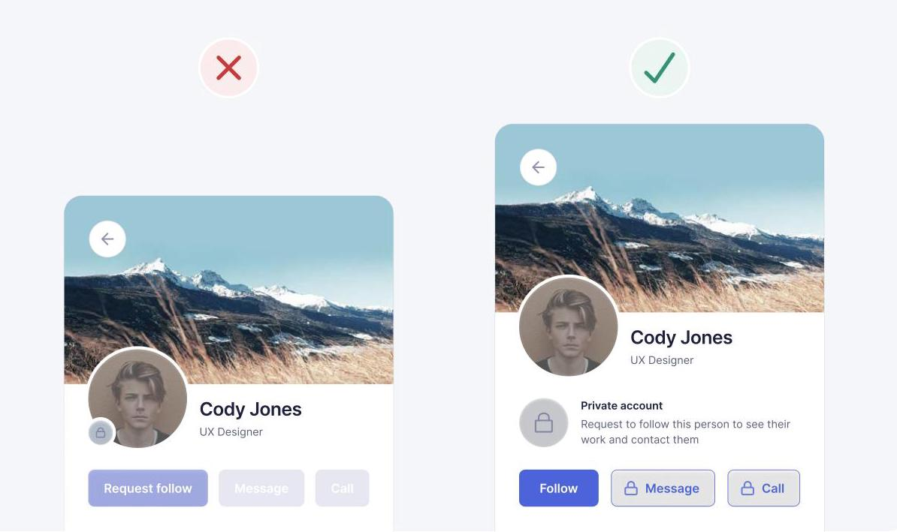

Another alternative to disabled buttons is to put a lock icon on regular buttons

Be sure to let people know why the locked features are unavailable and how they can get access. A message could be placed near the locked buttons or displayed when the locked buttons are actioned.

## Make disabled buttons more inclusive

In most cases, it's safest to avoid disabled buttons. However, if you need to use them, consider doing the following to make them more inclusive.

Make sure that people don't get stuck by providing additional information to help them move forward. Include a message near the disabled button explaining why it's unavailable and what they need to do to action it.

## Register

You need to fill out all fields to register

Include a message near disabled buttons explaining why they're unavailable

Add a tooltip to the disabled button explaining why it's unavailable and what people need to do to action it. A tooltip is a floating message that's displayed on hover or press of an action.

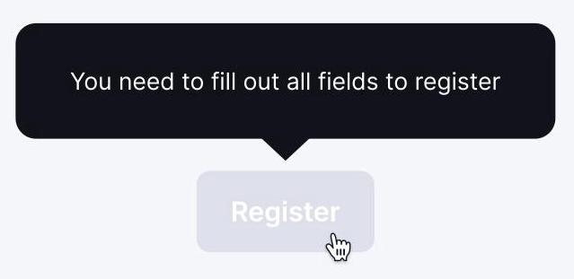

Add a tooltip to the disabled button explaining why it's unavailable

Also, make sure the button is keyboard accessible. This allows those using assistive technology to focus on the button and trigger the tooltip.

## Left align buttons

In most cases, you should order buttons from left to right, most important to least important, for the following reasons:

- English is read from left to right, downwards in an F-shaped pattern. People naturally look to the left edge as they move down the screen.

- Right aligned buttons can be missed on larger screens and by those using screen magnifiers.

- The most important button is the one that most people will need to use. Placing it first decreases the interaction cost for most people. On mobile screens, stack buttons top to bottom, from most important to least important. This maintains the button order.

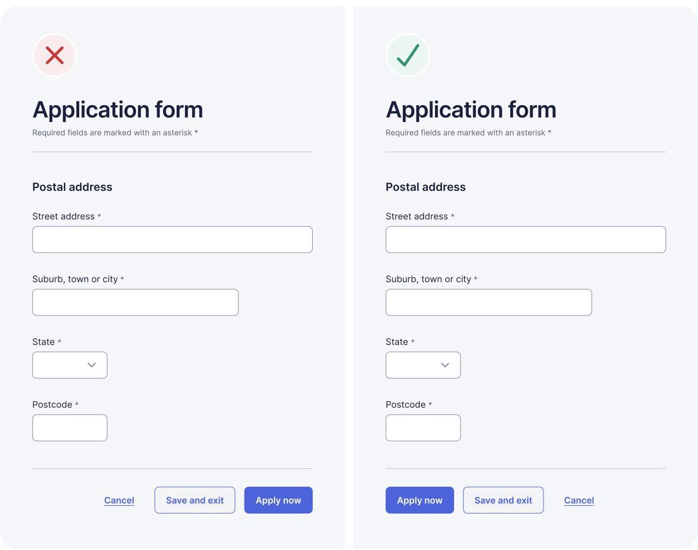

Right aligned versus left aligned buttons

Sometimes people need to carry things while using their mobile, so they might only have one hand available. Making buttons full-width helps both left and right handed people to reach them easily with one hand.

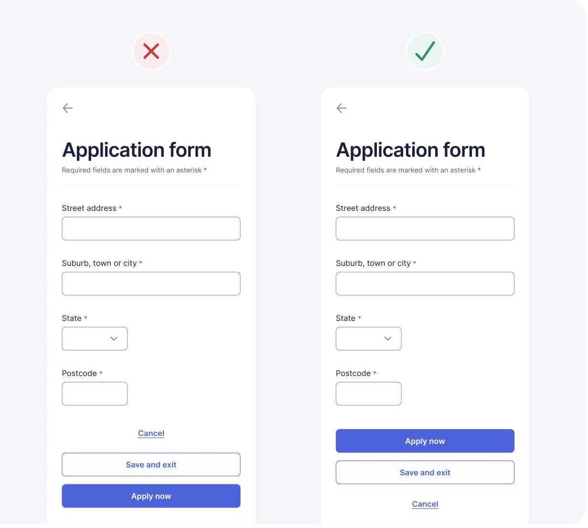

On mobile screens, stack buttons top to bottom, from most important to least important.

## What about small dialog boxes?

For consistency, I align buttons to the left on small dialog boxes. Right alignment can work well too, as long as buttons have a clear visual hierarchy. Let's look at the rationale for each approach.

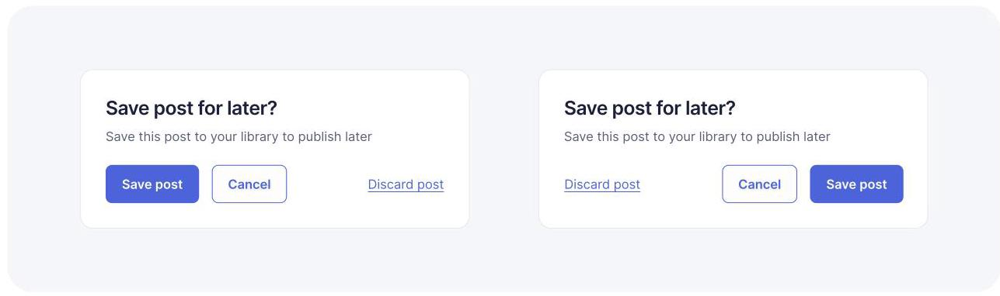

## Reasons for left aligned buttons

Along with the reasons mentioned previously, there are others that support aligning buttons to the left:

- It's a familiar pattern used widely on Windows OS and other websites.

- To maintain consistency with other forms that have left aligned buttons. Having buttons left aligned on some screens and right aligned on others in your product could be confusing.

## Reasons for right aligned buttons

It's often recommended to align buttons to the right on small dialog boxes for the following reasons:

- To better indicate direction or momentum. The primary button usually takes the user forward (right), while the secondary button takes them backward (left).

- It's a familiar pattern used widely on operating systems like Mac OS.

## Left align buttons on multi-step forms

On multi-step forms, the primary button is often right aligned and the "Back" button is left aligned. This is problematic for the following reasons:

- It can cause people to mistakenly click the back button as it's in such a prominent position. This could cause them to lose the data they just entered into the form.

- It places the primary button further away from the form fields, increasing the interaction cost to press it (especially on large screens).

- Right aligned buttons could be missed on large screens and by those using screen magnifiers.

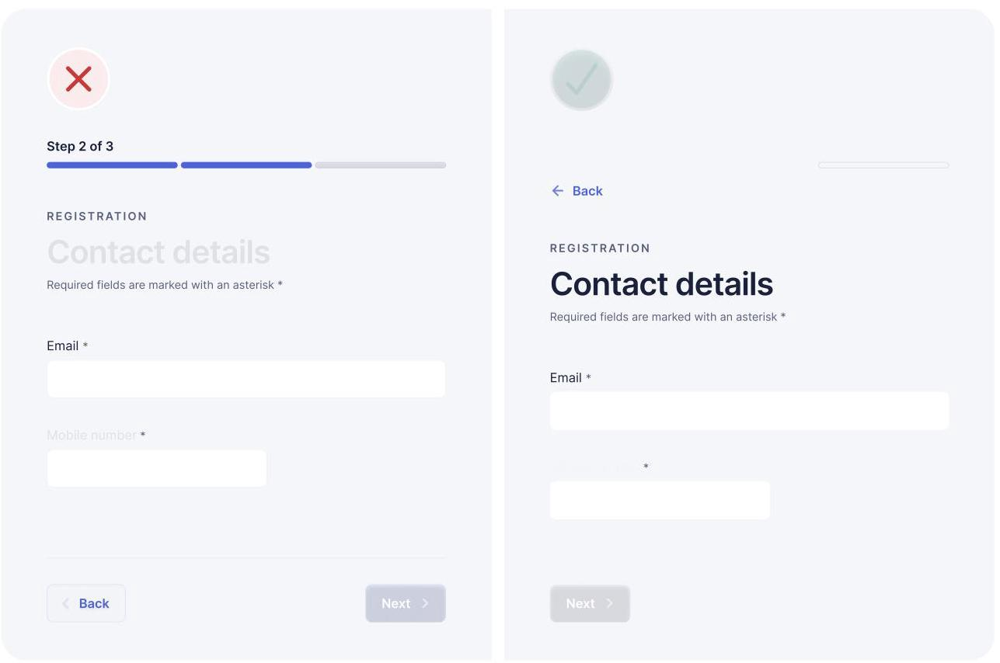

Right versus left alignment of the primary button on a multi-step form

Stay consistent and keep the primary button left aligned. Put a tertiary "Back" button at the top left of the form for the following reasons:

- It's a common position for the back button on mobile, website browsers, and breadcrumb navigation (a trail of pages a user has visited).

- People may need to go back to check something before filling out the next form. This placement allows them to go back without having to scroll or use the keyboard to tab to the bottom of the form.

- There's less chance of people mistakenly clicking the back button and losing data after they've completed the form.

## Exceptions to the left aligned button guideline

For single form fields like search fields and email subscriptions, it's common to put the primary button on the right of the field to save space. Connecting the primary button to the field reinforces the close relationship between the field and the button and helps ensure it isn't missed.

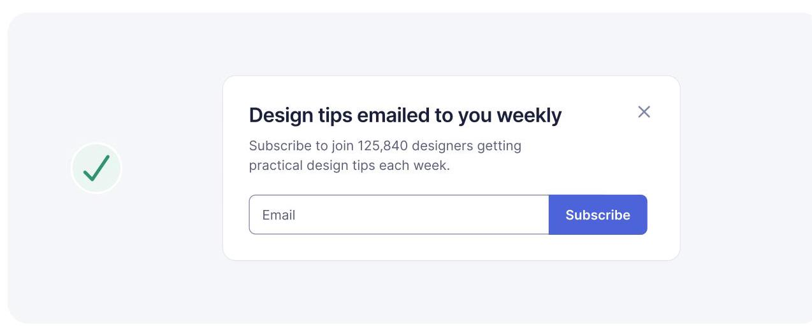

The primary button is attached to the right of the subscribe field to save space

## Ensure button text describes the action

Button text should clearly describe the action being taken so that it's meaningful when read out of context. A simple rule for button text that works well in most cases, is a verb (action) followed by a noun (thing).

For example, "Save post", "Discard message", and "Edit article". Button text should be descriptive for the following reasons:

- Some people will look at buttons first, as they're very prominent. Descriptive button text allows them to take action quickly, without having to read supporting text.

- Screen reader users often jump straight to buttons and links on a page, so button text needs to make sense when read out of context.

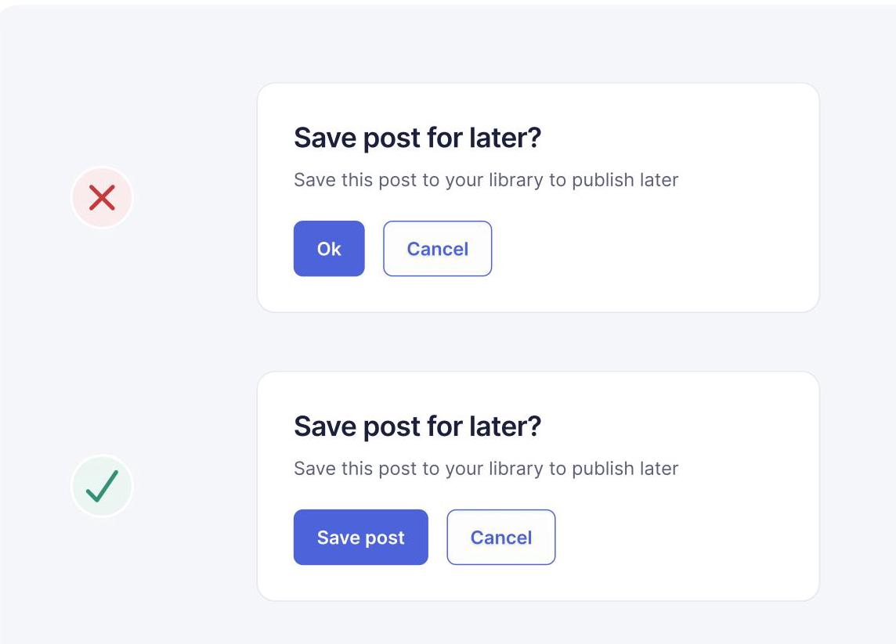

Vague button text versus descriptive button text

## Ensure buttons have a sufficient target size

Small targets are more difficult to click or touch than large ones. This is especially true for those with impaired motor control, or even someone holding their phone with one hand and using their thumb.

Try to stick to the following guidelines to ensure buttons (and other interactive elements) have a sufficient target size:

- Make buttons at least 48pt by 48pt in size. This aligns with an 8pt grid and is slightly larger than the WCAG recommendation of 44pt by 44pt.

- Make frequently used buttons even larger to improve efficiency and to help avoid them being missed.

- Separate buttons by at least 8pt to help prevent people mistakenly pressing the wrong one.

In the following example, the up and down arrows in the stepper component don't have a sufficient target size and are too close together. Increasing their target size and separating them makes them easier and faster to press.

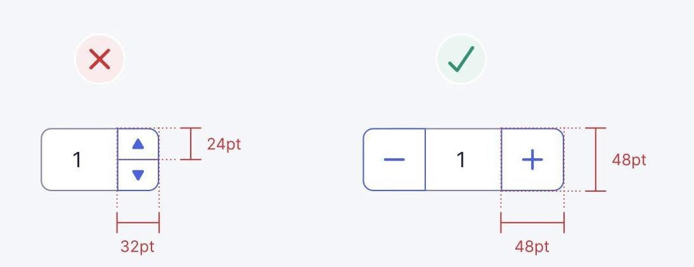

Insufficient versus sufficient button size

For small interactive elements, extend the target area beyond the visual bounds of the element. This means that even if someone misses the element, there's a good chance they'll still trigger the action.

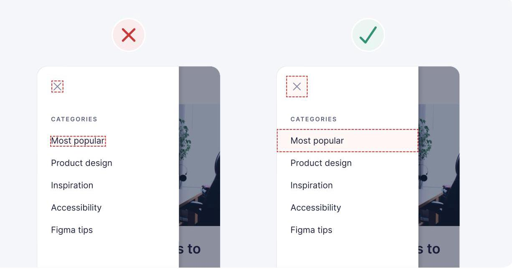

For small interactive elements, extend the target area beyond the visual bounds of the element.

Indicate the target area to further reduce the interaction cost. Without clear indication, people may not realise it's there. If the target still looks small, they may exert more effort and spend additional time trying to hit it precisely.

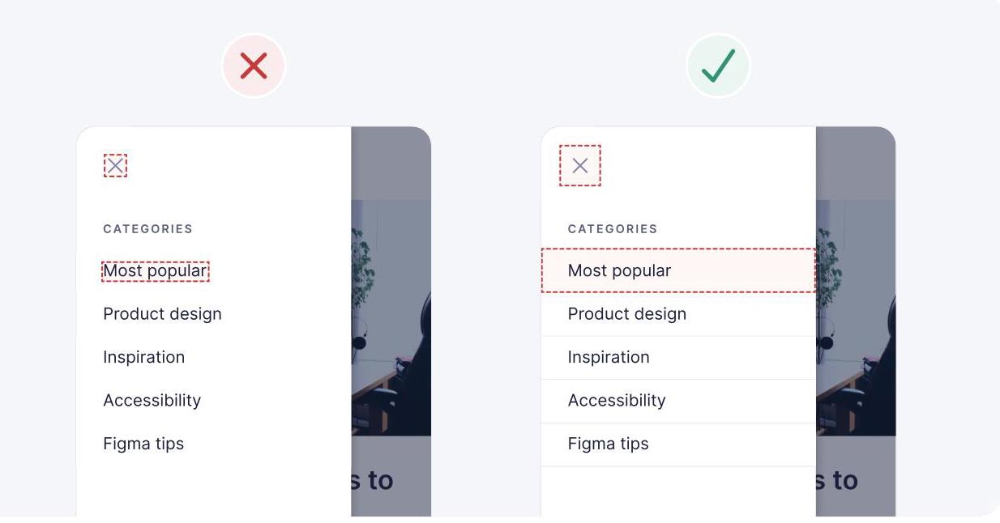

Indicate the target area to further reduce interaction cost

## Balance icon and text pairs

When pairing icons with text, try to ensure they have the same visual prominence for a more balanced and cohesive look.

## Use a similar weight

Try to use a similar weight, or thickness, for icons and text. This helps group them together as they look similar. It also helps balance them visually.

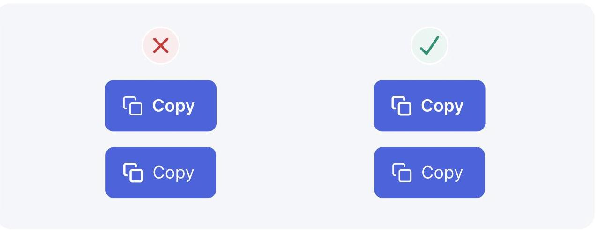

## Use a similar size

Try to match the size of the icon to the size of the text.

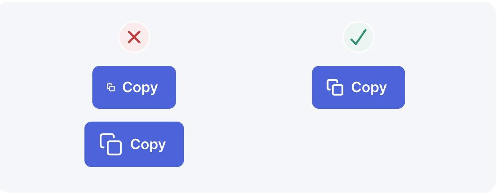

## Vary the contrast

Sometimes it's difficult to match the weight and size of icons and text. Luckily, you can also use contrast to help create a balance between the two.

In the example below, the icons are larger and thicker than the text they're paired with. This makes the icons slightly more prominent than the text.

To balance the pair, the contrast of the icons is decreased. Rather than using the "Text weak" colour variation from the solid colour palette for both icons and text, the "Stroke strong" colour variation is used for icons.

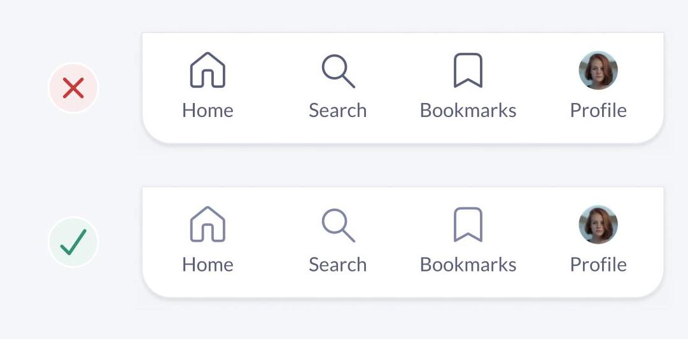

Decrease the contrast of icons to balance them with text

## Add friction to destructive actions

A destructive action is one that causes harm or can't be undone, like permanently deleting important information. Adding friction involves increasing the interaction cost required to perform an action. To help prevent people from mistakenly performing destructive actions, introduce increasing amounts of friction based on the severity of the action.

Let's go through the different levels of friction.

## Initial friction

Before a destructive action is taken, introduce friction to help prevent people from mistakenly actioning it. This generally involves making the action less prominent, moving it further away, or progressively disclosing it. Don't colour the action red, as this makes it more prominent.

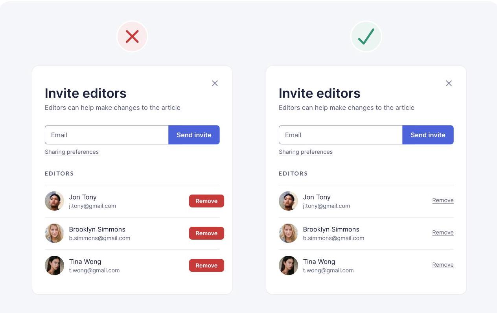

Make destructive actions less prominent to prevent people from mistakenly actioning them

## Light friction

For less serious actions, simply ask people to confirm the action before performing it.

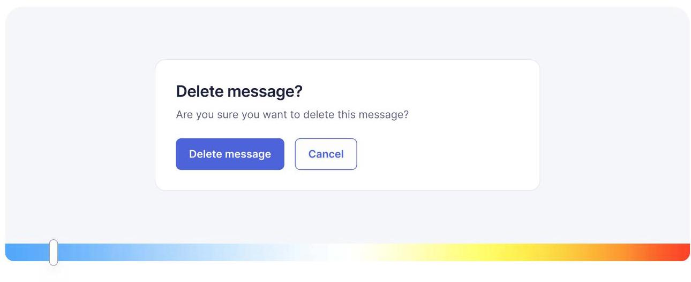

## Moderate friction

To add further friction, highlight the confirmation message in red. This will warn people that the action they're about to take is destructive.

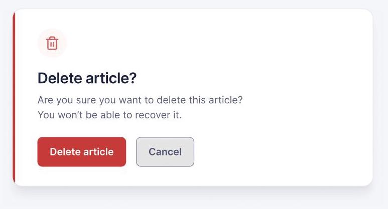

## Heavy friction

For very destructive actions, use red and include a checkbox. The checkbox must be selected before the destructive action can occur. Even if someone mistakenly presses the button, the action won't be performed.

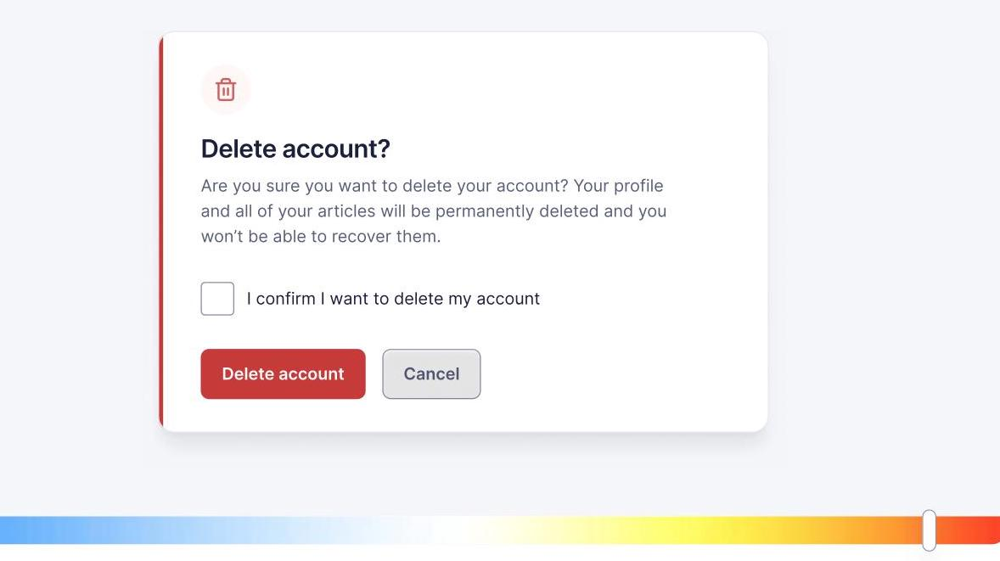

## Allow people to undo destructive actions

Even with added friction, mistakes will still be made. So, consider allowing people to undo or reverse destructive actions. This generally takes more time and effort to implement, but it removes a lot of risk.

☑ Message deleted

Your message was deleted successfully

Restore message

TUTORIAL - BUTTONS

## Apply what you've just learned

Let's apply some of the guidelines you've learned

to continue improving the fitness app example.

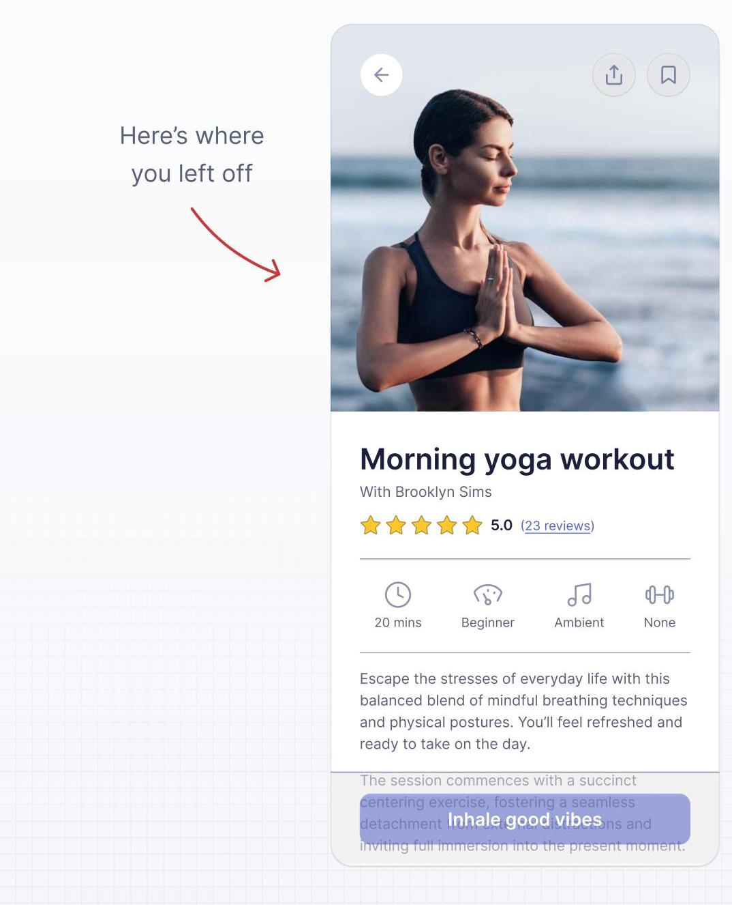

## Ensure button text describes the action

In the fitness app example, the meaning of the button text could be confusing to some, as it doesn't clearly describe the action being taken. Use a clear and descriptive label to reduce confusion.

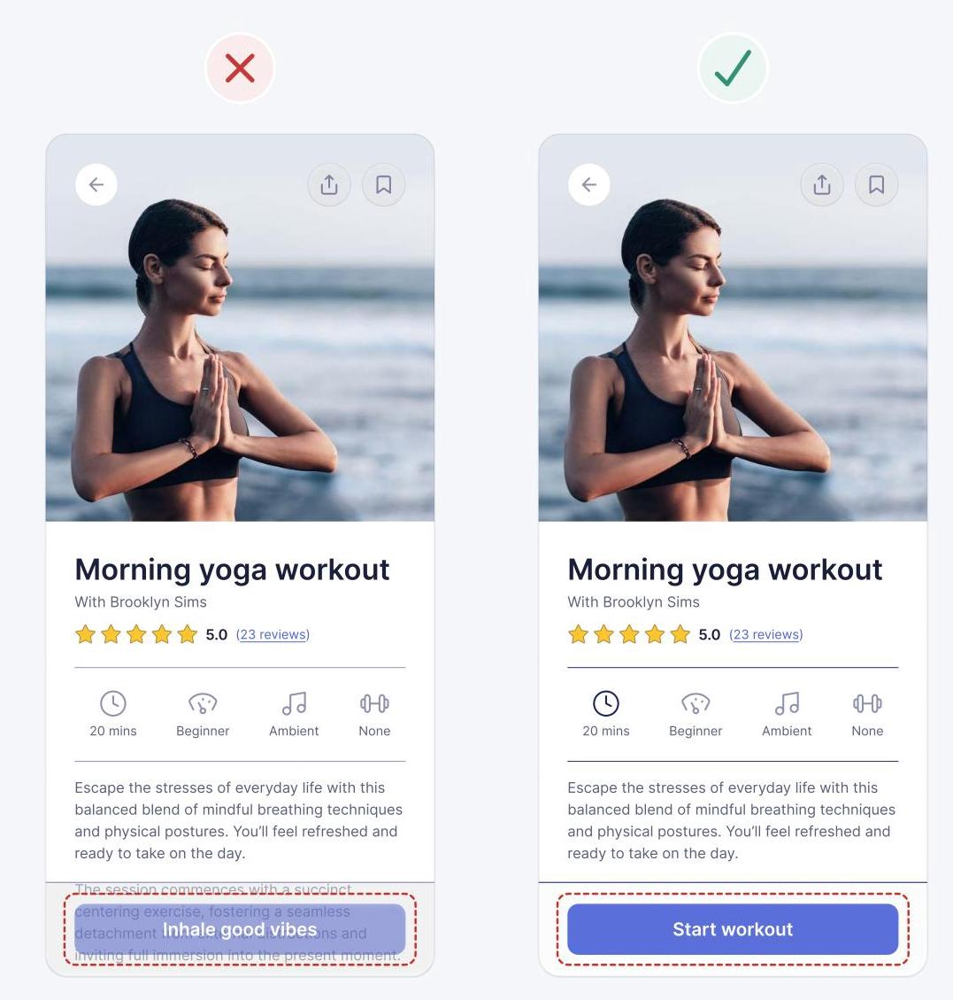

Unclear button text is changed to be clear and descriptive

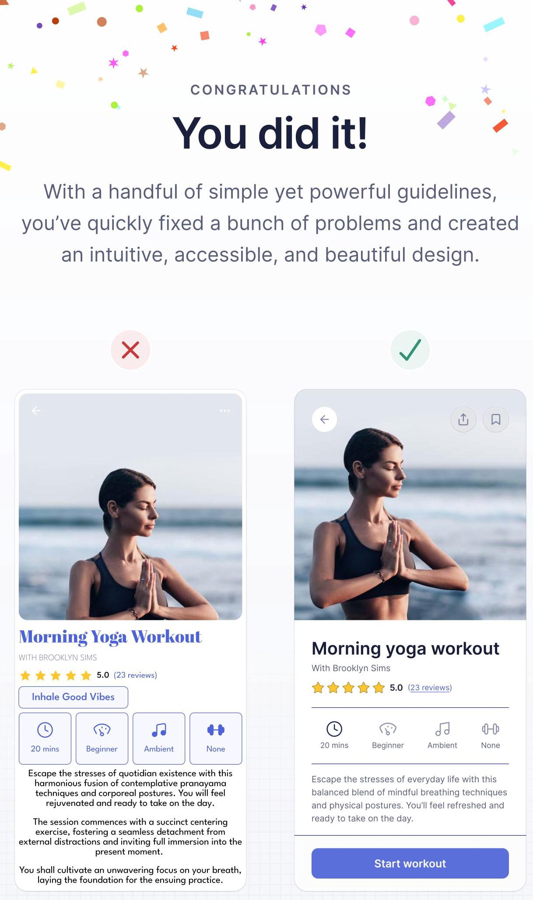

## Chapter summary

✓ Define 3 button weights to indicate the importance of actions. Ensure button styles are familiar, accessible, and have a clear visual hierarchy that isn't dependent on colour alone.

✓ Try to avoid disabled buttons, as they can cause people to get stuck. Instead, enable buttons and validate on submit.

✓ Order buttons from left to right, most important to least important to reduce interaction cost. This also helps avoid buttons being missed on larger screens and by those using screen magnifiers.

✓ Ensure button text clearly describes the action being taken, so it's meaningful when read out of context. Use a verb (action) followed by a noun (thing).

✓ Try to ensure buttons have a sufficient target size. Make them at least 48pt by 48pt in size and separate them by at least 8pt to help prevent people mistakenly actioning the wrong one. Your progress 7 of 8 chapters completed

Fundamentals Less is more ✓ Colour

- Layout and spacing Typography Copywriting Buttons 8 Forms