CHAPTER 8 Forms

Form patterns and principles to help people complete

forms more quickly and easily

<!-- auto-toc:start -->
## Contents

- Stack forms in a single column layout
- Stack labels on top of inputs
- Stack checkboxes and radio buttons
- What about the increase in height?
- Minimise the number of form fields
- Mark optional fields
- Try to avoid optional fields by using opt-ins
- Mark both required and optional fields
- The problem with leaving required fields unmarked
- Mark required fields with an asterisk *
- Mark required fields with the word "required"
- Situations where you don't need to mark required fields
- Match field width to the intended input
- Stick with conventional form field styles
- Display hints above form fields
- Don't use placeholder text instead of a label
- This is problematic for the following reasons:
- Form label tips
- Use an autocomplete instead of a long dropdown
- Use steppers for numeric fields instead of dropdowns
- Checkbox usage
- Toggle switch usage
- Use positive phrasing for checkboxes
- Break up long forms into multiple steps
- Group related fields under headings
- Ensure form field borders are high contrast
- Choose your form validation approach
- 1. Validate on submit of the form
- Quick guidelines for validating forms on submit:
- Advantages
- Disadvantages
- 2. Validate after people leave a field
- 3. Validate instantly as people type
- Chapter summary

<!-- auto-toc:end -->

## Stack forms in a single column layout

Form fields are often arranged in multiple columns to save space. A single column form layout is the safest, most efficient, and simplest form layout for the following reasons:

- It's more efficient to complete, as it decreases interaction cost by maintaining a consistent downward momentum.

- It decreases cognitive load, as people don't need to think about what field to fill out next. They simply move down the page in a straight line.

- Since there's only a single downward path to fill out the form, there's less chance of people missing fields. Those using screen magnifiers have a limited view of the screen and could miss fields in a second column.

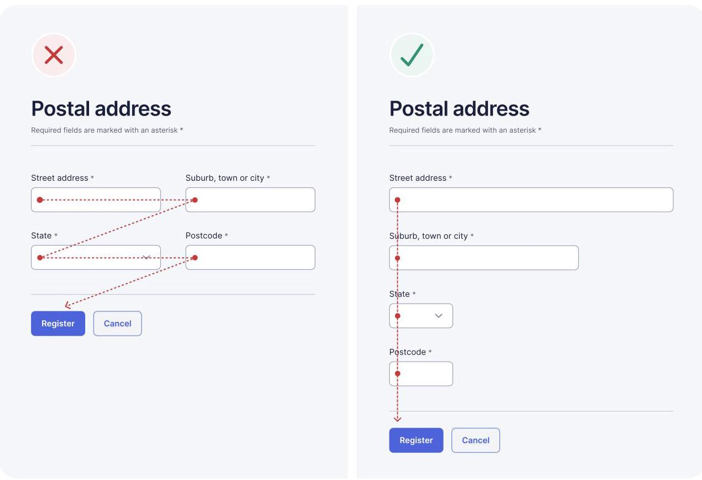

Multi column versus single column form examples

## Stack labels on top of inputs

Labels should also be stacked vertically on top of inputs. Avoid placing labels to the left of form fields, as it can increase cognitive load and interaction cost. This slows down form completion times.

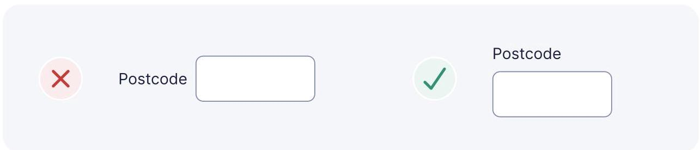

Stack labels on top of inputs

In the following example, the relatively large and inconsistent gap between labels and inputs is highlighted. This gap increases interaction cost. Your eyes need to focus on the label first, then move focus to the input in a zigzag pattern. Interaction cost is further increased if you forget the label and need to go back and check it. In the next example, the label text is right aligned to reduce the interaction cost. It also creates a stronger association between label and input. The problem is that it creates an inconsistent jagged left edge, making the text labels harder to scan. Right aligned text makes it harder for people to find the start of each line, as it changes depending on the label length. The jagged alignment also makes the layout look messy.

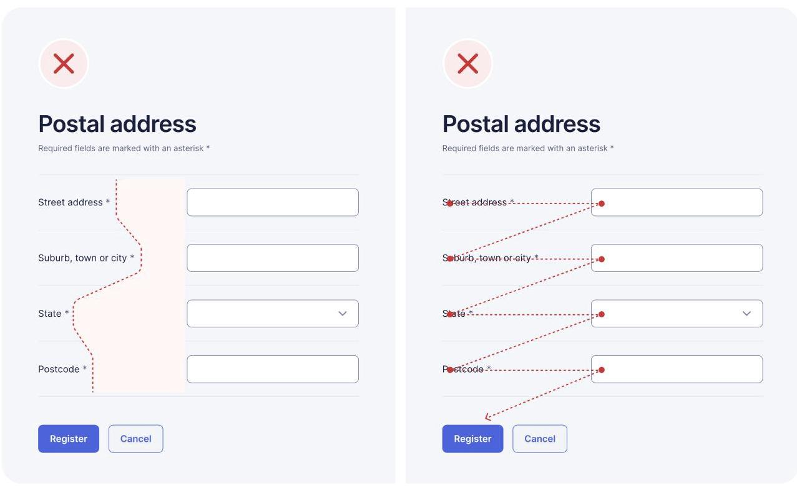

A large and inconsistent gap between labels and inputs increases interaction cost

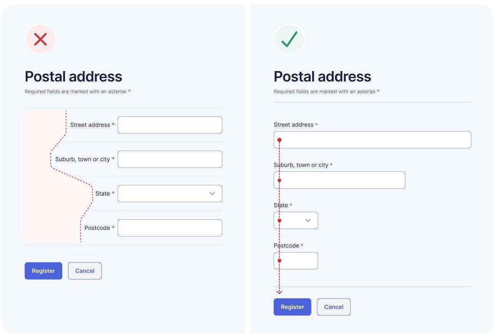

An inconsistent jagged left edge can make text labels harder to scan

Placing labels to the left of inputs is also problematic if the labels are long. Since space is limited, the label may need to wrap over multiple lines, making it more difficult to read.

To avoid the issues previously mentioned, stack labels closely on top of inputs. It's neat and tidy, maintains a simple and consistent downward momentum, and decreases interaction cost. This is because your eyes can see both the label and input in a single focus.

## Stack checkboxes and radio buttons

For similar reasons to those previously mentioned, it's safest to stack checkboxes and radio buttons vertically too. It can also help clearly separate options, so the wrong one isn't mistakenly selected.

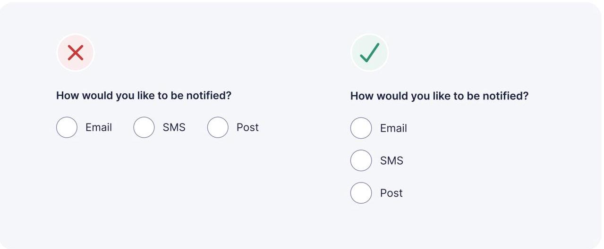

Horizontal versus vertical radio buttons

## What about the increase in height?

The main downside of stacking form elements in a single column is that it takes up more vertical space. While this can make forms feel longer and may deter some people from filling them out, the advantages of a single column form layout far outweigh the disadvantages.

To reduce the height of forms, short related fields can be placed side by side. For example, it's common for the credit card expiry date and CVC number to be placed side by side.

Since the fields are relatively small, they're contained within the bounds of the single column layout. This means they avoid most of the issues that come with a multi-column form layout.

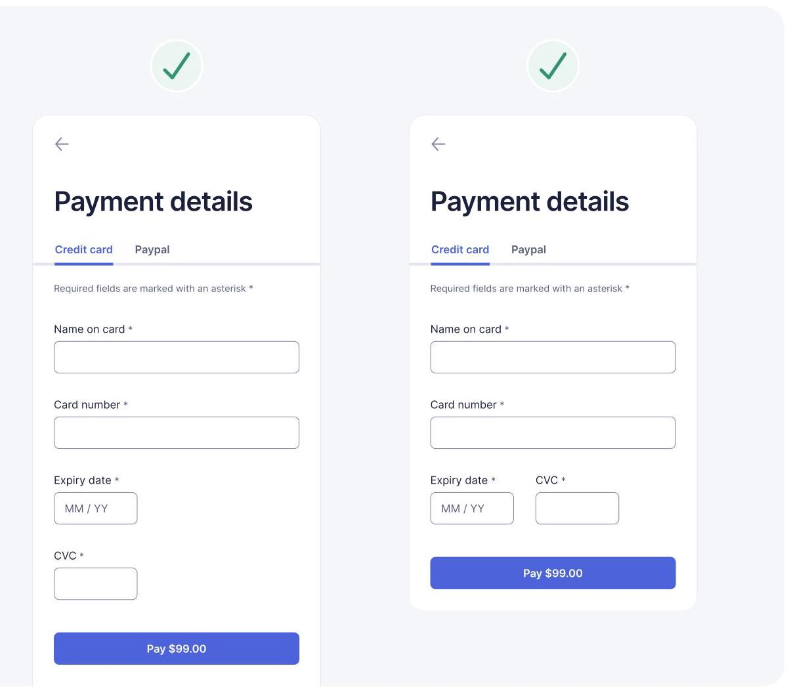

To reduce form height, short related fields can be placed side by side.

If a form is getting very long and it's affecting completion rates, consider breaking it up into multiple smaller steps. This can help decrease cognitive load, reduce mistakes, and improve completion rates. You'll learn more about breaking up forms later in this chapter.

## Minimise the number of form fields

People generally don't want to give away their personal information. Only ask for information that's essential to providing your product or service.

More form fields can be problematic and can result in:

- A higher chance that some won't complete the form.

- More work for those completing the form.

- A higher chance that people will make mistakes.

- More development time building the form.

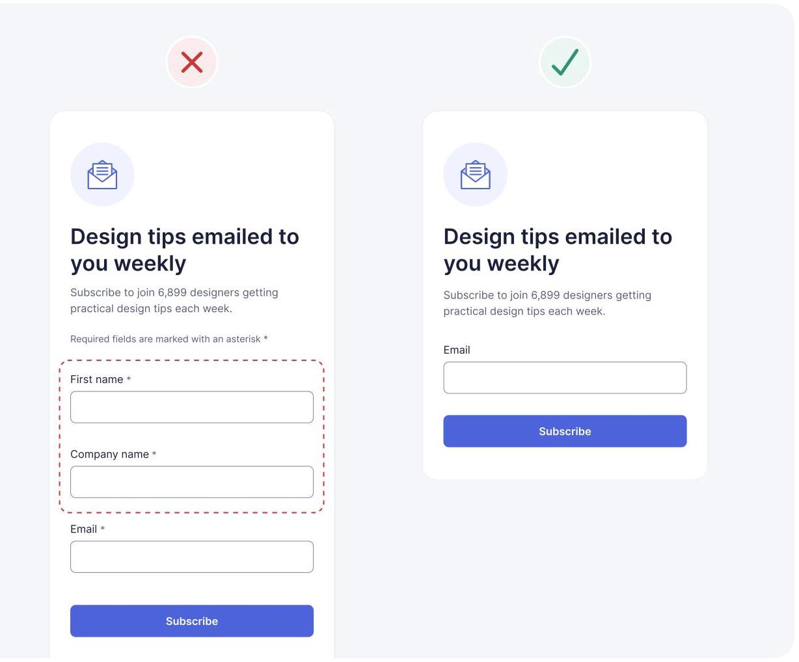

Remove unnecessary form fields

## Mark optional fields

Required form fields must be completed before a form can be submitted successfully. Optional fields don't need to be completed.

Ideally, you should only ask people for essential information, but sometimes optional fields can't be avoided. They can also be helpful to gather extra information from people to improve their experience.

Add the word "optional" to optional field labels. It lets people know that they don't need to provide this information to complete the form.

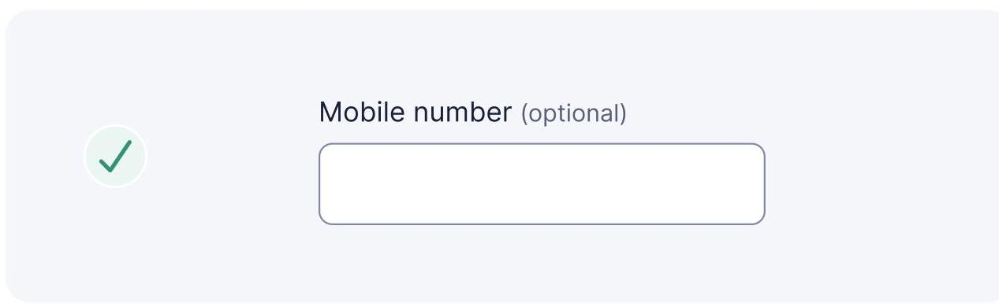

Add the word "optional" to optional field labels

## Try to avoid optional fields by using opt-ins

Including optional fields on forms adds complexity. To simplify forms, try to avoid optional fields altogether. Ask people to opt-in to provide non-essential information.

For example, let's say that you have a form with an optional mobile phone number input field. It's for people looking to receive updates via text message. Instead of using an optional field, ask people whether they'd like to receive updates first (using a checkbox). If they would, then ask for their mobile number (using a required input field).

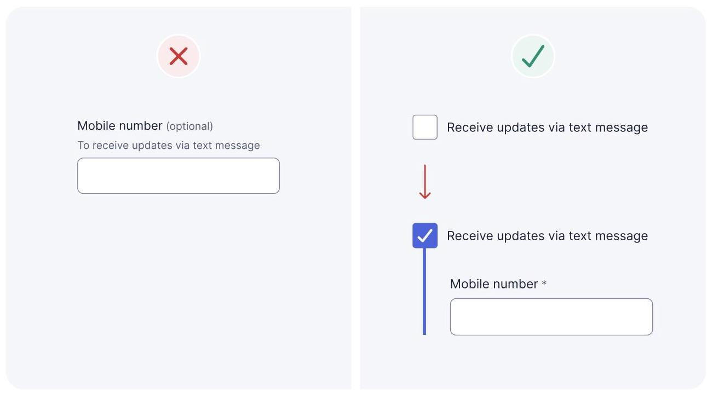

Optional field versus opt-in

Using progressive disclosure in this way can help simplify your form. Those who aren't interested in receiving updates don't need to see the extra mobile number field. This makes it faster and easier for people to complete.

## Mark both required and optional fields

It's safest to mark both required and optional fields, especially for those with cognitive disabilities. It clearly lets people know whether a field needs to be completed or not.

Guidelines for marking required and optional fields:

- Mark required fields with an asterisk * or the word "required".

- Mark optional fields with the word "optional".

We'll look at the rationale behind these guidelines next.

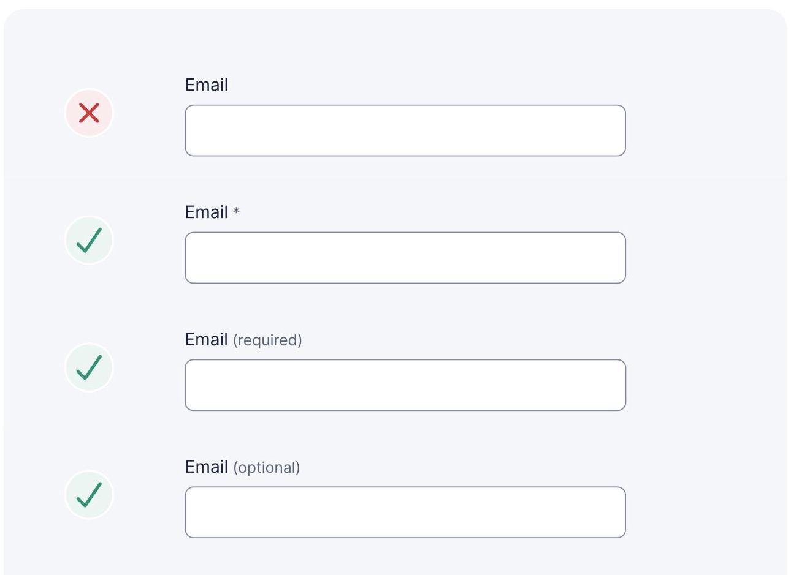

Mark both required and optional fields

## The problem with leaving required fields unmarked

Marking required fields with an asterisk * or the word "required" is often avoided by designers to reduce clutter. Instead, only optional fields are marked and the following instructions are included at the top of the form: "All fields are required unless marked optional".

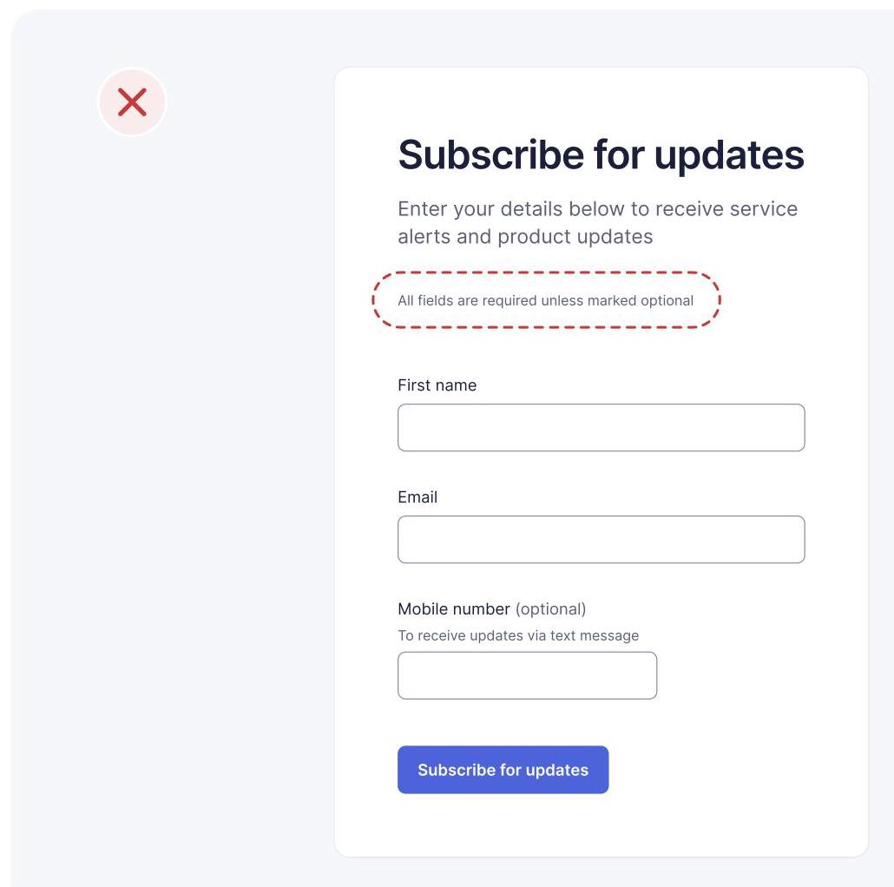

Instructions are often skipped which could leave people guessing whether form fields are required or not

The problem with this approach is that instructions are often skipped, as people scan an interface. This can leave them guessing whether form fields are required or not.

Marking both required and optional fields is an accessibility requirement for screen reader users, so it makes sense to do the same for sighted users.

## Mark required fields with an asterisk *

Marking required fields with an asterisk is a concise and familiar way to clearly indicate the fields people need to complete. Avoid colouring the asterisks red, as red commonly indicates an error.

You still need to include instructions at the top of the form, but it won't matter as much if people miss them, as many people are familiar with the meaning of the asterisk.

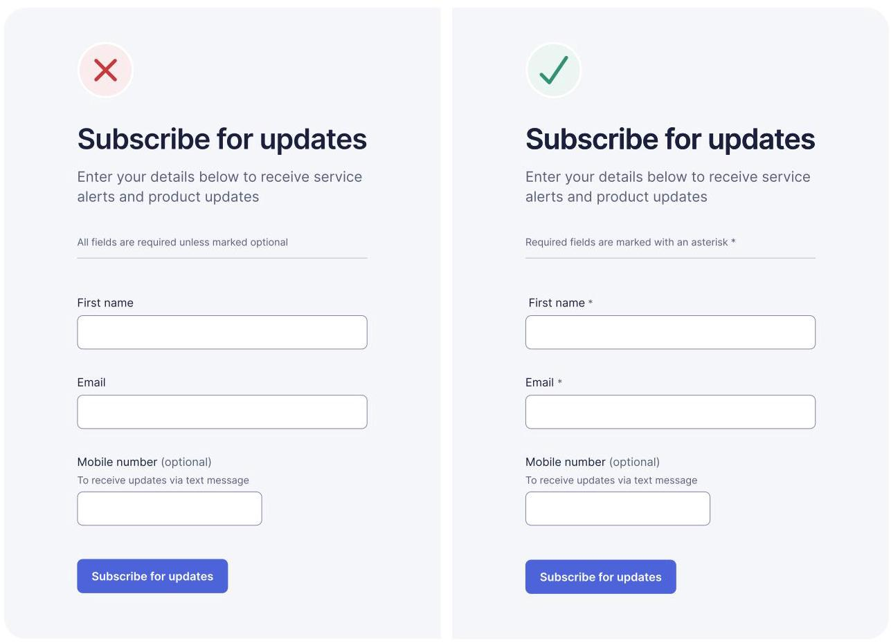

Marking required fields with an asterisk is concise and familiar

Marking required fields with an asterisk also makes it easy for people to quickly scan a form to get a better idea of how many required fields they need to complete.

## Mark required fields with the word "required"

There's still a small risk that some people might not understand that an asterisk indicates a required field. To be crystal clear, you can include the word "required" on required fields.

This means there's no need for any additional instructions at the top of the form. Sure, it adds clutter, but it's clearer and it avoids the usability risks mentioned earlier.

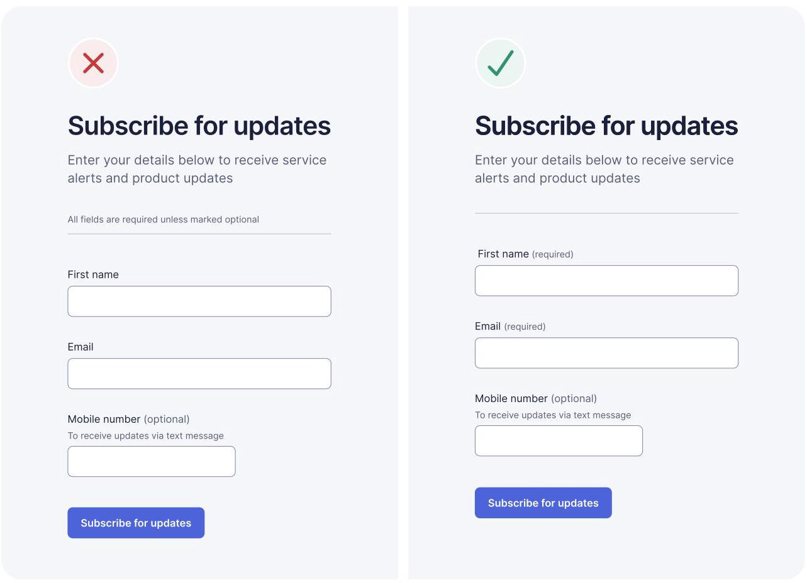

Marking required fields with the word "required" is safest

## Situations where you don't need to mark required fields

To reduce clutter, you could consider leaving required fields unmarked in the following situations:

- If you don't have any optional fields in your product.

- For short familiar forms like single field newsletter subscriptions or logins. It's commonly understood that these fields are required to subscribe or \( \log \) in.

- If your forms ask a single question per screen and you clearly explain why you're asking each question.

- If usability testing validates that you don't need to mark required fields.

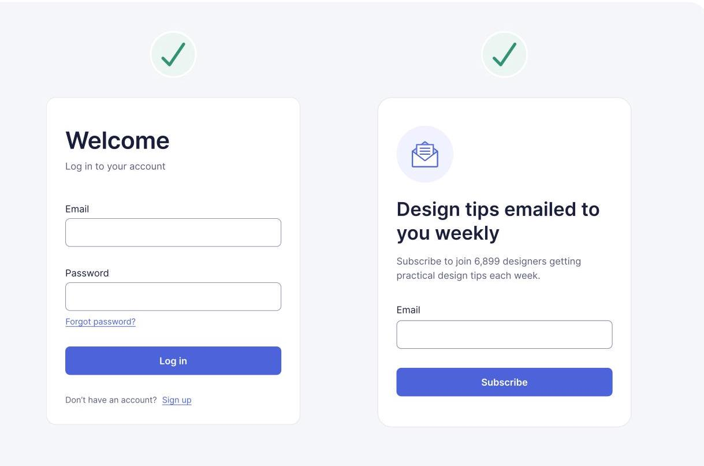

Example of a log in and newsletter subscription form

## Match field width to the intended input

The width of a form field sets people's expectations for the amount of information expected in the field. Using a wide field to collect a small piece of information can increase cognitive load and cause confusion.

Even though it looks neat and tidy, don't set all fields to the same width. The field width should be just wide enough to display all characters in the input.

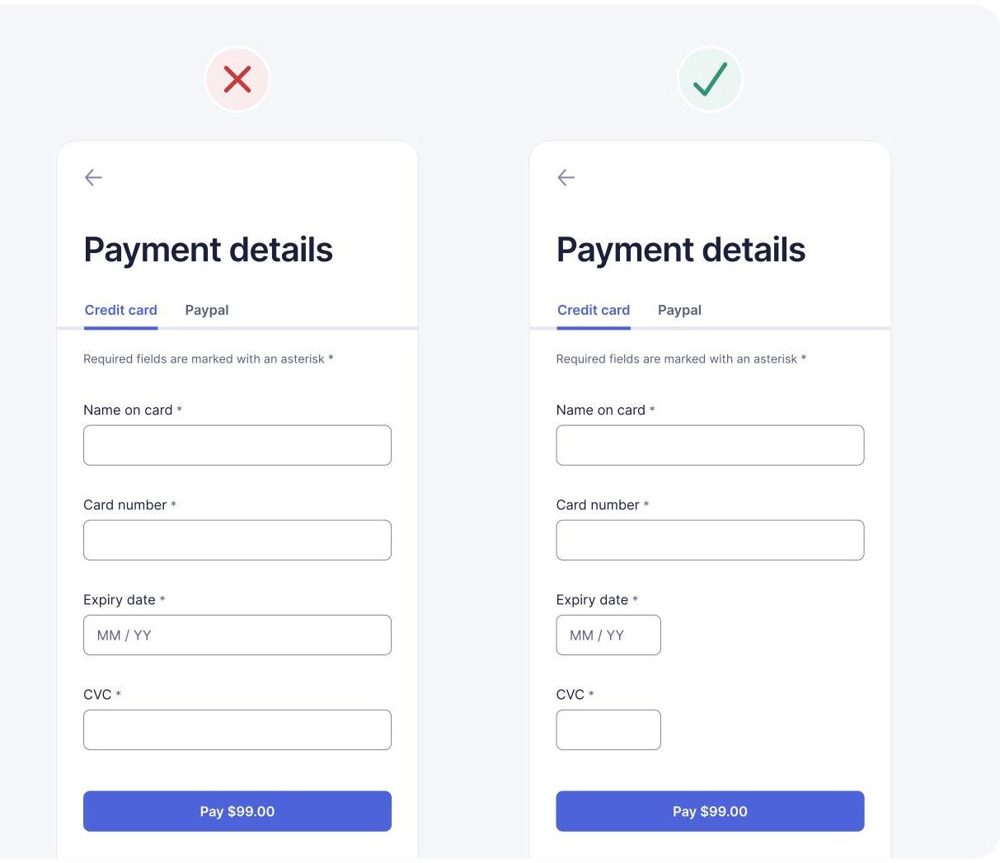

Full-width fields versus fields with a width that matches their intended input

For example, a postcode in Australia is 4 numbers, so you should set your field width to accommodate 4 numbers only.

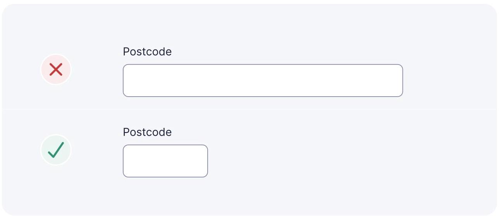

A postcode input field should have a width of 4 numbers

If the expected input length varies, set the field width to accommodate the most common case or the longest case if possible.

## Stick with conventional form field styles

According to Jakob's Law, it's safest to use conventional design patterns that people are familiar with. Aligning to people's existing mental models (understanding of how something works) can help avoid usability issues and decrease cognitive load. So, stick with conventional form field styles.

In the following example, unconventional form field styles make it unclear where people should put the answer to each question. Because the labels are inside the fields where the answers go, the fields already look filled. This makes it harder to distinguish between filled and empty fields. Using conventional field styles makes it much clearer.

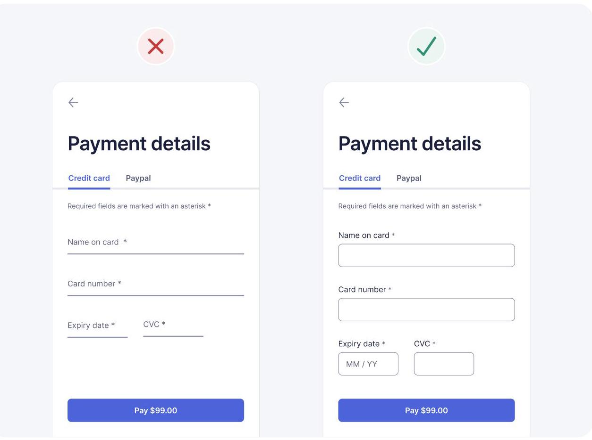

Unconventional form field styles versus conventional ones

If you're keen to modify form fields, try to ensure that they still contain the iconic elements of conventional form fields. This helps people understand your new form field style, as they can tie it to the conventional one they're used to.

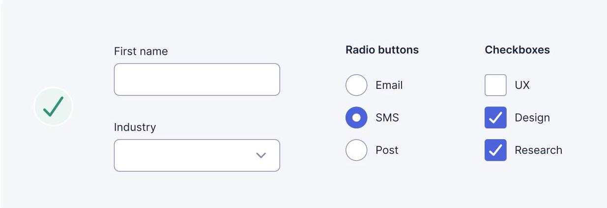

Conventional form field styles

The radio buttons, in the following example, were modified to increase their target area. Since they don't contain any conventional form field styles, their behaviour is unclear. Can multiple items be selected? Do they link somewhere? It's important to keep the iconic circle on the left of labels to tie them to conventional radio buttons. This lets people know that one option can be selected. Without the iconic radio button circle, the behaviour of the element is unclear.

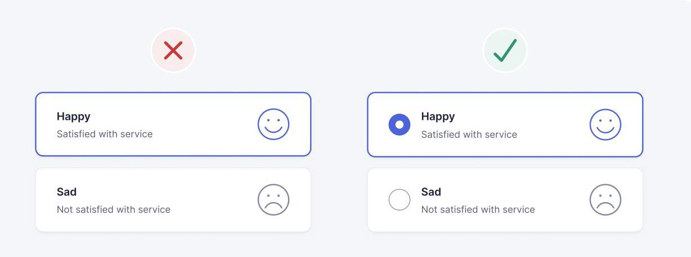

The iconic circle is kept on the left of labels to tie them to conventional radio buttons

## Display hints above form fields

Sometimes a short label isn't enough to clearly describe the information required in a form field. A "hint" or "helper text" is additional information that helps people complete a form field.

To help declutter an interface, hints are often hidden in tooltips (floating messages displayed on hover or press of an action). There's a risk that hidden hint text could be missed. If additional information is critical to help people complete a field, ensure it's visible.

Hints are often placed below form fields, but it's more logical to place them above fields. This helps people avoid errors and maintain downward momentum when completing forms. If a password needs to be at least 6 characters long, tell people before they fill out the password field, not after.

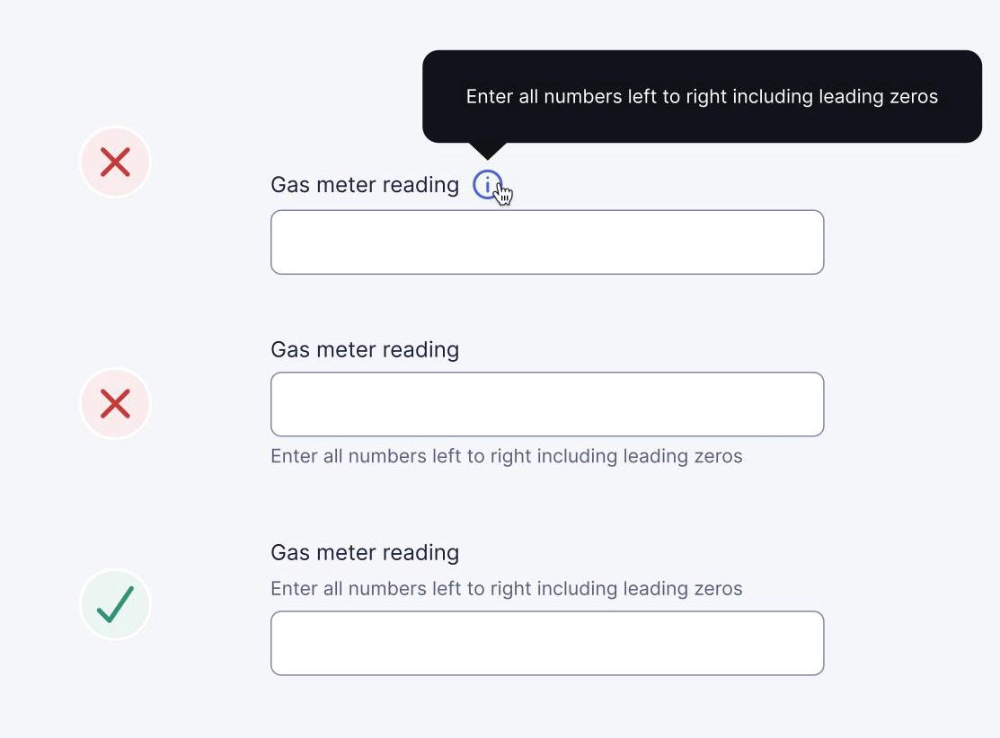

Display hints above form fields to help avoid errors and speed up form completion

Another problem with placing hints below form fields is that the space below form fields can be covered by autofill menus and on-screen keyboards. This results in the hint being hidden.

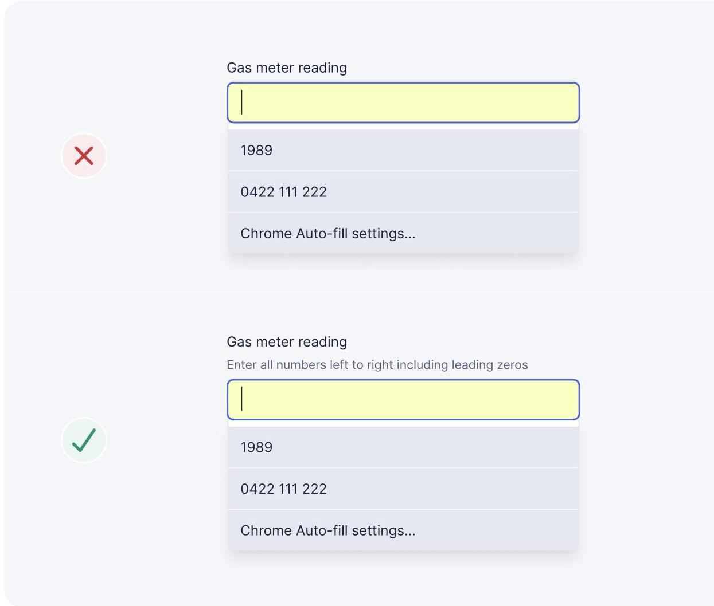

Hints placed below form fields can get covered by autofill menus

## Don't use placeholder text instead of a label

Placeholder text is a short hint displayed inside an input field before a person enters a value. To save space, placeholder text is often used instead of a label, as seen in the following example.

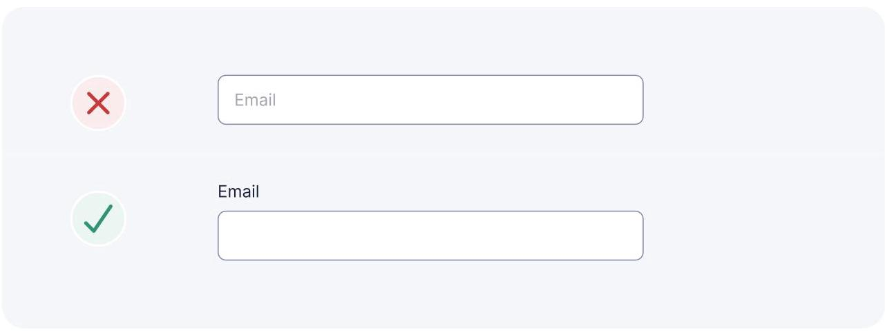

Placeholder text being used as a label versus an input with a separate label on top

## This is problematic for the following reasons:

- Placeholder text disappears once a person starts filling in an input field, causing some to forget what the field was for.

- Some might miss or skip fields with placeholder text, as it can look like the field has already been pre-filled.

- Placeholder text colour contrast is almost always inaccessible, as it's very light by design. This means many will struggle to read the label.

## Form label tips

- Always display a short descriptive label above form fields.

- Add a hint under the label if more information is needed.

- Avoid placeholder text in most cases, as it's unnecessary and can make inputs look like they've already been pre-filled.

- Avoid unnecessary instructional verbs (doing words) in your labels and hints. For example, "Enter email here" or "Type your email" is unnecessary, as it's already implied by the input field.

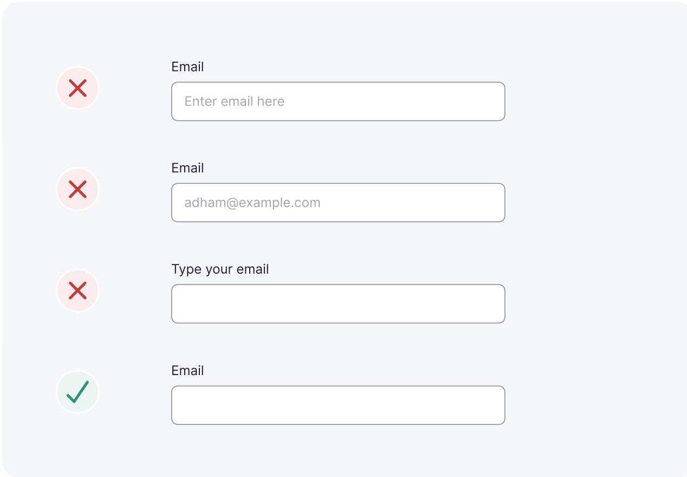

Do's and don'ts with form field labels

There are some exceptions to this guideline. Using placeholder text for single form fields like search boxes is fine, as long as you increase the contrast ratio of the placeholder text to at least 4.5:1 and ensure the field has an accessible label for screen readers.

# Ensure form field labels are close to their fields

It's very common for form field labels to be spaced relatively far away from their input fields. This makes it unclear which labels relate to which fields.

When spacing interface elements, make sure that related elements are spaced closer together to clearly indicate that they're related.

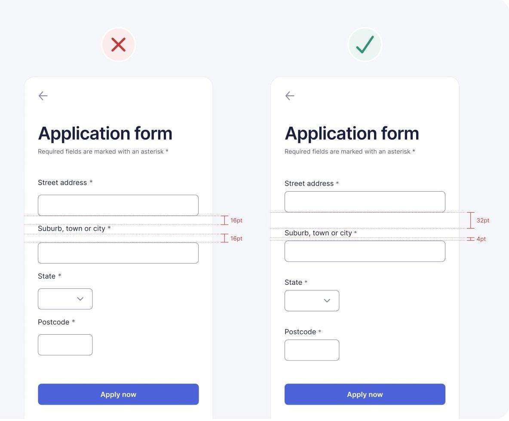

Ensure form field labels are close to their fields to clearly indicate that they're related

Another benefit of spacing labels close to their input fields is that your eyes don't need to focus on the label and input field separately. Your eyes only need to focus once on each field, which decreases the interaction cost.

# Try to use radio buttons instead of dropdowns

If there are around 10 options or fewer, consider displaying them as radio buttons instead of hiding them in a dropdown.

Dropdowns are popular as they're compact and tidy, but they can also be difficult and inefficient to use for the following reasons:

- Dropdowns have a high interaction cost, as they require multiple precise interactions. They can be especially difficult to use for people with motor impairments.

- Dropdowns can be mistaken as being filled and accidentally skipped.

- Options are hidden initially, making them hard to scan.

Radio buttons on the other hand, only require one quick interaction and are always visible and easy to compare. That being said, if saving space is a priority, it's fine to use a dropdown.

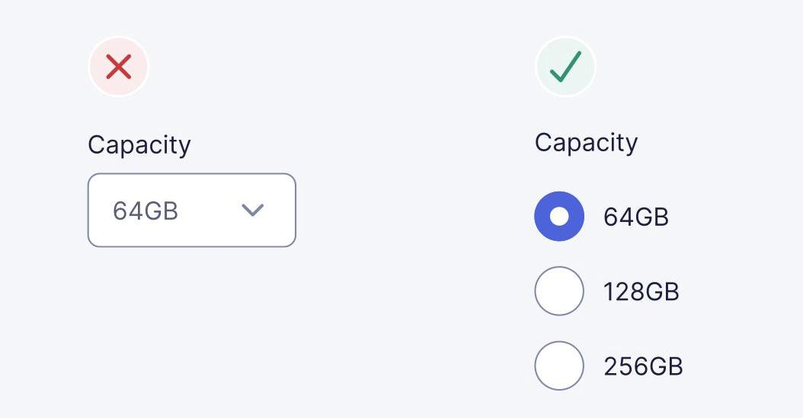

Try to use radio buttons instead of dropdowns for around 10 options or less

## Use an autocomplete instead of a long dropdown

Rather than force people to scroll through a long list of options in a dropdown, use an autocomplete search field (also known as predictive search) to help them find what they're looking for faster.

An autocomplete search field displays suggestions as someone types into the field, just like the Google search bar.

For example, it's much faster and easier to search for your country of birth, than to select it from a long dropdown list. Highlight the differences between suggestions in bold to help people differentiate them faster. Quick design tips for autocomplete fields:

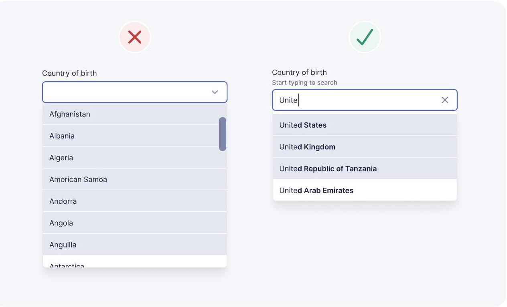

Long dropdown versus an autocomplete to select country of birth

- An autocomplete search field is suitable for fields where people know what they're looking for. For example, country of birth, a particular product, or a particular article.

- For less familiar fields, where people need to browse a long list of options to find a suitable selection, consider breaking the dropdown list into multiple separate fields. For example, occupation dropdowns are generally very long. Break them into 2 separate dropdowns, "industry" and "occupation", to make them easier and faster to complete.

- Try to keep the number of suggestions to around 10 or fewer. This avoids choice paralysis (where people are overwhelmed and give up). The goal is to make decisions easier and faster by providing fewer options.

- Highlight the differences between suggestions in bold to help people differentiate them faster.

## Use steppers for numeric fields instead of dropdowns

A stepper component makes it easier and faster for people to make small numeric changes. It allows people to increase or decrease a number with a single button press, or by typing the number in the field.

In the following example, using steppers to select the number of guests decreases the interaction cost significantly. Let's say that you needed to select 2 adults, 1 child, and 1 infant as guests for your trip. The interaction cost using dropdowns is 6 clicks plus 3 scrolls. Whereas, the interaction cost using steppers is only 4 clicks. Quick tips for designing steppers:

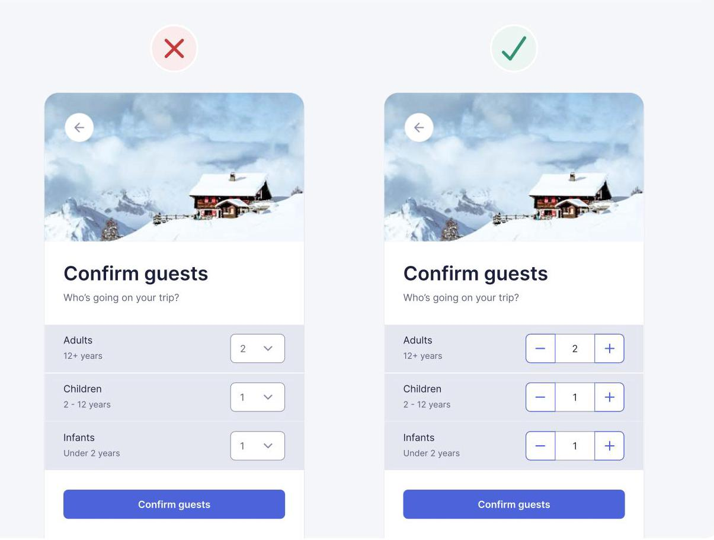

Dropdowns versus steppers to select number of guests

- Make sure stepper buttons have a sufficient target area. Use a minimum of 48pt by 48pt for buttons. The small buttons in the following example can be difficult for some to use.

- Place buttons horizontally rather than vertically. This allows more space between buttons, decreasing the risk that people might hit the wrong button accidentally.

- Use "+/-" buttons rather than "up/down" arrows or chevrons. This helps clearly differentiate stepper buttons from dropdowns or accordions.

- Steppers aren't suitable for making large numeric changes, as the interaction cost would be high.

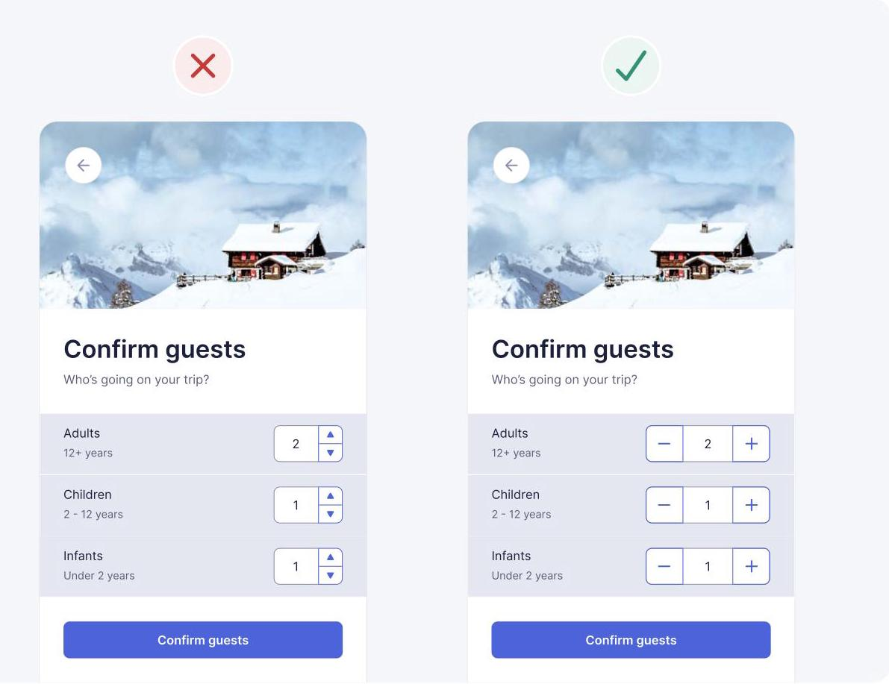

Ensure stepper buttons have a sufficient target area and space between them

# Use a checkbox or toggle switch for 2 options

For simple on or off options where the default option is off, consider using a checkbox or toggle switch. They have a lower interaction cost than dropdowns and are more compact than using 2 radio buttons.

## Checkbox usage

Use a single checkbox when a user needs to press a submit button before the option will take effect. Make sure the checkbox label describes what will happen when the checkbox is checked.

In the following example, people can use a checkbox to opt in to receive news and special offers and then submit the form.

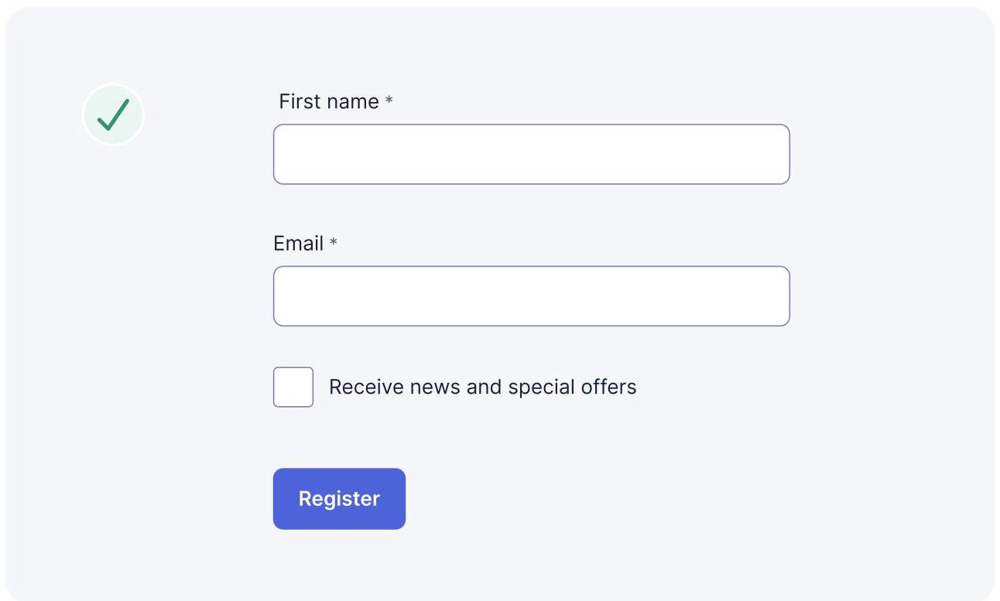

Use a single checkbox when a user needs to press a submit button before the option will take effect

## Toggle switch usage

Use a toggle switch for options that take immediate effect. Make sure the toggle switch label describes what will happen when the switch is on.

In the following example, a toggle switch is used to immediately change the pricing options without a submit button needing to be pressed.

Use a toggle switch for options that take immediate effect

## Use positive phrasing for checkboxes

It's generally safest to use positive phrasing for checkbox labels to avoid confusion. Describe what will happen when the checkbox is selected, rather than what won't happen.

A simple way to test whether you're using positive phrasing is to replace the selected checkbox with the word "yes". If the resulting sentence has conflicts or is unclear, then you're using negative phrasing.

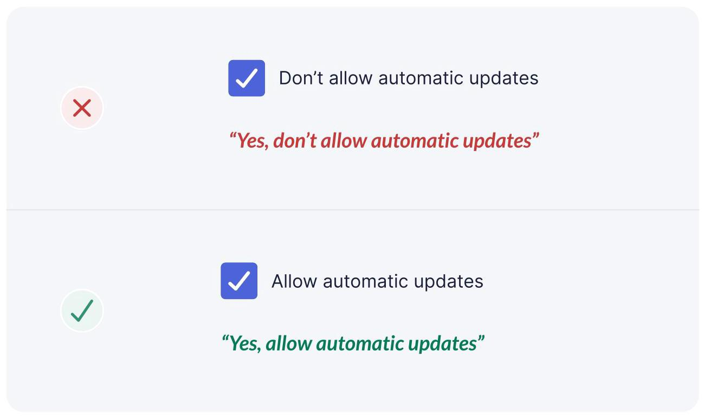

## Break up long forms into multiple steps

Break up long forms into multiple smaller steps to decrease cognitive load, reduce mistakes, and improve completion rates. Breaking up forms makes them seem less overwhelming, as people can focus on one thing at a time. Quick tips for designing multi-step forms:

- Let people know how long the form will take to complete and what they'll need before they start.

- Break up a 30 question form into 6 steps of 5 related questions, rather than 30 steps. This helps to reduce interaction cost.

- Order questions from easiest to hardest so people achieve early wins.

- Indicate progress as people fill out the form. They'll feel more motivated as they approach the end (according to the Goal-Gradient Effect).

- Allow people to review and change their answers before submitting them. Once submitted, display a success message and let people know what to expect next.

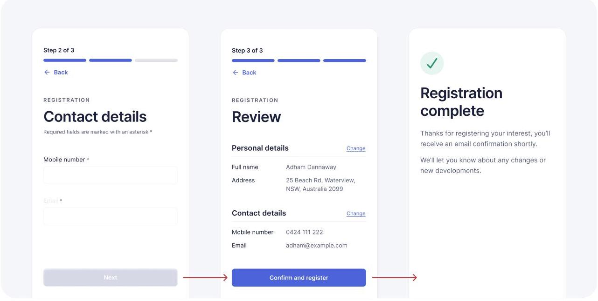

Multi-step form flow with progress indicator

## Group related fields under headings

If you can't break up a long form into multiple separate steps, group related fields together under headings. Grouping will make the form seem less overwhelming and make it easier for people to understand and complete.

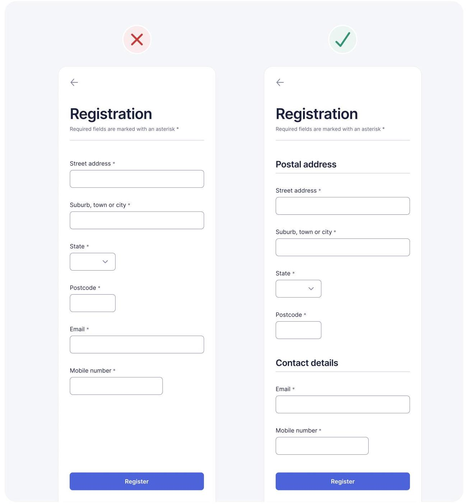

Example of a form with ungrouped fields versus one with grouped related fields

## Ensure form field borders are high contrast

Low contrast form fields are one of the most common UI design mistakes. Light borders on form fields can look nice, but there's a risk that some people may have difficulty seeing the borders. It could be someone with low vision or even a sighted user viewing the interface outside on a sunny day.

Borders are a distinctive detail that differentiate form fields from other interface elements. Without borders, it's unclear how to interact with a form field. Make sure the contrast ratio of form field borders is at least 3:1. This rule applies to any interface element to ensure it's accessible: buttons, toggle switches, inputs, steppers, checkboxes, and radio buttons.

If an interface element isn't purely for decorative purposes, it needs to have sufficient contrast to ensure that what it does and how it works is clear.

Low contrast form field border versus one with a sufficient 3:1 contrast ratio

## Choose your form validation approach

Even if your forms are well-designed, people will still make mistakes. Form validation is the process of checking whether a person has answered all required questions in a form and whether they have answered them correctly. If they miss a question or make a mistake, let them know and help them fix it.

There are 3 main approaches to validate forms:

1. Validate on submit of the form

2. Validate after people leave a field

3. Validate instantly as people type

The first is the simplest and easiest to design and build. Each subsequent approach becomes more complex and challenging to create. Depending on the types of questions you're asking in your form, you might consider using multiple approaches.

Let's look at the advantages and disadvantages of each.

## 1. Validate on submit of the form

If you're low on time and development resources, keep it simple and validate the form once a person submits it. It may sound simplistic, but it's the way forms were originally designed and it's still a valid approach.

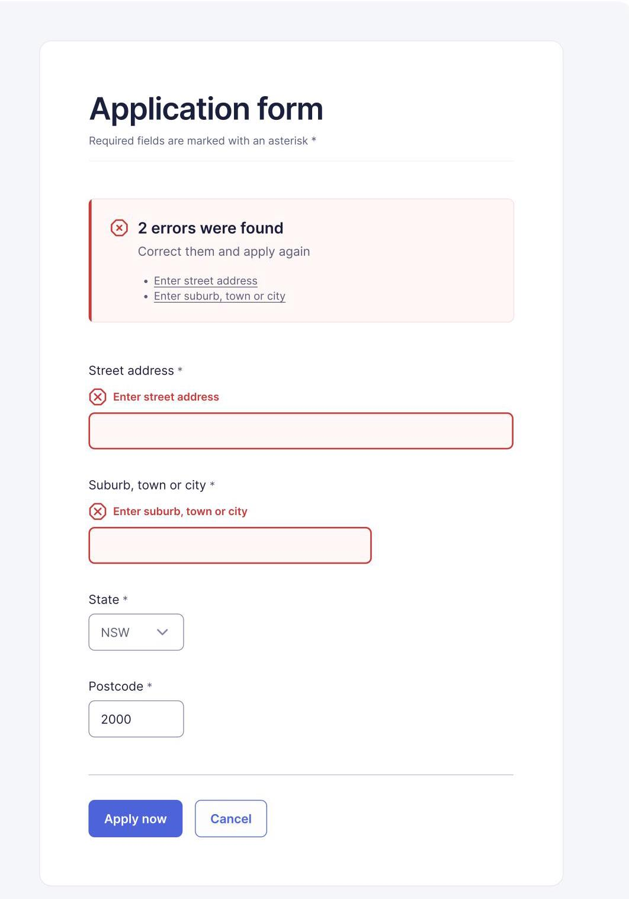

A list of errors with links are displayed at the top of the form after it's submitted

## Quick guidelines for validating forms on submit:

- Display a prominent error message above invalid form fields (rather than below) to help ensure errors are always visible. The space below form fields can be covered by autofill menus and on-screen keyboards.

- Use a red border and background shade to prominently highlight invalid fields. Make sure you also include an icon for people who are colour blind. Never rely on colour alone to distinguish interface elements.

- If there are multiple errors, let people know how many there are and list them at the top of the form. Make the listed errors links that take people to the corresponding invalid field.

- Don't disable the submit button, as disabled buttons can be problematic.

## Advantages

- Relatively simple and easy to implement.

- Allows people to focus on form completion without distractions.

## Disadvantages

- As people are completing a form, they have no idea whether they're answering questions correctly or not.

- People could be overwhelmed and frustrated by facing multiple errors all at once.

- People are forced to navigate through the entire form again to find and fix errors when they may have lost context.

- It doesn't work when people need assistance promptly, such as when someone requires help creating a password that meets specific criteria.

## 2. Validate after people leave a field

Rather than informing people of errors after they've completed a form, this approach lets them know if they've made a mistake immediately after they've completed a field. Validating after people leave a field is commonly known as inline validation or validating "on blur".

Remove the error message once the error has been resolved to let people know they've fixed it. This involves using the third validation approach (validating instantly as people type).

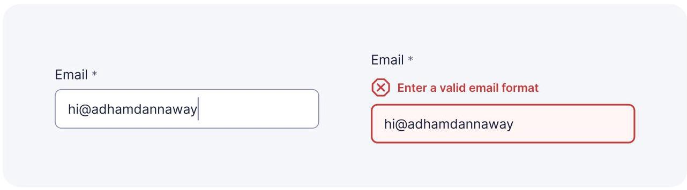

Email is validated once a person leaves the field

## Advantages

- People receive immediate feedback, so they're not left wondering whether they're answering questions correctly or not.

- People can fix errors faster while they still have context.

- It can be used to provide positive feedback for correct inputs, such as confirming that a password meets certain criteria.

## Disadvantages

- People could be distracted by the need to repeatedly switch between answering questions and fixing errors.

- It doesn't work well for groups of inputs, such as a list of checkboxes.

- It can be relatively complex to implement.

## 3. Validate instantly as people type

This approach waits until people have stopped typing their answer before validating it. To help prevent premature error messages, a delay is typically introduced once they've stopped typing.

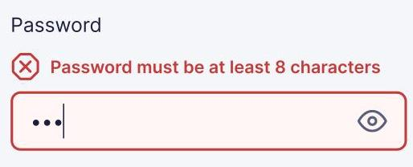

Password is validated as a person types

## Advantages

- It helps people work toward an answer. For example, creating a password that needs to meet certain criteria or checking if a username is available.

- People receive immediate feedback, so they're not left wondering whether they're answering questions correctly or not.

- People can fix errors faster while they still have context.

## Disadvantages

- Premature error messages can frustrate people and hinder form completion. Since people type at different speeds, it's difficult to know when they've finished typing their answer.

- It can be relatively complex to implement.

## Chapter summary

✓ Stack forms in a single column layout, as it decreases interaction cost by maintaining a consistent downward momentum.

✓ Mark both required and optional fields to avoid people guessing whether form fields are required or not.

✓ Match field width to the intended input, as the width sets people's expectations for the amount of information expected in the field.

✓ Rather than using dropdowns, consider using radio buttons, autocomplete search fields, or steppers, depending on the use case.

✓ Break up long forms into multiple smaller steps to decrease cognitive load, reduce mistakes, and improve completion rates.

Congratulations 8 of 8 chapters completed

Fundamentals Less is more ✓ Colour

- Layout and spacing Typography Copywriting

Buttons Forms