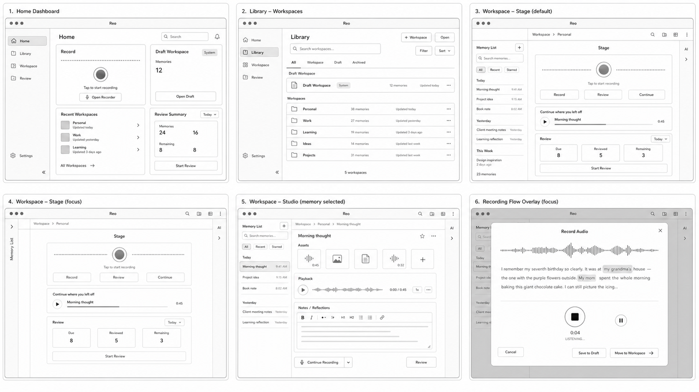

# Wireframes

本文档记录 Reo 当前产品结构 wireframe。

## 当前基线

该 wireframe 只约束产品结构和交互心智，不约束最终视觉 token、字体、文案、图标或组件细节。

当前结构包含：

- Home dashboard。
- Library 记忆空间管理。
- 记忆空间舞台默认态。
- 记忆空间舞台 focus 态。
- Memory Studio。
- Recording flow overlay。

## 使用规则

- wireframe 是结构参考，不是视觉真源。
- 最终视觉必须服从 `docs/current/design-system/`。
- 文案必须以当前中文产品文案为准。
- 录音组件可以参考长 waveform、居中 recording surface、timer、pause/stop、transcript 和 reflections 的交互心智。
- 记忆空间中间面板必须是表达舞台或 studio，不得退化为文件预览器。
